# 산업 공정 영상 이상탐지 파이프라인

정상 영상으로 공정 패턴을 학습하고 객체별 외형·공정 흐름의 이상을 찾는 학부 캡스톤 연구입니다. 특정 논문 주제를 미리 고정하지 않고, 기본 파이프라인의 관측 결과를 바탕으로 다음 실험을 설계합니다.

## 진행 현황

| 단계 | 범위 | 상태 | 결과 |
|---|---|---|---|
| 데이터 정리 (Stage 00) | IPAD 16개 장면 전체 | 안전한 로더·평가 마스크 완료, 정확한 재라벨링은 미해결 | 아래 표 및 [기계 판독 결과](results/stage00/summary.json) |
| 실험 01 | R01 전체 학습/테스트를 사용하는 기본 파이프라인 pilot | 완료: R01 15개 테스트 영상 평가 | [결과](results/experiment01/metrics.json) · [설정](configs/experiment01.json) |
| 실험 02 | 정상 trajectory 기반 phase 추정 | 완료: phase만 교체한 비교 | [결과와 한계](docs/EXPERIMENT02.md) |
| 실험 03 | 정상 이동 영역 기반 제품 재검출 | 완료: 관측 개선, 최종 결합 성능 저하 | [결과·의의·추천 3개](docs/EXPERIMENT03.md) |
| 실험 04 | 정상 phase별 진행량 기반 공정 점수 | 완료: AUROC/AP·recall 상승, 오탐 증가 | [결과·의의·추천 3개](docs/EXPERIMENT04.md) |
| 실험 05 | 여러 연속 관측의 진행량 | 완료: 오탐 감소, 관측 가용성 감소 | [결과·의의·추천 3개](docs/EXPERIMENT05.md) |
| 실험 06 | 진행량 phase 조건화 제거 비교 | 완료: 단순화 가능성, 오탐 증가 | [결과·의의·추천 3개](docs/EXPERIMENT06.md) |
| 실험 07 | 실제 장면 R03 적용성 | 완료: 진행량 추가로 ranking 저하, 상태 관측 실패 확인 | [결과·의의·추천 3개](docs/EXPERIMENT07.md) |
| 실험 08 | R03 객체 관계 기반 잠재 상태 | 완료: 외형 ranking 상승, 결합 ranking 하락 | [결과·의의·추천 3개](docs/EXPERIMENT08.md) |
| 실험 09 | 이전 상태별 공정 점수 보정 | 완료: 결합 ranking 상승, 프레임 recall 하락 | [결과·의의·추천 3개](docs/EXPERIMENT09.md) |
| 실험 10 | max 결합 및 Visual 단독 비교 | 완료: 평균 결합 억제 해소, 추가 공정 기여 제한적 | [결과·의의·추천 3개](docs/EXPERIMENT10.md) |
| 실험 11 | 관측된 진입 이후 체류 시간 신호 | 완료: 결합 ranking 하락, 추가 오탐 증가 | [결과·의의·추천 3개](docs/EXPERIMENT11.md) |
| 실험 12 | 진입 맥락별 체류 시간 및 동일 support 대조 | 완료: 조건화 후 결합 성능 저하, 보정 간섭 확인 | [결과·의의·추천 3개](docs/EXPERIMENT12.md) |
| 실험 13 | 정상 영상 단위 보정 holdout 검증 | 완료: 정상 FIT 범위 안의 체류 오탐 반례 확인 | [결과·의의·추천 3개](docs/EXPERIMENT13.md) |
| 실험 14 | 완결 정상 길이 기준 체류 percentile | 완료: 정상 holdout 반례 교정, R03 체류 효용은 미확인 | [결과·의의·추천 3개](docs/EXPERIMENT14.md) |
| 실험 15 | R04에서 고정 파이프라인 적용성 | 완료: 역할 오검출·q99=1 경보 불능 확인 | [결과·의의·추천 3개](docs/EXPERIMENT15.md) |
| 실험 16 | 연속 체류 꼬리 점수·경보 가능성 | 완료: 경보 복구, 체류 없는 기준선과 동일 경보 | [결과·의의·추천 3개](docs/EXPERIMENT16.md) |
| 실험 17 | 혼동 객체와 대조하는 anchor 역할 검증 | 완료: 일부 오검출 차단, ranking·체류 가용성 저하 | [결과·의의·추천 3개](docs/EXPERIMENT17.md) |
| 실험 18 | track 단위 인과적 semantic margin 집계 | 완료: 짧은 변동 감소, ranking 저하·오탐 증가 | [결과·의의·추천 3개](docs/EXPERIMENT18.md) |
| 실험 19 | 관계 관측 여부를 반영하는 외형 subspace 선택 | 완료: ranking·오탐 개선, recall·구간 탐지 감소 | [결과·의의·추천 3개](docs/EXPERIMENT19.md) |
| 실험 20 | 외형 bank 경로별 정상 보정·영상 holdout 검증 | 완료: 정상 holdout 오탐 증가, 테스트 효과 제한적 | [결과·의의·추천 3개](docs/EXPERIMENT20.md) |
| 실험 21 | 관측 FIT 제한·추론 fallback의 2×2 대조 | 완료: 두 요소의 개별 효과·보정 상호작용 확인 | [결과·의의·추천 3개](docs/EXPERIMENT21.md) |
| 실험 22 | 동일 bank 표본 수 무작위 FIT 대조 | 완료: 관측 FIT의 외형 차이 유지, 구간 탐지는 모든 random보다 적음 | [결과·의의·추천 3개](docs/EXPERIMENT22.md) |
| 실험 23 | 표본 수·PCA rank를 함께 맞춘 대조 | 완료: rank 통제 후에도 외형 장점·구간 미탐 상충 유지 | [결과·의의·추천 3개](docs/EXPERIMENT23.md) |
| 실험 24 | 누락 지속 길이에 따른 인과적 fallback | 완료: 시간 제한은 오탐·ranking 악화, CDF 간접 효과 확인 | [결과·의의·추천 3개](docs/EXPERIMENT24.md) |
| 실험 25 | 두 외형 경로의 고정 정상 CDF | 완료: 요청별 점수 불변 확보, pooled/age ranking 저하 | [결과·의의·추천 3개](docs/EXPERIMENT25.md) |
| 실험 26 | 실제 bank에 일치하는 CDF 선택 | 완료: 같은 bank 점수 불일치 제거, ranking 저하·경보 불변 | [결과·의의·추천 3개](docs/EXPERIMENT26.md) |
| 실험 27 | 연속 관측 전이만 공정 결합 | 완료: ranking·오탐 개선, TP 소폭 감소·새 구간 없음 | [결과·의의·추천 3개](docs/EXPERIMENT27.md) |
| 실험 28 | 전이 CDF의 정상 관측 모집단 정렬 | 완료: 정상 오탐 증가, test 경보 불변·ranking 소폭 저하 | [결과·의의·추천 3개](docs/EXPERIMENT28.md) |
| 실험 29 | 정상 전이 커버리지·관측 근거 감사 | 완료: 객체 쌍의 이력 혼합·역할 혼동 확인, 정상-only 진단 | [결과·의의·추천 3개](docs/EXPERIMENT29.md) |
| 실험 30 | 객체 쌍 track 경계의 관계 평균 초기화 | 완료: 이력 혼합 제거, 탐지 증가·오탐 증가 | [결과·의의·추천 3개](docs/EXPERIMENT30.md) |
| 실험 31 | 같은 객체 쌍의 연속 관측 전이만 결합 | 완료: 오탐 감소·이상 경보 소폭 감소, 탐지 구간 유지 | [결과·의의·추천 3개](docs/EXPERIMENT31.md) |
| 실험 32 | 객체 쌍의 연속성을 반영한 정상 체류 episode 재구성 | 완료: 진입 미확인·검열 분리, 체류 지원 부족 확인 | [결과·의의·추천 3개](docs/EXPERIMENT32.md) |
| 다음 실험 33 | 관계 관측 손실의 원인·정상 역할 근거 감사 | 계획 완료, 미실행 | [계획](docs/EXPERIMENT33_PLAN.md) |

각 실험을 마치면 **이번 결과 → 결과의 의의 → 보완할 점 → 다음 Recommended improvements(추천순 3개)**를 보고합니다. 각 추천에는 관측 근거·변경 내용·검증 기준을 포함하고, 다음 결과에 따라 우선순위를 갱신합니다. [보고 규칙](docs/EXPERIMENT_REPORTING.md)

## Stage 00 — 데이터 정합성과 시간축

| 항목 | 실측 |
|---|---:|
| 장면 | 합성 12 + 실제 4 |
| 정상 학습 시퀀스 / 프레임 | 776 / 430,867 |
| 테스트 시퀀스 / 프레임 | 292 / 167,112 |
| 길이가 일치하는 테스트 시퀀스 | 281 |
| 주 평가에 포함할 테스트 프레임 | 159,818 (95.64%) |
| 정렬 미확정 시퀀스 / 프레임 | 11 / 7,294 |
| 확인 가능한 시간 단위 | 원본 프레임 인덱스 |
| FPS·실제 timestamp·semantic phase GT | 확인 불가, null로 기록 |

**원본 ZIP에서도 라벨 길이 불일치가 동일하게 발견됩니다. 정확한 정렬을 복구했다고 주장하지 않습니다.** 원본 프레임·라벨은 수정하지 않습니다. 길이가 다른 시퀀스의 파생 평가 라벨은 모두 `-1`(unknown)로 저장하며 주 지표에서 제외합니다. 이 규칙은 추론·특징·phase·점수 계산에는 영향을 주지 않습니다. 전체 공식 benchmark 성능과 직접 동등한 protocol은 아닙니다.

| 시퀀스 | 프레임 | 원본 라벨 | 처리 |
|---|---:|---:|---|
| R02/12 | 806 | 805 | 정렬 미확정 |
| R02/13 | 609 | 608 | 정렬 미확정 |
| R02/14 | 497 | 498 | 정렬 미확정 |
| S05/09–15 (각각) | 626 | 676 | 정렬 미확정 |
| S12/13 | 1,000 | 1,001 | 정렬 미확정 |

1. 모든 시퀀스의 파일명을 정수 프레임 번호로 정렬하고 0부터 연속인지 검사합니다.
2. 테스트 라벨 292개는 원본 ZIP의 내용과 바이트 단위로 비교했습니다. 모든 시퀀스의 ZIP/로컬 프레임 수도 일치합니다.
3. 이미지 내용 비교·디코딩 검사는 시퀀스별 처음/중간/끝에 한정합니다. 전체 JPG 디코딩·콘텐츠 해시 검사를 완료한 것은 아닙니다.
4. FPS를 25/30으로 가정하지 않습니다. 속도·duration·탐지 지연은 프레임 단위로만 다룹니다.
5. 공식 로더의 `frame_name * 200 // sequence_length`는 상대 위치 proxy입니다. 실제 주기 경계 또는 semantic phase 정답으로 사용하지 않습니다.
6. score를 전체 프레임으로 확장할 때 이전 관측 점수를 유지합니다. 미래 샘플을 이용한 선형 보간을 하지 않습니다.
7. 정상 영상은 장면별로 약 80% fit / 20% calibration에 고정 분할했습니다. 시퀀스 단위 분할이며, 테스트 라벨로 분할·임계값을 선택하지 않습니다. 근접/파생 영상의 원본 그룹 정보는 없으므로 그룹 독립성은 아직 입증하지 못했습니다.

[전체 manifest](results/stage00/manifest.json) · [시퀀스 CSV](results/stage00/sequences.csv) · [불일치 근거](results/stage00/mismatches.json) · [정상 분할](results/stage00/splits.json)

### 재현

```bash
uv venv .venv --python python3.12
uv pip install --python .venv/bin/python -r requirements.lock.txt
export PYTHONPATH=src
.venv/bin/python scripts/audit_data.py \
  --data-root /path/to/IPAD_dataset \
  --archive /path/to/IPAD_dataset-001.zip
.venv/bin/python -m pytest -q
```

파생 라벨은 `artifacts/labels_strict/`에 생성됩니다. 원본 데이터·가중치·특징 캐시·개인 계획서·서버 로그는 GitHub에 업로드하지 않습니다.

## 실험 01의 구현 범위

정상 FIT 영상 → 로컬 Qwen 객체/phase 후보 → GroundingDINO → IoU tracking → frozen CLIP의 전체 프레임/crop 특징 → 관측 phase별 PCA → visual/process score → frame 및 객체 후보 점수.

첫 실험은 R01의 모든 시퀀스에서 실행합니다. 4프레임 간격 sampling, 정상 calibration, 현재 관측 기반 phase 추정을 사용합니다. 다른 장면의 결과나 전체 IPAD 재현으로 확대 해석하지 않습니다. 제안 파이프라인에는 원래 완전한 구현 명세가 없으므로 이 설정은 **우리의 명시적 baseline 구현**이며, 기존 논문 수치 재현은 아닙니다.

추후 개선은 실험 01 결과를 확인한 뒤 Recommended improvements로 기록합니다. phase 추정·누락 객체·좌표/관계 특징 등에 대한 개선을 미리 성능 기여로 주장하지 않습니다.

## 실험 01 결과

정상 fit 27개 / calibration 7개, 테스트 15개 영상의 **3,685프레임**을 평가했습니다. 이상 프레임은 1,254개입니다. seed 42 한 번의 R01 pilot이며 전체 IPAD 성능을 의미하지 않습니다.

| 점수 | Frame AUROC | Average precision |
|---|---:|---:|
| Visual | 0.5727 | 0.3766 |
| Process | 0.4942 | 0.3377 |
| Combined (0.5/0.5) | 0.5371 | 0.3636 |

정상 calibration q99 임계값은 0.9810입니다. 이 임계값에서 테스트 정상 프레임 오탐률은 **6.95%**, 이상 프레임 recall은 **5.98%**입니다. AUROC/AP만 보고 실사용 가능한 성능으로 해석하지 않습니다.

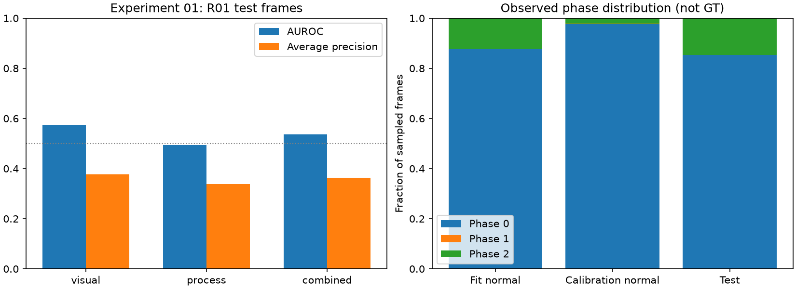

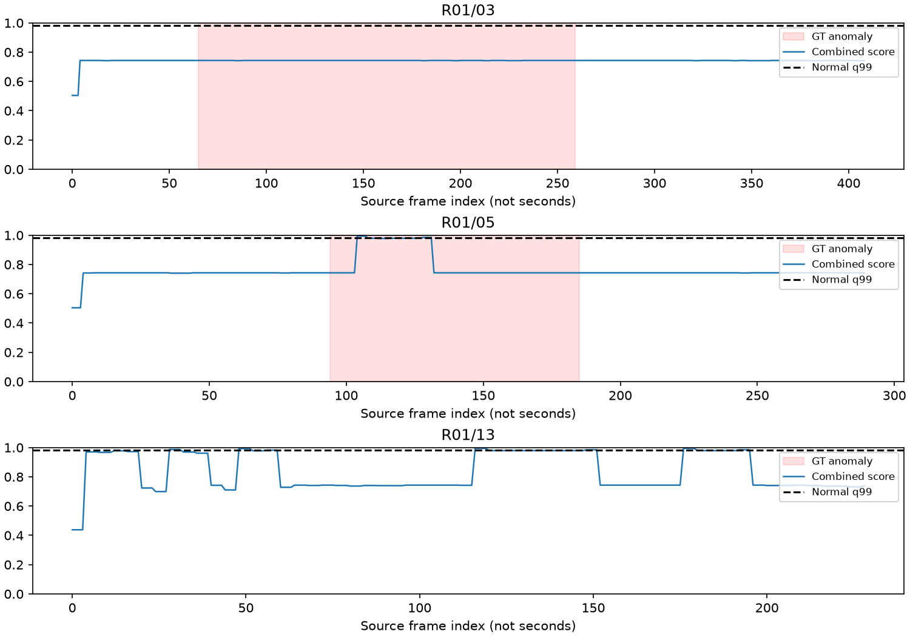

[상세 방법](docs/EXPERIMENT01.md) · [전체 지표](results/experiment01/metrics.json) · [영상별 지표](results/experiment01/per_sequence.csv) · [검출/추출 진단](results/experiment01/extraction.json)

### 실험 01의 의의

로컬 VLM부터 객체·공정 이상 점수까지 연결하는 실행 가능한 baseline을 확보했습니다. Process를 더했을 때 Visual 단독보다 AUROC가 낮아지고 중앙 phase가 사라진 결과는 phase 관측 방식의 검증이 우선임을 보여줍니다. 파이프라인 구현의 근거이며 novelty나 일반화 성능의 입증은 아닙니다.

### 실험 01의 보완할 점

- **Phase collapse:** FIT 샘플의 phase 분포가 `[1363, 0, 193]`입니다. 왼쪽/중앙/오른쪽이라는 언어적 설명만으로 CLIP 전체 프레임 특징이 중앙 상태를 분리하지 못했습니다. Calibration/Test에서도 중앙은 각각 1샘플뿐입니다. Process AUROC 0.4942와 함께 볼 때 현 phase proxy의 유효성이 부족합니다.
- **객체 오검출:** 정상 영상 01의 bbox 직접 점검에서 하단 고정 빨간 부품도 product 역할로 검출되었습니다. `role_frame_coverage=1.0`은 해당 역할의 박스가 있다는 뜻이며, 실제 제품 recall 100%가 아닙니다.
- **외형 정보의 한계:** crop 정규화로 위치 정보를 잃으며, motion/관계는 아직 scoring에 사용하지 않습니다.

### 실험 01 이후 Recommended improvements — 추천순 3개

| 추천순 | 개선 후보 | 관측 근거와 검증 방향 |
|---|---|---|
| 1 | 정상 trajectory 기반 phase 추정 | 중앙 FIT 표본 0개. phase만 교체하고 관측률·점수·오탐/recall 비교 |
| 2 | 제품 grounding 검증·개선 | 고정 부품 오검출. bbox subset에서 precision/recall·누락 길이 확인 |
| 3 | Process 신뢰도에 따른 결합·보정 | Combined가 Visual보다 낮음. 정상 데이터로 결정한 결합 규칙 비교 |

[후보별 변경 내용·검증 기준](docs/EXPERIMENT01.md)에 따라 1순위를 실험 02로 선택했습니다.

**실험 02의 단일 변경:** detector, crop 특징, encoder, split, sampling, PCA/scoring 규칙은 그대로 유지하고 phase 추정만 바꿉니다. 정상 FIT에서 실제로 이동한 product-role track으로 이동 경로와 3개 공간 상태를 적합하고, test-time에는 현재 bbox와 과거 상태만 사용합니다. 누락 시 이전 phase를 유지하며 그 비율을 공개합니다. 위치 정답·test label·미래 프레임은 사용하지 않습니다. 이는 R01의 공간적 진행 proxy이며 일반 공정 grammar 학습으로 주장하지 않습니다. 당시 그 이후 실험은 미리 설계하지 않았습니다.

## 실험 02 결과와 비교

실험 01의 검출·encoder 특징을 재사용하고 **phase 추정만** 정상 trajectory로 교체했습니다. `phases` 이외의 입력 배열이 모두 동일한지 검사했습니다. 상세 근거는 [실험 02 문서](docs/EXPERIMENT02.md)에 있습니다.

| R01 평가 | 실험 01 | 실험 02 |
|---|---:|---:|
| Combined AUROC | 0.5371 | 0.5959 |
| Combined average precision | 0.3636 | 0.4031 |
| Process AUROC | 0.4942 | 0.5471 |
| 정상 q99에서 테스트 정상 프레임 오탐률 | 6.95% | 14.85% |
| 정상 q99에서 테스트 이상 프레임 recall | 5.98% | 23.37% |
| FIT phase 0/1/2 샘플 수 | 1363 / 0 / 193 | 998 / 444 / 114 |

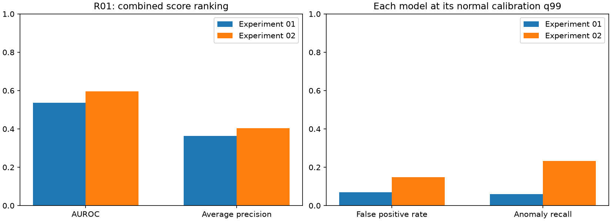

### 실험 02의 의의

동일한 검출·encoder 특징에서 phase 추정만 교체한 비교로 Combined AUROC +0.0588, AP +0.0395를 관측했습니다. phase 구성 방식이 후속 정상 모델에 영향을 준다는 근거입니다. semantic phase 정확도나 novelty를 입증한 결과는 아닙니다.

### 실험 02의 보완할 점

**Ranking은 개선됐지만 오탐도 증가했습니다.** 각 모델의 정상 calibration에서 결정한 q99를 그대로 적용한 결과입니다. 동일 test FPR 비교나 통계적 유의성 주장이 아닙니다.

또한 공간 phase를 직접 관측할 수 있었던 bbox는 전체 샘플의 **383/2893 = 13.24%**뿐입니다. 나머지는 이전 phase를 유지하거나 첫 관측 전 초기 phase 0을 사용했습니다. 상태 점유율이 달라졌다는 것만으로 semantic phase 정확도를 주장하지 않습니다. 현재 병목은 검출 품질·관측 누락입니다.

### 실험 02 이후 Recommended improvements — 추천순 3개

| 추천순 | 개선 후보 | 관측 근거와 검증 방향 |
|---|---|---|
| 1 | **제품 grounding 품질 개선** | 직접 phase 관측 13.24%. 색상 의존·고정 배경 혼동을 점검하고 bbox subset의 precision/recall·누락 길이 검증 |
| 2 | **누락 관측을 반영한 phase 불확실성** | 오래된 phase 유지 가능. 관측 경과 프레임 수·unknown·재관측 처리를 비교하고 오탐/recall 확인 |
| 3 | **신뢰도 기반 결합·정상 calibration 개선** | 정상 오탐률 14.85%. 정상 데이터로 결합/임계값 규칙을 결정하고 경보 품질 비교 |

[후보별 변경 내용·검증 기준과 주의점](docs/EXPERIMENT02.md)을 기록했습니다. 다음 실험의 최우선 후보는 제품 grounding 개선이며, 세 후보를 확정된 후속 실험으로 취급하지 않습니다. 이후 1순위의 정상 이동 영역을 이용한 제품 재검출을 실험 03에서 실행했습니다. R01은 개발 장면이며 최종 검증 결과로 간주하지 않습니다.

[실험 02 지표](results/experiment02/metrics.json) · [phase 관측 진단](results/experiment02/phase_grounding.json) · [비교 CSV](results/comparison01_02/metrics.csv)

## 실험 03 결과 — 정상 이동 영역 기반 제품 재검출

정상 FIT의 이동 track으로 제품 검출 영역을 정했습니다. detector/prompt는 유지하고, 다른 역할 및 전체 프레임 특징과 phase 공간 지도는 고정했습니다. R01·seed 42, 테스트 15개 영상/3,685프레임으로 실험 02와 비교했습니다.

| 지표 | 실험 02 | 실험 03 |
|---|---:|---:|
| Visual AUROC | 0.5787 | 0.6514 |
| Visual AP | 0.3798 | 0.4260 |
| Process AUROC | 0.5471 | 0.5388 |
| Process AP | 0.3749 | 0.3603 |
| Combined AUROC | 0.5959 | 0.5814 |
| Combined AP | 0.4031 | 0.4018 |
| 정상 q99 기준 테스트 정상 오탐률 | 14.85% | 2.96% |
| 정상 q99 기준 테스트 이상 recall | 23.37% | 3.83% |
| 직접 phase 관측률 (전체 sampled 시점) | 13.24% | 94.75% |

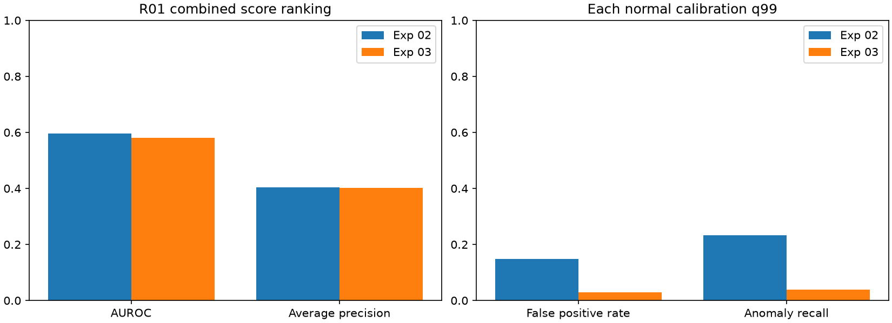

**의의:** 정상 trajectory를 검출 입력에 연결해 공간 phase 관측을 늘리고 Visual AUROC를 높일 가능성을 확인했습니다. 다만 Combined AUROC는 하락했습니다. 관측 품질 개선을 최종 탐지 개선이나 novelty 입증으로 확대 해석하지 않습니다.

**보완할 점:** 오탐 감소와 함께 recall도 23.37%→3.83%로 줄었습니다. 전이 빈도 점수에는 phase 내 실제 진행·정지 정보가 없고, 제품 없는 정상 구간의 배경 오검출도 남았습니다. 관측률은 제품 recall이 아니며 독립 bbox GT와 다른 장면 검증이 필요합니다. ROI의 경로 밖 이상 누락 가능성도 있습니다.

### 실험 03 이후 Recommended improvements — 추천순 3개

| 추천순 | 개선 후보 | 검증 방향 |
|---|---|---|
| 1 | **정상 궤적의 진행량 기반 공정 점수** | 동일 track의 프레임당 이동량으로 실제 진행·정지 신호 추가. 정상 FIT 진단 후 규칙 고정 |
| 2 | **관측 상태와 실제 부재 구분** | 빈 벨트·검출 누락·재관측을 구분하고 정상 오탐과 제품 누락 이상을 함께 점검 |
| 3 | **공정 기여를 검증하는 결합·보정** | Visual 단독/고정 결합/정상 신뢰도 결합 비교. test 지표로 가중치 탐색 금지 |

[상세 결과·의의·한계·후보별 검증 기준](docs/EXPERIMENT03.md) · [실험 04 계획](docs/EXPERIMENT04_PLAN.md) · [지표](results/experiment03/metrics.json) · [관측 진단](results/experiment03/observations.json)

## 실험 04 결과 — 정상 phase별 진행량 추가

동일 track의 인접 관측에서 원본 프레임당 진행량을 계산하고, phase별 정상 median/MAD 편차를 기존 공정 점수에 추가했습니다. 미관측·track 변경 시 진행량은 사용하지 않습니다. 실험 03의 특징·phase·Visual 및 기존 전이 점수가 보존됐는지 검사했습니다.

| 지표 | 실험 03 | 실험 04 |
|---|---:|---:|
| Visual AUROC | 0.6514 | 0.6514 |
| Visual AP | 0.4260 | 0.4260 |
| Process AUROC | 0.5388 | 0.6738 |
| Process AP | 0.3603 | 0.6167 |
| Combined AUROC | 0.5814 | 0.6846 |
| Combined AP | 0.4018 | 0.6298 |
| 정상 q99에서 테스트 정상 오탐률 | 2.96% | 9.95% |
| 정상 q99에서 테스트 이상 recall | 3.83% | 41.95% |

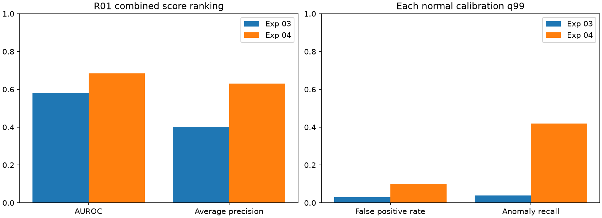

**의의:** 외형과 phase를 고정한 상태에서 시간적 진행량이 추가 이상 신호를 제공할 가능성을 확인했습니다. Combined AUROC +0.1032, AP +0.2279입니다. 이는 R01 개발 결과이며 phase 조건화의 독립 기여나 알고리즘 novelty·일반화 입증은 아닙니다.

**보완할 점:** 정상 오탐률도 2.96%→9.95%로 늘었습니다. 오탐 구간 41개 중 30개가 4프레임 이하였지만, 실제 이상과 겹치는 경보도 짧은 경우가 있어 단순 제거는 위험합니다. 진행량 유효 관측률은 테스트 sampled 시점 기준 93.85%이며 실제 부재와 검출 실패 문제는 남아 있습니다. 각 모델의 정상 q99에서 비교했으므로 동일 테스트 오탐률 비교가 아닙니다.

### 실험 04 이후 Recommended improvements — 추천순 3개

| 추천순 | 개선 후보 | 검증 방향 |
|---|---|---|
| 1 | **여러 연속 관측으로 진행량 추정** | 단일 간격 변동을 줄이는 인과적 변위 계산. 관측률·오탐/recall·지연·짧은 이상 손실 함께 확인 |
| 2 | **phase 조건의 필요성 분리 검증** | phase별/pooled 진행량 모델만 교체해 추가 복잡성의 기여 확인 |
| 3 | **미사용 장면 적용성과 검증 분리** | 테스트 성능과 무관하게 다른 장면을 선택하고 정상 데이터로만 파이프라인 적합 |

[상세 보고서](docs/EXPERIMENT04.md) · [지표](results/experiment04/metrics.json) · [오류 진단](results/experiment04/error_diagnosis.json) · [실험 05 계획](docs/EXPERIMENT05_PLAN.md)

## 실험 05 결과 — 여러 연속 관측의 진행량

진행량 계산을 4프레임 간격에서 12프레임 변위로 변경했습니다. 연속 4개 관측의 track ID가 같을 때만 사용하며, 나머지 특징·phase·점수 규칙은 유지했습니다.

| 지표 | 실험 04 | 실험 05 |
|---|---:|---:|
| Visual AUROC | 0.6514 | 0.6514 |
| Visual AP | 0.4260 | 0.4260 |
| Process AUROC | 0.6738 | 0.6889 |
| Process AP | 0.6167 | 0.6502 |
| Combined AUROC | 0.6846 | 0.6992 |
| Combined AP | 0.6298 | 0.6584 |
| 정상 q99 기준 테스트 정상 오탐률 | 9.95% | 5.92% |
| 정상 q99 기준 테스트 이상 recall | 41.95% | 42.26% |

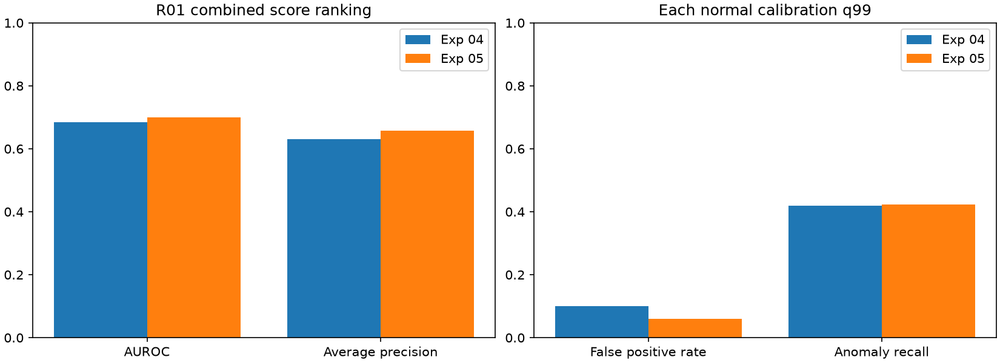

**의의:** R01에서 정상 오탐 프레임이 242→144로 줄고 AUROC/AP가 소폭 상승했습니다. 8개 GT 이상 구간 모두 경보가 있었으며 첫 경보 지연 중앙값은 두 실험 모두 38.5프레임입니다. 각자의 정상 q99 기준으로 비교했으며 동일 테스트 오탐률 비교가 아닙니다.

**보완할 점:** 테스트 진행량 가용성은 sampled 기준 93.85%→90.40%로 줄었습니다. 구간 안에 경보가 있다는 사실은 이상 프레임 전체를 탐지했다는 뜻이 아닙니다. 12프레임 이하 GT 이상 구간은 0개여서 짧은 이상 보존은 검증하지 못했습니다. 단일 장면 개발 결과이며 novelty·일반화 입증은 아직입니다.

### 실험 05 이후 Recommended improvements — 추천순 3개

| 추천순 | 개선 후보 | 검증 방향 |
|---|---|---|
| 1 | **진행량 phase 조건의 필요성 분리** | phase별/pooled 진행량 모델만 교체해 구성 요소의 기여와 복잡성 확인 |
| 2 | **미사용 장면·짧은 이상 검증** | 다른 공정과 이상 길이에서 정상 데이터만으로 적합하고 적용 한계 평가 |
| 3 | **초기·미관측 구간의 이상 신호 보완** | 긴 첫 경보 지연과 관측 부재를 진단하고 정상 빈 벨트/실제 누락 구분 |

[상세 보고서](docs/EXPERIMENT05.md) · [지표](results/experiment05/metrics.json) · [이벤트별 지연](results/comparison04_05/events.json) · [실험 06 계획](docs/EXPERIMENT06_PLAN.md)

## 실험 06 결과 — 진행량 phase 조건화 제거

동일한 12프레임 진행량을 phase별 모델 대신 하나의 pooled 정상 모델로 적합했습니다. 외형 PCA의 phase 조건화와 전이는 유지했습니다. 모든 입력 특징·관측 마스크·기존 branch가 보존됐는지 확인했습니다.

| 지표 | 실험 05: phase 조건 | 실험 06: pooled |
|---|---:|---:|
| Visual AUROC | 0.6514 | 0.6514 |
| Visual AP | 0.4260 | 0.4260 |
| Process AUROC | 0.6889 | 0.6929 |
| Process AP | 0.6502 | 0.6502 |
| Combined AUROC | 0.6992 | 0.7049 |
| Combined AP | 0.6584 | 0.6612 |
| 정상 q99 기준 테스트 정상 오탐률 | 5.92% | 7.82% |
| 정상 q99 기준 테스트 이상 recall | 42.26% | 45.45% |
| 첫 경보 지연 중앙값 (원본 프레임) | 38.5 | 12.0 |
| 경보가 발생한 GT 이상 구간 | 8 / 8 | 8 / 8 |
| 진행량 모델 수 (fallback 포함) | 4 | 1 |

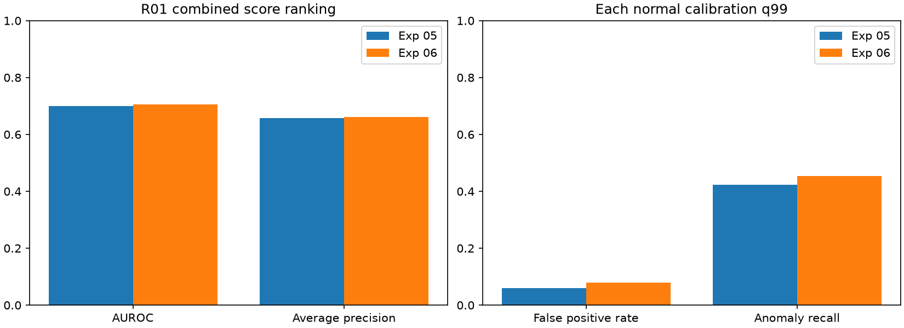

**의의:** 진행량 모델을 4→1개로 줄여도 이번 R01의 ranking은 낮아지지 않았습니다. 진행량의 phase 조건이 필수라는 주장은 현재 결과가 지지하지 않습니다. 외형 PCA의 phase 조건까지 불필요하다는 뜻은 아닙니다.

**보완할 점:** 오탐률이 5.92%→7.82%로 증가했습니다. phase 0의 이상 탐지 프레임이 0→88개로 늘면서 정상 오탐도 0→68개로 늘었습니다. 각 모델의 정상 q99가 달라졌으므로 지연 개선을 동일 오탐률에서의 우월성으로 해석하지 않습니다. AUROC/AP 차이도 작고 단일 장면 개발 결과에 한정됩니다.

### 실험 06 이후 Recommended improvements — 추천순 3개

| 추천순 | 개선 후보 | 검증 방향 |
|---|---|---|
| 1 | **미사용 실제 장면 R03 적용성** | 장면별 실행 구조를 분리하고 정상 discovery·관측 가정을 확인한 뒤 같은 R03 특징에서 진행량 추가 전후 비교 |
| 2 | **정상 조건별 보정·오탐 진단** | 정상 진입/진행/이탈 및 관측 신뢰도를 진단. test 기반 phase별 threshold 최적화 금지 |
| 3 | **독립 반복·짧은 이상 및 누락 검증** | 작은 지표 차이와 평가 공백을 seed/영상 단위 불확실성 및 다른 이상 길이로 확인 |

[상세 보고서](docs/EXPERIMENT06.md) · [지표](results/experiment06/metrics.json) · [phase별 오류](results/comparison05_06/phase_errors.json) · [실험 07 계획](docs/EXPERIMENT07_PLAN.md)

## 실험 07 결과 — 다른 실제 공정 R03 적용성

R03의 정상 영상으로 로컬 Qwen discovery와 정상 모델을 새로 적합했습니다. 지게차·팔레트 공정에 R01의 단방향 ROI/공간 phase를 복사하지 않고, 같은 R03 특징에서 기본 설정과 pooled 지게차 진행량 추가를 비교했습니다. 정상 fit/calibration 18/4개, 테스트 17개 영상의 12,005프레임입니다.

| R03 지표 | 기본 외형·전이 (07) | 진행량 추가 (07_motion) |
|---|---:|---:|
| Visual AUROC | 0.6968 | 0.6968 |
| Visual AP | 0.6374 | 0.6374 |
| Process AUROC | 0.4980 | 0.5243 |
| Process AP | 0.4223 | 0.4355 |
| Combined AUROC | 0.6747 | 0.6165 |
| Combined AP | 0.5664 | 0.4942 |
| 정상 q99 기준 정상 오탐률 | 3.85% | 3.59% |
| 정상 q99 기준 이상 프레임 recall | 5.56% | 6.41% |
| 경보가 발생한 GT 이상 구간 | 10 / 17 | 11 / 17 |
| 미탐 GT 이상 구간 | 7 | 6 |

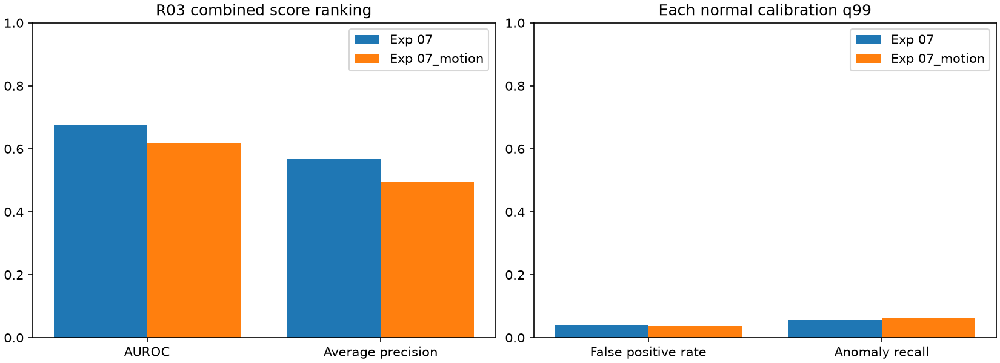

**의의:** R01에서 유용했던 진행량이 R03에서는 Combined AUROC -0.0582, AP -0.0722로 악화됐습니다. 모듈의 적용 조건과 실패를 확인했으며, 장면별 discovery·artifact·역할 anchor를 분리하는 구현을 추가했습니다. R01 학습 분포를 그대로 이전한 zero-shot 실험은 아닙니다.

**보완할 점:** `carrying` phase가 모든 분할에서 0개이고, 높은 역할 관측률에도 배경·부분·중복 박스가 섞입니다. 정상 정지와 왕복이 있는 공정에서 지게차 중심 속도만으로 적재 관계를 표현하기 어렵습니다. 두 설정 모두 프레임 recall이 낮고 6~7개 GT 구간을 놓쳤습니다. 서로 다른 정상 q99 기준 비교이며, 탐지 구간 집합이 달라 detected-only 지연 중앙값을 직접 개선량으로 해석하지 않습니다.

### 실험 07 이후 Recommended improvements — 추천순 3개

| 추천순 | 개선 후보 | 검증 방향 |
|---|---|---|
| 1 | **객체 관계 기반 상태 grounding** | 지게차–팔레트 상대 위치·겹침·크기로 정상 latent state 구성. 상태 support와 탐지 품질 함께 검증 |
| 2 | **역할별 검출 품질·관측 불확실성** | 큰 배경 박스, 부분/중복 팔레트 진단. coverage를 GT recall로 해석하지 않음 |
| 3 | **공정 모듈의 조건부 사용·결합 검증** | 약한 공정 점수가 외형 신호를 희석하는지 검증. 정상 support로 규칙을 정하고 test 가중치 탐색 금지 |

[상세 보고서](docs/EXPERIMENT07.md) · [기본 지표](results/experiment07/metrics.json) · [진행량 추가 지표](results/experiment07_motion/metrics.json) · [실험 08 사전 계획](docs/EXPERIMENT08_PLAN.md)

## 실험 08 결과 — 객체 관계 기반 잠재 상태

지게차–팔레트의 상대 위치·면적비·겹침과 지게차 위치로 정상 관계 군집 4개를 적합했습니다. 실험 07의 bbox/CLIP 특징을 보존하고 phase와 그에 종속된 정상 모델만 바꿨습니다. 관계 관측률은 정상 FIT 99.81%, calibration/test 100%지만 검출·semantic phase 정확도를 뜻하지 않습니다.

| R03 지표 | 실험 07 | 실험 08 |
|---|---:|---:|
| Visual AUROC | 0.6968 | 0.7330 |
| Visual AP | 0.6374 | 0.6778 |
| Process AUROC | 0.4980 | 0.5520 |
| Process AP | 0.4223 | 0.4693 |
| Combined AUROC | 0.6747 | 0.6361 |
| Combined AP | 0.5664 | 0.5496 |
| 정상 q99 기준 정상 오탐률 | 3.85% | 3.36% |
| 정상 q99 기준 이상 프레임 recall | 5.56% | 10.36% |
| 경보가 발생한 GT 이상 구간 | 10 / 17 | 11 / 17 |

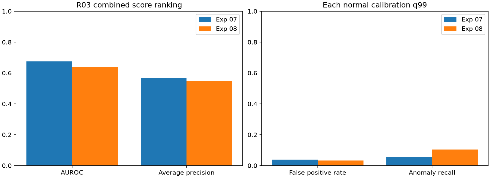

**의의:** 외형 입력을 보존한 관계 phase 교체로 Visual AUROC가 +0.0362 상승했습니다. 두 branch의 개별 ranking이 올라도 고정 결합은 악화될 수 있음을 확인했습니다. 정상 calibration에서 공정 percentile 중앙값이 이전 상태별 0.190~0.964로 달라 다음 보정 실험의 근거를 확보했습니다. novelty·semantic grounding 성공·일반화가 입증된 것은 아닙니다.

**보완할 점:** Combined AUROC는 -0.0385이며 여전히 GT 이상 구간 6개를 놓쳤습니다. 상태 군집에는 독립 의미 정답이 없고, 정상 시간 순서에 따른 군집 번호와 self/next/cycle prior도 heuristic입니다. 각자의 정상 q99로 비교했습니다. 공통 탐지 9개 구간의 지연 변화 중앙값은 -104프레임이지만 신규 탐지 2개·탐지 손실 1개, 시작 전부터 경보가 켜진 구간 1개를 함께 고려해야 합니다. R03은 개발 장면입니다.

### 실험 08 이후 Recommended improvements — 추천순 3개

| 추천순 | 개선 후보 | 검증 방향 |
|---|---|---|
| 1 | **이전 상태별 공정 점수 보정** | 정상 상태별 percentile 차이 진단에 근거. phase·외형·raw 전이·결합 고정 후 조건부 CDF만 비교 |
| 2 | **공정 결합 기여 분리** | branch 개선과 Combined 하락의 불일치 확인. Visual 단독·정상 신뢰도 결합을 test 가중치 탐색 없이 검증 |
| 3 | **잠재 상태·관측 신뢰성 검증** | 상태 support를 의미 정확도와 구분. 정상 대표 관측·bbox/관계 품질 및 순서 안정성 점검 |

[상세 결과·의의·한계·후보별 검증 기준](docs/EXPERIMENT08.md) · [지표](results/experiment08/metrics.json) · [정상 보정 진단](results/experiment08/normal_process_calibration_diagnostic.json) · [실험 09 계획](docs/EXPERIMENT09_PLAN.md)

## 실험 09 결과 — 이전 상태별 공정 점수 보정

실험 08의 특징·phase·외형 모델·전이 원점수는 보존하고, 정상 전이 점수의 보정만 이전 상태별로 나눴습니다. 정상 상태별 percentile 중앙값 범위는 0.190~0.964에서 0.438~0.491로 줄었습니다. 보정에 사용한 정상 데이터의 진단이며 독립 일반화 결과는 아닙니다.

| R03 지표 | 실험 08 | 실험 09 |
|---|---:|---:|
| Visual AUROC | 0.7330 | 0.7330 |
| Visual AP | 0.6778 | 0.6778 |
| Process AUROC | 0.5520 | 0.4627 |
| Process AP | 0.4693 | 0.4086 |
| Combined AUROC | 0.6361 | 0.7108 |
| Combined AP | 0.5496 | 0.6125 |
| 정상 q99 기준 정상 오탐률 | 3.36% | 1.85% |
| 정상 q99 기준 이상 프레임 recall | 10.36% | 2.29% |
| 경보가 발생한 GT 이상 구간 | 11 / 17 | 11 / 17 |

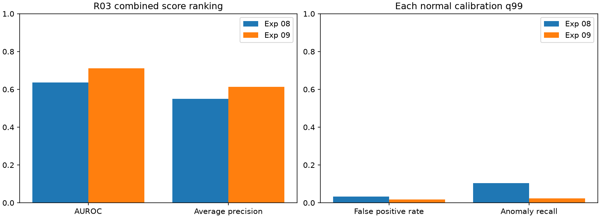

**의의:** 보정만 바꿔 Combined AUROC +0.0747, AP +0.0629를 확인했습니다. 그러나 Process ranking은 하락했고 Visual 단독보다도 낮습니다. 정상 보정과 실제 공정 이해의 개선을 구분할 근거이며 novelty나 일반화 입증은 아닙니다.

**보완할 점:** 평균 결합에서 상태 유지 점수의 상한은 0.719~0.745로 정상 q99 0.958을 넘지 못합니다. 상태 유지 이상 4,884프레임에서 경보가 없었고 전체 recall은 2.29%입니다. 경보는 상태 변경 구간에 집중돼 그 구간의 정상 156프레임 중 128프레임도 오탐입니다. 동일한 GT 11개 구간을 탐지했으며 공통 지연 변화 중앙값은 0프레임입니다. 각 모델의 정상 q99 비교이고, R03은 개발 장면입니다.

### 실험 09 이후 Recommended improvements — 추천순 3개

| 추천순 | 개선 후보 | 검증 방향 |
|---|---|---|
| 1 | **외형 점수를 낮추지 않는 결합** | 평균을 max로 바꾸고 Visual 단독도 비교. 상태 유지 탐지와 상태 전환 오탐의 상충 평가 |
| 2 | **체류 시간 기반 공정 신호** | 같은 self-transition 반복의 한계를 정상 머무름 길이로 보완. 정상 대기·정지 및 경계 censoring 진단 |
| 3 | **정상 보정·상태 관측의 안정성 검증** | calibration 4개 영상·희소 상태 16개 전이의 한계 점검. 영상 단위 support와 의미 정확도 구분 |

[상세 결과·의의·한계·후보별 검증 기준](docs/EXPERIMENT09.md) · [지표](results/experiment09/metrics.json) · [결합 실패 진단](results/experiment09/fusion_diagnostic.json) · [실험 10 계획](docs/EXPERIMENT10_PLAN.md)

## 실험 10 결과 — 최댓값 결합과 Visual 단독

두 branch를 고정하고 평균 결합을 max로 교체했습니다. Visual 단독 대조군도 함께 평가했으며, 각 설정의 최종 점수로 정상 q99를 따로 정했습니다.

| R03 최종 점수 지표 | 09 평균 | 10 최댓값 | Visual 단독 |
|---|---:|---:|---:|
| AUROC | 0.7108 | 0.7339 | 0.7330 |
| AP | 0.6125 | 0.6784 | 0.6778 |
| 정상 q99 기준 정상 오탐률 | 1.85% | 2.62% | 7.87% |
| 정상 q99 기준 이상 프레임 recall | 2.29% | 25.59% | 31.53% |
| 경보가 발생한 GT 이상 구간 | 11 / 17 | 11 / 17 | 13 / 17 |

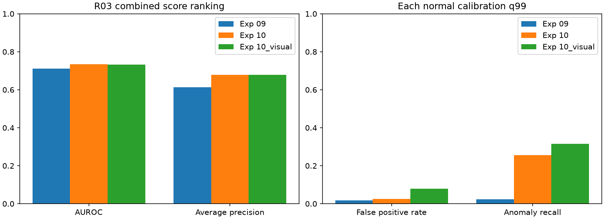

**의의:** 평균 결합에서 경보가 불가능했던 상태 유지 이상 4,884프레임 중 max는 1,213프레임을 탐지했습니다. 결합의 억제는 해소됐지만 Visual 대비 AUROC 차이는 +0.0009이며 추가 탐지 GT 구간은 없었습니다. 공정 신호의 추가 기여가 제한적임을 확인한 결과이고 novelty·일반화 입증은 아닙니다.

**보완할 점:** max도 이상 구간 6개를 놓쳤습니다. Visual보다 높은 q99 때문에 기존 이상 경보 317프레임을 잃고 16프레임을 추가했으며, 구간 2개를 더 놓쳤습니다. 점수가 낮아지지 않아도 재보정한 임계값의 탐지가 보존되는 것은 아닙니다. 각자의 정상 q99 비교이며 작은 ranking 차이에 유의성을 주장하지 않습니다.

### 실험 10 이후 Recommended improvements — 추천순 3개

| 추천순 | 개선 후보 | 검증 방향 |
|---|---|---|
| 1 | **관측된 진입 이후 정상 체류 시간** | 전이만으로 부족한 지속 신호 추가. 정상 support가 충분한 상태만 사용하고 경계·누락·진입 미관측은 abstain |
| 2 | **영상 단위 정상 보정 안정성** | q99 차이 0.0008219에 경보가 크게 변함. 정상 영상별 상단 분포와 임계값 민감도 점검 |
| 3 | **관계 상태의 의미·관측 품질** | 짧은 군집 전환이 실제 동작인지 확인. 검출 실패·jitter와 실제 전환을 보조 진단으로 구분 |

[상세 결과·의의·한계·후보별 검증 기준](docs/EXPERIMENT10.md) · [최댓값 지표](results/experiment10/metrics.json) · [Visual 지표](results/experiment10_visual/metrics.json) · [경보·상단 점수 진단](results/comparison09_10_10_visual/fusion_diagnostic.json) · [실험 11 계획](docs/EXPERIMENT11_PLAN.md)

## 실험 11 결과 — 관측된 진입 이후 체류 시간

정상 완결 구간이 충분한 상태 1/2/3에만 체류 점수를 추가했습니다. 시작 경계·관계 누락·지원 부족 상태에서는 기존 전이를 유지합니다. 특징·phase·Visual·기존 전이 점수는 보존했습니다.

| R03 지표 | 실험 10 | 실험 11 |
|---|---:|---:|
| Visual AUROC | 0.7330 | 0.7330 |
| Process AUROC | 0.4627 | 0.5230 |
| Combined AUROC | 0.7339 | 0.7005 |
| Combined AP | 0.6784 | 0.6055 |
| 정상 q99 기준 정상 오탐률 | 2.62% | 6.37% |
| 정상 q99 기준 이상 프레임 recall | 25.59% | 26.22% |
| 경보가 발생한 GT 이상 구간 | 11 / 17 | 11 / 17 |

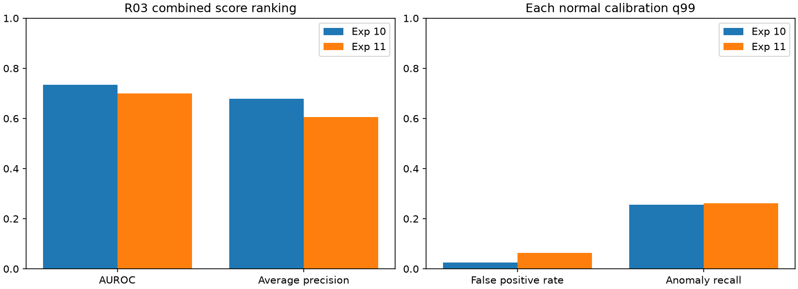

**의의:** 경계·누락·지원 부족을 구분하는 인과적 체류 모듈을 구현하고 실패 조건을 확인했습니다. Process ranking은 조금 높아져도 최종 성능은 악화됐으며, 현재 결과로 체류 모듈의 성능 개선이나 novelty를 주장할 수 없습니다.

**보완할 점:** 정상 오탐 260프레임과 이상 탐지 32프레임이 추가됐고 새 GT 구간은 탐지하지 못했습니다. 상태 2에서 추가 이상 탐지 없이 오탐 224프레임이 발생했습니다. 체류 신호는 테스트 프레임 58.43%에서만 유효하며, 유효 구간 단독 AUROC는 0.5050입니다. 정상 길이도 진입 맥락에 따라 달랐지만 이것이 실패 원인인지는 후속 검증이 필요합니다. 각자의 정상 q99 비교이며 R03은 개발 장면입니다.

### 실험 11 이후 Recommended improvements — 추천순 3개

| 추천순 | 개선 후보 | 검증 방향 |
|---|---|---|
| 1 | **진입 맥락별 체류 시간** | 상태 2의 정상 길이 중앙값 134 대 18프레임 차이 검증. 동일 유효 마스크 대조군으로 abstention 효과와 분리 |
| 2 | **정상 속도·상단 보정 안정성** | 체류 percentile=1인 테스트 정상 284프레임. 정상 영상별 길이 꼬리·calibration 대표성 점검 |
| 3 | **관계 상태와 실제 동작 대응** | 의미 GT 부재와 약한 체류 구별력 점검. 군집 재방문·jitter·가림과 실제 지속 구분 |

[상세 결과·의의·한계·후보별 검증 기준](docs/EXPERIMENT11.md) · [지표](results/experiment11/metrics.json) · [체류 오류 진단](results/experiment11/dwell_diagnostic.json) · [정상 진입 맥락](results/experiment11/normal_entry_context_diagnostic.json) · [실험 12 계획](docs/EXPERIMENT12_PLAN.md)

## 실험 12 결과 — 진입 맥락별 체류 시간

진입별 길이 모델과 동일 유효 구간의 상태별 길이 대조군을 함께 평가했습니다. 두 설정 모두 테스트 체류 가용성은 57.56%이며 기존 Visual·전이 점수는 동일합니다.

| R03 지표 | 11 상태별 | 12_support 대조 | 12 진입별 |
|---|---:|---:|---:|
| Combined AUROC | 0.7005 | 0.7006 | 0.6968 |
| Combined AP | 0.6055 | 0.6055 | 0.5953 |
| 정상 q99 기준 정상 오탐률 | 6.37% | 6.37% | 7.35% |
| 정상 q99 기준 이상 프레임 recall | 26.22% | 26.22% | 26.70% |
| 경보가 발생한 GT 이상 구간 | 11 / 17 | 11 / 17 | 11 / 17 |

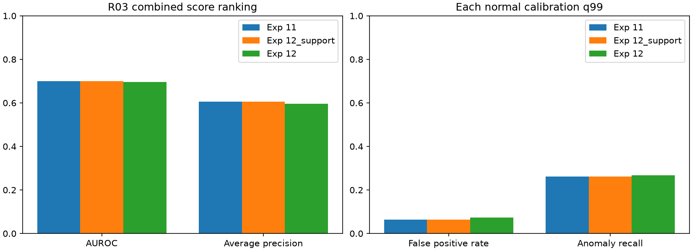

**의의:** 동일 support 대조로 구간 제외 효과와 길이 조건화 효과를 분리했습니다. 조건화는 이번 결과에서 개선을 지지하지 않았으며, 다른 맥락의 raw 변화가 공유 CDF를 통해 길이 모델이 그대로인 맥락에도 영향을 주는 현상을 확인했습니다. novelty·일반화 입증은 아닙니다.

**보완할 점:** 대조군보다 정상 오탐 68프레임과 이상 탐지 24프레임이 추가됐고 새 이상 구간은 탐지하지 못했습니다. 길이가 그대로인 0→1에서도 오탐 48프레임이 추가됐습니다. 정상 4개 영상의 보정 결과만으로 다른 정상 영상에서의 안정성을 판단하기 어렵습니다. 12와 대조군의 q99는 이번 실행에서 같았지만 동일 테스트 오탐률 비교는 아닙니다.

### 실험 12 이후 Recommended improvements — 추천순 3개

| 추천순 | 개선 후보 | 검증 방향 |
|---|---|---|
| 1 | **정상 영상 단위 보정 검증** | 정상 4개 영상을 하나씩 제외하고 나머지 3개로 모든 reference/q99 적합. 제외 영상의 오탐·support 확인 |
| 2 | **맥락 간 보정 간섭 완화** | 같은 raw의 percentile 변화 진단. 충분한 support에서 보정만 분리하되 희소 맥락 불안정성 점검 |
| 3 | **관계 상태의 의미·관측 재검증** | 약한 체류 구별력과 기존 오탐 원인 확인. 실제 정상 대기·재방문과 군집/검출 오류 구분 |

[상세 결과·의의·한계·후보별 검증 기준](docs/EXPERIMENT12.md) · [12 지표](results/experiment12/metrics.json) · [대조군 지표](results/experiment12_support/metrics.json) · [보정 간섭 진단](results/comparison11_12_support_12/calibration_interference.json) · [실험 13 계획](docs/EXPERIMENT13_PLAN.md)

## 실험 13 결과 — 정상 영상 단위 보정 검증

정상 calibration 영상 07/08/15/22를 하나씩 제외하고 나머지 3개로 모든 reference와 q99를 적합했습니다. FIT 18개는 고정했으며, 4설정 × 4fold에서 각 설정이 동일한 정상 2,806프레임을 평가했습니다. **정상만 사용하므로 이상 AUROC/AP·recall·구간 지연은 계산하지 않았습니다.**

| 정상 holdout 결과 | 체류 없음 (10) | 상태별 (11) | support 대조 (12_support) | 진입별 (12) |
|---|---:|---:|---:|---:|
| 오탐 프레임 | 44 | 84 | 84 | 84 |
| 전체 프레임 가중 오탐률 | 1.568% | 2.994% | 2.994% | 2.994% |
| 영상별 오탐률 평균 | 1.577% | 2.999% | 2.999% | 2.999% |
| 영상 22 오탐률 | 1.71% | 7.40% | 7.40% | 7.40% |

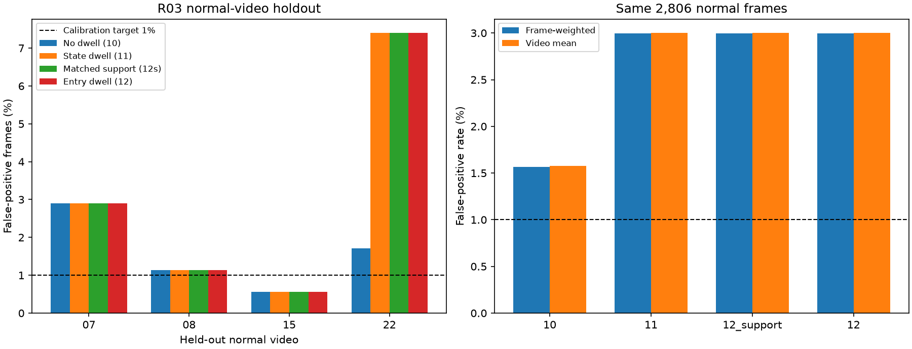

**의의:** 모든 보정 단계에서 평가 영상을 제외하는 검증을 추가했습니다. 정상 22의 구간 길이 232는 FIT 최대 244 이내였지만, 보정 영상 세 개의 길이가 모두 180이어서 체류 점수가 1로 포화됐습니다. 이상 라벨 없이 정상 support 왜곡의 구체적 반례를 확인했습니다.

**보완할 점:** 추가 체류 오탐 40프레임은 한 영상에 집중됐고 세 체류 모델의 경보는 같았습니다. 기본 모델에도 정상 오탐이 남습니다. 네 정상 영상은 이전 실험에 사용된 개발 자료이며, 이번 fold에서 제외했다고 최종 독립 테스트가 되는 것은 아닙니다. 성능 향상·novelty·통계적 유의성은 주장하지 않습니다.

### 실험 13 이후 Recommended improvements — 추천순 3개

| 추천순 | 개선 후보 | 검증 방향 |
|---|---|---|
| 1 | **완결 정상 구간 기준 체류 percentile** | FIT 길이 분포에서 경과 시간 위치를 직접 계산. 정상 support 보존과 이상 민감도 감소를 함께 평가 |
| 2 | **영상 단위 support·보정 불확실성** | 한 영상 제외로 state 3 reference가 7/9개가 되는 희소성 점검. 프레임 수와 영상 다양성 구분 |
| 3 | **관계 상태·외형 오탐 진단** | 체류 없이도 남는 정상 44프레임 오탐을 bbox/상태 안정성 관점에서 분석 |

[상세 결과·의의·한계·후보별 검증 기준](docs/EXPERIMENT13.md) · [fold 결과](results/experiment13/fold_metrics.csv) · [정상 support 반례](results/experiment13/support_diagnostic.json) · [실험 14 계획](docs/EXPERIMENT14_PLAN.md)

## 실험 14 결과 — 완결 정상 길이 기준 체류 percentile

체류의 2차 경과 시간 보정을 없애고, 정상 FIT 완결 길이 분포에서 현재 경과 시간의 위치를 직접 계산했습니다. 기존 Visual·전이·phase·체류 유효 마스크는 보존했습니다.

| R03 개발 테스트 지표 | 체류 없음 (10) | 기존 진입별 (12) | 완결 FIT 기준 (14) |
|---|---:|---:|---:|
| Combined AUROC | 0.7339 | 0.6968 | 0.7042 |
| Combined AP | 0.6784 | 0.5953 | 0.6036 |
| 정상 q99 기준 정상 오탐률 | 2.62% | 7.35% | 7.06% |
| 정상 q99 기준 이상 프레임 recall | 25.59% | 26.70% | 26.22% |
| 경보가 발생한 GT 이상 구간 | 11 / 17 | 11 / 17 | 11 / 17 |

별도 정상 4-fold에서는 기존 12의 오탐이 **84→44프레임, 2.994%→1.568%**로 줄었습니다. fold별 q99는 같고, 정상 영상 22의 알려진 추가 오탐 40프레임을 제거했습니다. 이 자료는 변경 설계에 사용한 개발 자료로, 새로운 독립 검증은 아닙니다.

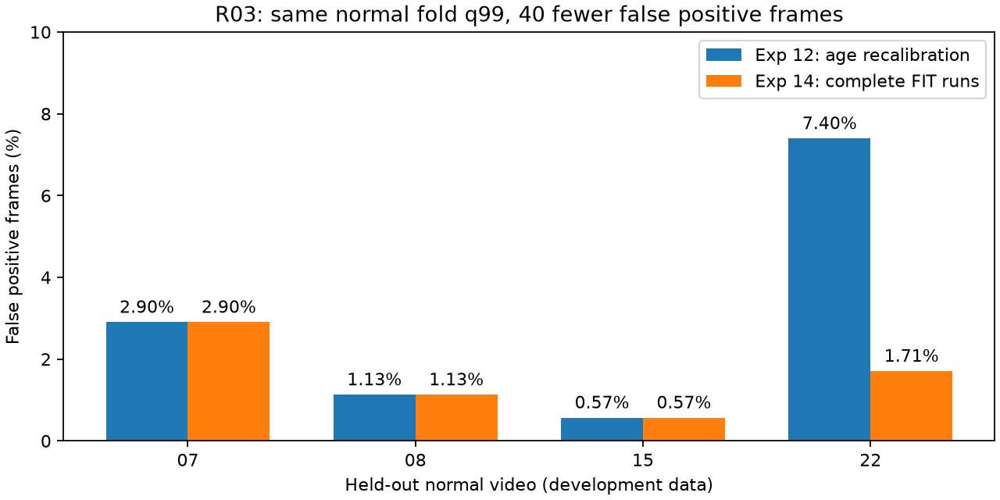

**의의:** 정상 완결 길이와 관측 경과 시간의 이중 보정에서 생긴 support 왜곡 한 사례를 교정했습니다. 정상 진단과 이상 탐지 손실을 함께 검증했으며, 국소적인 회복을 novelty나 체류 모듈의 성능 향상으로 주장하지 않습니다.

**보완할 점:** R03에서는 12보다 정상 경보 20프레임과 이상 경보 24프레임이 함께 줄었습니다. 체류 없는 10보다 정상 경보 308프레임과 이상 경보 32프레임이 추가됐고 새 이상 구간은 찾지 못했습니다. 완결 구간이 맥락별 16~23개라 이번 체류 branch는 FIT 최대 길이를 넘어야 독자 경보를 냅니다. 이를 넘은 정상 프레임도 336개입니다. 각자의 정상 q99 비교이며 R03은 반복 관찰한 개발 장면입니다.

### 실험 14 이후 Recommended improvements — 추천순 3개

| 추천순 | 개선 후보 | 검증 방향 |
|---|---|---|
| 1 | **R04에서 고정 파이프라인 적용성** | R03 반복 조정의 한계 확인. 정상 FIT로 재적합하고 체류 없는/있는 구성의 기여·관측 실패를 함께 평가 |
| 2 | **관계 상태·관측 품질 진단** | 정상 길이 초과 336프레임의 원인을 실제 영상·bbox·track·군집 전환과 대조 |
| 3 | **영상 단위 길이 support·불확실성** | 희소 길이 은행의 기여 영상 수와 최대 길이 안정성 확인. 추가 abstention의 탐지 손실 포함 |

[상세 결과·의의·한계·후보별 검증 기준](docs/EXPERIMENT14.md) · [지표](results/experiment14/metrics.json) · [체류 진단](results/experiment14/completed_dwell_diagnostic.json) · [기준선 포함 비교](results/comparison10_12_14/comparison.png) · [실험 15 계획](docs/EXPERIMENT15_PLAN.md)

## 실험 15 결과 — R04 적용성과 경보 불능

새 실제 장면 R04의 정상 FIT 20개로 vocabulary·관계 모델을 적합하고 calibration 5개, 테스트 19개·8,154프레임을 평가했습니다. 같은 특징의 체류 없는/있는 두 구성을 비교했습니다.

| R04 지표 | 체류 없음 (15_base) | 완결 FIT 체류 (15) |
|---|---:|---:|
| Combined AUROC | 0.6692 | 0.7061 |
| Combined AP | 0.6614 | 0.7191 |
| 정상 q99 | 0.997458 | **1.000000** |
| 정상 오탐률 | 9.12% | 0% |
| 이상 프레임 recall | 11.51% | **0%** |
| 경보가 발생한 GT 이상 구간 | 12 / 26 | **0 / 26** |

**오탐 0%는 개선이 아닙니다.** 정상 calibration 482개 중 5개 체류 점수가 FIT 최대 길이 밖에서 1로 포화됐고 q99도 1이 됐습니다. 모든 점수는 1 이하이므로 `score > q99` 경보가 불가능합니다. 테스트 비교 연산이나 임계값을 바꿔 결과를 보정하지 않았습니다.

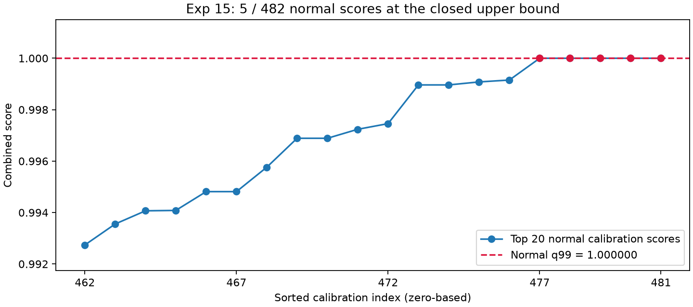

**의의:** 새 장면에서 고정한 파이프라인을 재현하고 ranking 상승과 경보 가능성을 구분했습니다. 이 실패는 정상 calibration만으로도 발견할 수 있습니다. AUROC 상승을 운용 성능 개선이나 novelty로 주장하지 않습니다.

**보완할 점:** 정상 예시 6개 중 5개에서 `lid` bbox가 움직이는 금속판 대신 바이스를 가리켰습니다. 이는 정성 사례이며 전수 검출 정확도는 아닙니다. 높은 역할 관측률로 올바른 grounding을 주장할 수 없습니다. 체류 가용성은 41.83%이고, 희소 군집·미관측 상태 할당도 남아 있습니다. 같은 IPAD의 한 장면·단일 seed 결과이며 이후 R04는 개발 장면입니다.

### 실험 15 이후 Recommended improvements — 추천순 3개

| 추천순 | 개선 후보 | 검증 방향 |
|---|---|---|
| 1 | **연속 체류 꼬리 점수·경보 가능성 검사** | 체류 점수만 FIT lognormal CDF로 교체. 정상 q99 포화와 finite 여부, 경보 복구·오탐 증가를 함께 평가 |
| 2 | **정상 객체 역할 grounding 검증** | 높은 관측률과 실제 부품 오검출의 차이 확인. 정상 crop·혼동 객체를 점검하고 누락/후단 손실도 평가 |
| 3 | **미관측 관계 상태의 명시적 처리** | latent 0의 FIT 유효 관측 3개 대비 전체 할당 127개. 직접 관측과 초기/유지 상태를 구분한 fallback 검증 |

[상세 결과·의의·한계·후보별 검증 기준](docs/EXPERIMENT15.md) · [체류 지표](results/experiment15/metrics.json) · [체류 없는 지표](results/experiment15_base/metrics.json) · [정상 포화 진단](results/experiment15/threshold_ceiling.json) · [실험 16 계획](docs/EXPERIMENT16_PLAN.md)

## 실험 16 결과 — 연속 체류 점수와 경보 복구

객체·특징·관계 상태·체류 지원 구간을 고정하고 체류 점수만 정상 FIT 완결 길이의 lognormal CDF로 바꿨습니다. 먼저 정상 calibration에서 포화 여부를 확인한 뒤 같은 설정으로 평가했습니다.

| R04 지표 | 체류 없음 (15_base) | empirical 체류 (15) | 연속 체류 (16) |
|---|---:|---:|---:|
| Combined AUROC | 0.6692 | 0.7061 | 0.6851 |
| Combined AP | 0.6614 | 0.7191 | 0.6712 |
| 정상 q99 | 0.997458 | 1.000000 | 0.997458 |
| 정상 오탐률 | 9.12% | 0% | 9.12% |
| 이상 프레임 recall | 11.51% | 0% | 11.51% |
| 경보가 발생한 GT 이상 구간 | 12 / 26 | 0 / 26 | 12 / 26 |

**의의:** 정상 calibration의 체류 점수 1 포화가 5개→0개가 되어 경보 불능을 해소했습니다. 그러나 복구된 경보는 체류 없는 기준선과 프레임별로 완전히 같습니다. 포화 교정과 체류의 추가 효용을 구분했으며, 새로운 탐지 성능이나 CDF 자체의 novelty를 입증한 결과는 아닙니다.

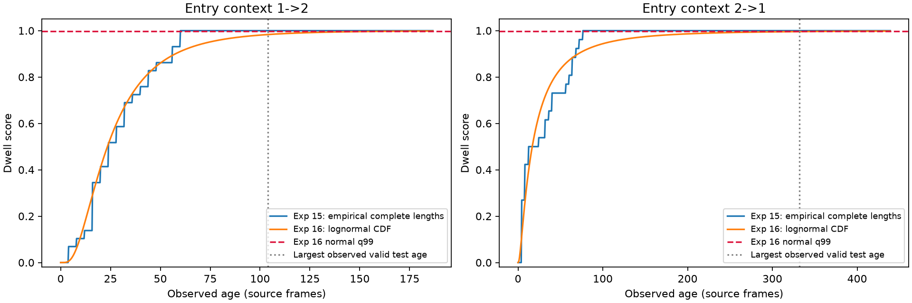

**보완할 점:** 테스트 체류 최대 점수 0.983324/0.996023이 모두 q99보다 낮아 추가 경보가 없었습니다. 기준선 대비 ranking은 조금 높지만 실험 15보다 AUROC/AP가 낮아졌습니다. 역할 오검출·체류 가용성 41.83%·미관측 phase 할당도 그대로입니다. lognormal 가정과 작은 정상 길이 표본의 일반화는 미검증이며, R04는 개발 장면입니다.

### 실험 16 이후 Recommended improvements — 추천순 3개

| 추천순 | 개선 후보 | 검증 방향 |
|---|---|---|
| 1 | **혼동 객체와 대조하는 anchor 역할 검증** | 기존 CLIP crop과 금속판/바이스 문장을 대조해 관계 후보를 필터링. 실제 부품 누락과 지원 붕괴도 평가 |
| 2 | **미관측 관계 상태의 명시적 처리** | 직접 관측과 초기/유지된 상태를 구분. 정상·추론에 같은 fallback을 적용하고 가용성·오탐/미탐 비교 |
| 3 | **정상 영상 단위 경보 지점 안정성** | calibration 영상 제외에 따른 q99·포화·branch 기여 점검. 테스트 기반 임계값·가중치 탐색 금지 |

[상세 결과·의의·한계·후보별 검증 기준](docs/EXPERIMENT16.md) · [지표](results/experiment16/metrics.json) · [정상 경보 가능성](results/experiment16/normal_feasibility.json) · [경보 비교](results/experiment16/lognormal_diagnostic.json) · [실험 17 계획](docs/EXPERIMENT17_PLAN.md)

## 실험 17 결과 — anchor 역할 검증과 관측 손실

기존 CLIP crop 특징에서 금속판 문장과 혼동 바이스 문장의 cosine을 대조해 `margin > 0`인 후보만 관계 anchor로 허용했습니다. 원본 bbox/crop/track과 appearance 후보를 유지하고 정상 관계·점수 모델을 재적합했습니다.

| R04 지표 | 실험 16 | 실험 17 |
|---|---:|---:|
| Combined AUROC | 0.6851 | 0.6711 |
| Combined AP | 0.6712 | 0.6630 |
| 정상 오탐률 | 9.12% | 10.15% |
| 이상 프레임 recall | 11.51% | 14.48% |
| 경보가 발생한 GT 이상 구간 | 12 / 26 | 14 / 26 |
| 체류 유효 비율 | 41.83% | 4.03% |

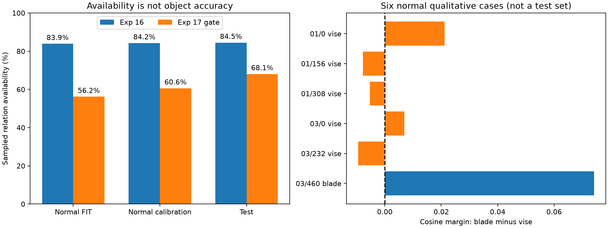

**의의:** 알려진 정상 바이스 오검출 5개 중 3개를 제외하고 확인한 금속판 1개를 유지했습니다. 언어로 후보 역할을 검증하는 단계를 구현했지만, 일부 정성 사례의 교정이 전체 파이프라인 개선을 보장하지 않음을 확인했습니다. 전수 정확도나 novelty 입증은 아닙니다.

**보완할 점:** q99는 동일했으나 순 오탐 +37프레임, 이상 탐지 +136프레임으로 절충이 생겼습니다. 전체 경보는 Visual branch와 같고 체류의 추가 경보는 없습니다. 정상 FIT의 같은-track margin 부호 전환은 190/1,868쌍이며 새 누락 구간 136개 중 62개가 한 sample 길이였습니다. 역할 오류 두 사례와 관측 끊김이 남고, 동일 관측 지원 대조가 없어 의미 검증과 관측 감소 효과를 분리하지 못했습니다.

### 실험 17 이후 Recommended improvements — 추천순 3개

| 추천순 | 개선 후보 | 검증 방향 |
|---|---|---|
| 1 | **track 단위 인과적 margin 집계** | 같은 track의 최근 3개 연속 관측 중앙값. 짧은 끊김·지원 회복과 잘못된 anchor 지속을 함께 평가 |
| 2 | **관측 지원을 맞춘 대조 실험** | 같은 관측 범위에서 후보 의미 변화와 coverage 감소의 영향을 분리 |
| 3 | **정상 역할 검증 범위 확대** | 부품 자세·배경이 다양한 정상 crop 검토. 개발 사례와 별도 사례, 수작업 주석 범위를 구분 |

[상세 결과·의의·한계·후보별 검증 기준](docs/EXPERIMENT17.md) · [지표](results/experiment17/metrics.json) · [정상 역할/지원](results/experiment17/normal_anchor_audit.json) · [관측·경보 변화](results/experiment17/gate_diagnostic.json) · [정상 연속성](results/experiment17/normal_gate_continuity.json) · [실험 18 계획](docs/EXPERIMENT18_PLAN.md)

## 실험 18 결과 — 시간적 안정성과 의미 오류의 구분

같은 anchor track의 최근 3개 연속 관측 margin 중앙값으로 역할 gate를 판정했습니다. 미래 관측 없이 gap·track·영상 변경에서 초기화하고, 기존 특징을 유지한 채 정상 관계·점수 모델을 재적합했습니다.

| R04 지표 | 실험 17 | 실험 18 |
|---|---:|---:|
| Combined AUROC / AP | 0.6711 / 0.6630 | 0.6655 / 0.6572 |
| 정상 오탐률 | 10.15% (363프레임) | 10.60% (379프레임) |
| 이상 프레임 recall | 14.48% | 14.64% |
| 경보가 발생한 GT 이상 구간 | 14 / 26 | 15 / 26 |
| 체류 유효 비율 | 4.03% | 5.11% |
| 정상 같은-track margin 부호 전환 | 190 / 1,868쌍 | 78 / 1,868쌍 |
| 정상 한 sample 관계 누락 구간 | 62 | 27 |

두 모델의 정상 q99는 0.997457627로 같습니다. 정상 FIT 20개/calibration 5개, 테스트 19개·8,154프레임을 평가했습니다. 누락 구간은 동일한 실험 16 관측을 기준으로 계산합니다.


**의의:** 짧은 판정 변동 감소와 의미 정확도·최종 경보의 개선을 분리했습니다. 인과적 역할 집계를 구현했지만, 종합 ranking은 하락하고 정상 오탐은 순 16프레임 늘었습니다. 안정성이 전반적 개선이나 novelty를 입증하지 않습니다.

**보완할 점:** 알려진 바이스 한 사례가 다시 통과해 오검출 5개 중 3개가 남았습니다. 체류의 추가 경보는 여전히 없고 전이가 Visual에 더한 경보는 정상 20/이상 4프레임입니다. 정상 FIT 837/1,960개는 관계를 관측하지 못했는데도 초기/이전 phase로 외형 모델을 학습합니다. 관측률을 역할 정확도로 해석하지 않으며 R04는 반복 개발 장면입니다.

### 실험 18 이후 Recommended improvements — 추천순 3개

| 추천순 | 개선 후보와 근거 | 변경·검증 방향 |
|---|---|---|
| 1 | **관측 여부를 반영하는 외형 subspace 선택**: FIT 미관측 837개, latent 0 직접 관측 3/126개 | 관측 FIT만 phase PCA에 사용하고 미관측 때 역할별 전체 정상 PCA로 fallback. 공정 점수 고정, 전체/관측별 지표·지원 부족 평가. 누락 프레임도 평가에 포함 |
| 2 | **관측 지원을 맞춘 대조 실험**: FIT 관계 +61/−39개와 후단 재적합이 혼재 | 같은 관측 mask에서 gate 효과 분리. 입력·지원 범위를 공개하고 subset 결과를 전체로 일반화하지 않음 |
| 3 | **정상 역할 검증 범위 확대**: 집계로 바이스 오류 한 사례 복원 | 별도 정상 자세·배경 사례의 부품 누락/혼동 검토. 주석 범위·비용 공개, 테스트 이상 라벨로 gate 튜닝 금지 |

[상세 결과·의의·한계·후보별 검증 기준](docs/EXPERIMENT18.md) · [지표](results/experiment18/metrics.json) · [정상 연속성](results/experiment18/normal_temporal_continuity.json) · [관측 조건/branch](results/experiment18/observation_conditioning.json) · [검증](results/experiment18/validation.json) · [실험 19 계획](docs/EXPERIMENT19_PLAN.md)

## 실험 19 결과 — 관측 여부를 반영한 외형 모델

관계가 관측된 정상 FIT만 phase별 PCA에 사용하고, 관계 미관측 또는 phase 지원 부족 시 역할별 전체 정상 PCA를 사용했습니다. 실험 18의 모든 특징·관계 mask·공정 점수는 유지했습니다.

| R04 지표 | 실험 18 | 실험 19 |
|---|---:|---:|
| Combined AUROC / AP | 0.6655 / 0.6572 | 0.6792 / 0.6767 |
| 정상 오탐률 | 10.60% (379프레임) | 8.05% (288프레임) |
| 이상 프레임 recall | 14.64% (670프레임) | 13.13% (601프레임) |
| 경보가 발생한 GT 이상 구간 | 15 / 26 | 14 / 26 |
| 역할×phase 외형 bank | 16 | 12 |

정상 FIT 20개/calibration 5개, 테스트 19개·8,154프레임을 평가했습니다. 정상 q99는 두 모델 모두 0.997457627이며 관계·체류 가용성도 같습니다.

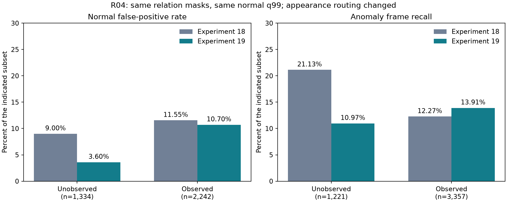

**의의:** 초기/이전 phase를 미관측 프레임에도 확정적으로 적용하던 가정을 검증했습니다. 같은 관측 범위에서 ranking과 오탐은 개선됐지만 미탐이 늘어 절충을 확인했습니다. 모델 선택 구조를 명시한 구현 결과이며 성능 상승만으로 novelty를 주장하지 않습니다.

**보완할 점:** 미관측 구간에서 정상 경보 72개와 이상 경보 124개가 함께 사라졌고 R04_04의 이상 구간 하나를 놓쳤습니다. 일부 역할의 phase/pooled 정상 residual 분포가 다른데 CDF는 혼합되어 있습니다. 학습 표본 제한과 추론 fallback의 개별 효과도 아직 분리하지 않았고, 객체 역할 오류·체류 가용성 5.11%는 남습니다. R04는 반복 개발 장면입니다.

### 실험 19 이후 Recommended improvements — 추천순 3개

| 추천순 | 개선 후보와 근거 | 변경·검증 방향 |
|---|---|---|
| 1 | **실제 외형 bank 경로별 정상 보정**: 판재 정상 보정 99% 분위가 관측 0.99271 / 미관측 0.96329 | 역할×phase/pooled CDF 비교. 정상 영상 holdout으로 표본 부족·포화·오탐 안정성을 먼저 검증하고 전체 recall/오탐 평가. 테스트 threshold 탐색 금지 |
| 2 | **학습 표본 제한과 추론 fallback의 분리 대조**: 관측/미관측 경보 변화가 다름 | 두 변경의 개별 구성과 결합 비교. 동일 특징·공정·분할을 유지하며 보정은 각 구성에 맞게 재적합 |
| 3 | **정상 객체 역할·관측 누락 검증**: 기존 역할 오류와 낮은 체류 지원 지속 | 별도 정상 사례의 부품 누락·혼동 검토. 주석 범위/비용 공개, 관측률과 의미 정확도 구분 |

[상세 결과·의의·한계·검증 기준](docs/EXPERIMENT19.md) · [지표](results/experiment19/metrics.json) · [관측별/bank 진단](results/experiment19/appearance_diagnostic.json) · [재현 검증](results/experiment19/validation.json) · [실험 20 계획](docs/EXPERIMENT20_PLAN.md)

## 실험 20 결과 — 외형 bank 경로별 정상 보정

PCA·raw residual·관계 mask·공정 점수를 유지하고 외형 CDF만 역할×실제 phase/pooled bank로 나눴습니다. 정상 관측 50개·서로 다른 영상 2개 이상일 때만 경로별 보정을 쓰며, 부족하면 역할 전체 CDF를 사용합니다.

| 지표 | 실험 19 | 실험 20 |
|---|---:|---:|
| 정상 영상 holdout 오탐 | 44/1,920 (2.29%) | **68/1,920 (3.54%)** |
| 테스트 Combined AUROC / AP | 0.6792 / 0.6767 | 0.6780 / 0.6802 |
| 테스트 정상 오탐률 | 8.05% (288) | 8.28% (296) |
| 테스트 이상 recall | 13.13% (601) | 13.22% (605) |
| 탐지한 GT 이상 구간 | 14/26 | 14/26 |

R04 정상 FIT 20개/calibration 5개, 테스트 19개·8,154프레임입니다. 모델별 정상 q99는 0.997457627 / 0.997607656으로 다릅니다. 탐지 구간 총수는 같지만 **두 구간을 얻고 두 구간을 잃었습니다.**

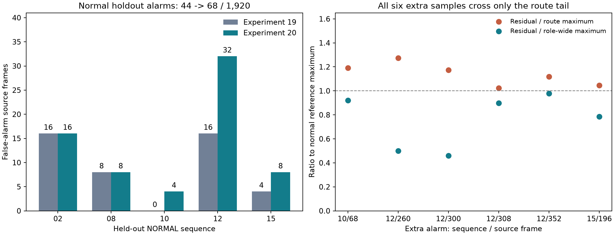

**의의:** 지원 guard를 통과해도 경로별 보정이 안정적이지 않을 수 있음을 정상 holdout에서 확인했습니다. 추가 정상 오탐 6 samples는 모두 해당 경로 최대 밖이지만 역할 전체 정상 범위 안에 있었습니다. 보정의 실패 조건을 재현한 결과이며 AP 상승을 novelty로 주장하지 않습니다.

**보완할 점:** 미관측 이상 탐지 순 +60개가 관측 탐지 −56개로 대부분 상쇄됐습니다. 정상 holdout·테스트 오탐이 모두 늘어 이번 CDF를 기본 구성으로 승격하지 않습니다. 관측 FIT 제한과 추론 fallback의 개별 기여, 객체 역할 오류·낮은 체류 지원은 미해결이며 R04는 반복 개발 장면입니다.

### 실험 20 이후 Recommended improvements — 추천순 3개

| 추천순 | 개선 후보와 근거 | 변경·검증 방향 |
|---|---|---|
| 1 | **관측 FIT 제한·추론 fallback의 2×2 분리 대조**: CDF 분리의 전체 탐지 순증가는 4개, 기존 외형 변경의 개별 효과는 미분리 | 역할 전체 CDF를 유지하고 두 요소의 단독/결합 구성 모두 공개. 정상 holdout·전체/관측별 지표 검증, 유리한 셀만 보고하지 않음 |
| 2 | **경로·역할 전체 reference의 부분 공유**: 추가 정상 6 samples가 역할 전체 범위 안 | 공유 규칙을 별도 실행 전에 고정하고 정상 꼬리·오탐과 이상 탐지 손실 평가. 테스트 가중치 탐색 금지 |
| 3 | **정상 역할·누락 검증 확대**: 기존 역할 오류와 체류 가용성 5.11% 지속 | 별도 정상 자세/배경 사례 검토와 보조 주석 범위·비용 공개. coverage와 의미 정확도 구분 |

[상세 결과·의의·한계·검증 기준](docs/EXPERIMENT20.md) · [정상 holdout](results/experiment20/normal_holdout.json) · [지표](results/experiment20/metrics.json) · [관측·경로 진단](results/experiment20/route_diagnostic.json) · [재현 검증](results/experiment20/validation.json) · [실험 21 계획](docs/EXPERIMENT21_PLAN.md)

## 실험 21 결과 — 관측 정보의 학습·추론 역할 분리

A는 관측된 정상 FIT만 phase PCA에 사용하는 변경, B는 미관측 추론 시 pooled PCA로 전환하는 변경입니다. 역할 전체 CDF를 유지하고 네 셀을 모두 비교했습니다.

| 구성 | 정상 holdout 오탐 / 1,920 | Combined AUROC | 테스트 오탐률 | 이상 recall | 탐지 구간 / 26 |
|---|---:|---:|---:|---:|---:|
| 18: A/B 없음 | 52 | 0.6655 | 10.60% | 14.64% | 15 |
| 21_fit: A만 | 40 | 0.6765 | 8.64% | 13.74% | 13 |
| 21_infer: B만 | 48 | 0.6715 | 9.48% | 13.76% | 17 |
| 19: A+B | 44 | 0.6792 | 8.05% | 13.13% | 14 |

R04 정상 FIT 20/calibration 5/test 19개, 테스트 8,154프레임입니다. 네 구성의 정상 q99는 0.997457627로 같았고 특징·관측 mask·공정 점수는 보존했습니다.

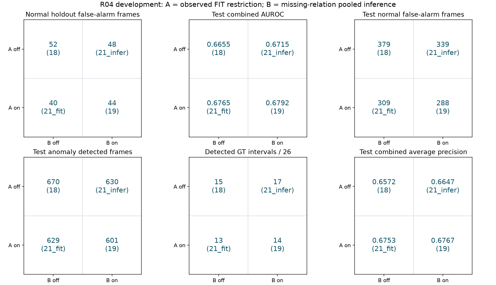

**의의:** 학습 제한과 추론 fallback을 분리해 역할과 절충을 확인했습니다. A는 두 B 조건에서 ranking과 정상 오탐을 개선했지만 이상 경보·구간 탐지는 줄었습니다. B는 이상 프레임 경보를 줄이면서 탐지 구간 수는 늘렸습니다. 지표별로 유리한 구성이 달라 하나를 종합 승자로 선택하지 않습니다.

**보완할 점:** A가 표본 수와 bank 지원도 바꾸므로 관측 정보 자체의 가치를 아직 입증하지 못했습니다. B는 역할 전체 CDF를 통해 관측 프레임 경보에도 간접 영향을 줍니다. 정상 영상별 결과가 다르고, 역할 오류·체류 가용성 5.11%와 R04 반복 개발 한계도 남습니다. 성능 상승을 novelty로 주장하지 않습니다.

### 실험 21 이후 Recommended improvements — 추천순 3개

| 추천순 | 개선 후보와 근거 | 변경·검증 방향 |
|---|---|---|
| 1 | **동일 표본 수 무작위 FIT 대조**: A 효과에 표본 감소·phase 0 bank 제거가 혼재 | 역할×phase 표본 수를 맞춰 seed 0~4 모두 평가. 정상 holdout·전체/관측별 지표 공개, 최고 seed 선택 금지 |
| 2 | **미관측 길이를 반영한 인과적 fallback**: A 고정 시 미관측 이상 경보 283→134개 | 정상 FIT 누락 분포로만 규칙을 정하고 길이별 오탐·미탐·경계 지연 검증. 미래 보간과 테스트 기반 gate 튜닝 금지 |
| 3 | **정상 객체 역할·누락 검증 확대**: 모든 셀이 기존 역할 오류를 계승 | 별도 정상 사례의 실제 부품/혼동 검토. 보조 주석 범위·비용 공개, 관측률과 정확도 구분 |

[상세 결과·의의·한계·검증 기준](docs/EXPERIMENT21.md) · [정상 holdout](results/experiment21/normal_holdout.json) · [요인·관측·bank 진단](results/experiment21/factorial_diagnostic.json) · [재현 검증](results/experiment21/validation.json) · [실험 22 계획](docs/EXPERIMENT22_PLAN.md)

## 실험 22 결과 — 같은 표본 수에서도 남는 차이와 상충

관측 FIT(21_fit)와 bank별 표본 수·지원 부족 fallback을 맞춘 무작위 seed 0–4를 모두 평가했다. B는 끄고 pooled PCA·관계 phase·공정 점수를 고정했다. R04 정상 FIT 20 / calibration 5 / 테스트 19개, 테스트 8,154프레임이다.

| 구성 | Visual AUROC / AP | Combined AUROC / AP | 정상 오탐률 (FP) | 이상 recall (TP) | 탐지 구간 / 26 |
|---|---:|---:|---:|---:|---:|
| 18: 전체 FIT | 0.6806 / 0.6688 | 0.6655 / 0.6572 | 10.60% (379) | 14.64% (670) | 15 |
| 21_fit: 관측 FIT | 0.7001 / 0.6970 | 0.6765 / 0.6753 | 8.64% (309) | 13.74% (629) | 13 |
| 22_s0: 무작위 0 | 0.6912 / 0.6835 | 0.6737 / 0.6672 | 9.31% (333) | 13.65% (625) | 17 |
| 22_s1: 무작위 1 | 0.6955 / 0.6866 | 0.6781 / 0.6709 | 9.87% (353) | 13.54% (620) | 16 |
| 22_s2: 무작위 2 | 0.6889 / 0.6829 | 0.6722 / 0.6679 | 10.88% (389) | 17.15% (785) | 18 |
| 22_s3: 무작위 3 | 0.6894 / 0.6814 | 0.6738 / 0.6670 | 9.20% (329) | 12.84% (588) | 16 |
| 22_s4: 무작위 4 | 0.6908 / 0.6846 | 0.6749 / 0.6694 | 8.86% (317) | 12.84% (588) | 17 |

정상 영상 holdout 오탐은 전체 FIT 52, 관측 FIT 40, random 32/40/40/56/40프레임(/1,920)이다. 각 구성은 역할 CDF/q99를 다시 적합했으며 s3의 q99는 0.997238, 나머지는 0.997458이다. 같은 테스트 오탐률 비교가 아니다.

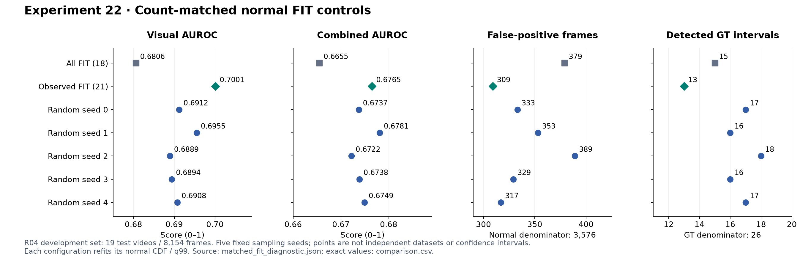

**의의:** 같은 표본 수에서도 관측 FIT의 Visual AUROC/AP와 낮은 오탐이 다섯 random보다 유리했다. 다만 random도 전체 FIT보다 Combined AUROC가 높아 기존 개선 전체를 관측 정보의 의미적 품질로 설명할 수 없다. 표본 선택에 따른 파이프라인의 상충을 구체화했다.

**보완할 점:** 관측 FIT의 Combined AUROC는 random 범위 안이고 구간 탐지는 13개 대 16–18개로 적다. 정상 holdout 우위도 일정하지 않다. 두 phase bank의 rank 차이가 남고, 동일 R04의 다섯 seed는 독립 검증/신뢰구간/novelty 증명이 아니다. 기존 라벨 정렬 미확정·역할 GT·FPS 한계는 유지한다.

### 실험 22 이후 Recommended improvements — 추천순 3개

| 추천순 | 개선 후보와 변경 내용 | 이번 결과의 근거 | 검증 기준 및 주의점 |
|---|---|---|---|
| 1 | **표본 수와 PCA rank를 함께 맞춘 관측 FIT 대조**: 같은 표본·bank별 공통 rank로 비교 | Visual AUROC/AP·오탐 차이는 무작위 범위 밖에 있지만 phase 2의 PCA rank가 다름 | 정상 FIT rank만으로 공통 값을 고정하고 여섯 구성 모두 정상 holdout·전체/관측별 점수·구간 탐지를 비교. 최고 seed 선택 금지, capacity 통제 후에도 의미 정확도/novelty로 해석하지 않음 |
| 2 | **미관측 지속 길이에 따른 인과적 fallback**: 짧은 누락과 긴 누락을 구분 | 관측 FIT는 미관측 AUROC가 높지만, 미관측 이상 경보 283개·구간 탐지 13개로 지표 간 차이가 남음 | 정상 FIT 누락 분포로만 규칙을 정하고 길이별 오탐/미탐·경계 지연과 CDF 간접 효과를 보고. 미래 프레임·테스트 길이를 gate 결정에 사용하지 않음 |
| 3 | **정상 영상의 객체 역할·관계 관측 감사 확대**: 부품과 혼동 객체의 추가 사례 점검 | 모든 대조가 같은 검출/관계 mask에 의존하고 체류 유효 비율은 계속 5.11% | 별도 정상 사례에서 역할 오류·누락을 검증하고 보조 주석 범위/비용 공개. 관측 mask나 5개 seed를 정답/독립 검증으로 간주하지 않음 |

72개 테스트와 44개 특징 파일·35개 정상 holdout 구성·133개 테스트 예측의 재구성 검증을 통과했다. 최고 seed는 선택하지 않았다.

[상세 결과·의의·한계](docs/EXPERIMENT22.md) · [비교 CSV](results/experiment22/comparison.csv) · [전체 진단](results/experiment22/matched_fit_diagnostic.json) · [정상 감사](results/experiment22/normal_audit.json) · [검증](results/experiment22/validation.json) · [실험 23 계획](docs/EXPERIMENT23_PLAN.md)

## 실험 23 결과 — rank 통제 후에도 남는 상충

관측 FIT와 random seed 0–4의 표본을 보존하고 정상 FIT rank 최솟값을 bank별 공통 rank로 맞췄다. global phase 2는 30, 역할 1 phase 2는 29이며 pooled·공정·추론 경로는 같다. R04 테스트 19개/8,154프레임을 평가했다.

| 공통 rank 구성 | Visual AUROC / AP | Combined AUROC / AP | 정상 오탐률 (FP) | 이상 recall (TP) | 탐지 구간 / 26 |
|---|---:|---:|---:|---:|---:|
| 23_obs | 0.7001 / 0.6971 | 0.6765 / 0.6753 | 8.64% (309) | 13.74% (629) | 13 |
| 23_s0 | 0.6912 / 0.6836 | 0.6737 / 0.6673 | 9.31% (333) | 13.48% (617) | 16 |
| 23_s1 | 0.6950 / 0.6872 | 0.6774 / 0.6712 | 9.31% (333) | 12.41% (568) | 16 |
| 23_s2 | 0.6886 / 0.6833 | 0.6715 / 0.6679 | 10.88% (389) | 16.89% (773) | 18 |
| 23_s3 | 0.6902 / 0.6832 | 0.6748 / 0.6687 | 9.20% (329) | 13.19% (604) | 16 |
| 23_s4 | 0.6904 / 0.6843 | 0.6744 / 0.6689 | 8.86% (317) | 12.93% (592) | 16 |

정상 holdout 오탐은 obs/s0/s1/s2/s3/s4 순으로 40/32/40/36/56/40프레임(/1,920)이다. 기존 대비 s2만 4개 감소했다. q99는 s3 0.997238, 나머지 0.997458이며 구성마다 정상 CDF/q99를 적합했다.

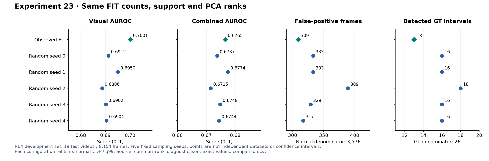

**의의:** count/rank/지원/경로를 맞춰도 관측 FIT의 외형 ranking·낮은 오탐 차이는 유지됐다. 이전 차이를 rank만으로 설명하기 어렵다는 근거를 보강했다. rank 변경에 따른 Combined AUROC 변화는 모든 구성에서 절댓값 0.001 미만이며 관측 FIT의 경보는 완전히 같았다.

**보완할 점:** 관측 FIT의 구간 탐지는 13개로 random의 16–18개보다 적고, Combined AUROC는 random 범위 안이다. 역할 의미 품질·독립 일반화·novelty의 증명은 아니다. 미관측 global 641 samples 중 471개가 누락 길이 구분 없이 phase bank를 유지한다.

### 실험 23 이후 Recommended improvements — 추천순 3개

| 추천순 | 개선 후보와 변경 내용 | 이번 결과의 근거 | 검증 기준 및 주의점 |
|---|---|---|---|
| 1 | **누락 지속 길이에 따른 인과적 fallback**: 정상 FIT 누락 길이로 이전 phase 유지 한도를 정함 | count/rank 통제 후에도 관측 FIT는 13/26 구간 탐지, 미관측 global 471 samples에서 phase bank 유지 | 무기한 유지·즉시 pooled·나이 기반 전환을 같은 bank로 비교. 정상 FIT만으로 한도 고정, 길이별 FP/recall·경계 지연·CDF 간접 효과 검증. 미래 관측/테스트 라벨로 gate 결정 금지 |
| 2 | **관측 근거를 반영한 공정 점수 신뢰도**: 불확실한 상태에서 전이·체류 분기의 기여를 구분 | 모든 구성에서 동일 process AUROC 0.5688, Combined ranking이 Visual보다 낮음 | 정상 관측/지원 정보로만 규칙을 만들고 공정의 독자 TP·FP와 정상 보정을 확인. 테스트 지표로 가중치를 선택하거나 체류 가용성을 정확도로 취급하지 않음 |
| 3 | **정상 객체 역할·관계 관측 감사 확대**: 실제 부품과 혼동 객체의 추가 사례 검증 | count/rank 통제로도 잘못된 역할·관계 mask 자체는 교정되지 않음 | 개발 사례와 별도 정상 사례/보조 주석을 구분하고 오류·누락/비용 보고. mask를 semantic GT로, 반복 R04를 독립 검증으로 간주하지 않음 |

82개 테스트, 44개 특징 파일·60개 정상 holdout 구성·228개 테스트 예측의 재구성 검증을 통과했다. 최고 seed는 선택하지 않았다.

[상세 결과·의의·한계](docs/EXPERIMENT23.md) · [12개 버전 비교 CSV](results/experiment23/comparison.csv) · [paired/관측/구간 진단](results/experiment23/common_rank_diagnostic.json) · [정상 감사](results/experiment23/normal_audit.json) · [검증](results/experiment23/validation.json) · [실험 24 계획](docs/EXPERIMENT24_PLAN.md)

## 실험 24 결과 — 누락 길이 제어와 보정의 간접 효과

정상 FIT의 완결 누락 139개에서 90분위수 **56프레임**을 유지 한도로 고정했다. 시작/끝 경계 23개는 제외했다. 같은 PCA/공정 모델에서 무기한 유지·즉시 pooled·시간 제한을 R04 테스트 19개/8,154프레임에서 비교했다.

| 구성 | Visual AUROC / AP | Combined AUROC / AP | 정상 오탐률 (FP) | 이상 recall (TP) | 탐지 구간 / 26 |
|---|---:|---:|---:|---:|---:|
| 23_obs: 무기한 유지 | 0.7001 / 0.6971 | 0.6765 / 0.6753 | 8.64% (309) | 13.74% (629) | 13 |
| 24_pool: 즉시 pooled | 0.6971 / 0.6940 | 0.6792 / 0.6768 | 8.05% (288) | 13.13% (601) | 14 |
| 24_age: 56프레임 제한 | 0.6966 / 0.6934 | 0.6735 / 0.6725 | 9.17% (328) | 14.55% (666) | 13 |

정상 holdout 오탐은 40/44/40프레임(/1,920), 전체 정상 q99는 모두 0.997457627118644다. 각 구성의 정상 CDF/q99를 재적합했고 동일 테스트 FPR 비교는 아니다.

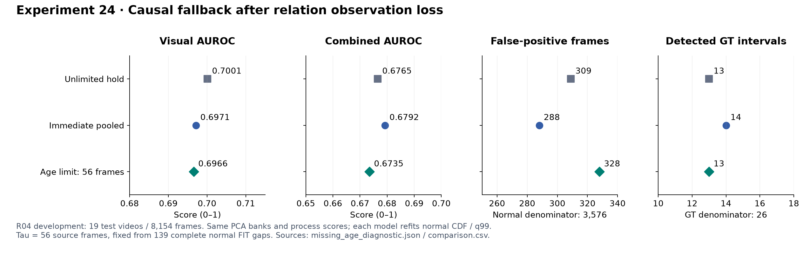

**의의:** 미래 정보 없이 누락 나이에 따라 경로를 전환하는 구현을 검증했다. 기대한 성능 개선은 없었으며, 실제 경로 변경과 CDF의 간접 효과를 구분했다. 시간 제한에서 긴 누락의 이상 경보는 20프레임 줄었지만, raw가 같은 관측·짧은 누락에서 정상 19/이상 57프레임 경보가 추가됐다.

**보완할 점:** 시간 제한은 오탐·ranking을 악화시키고 구간 탐지도 늘리지 못했다. 긴 누락 subset은 정상 8/이상 170프레임이라 비교 근거가 제한적이다. 정상 reference 혼합이 다른 상태 점수에 미치는 영향, 역할 GT·독립 검증·FPS 부재도 남는다. 이 후보를 개선된 기본값으로 채택하지 않는다.

### 실험 24 이후 Recommended improvements — 추천순 3개

| 추천순 | 개선 후보와 변경 내용 | 이번 결과의 근거 | 검증 기준 및 주의점 |
|---|---|---|---|
| 1 | **두 외형 경로를 모두 계산하는 고정 정상 CDF**: 정상 calibration을 phase 요청/pooled 요청 양쪽으로 통과시켜 gate와 무관한 reference를 만듦 | 24_age에서 raw가 같은 관측·짧은 누락 구간에 정상 19/이상 57 경보 추가. q99도 같아 CDF 혼합의 간접 효과임 | 같은 요청 경로의 보정 점수 불변과 holdout 비누출 확인, 전체 지표·포화·임계값 효과 공개. 실험 20의 부분 표본 route CDF와 구분하고 개선을 보장하지 않음 |
| 2 | **관측 근거를 반영한 공정 점수 신뢰도**: 불확실한 phase에서 분기 기여를 구분 | 모든 구성에서 process 점수 동일, 관측 subset process AUROC 0.4812, 전체 Combined AUROC가 Visual보다 낮음 | 정상 지원 정보로만 규칙을 정하고 독자 TP/FP·정상 보정 확인. 테스트 라벨로 분기 가중치 선택 금지 |
| 3 | **정상 역할·누락 원인 감사 확대**: 실제 부품, 혼동 객체, 가림의 사례를 구분 | 누락 길이만으로 pooled 전환의 이점을 얻지 못했고 역할 오류는 그대로임 | 별도 정상 사례/보조 주석의 범위와 비용 공개. 긴 누락을 이상 정답으로 간주하거나 관측률을 semantic 정확도로 대체하지 않음 |

92개 테스트와 44개 특징 파일·15개 정상 holdout 구성·57개 테스트 예측의 재구성 검증을 통과했다.

[상세 결과·의의·한계](docs/EXPERIMENT24.md) · [비교 CSV](results/experiment24/comparison.csv) · [누락 나이별 진단](results/experiment24/missing_age_diagnostic.json) · [FIT 누락·τ](results/experiment24/fit_gap_profile.json) · [검증](results/experiment24/validation.json) · [실험 25 계획](docs/EXPERIMENT25_PLAN.md)

## 실험 25 결과 — gate와 독립적인 정상 보정

정상 calibration의 각 특징을 phase 요청/pooled 요청 경로에 모두 통과시켜 역할별 두 CDF를 고정했다. gate별로 표본을 나누지 않으며 세 구성의 reference는 정확히 같다. R04 테스트 19개/8,154프레임을 평가했다.

| 구성 | Visual AUROC / AP | Combined AUROC / AP | 정상 오탐률 (FP) | 이상 recall (TP) | 탐지 구간 / 26 |
|---|---:|---:|---:|---:|---:|
| 25_hold | 0.7001 / 0.6971 | 0.6765 / 0.6753 | 8.64% (309) | 13.74% (629) | 13 |
| 25_pool | 0.6883 / 0.6861 | 0.6657 / 0.6654 | 7.86% (281) | 12.06% (552) | 14 |
| 25_age | 0.6912 / 0.6903 | 0.6681 / 0.6692 | 8.64% (309) | 13.91% (637) | 13 |

정상 holdout 오탐은 세 새 구성 모두 40프레임(/1,920)이다. 정상 q99는 hold/pool/age 순으로 0.997458/0.996888/0.997238이다. 자체 q99와 이전 정상 q99를 같은 새 점수에 적용한 사후 진단에서는 경보 차이가 0개였다.

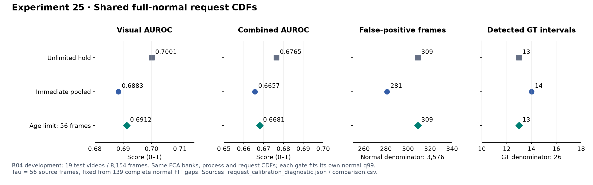

**의의:** 같은 요청 경로의 점수가 gate와 무관하게 같아졌다. 세 구성의 관측 구간 점수·경보도 정확히 같아, 기존 정상 CDF 혼합의 간접 효과를 분리할 수 있게 됐다.

**보완할 점:** 이전 대비 pool/age의 오탐과 이상 recall이 함께 줄고 ranking은 낮아졌다. 같은 pooled bank인데 요청이 달라 보정 점수가 달라지는 사례가 hold→pool에서 519개, hold→age에서 492개 남는다. 특징 관측 수이며 frame 수가 아니다. 구조적 일관성과 성능·novelty를 동일시하지 않는다.

### 실험 25 이후 Recommended improvements — 추천순 3개

| 추천순 | 개선 후보와 변경 내용 | 이번 결과의 근거 | 검증 기준 및 주의점 |
|---|---|---|---|
| 1 | **실제 bank에 일치하는 CDF 선택**: 지원 부족 pooled fallback도 pooled 기준 CDF로 보정 | 같은 pooled bank·다른 요청인 관측에서 hold→pool 531개 중 519개, hold→age 504개 중 492개의 점수가 달라짐 | reference는 그대로 두고 실제 bank dispatch만 변경. 같은 bank 점수 불변·지원 부족 subset·q99 효과와 전체 성능 검증. 일관성 확보를 성능/novelty로 동일시하지 않음 |
| 2 | **관측 근거를 반영한 공정 점수 신뢰도**: 불확실한 phase에서 분기 기여를 구분 | 모든 공정 배열은 같고 전체 Combined ranking이 여전히 Visual보다 낮음 | 정상 지원 정보로만 규칙을 정하고 독자 TP/FP·정상 보정 확인. 테스트 라벨로 가중치 선택 금지 |
| 3 | **정상 역할·누락 원인 감사 확대**: 실제 부품·혼동 객체·가림 사례 검증 | 보정 구조를 바꿔도 역할/관계 mask의 의미 품질은 검증되지 않음 | 별도 정상 사례/보조 주석 범위와 비용 공개. 누락률을 의미 정확도로 대체하지 않고 반복 R04를 독립 평가로 부르지 않음 |

96개 테스트와 44개 특징 파일·30개 정상 holdout 구성·114개 테스트 예측의 재구성 검증을 통과했다.

[상세 결과·의의·한계](docs/EXPERIMENT25.md) · [비교 CSV](results/experiment25/comparison.csv) · [요청/관측/구간 진단](results/experiment25/request_calibration_diagnostic.json) · [임계값 효과](results/experiment25/threshold_decomposition.json) · [검증](results/experiment25/validation.json) · [실험 26 계획](docs/EXPERIMENT26_PLAN.md)

## 로컬 VLM

| 설정 | 값 |
|---|---|
| 실행기 | `/home/jeong/Server/llama.cpp/build/bin/llama-server` |
| 모델 | Qwen3.8-27B-Q8_0 + 대응 mmproj |
| context | 요청당 65,536 |
| temperature | 0.2 |
| GPU layers | all |
| reasoning | on |
| parallel | 1 (요청당 context 확보를 위한 사용자 승인) |
| 나머지 서버 옵션 | 기본값 |

`bash scripts/start_local_vlm.sh`로 실행합니다. OpenAI 호환 HTTP 형식을 사용하는 **로컬 loopback endpoint**이며 외부 유료 API가 아닙니다. 생성된 reasoning 텍스트는 결과 파일에 저장하지 않습니다.

## 출처

- [IPAD 논문](https://arxiv.org/abs/2404.15033), [공식 코드 고정 commit](https://github.com/LJF1113/IPAD/tree/22764cbeeda3946303d236babdd2664fd6241b91)
- [GroundingDINO](https://github.com/IDEA-Research/GroundingDINO), [CLIP](https://github.com/openai/CLIP)
- [SubspaceAD](https://github.com/CLendering/SubspaceAD): 정상 subspace residual이라는 발상 참고. 본 구현은 CLIP crop 특징을 사용하며 원 논문의 DINOv2 patch-level 구현과 동일하지 않습니다.

## 실험 26 — 실제 bank에 일치하는 CDF 선택

| 구성 | Visual AUROC / AP | Combined AUROC / AP | 정상 오탐률 (FP) | 이상 recall (TP) | 탐지 / 26 |
|---|---:|---:|---:|---:|---:|
| 25_hold | 0.7001 / 0.6971 | 0.6765 / 0.6753 | 8.64% (309) | 13.74% (629) | 13 |
| 25_pool | 0.6883 / 0.6861 | 0.6657 / 0.6654 | 7.86% (281) | 12.06% (552) | 14 |
| 25_age | 0.6912 / 0.6903 | 0.6681 / 0.6692 | 8.64% (309) | 13.91% (637) | 13 |
| 26_hold | 0.6899 / 0.6899 | 0.6669 / 0.6689 | 8.64% (309) | 13.74% (629) | 13 |
| 26_pool | 0.6875 / 0.6857 | 0.6650 / 0.6650 | 7.86% (281) | 12.06% (552) | 14 |
| 26_age | 0.6898 / 0.6891 | 0.6669 / 0.6681 | 8.64% (309) | 13.91% (637) | 13 |

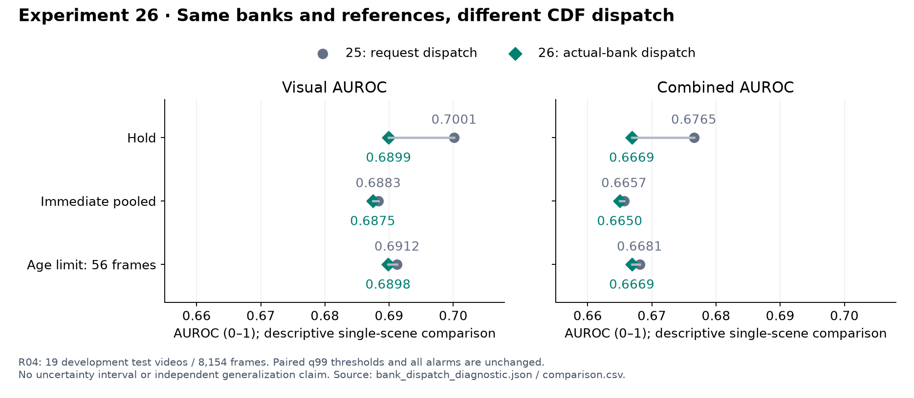

**의의:** 같은 실제 bank·다른 요청의 테스트 특징 관측에서 점수 불일치가 hold→pool 519→0, hold→age 492→0, pool→age 27→0개로 사라졌다. 두 정상 reference·PCA·process를 보존하고 dispatch만 변경해 보정 일관성을 검증했다. 정상 holdout은 모두 40/1,920프레임이다.

**보완할 점:** 짝지은 q99·경보·탐지 구간은 모두 같지만 Visual/Combined ranking은 낮아졌다. 첫 reference의 fallback 혼합, 공정 관측 신뢰도와 역할 의미 정확도는 남아 있다. 반복 R04 개발 평가이며 성능 개선·독립 일반화·novelty를 주장하지 않는다. 비용은 미측정이다.

### 다음 Recommended improvements — 추천순 3개

| 추천순 | 개선 후보와 변경 내용 | 이번 결과의 근거 | 검증 기준 및 주의점 |
|---|---|---|---|
| 1 | **연속 관측으로 뒷받침되는 전이만 결합**: 이전·현재 관계가 모두 관측된 경우에만 transition score 기여 | 세 구성 모두 Combined AUROC 0.6650–0.6669로 Visual 0.6875–0.6899보다 낮음. 외형 보정 불일치를 제거해도 공정 기여 문제는 남음 | 전이 확률·CDF는 고정하고 결합 gate만 변경. 정상 holdout, 공정 독자 TP/FP·구간 및 gate 경계 검사. 누락 자체가 이상 단서일 수 있어 미탐 증가도 보고 |
| 2 | **정상 역할·누락 원인 감사 확대**: 실제 부품·혼동 객체·가림 사례를 구분 | 같은 bank 불변성을 확보했어도 관계 의미 정확도는 미검증이고 체류 유효 범위는 5.11% | 정상 사례와 보조 주석 범위/비용 명시. 관측률을 검출 recall 또는 phase 정확도로 대체하지 않음 |
| 3 | **정상 상태별 보정 진단**: reference와 실제 경로의 분포 차이를 영상 단위로 점검 | 정상 오탐·q99가 같아도 ranking은 낮아짐. 첫 reference는 여전히 phase 요청과 지원 부족 fallback을 함께 포함 | 정상 holdout의 관측/누락·bank별 percentile 및 support를 보고. 작은 subset CDF 재적합이나 테스트 순위에 맞춘 선택을 바로 도입하지 않음 |

[상세 결과·의의·한계·재현](docs/EXPERIMENT26.md) · [6개 구성 CSV](results/experiment26/comparison.csv) · [검증](results/experiment26/validation.json) · [1순위를 구체화한 실험 27 계획](docs/EXPERIMENT27_PLAN.md)

## 실험 27 — 연속 관측 전이만 공정 결합

| 구성 | Visual AUROC / AP | Combined AUROC / AP | 정상 오탐률 (FP) | 이상 recall (TP) | 탐지 / 26 |
|---|---:|---:|---:|---:|---:|
| 26_hold | 0.6899 / 0.6899 | 0.6669 / 0.6689 | 8.64% (309) | 13.74% (629) | 13 |
| 26_pool | 0.6875 / 0.6857 | 0.6650 / 0.6650 | 7.86% (281) | 12.06% (552) | 14 |
| 26_age | 0.6898 / 0.6891 | 0.6669 / 0.6681 | 8.64% (309) | 13.91% (637) | 13 |
| 27_hold | 0.6899 / 0.6899 | 0.6820 / 0.6816 | 8.19% (293) | 13.65% (625) | 13 |
| 27_pool | 0.6875 / 0.6857 | 0.6797 / 0.6774 | 7.41% (265) | 11.97% (548) | 14 |
| 27_age | 0.6898 / 0.6891 | 0.6820 / 0.6808 | 8.19% (293) | 13.83% (633) | 13 |


**의의:** 외형·전이 확률·정상 CDF를 고정한 채 관측 전이만 결합해 재관측 경계의 간섭을 분리했다. 정상 holdout FP는 세 구성 모두 40→32/1,920프레임, 테스트는 FP −16/TP −4프레임이며 탐지 구간 집합은 같다. q99는 짝지은 이전 값과 같다.

**보완할 점:** 공정의 독자 추가 경보는 정상 16/이상 4프레임, 추가 탐지 구간은 0개다. Combined ranking은 Visual보다 낮고 전이 CDF에는 미관측 표본이 남는다. 정상 holdout 개선은 영상 02에 집중했고 R04 반복 개발 평가다. 성능 상승을 novelty·일반화로 해석하지 않는다. 비용은 미측정이다.

### 다음 Recommended improvements — 추천순 3개

| 추천순 | 개선 후보와 변경 내용 | 이번 결과의 근거 | 검증 기준 및 주의점 |
|---|---|---|---|
| 1 | **전이 보정 모집단을 연속 관측에 맞추기**: 정상 CDF에 관측 쌍만 포함하고 전이 확률·gate는 고정 | 결합에서는 관측 쌍만 쓰지만 정상 reference에는 전체 477개 전이가 남음. 관측 쌍은 247개, 이전 상태 0은 20→0개. 공정 추가 경보는 여전히 FP 16/TP 4 | 이전 상태별 support·global fallback·정상 holdout·q99 포화와 독자 TP/FP를 검사. 작은 표본에서 포화/오탐 증가 가능, 테스트로 cutoff 선택 금지 |
| 2 | **정상 역할·누락 원인 감사 확대**: 실제 부품·혼동 객체·재관측 사례를 구분 | 재관측 경보 간섭은 확인했으나 관측 쌍에서도 Combined ranking이 Visual보다 낮고 의미 정확도는 미검증 | 정상 영상의 보조 사례/주석 범위를 명시. 관측 mask를 semantic 정답으로 취급하지 않음 |
| 3 | **고정 설정의 다른 장면 적용성 검증**: 새 장면의 정상 데이터로만 적합·보정 | 개선과 실패가 반복 사용한 R04에 한정되고 정상 holdout 개선은 영상 02에 집중 | 대상과 protocol을 먼저 고정하고 test를 한 번 평가. 장면별 object/phase 의미 차이와 지원 부족, 전체 실패도 보고 |

[상세 결과·의의·한계·재현](docs/EXPERIMENT27.md) · [6개 구성 CSV](results/experiment27/comparison.csv) · [검증](results/experiment27/validation.json) · [1순위를 구체화한 실험 28 계획](docs/EXPERIMENT28_PLAN.md)

## 실험 28 — 전이 CDF의 정상 관측 모집단 정렬

| 구성 | Visual AUROC / AP | Combined AUROC / AP | 정상 오탐률 (FP) | 이상 recall (TP) | 탐지 / 26 |
|---|---:|---:|---:|---:|---:|
| 27_hold | 0.6899 / 0.6899 | 0.6820 / 0.6816 | 8.19% (293) | 13.65% (625) | 13 |
| 27_pool | 0.6875 / 0.6857 | 0.6797 / 0.6774 | 7.41% (265) | 11.97% (548) | 14 |
| 27_age | 0.6898 / 0.6891 | 0.6820 / 0.6808 | 8.19% (293) | 13.83% (633) | 13 |
| 28_hold | 0.6899 / 0.6899 | 0.6812 / 0.6812 | 8.19% (293) | 13.65% (625) | 13 |
| 28_pool | 0.6875 / 0.6857 | 0.6787 / 0.6768 | 7.41% (265) | 11.97% (548) | 14 |
| 28_age | 0.6898 / 0.6891 | 0.6812 / 0.6804 | 8.19% (293) | 13.83% (633) | 13 |

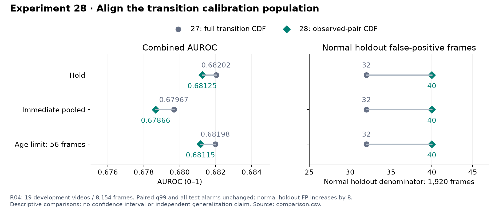

**의의:** 정상 CDF와 관측 gate를 맞춰도 전이 커버리지가 보장되지 않음을 확인했다. 정상 holdout FP는 세 구성 모두 32→40/1,920프레임으로 증가했다. 영상 02의 관측 전이 3→2 두 곳이 다른 4개 영상의 상태 CDF 최대를 넘어 점수 1이 됐다. 해당 상태 reference는 88개로 지원 규칙을 만족했다.

**보완할 점:** test 경보·탐지 구간과 q99는 같고 Combined ranking은 소폭 낮아졌다. 공정 추가 경보는 정상 16/이상 4프레임, 추가 탐지 구간은 0개다. 이번 변경을 성능 개선으로 채택하지 않는다. 반복 R04 개발·의미 GT 부재와 비용 미측정의 한계를 유지한다.

### 다음 Recommended improvements — 추천순 3개

| 추천순 | 개선 후보와 변경 내용 | 이번 결과의 근거 | 검증 기준 및 주의점 |
|---|---|---|---|
| 1 | **정상 전이의 영상별 커버리지·관측 근거 감사**: 전이→역할/track/관계 특징의 추적 정보를 추가 | 정상 영상 02의 관측 전이 3→2 두 곳이 다른 4개 영상의 CDF 최대를 넘어 오탐 +8. 이전 상태 support 88개만으로 전이 커버리지를 보장하지 못함 | 정상 FIT/calibration 전체 전이별 표본·영상 수와 사례를 재구성. score/threshold를 바꾸지 않고 반례를 추적. 시각 검토를 semantic GT/정확도로 부르지 않음 |
| 2 | **정상 FIT 전이 확률의 관측 모집단 정렬**: 관측 쌍만으로 확률 적합하는 대조 | gate·CDF는 관측 쌍인데 FIT 전이 빈도는 전체 1,940개를 사용하며 관측 쌍은 964개 | 한 번에 FIT 확률만 변경하고 CDF/지원 부족/정상 holdout 효과를 분리. 희소 전이·가림에 의한 정당한 이상 신호 손실 검사 |
| 3 | **고정 설정의 다른 장면 적용성 검증** | 반복 R04에서 calibration만 바꿔도 정상 오탐이 증가하고 test 효용은 없음 | 장면/protocol을 먼저 고정하고 정상 적합 후 test 한 번 평가. object/phase 의미 차이, 지원 부족과 실패도 보고 |

[상세 결과·의의·한계·재현](docs/EXPERIMENT28.md) · [정상 반례 원인](results/experiment28/normal_alarm_attribution.json) · [검증](results/experiment28/validation.json) · [1순위를 구체화한 실험 29 계획](docs/EXPERIMENT29_PLAN.md)

## 실험 29 — 정상 전이 근거 추적

| 항목 | 결과 |
|---|---|
| 감사 범위 | 정상 25개 영상, 9,732프레임, 2,442 samples / 2,417전이 |
| 관측 3→2 | FIT 4회/4개 영상, calibration 2회/1개 영상 |
| 서로 다른 쌍이 섞인 평균 | FIT 114/1,123, calibration 26/297 유효 samples |
| 시각 검토 | target 6 + 대조 24 사례, 독립 semantic GT 아님 |
| 성능 평가 | 새 AUROC/AP·FPR·recall 미평가; 점수/모델 변경 없음 |

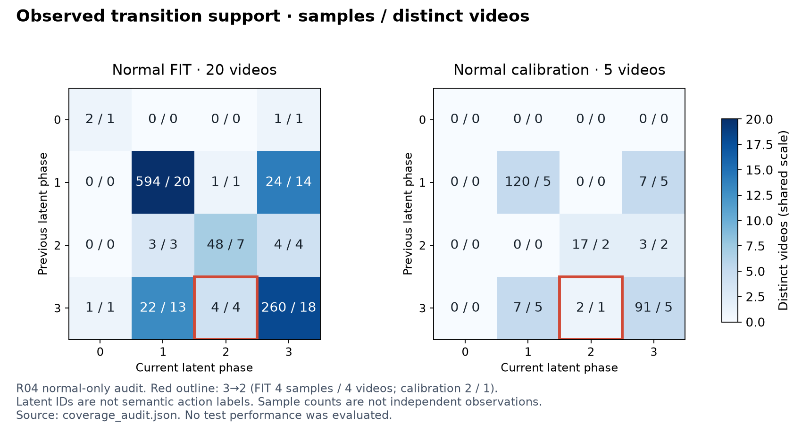

**의의:** 두 정상 반례에서 바이스 주변 anchor가 blade 주변으로 바뀐 뒤 이전 track descriptor가 관계 평균에 남아 있었다. raw 최근접 중심은 2→2인데 저장 평균 phase는 3→2였다. 전이→객체/track→원본 frame을 연결하는 진단 기능을 추가했다.

**보완할 점:** 이력 초기화만으로 지속적 역할 오류를 고칠 수 없고 track 단절이 실제 객체 변경을 뜻하지 않는다. 30개 목적 표집의 시각 메모는 정확도 평가가 아니다. 이번 정상-only 감사에서 test 성능·운용 비용은 측정하지 않았다. 기존 정상 특징/점수/모델 181개 파일은 그대로다.

### 다음 Recommended improvements — 추천순 3개

| 추천순 | 개선 후보와 변경 내용 | 이번 결과의 근거 | 검증 기준 및 주의점 |
|---|---|---|---|
| 1 | **객체 쌍 track 경계에서 관계 평균 초기화**: anchor 또는 target track이 바뀌면 이전 descriptor 이력을 비움 | 정상 3→2 6회 모두 현재 평균에 서로 다른 쌍이 섞임. 두 calibration 반례의 raw 최근접 중심은 2→2인데 저장 평균 phase는 3→2 | 선택 객체/관측 mask·기존 phase 중심을 고정하고 평균 규칙만 변경. 정상 재적합·holdout 후 테스트, rank/support 변화도 보고. track 단절이 실제 객체 교체라는 보장은 없음 |
| 2 | **정상 시공간 근거를 추가한 역할 검증**: blade와 바이스·갈색 제품 후보의 혼동을 줄이는 검증 | 검토 사례에서 양수 semantic margin으로 바이스를 anchor로 선택하는 현상과 target의 blade 선택이 보임 | 정상 데이터에서만 규칙을 정하고 역할 검토·가용성·최종 탐지를 함께 확인. 이번 목적 표집을 정확도 근거로 쓰거나 test로 margin을 조정하지 않음 |
| 3 | **고정 설정의 다른 장면 적용성 검증** | 전이 3→2의 calibration support가 한 영상에 집중하며 현재 관측 문제도 R04 사례에 한정 | 장면/protocol을 먼저 고정하고 정상 적합 뒤 test 한 번 평가. 다른 기구/객체 역할과 phase 의미 차이·지원 부족도 보고 |

[상세 결과·의의·한계·재현](docs/EXPERIMENT29.md) · [평균 이력 진단](results/experiment29/history_diagnostic.json) · [검증](results/experiment29/validation.json) · [1순위를 구체화한 실험 30 계획](docs/EXPERIMENT30_PLAN.md)

## 실험 30 — 객체 쌍 track 경계의 관계 평균 초기화

| 구성 | Visual AUROC / AP | Combined AUROC / AP | 정상 오탐률 (FP) | 이상 recall (TP) | 탐지 / 26 |
|---|---:|---:|---:|---:|---:|
| control_hold | 0.6899 / 0.6899 | 0.6820 / 0.6816 | 8.19% (293) | 13.65% (625) | 13 |
| control_pool | 0.6875 / 0.6857 | 0.6797 / 0.6774 | 7.41% (265) | 11.97% (548) | 14 |
| control_age | 0.6898 / 0.6891 | 0.6820 / 0.6808 | 8.19% (293) | 13.83% (633) | 13 |
| reset_hold | 0.6905 / 0.6896 | 0.7158 / 0.7083 | 9.09% (325) | 18.20% (833) | 16 |
| reset_pool | 0.6889 / 0.6861 | 0.7154 / 0.7064 | 8.08% (289) | 16.78% (768) | 17 |
| reset_age | 0.6902 / 0.6886 | 0.7156 / 0.7074 | 9.09% (325) | 18.37% (841) | 16 |

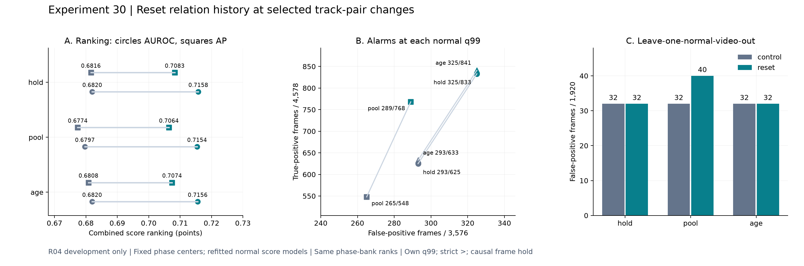

**의의:** 관계 평균의 mixed-pair window가 FIT/calibration/test 114/26/120→모두 0이 됐다. 기존 중심·검출·특징·관측 mask와 공통 rank를 유지하고 정상 점수 모델을 재적합했다. control은 실험 27 저장 모델/점수를 정확히 재현한다. 탐지 구간은 세 경로 모두 +3개이며, reset 체류가 Visual에 없는 구간 1개를 추가했다.

**보완할 점:** 테스트 FP는 +32/+24/+32프레임, 정상 holdout FP는 32→32/40/32로 늘거나 같다. 체류 지원 3→1이 8→10 runs로 최소 지원 경계를 넘어 가용성이 417→2,433프레임으로 늘었으므로 초기화의 순수 효과로 볼 수 없다. 체류 독자 경보는 FP 12/TP 180~196이고 새 정상 2→1 오탐 두 곳은 anchor 교체 경계다. age의 q99는 달라지며 같은 reset 점수에 control q99 적용 시 TP만 8프레임 늘어난다. 역할 GT·독립 평가·비용 측정은 없고 성능 향상을 novelty로 단정하지 않는다.

### 다음 Recommended improvements — 추천순 3개

| 추천순 | 개선 후보와 변경 내용 | 이번 결과의 근거 | 검증 기준 및 주의점 |
|---|---|---|---|
| 1 | **선택된 track 쌍의 연속성으로 전이 증거 검증**: 두 sample 모두 관계가 관측되고 선택된 anchor/target ID가 모두 같을 때만 전이 점수를 결합 | 새 정상 2→1 오탐 2곳 모두 anchor track 교체 경계. 나머지 정상 CDF의 상태 support 31개에도 해당 edge는 0개이며 점수 1. 전이 독자 기여는 여전히 FP 16/TP 4 | 평균·phase·정상 FIT 확률/CDF·외형·체류는 고정하고 전이 결합 gate만 대조. 정상 holdout과 독자 FP/TP, 놓치는 구간 및 q99 효과 검사. 실제 정상/이상 객체 교체나 track 단절의 유효 전이까지 제거할 수 있음 |
| 2 | **체류 맥락 지원을 맞춘 기여 분리**: 공통 지원 1→3과 새 지원 3→1의 사용 여부를 명시적으로 나누는 대조 | 3→1 완결 run이 8→10개로 최소 지원 경계를 넘어 가용 프레임 2,000개가 추가됐고 체류 독자 경보 전부가 이 맥락에서 발생 | 정상 FIT만으로 지원 집합을 동결하고 각 구성의 정상 q99·holdout 재검증. 새 맥락은 6개 영상/10 runs뿐이며 꼬리 분포·역할 정확도를 보장하지 않음. 지원 효과를 초기화 자체의 순수 효과로 부르지 않음 |
| 3 | **정상 시공간 근거를 이용한 객체 역할 검증**: blade/바이스 및 target 혼동 사례를 정상 데이터에서 검토하고 검증 신호를 보강 | 평균 혼합은 0이지만 선택 객체·semantic margin은 전혀 바뀌지 않았고 실험 29의 역할 혼동이 남음. 테스트 FP는 24~32프레임 증가 | 검토용 주석과 normal-only 학습을 구분하고 선택 정확도·관측률·최종 탐지를 따로 검사. 목적 표집 메모를 의미 GT로 취급하거나 test로 cutoff를 조정하지 않음 |

[상세 결과·의의·한계·재현](docs/EXPERIMENT30.md) · [비교 CSV](results/experiment30/comparison.csv) · [체류 지원·정상 오류 원인](results/experiment30/mechanism_audit.json) · [검증](results/experiment30/validation.json) · [1순위를 구체화한 실험 31 계획](docs/EXPERIMENT31_PLAN.md)

## 실험 31 — 같은 객체 쌍의 연속 관측 전이만 결합

| 구성 | Visual AUROC / AP | Combined AUROC / AP | 정상 오탐률 (FP) | 이상 recall (TP) | 탐지 / 26 |
|---|---:|---:|---:|---:|---:|
| 30_reset_hold | 0.6905 / 0.6896 | 0.7158 / 0.7083 | 9.09% (325) | 18.20% (833) | 16 |
| 30_reset_pool | 0.6889 / 0.6861 | 0.7154 / 0.7064 | 8.08% (289) | 16.78% (768) | 17 |
| 30_reset_age | 0.6902 / 0.6886 | 0.7156 / 0.7074 | 9.09% (325) | 18.37% (841) | 16 |
| 31_hold | 0.6905 / 0.6896 | 0.7210 / 0.7139 | 8.64% (309) | 18.11% (829) | 16 |
| 31_pool | 0.6889 / 0.6861 | 0.7207 / 0.7124 | 7.63% (273) | 16.69% (764) | 17 |
| 31_age | 0.6902 / 0.6886 | 0.7208 / 0.7131 | 8.64% (309) | 18.28% (837) | 16 |


**의의:** 외형·체류·전이 확률/CDF와 정상 q99를 유지한 채 선택 객체 쌍이 바뀌는 경계의 전이 결합만 차단했다. 정상 holdout FP는 hold/pool/age에서 32/40/32→24/32/24프레임, test는 모두 FP −16/TP −4다. 탐지 구간 집합 16/17/16개와 조건부 지연은 같다.

**보완할 점:** 전이의 독자 경보는 FP 16/TP 4→0/0이 되어 추가 공정 기여는 체류 FP 12/TP 180~196, 추가 구간 1개뿐이다. 정상 감사에서 같은 쌍으로 진입·유지·종료한 체류는 맥락별 3/4 runs로 기존 최소 지원 10개에 미달했다. 현재 체류 모델에는 이 조건을 적용하지 않았다. 정상 개선은 한 영상에 집중하고 track ID가 의미 GT는 아니며 반복 R04 결과를 novelty·일반화로 단정하지 않는다. 비용은 미측정이다.

### 다음 Recommended improvements — 추천순 3개

| 추천순 | 개선 후보와 변경 내용 | 이번 결과의 근거 | 검증 기준 및 주의점 |
|---|---|---|---|
| 1 | **객체 쌍의 연속성을 반영한 체류 episode 재구성**: 실제 관측한 종료, 객체 교체·누락·영상 끝의 우측 검열, 진입 미관측을 분리해 정상 학습 자료를 만듦 | 남은 공정 독자 경보는 전부 체류. 같은 쌍으로 진입·유지·종료한 정상 FIT 완결 run은 1→3 3개/2영상, 3→1 4개/3영상으로 기존 최소 10개에 미달 | 우선 normal-only로 complete/censored/unknown-entry·맥락별 영상 수와 관측 길이를 검증하고 원본 sample까지 추적. 검열 경계를 실제 종료로 대체하거나 지원 threshold를 낮춰 성능을 만들지 않음. 체류 분포 재설계는 이 자료를 본 뒤 결정 |
| 2 | **정상 시공간 근거로 역할 검증 보강**: blade/바이스·제품 후보 혼동을 구분할 근거 추가 | 평균과 전이에서 track 경계를 제어해도 동일 ID의 잘못된 역할은 그대로이며 객체/phase GT는 없음. 체류 독자 FP 12개가 남음 | 정상 사례/보조 주석 범위를 명시하고 객체 선택·가용성·최종 탐지를 각각 검증. 오탐의 원인을 역할 오류로 단정하거나 test로 margin을 조정하지 않음 |
| 3 | **고정 설정의 다른 장면 적용성 검증** | 정상 holdout 개선은 영상 02 한 곳에 집중하고 현재 탐지 근거는 반복 R04의 체류 맥락에 의존 | 대상/프로토콜을 먼저 동결하고 새 장면 정상 FIT/calibration으로만 적합. 객체·phase 의미 차이와 지원 부족/실패를 포함해 보고하고 단일 장면 개선을 일반화하지 않음 |

[상세 결과·의의·한계·재현](docs/EXPERIMENT31.md) · [비교 CSV](results/experiment31/comparison.csv) · [정상 체류 관측 근거](results/experiment31/normal_dwell_identity_audit.json) · [검증](results/experiment31/validation.json) · [1순위를 구체화한 실험 32 계획](docs/EXPERIMENT32_PLAN.md)

## 실험 32 — 정상 체류의 완결·중단·진입 미확인 구분

| 파티션 | episode | 완결 | 우측 검열 | 진입 미확인 |
|---|---:|---:|---:|---:|
| FIT 20영상 | 257 | 7 | 22 | 228 |
| calibration 5영상 | 78 | 5 | 7 | 66 |

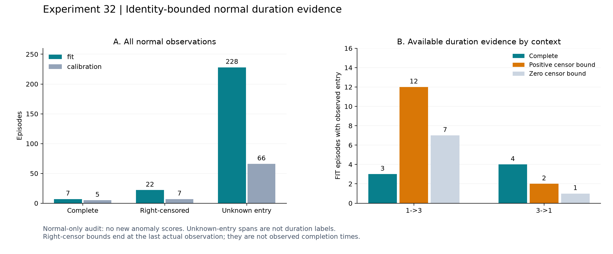

**의의:** 정상 episode 335개를 선택 track·phase·관측 index로 재구성하고, 끝을 못 본 경우는 마지막 실제 관측까지의 하한으로 보존했다. FIT 1→3은 complete 3개/검열 19개이며, 그중 5개 하한이 complete 최대 16프레임보다 길었다. 완결만 남기면 이미 관측한 긴 구간의 정보가 빠질 수 있다.

**보완할 점:** FIT 진입 미확인은 228/257개(88.72%)이고 재관측 시작 156개·track 교체 69개가 대부분이다. complete 7개는 3영상에 집중하며 두 맥락 모두 기존 최소 10 complete 조건에 미달한다. 검열의 독립성·의미 정확도는 미확인이다. 이번은 normal-only 자료 재구성으로 새 AUROC/AP·FPR/recall·비용은 미평가이며 기존 정상 입력/모델/점수 103개를 유지했다.

### 다음 Recommended improvements — 추천순 3개

| 추천순 | 개선 후보와 변경 내용 | 이번 결과의 근거 | 검증 기준 및 주의점 |
|---|---|---|---|
| 1 | **관계 관측 손실의 원인을 분해하고 정상 역할 근거 검증**: raw 객체 후보→semantic/면적 gate→선택/track→episode 중단의 추적 정보를 추가 | FIT 228/257 episode가 진입 미확인. 이 중 재관측 시작 156개, track 교체 69개이며 진입을 아는 우측 검열 22개 중 관계 누락 11개·track 교체 9개 | 정상 25영상에서 후보가 원래 없었는지, filter로 제외됐는지, 다른 track으로 바뀌었는지 구분하고 사전 선택한 정상 사례를 검토. 캐시 후보 부재를 검출 false negative로 단정하거나 목적 표집을 의미 정확도로 계산하지 않음 |
| 2 | **검열 정보를 보존하는 체류 추정의 지원성·민감도 대조**: 완결만 쓰는 추정과 중단 전 관측 하한을 활용하는 후보 비교 | FIT 1→3은 complete 3개/검열 19개이고 그중 5개 하한이 완결 최대 16프레임보다 큼. 3→1은 complete 4개/검열 3개 | 정상 데이터만으로 영상별 민감도·꼬리 불확실성·실패를 보고. 검열의 독립성은 미확인이고 0 하한은 양의 duration으로 대체하지 않음. 기존 최소 complete support 미달을 임의 완화해 성능을 만들지 않음 |
| 3 | **다른 장면·별도 정상 자료에서 고정 파이프라인 적용성 검증** | FIT complete 7개가 영상 3개에만 있고 4개는 영상 14에 집중. 반복 R04만으로 안정적인 체류 학습을 보장할 수 없음 | 장면/분할/설정을 먼저 고정하고 calibration을 FIT에 합치지 않음. 객체·phase 의미 차이, 영상 그룹 독립성, 지원 실패까지 보고 |

[상세 결과·의의·한계·재현](docs/EXPERIMENT32.md) · [맥락별 CSV](results/experiment32/context_evidence.csv) · [episode 출처](results/experiment32/episodes.json) · [검증](results/experiment32/validation.json) · [1순위를 구체화한 실험 33 계획](docs/EXPERIMENT33_PLAN.md)
