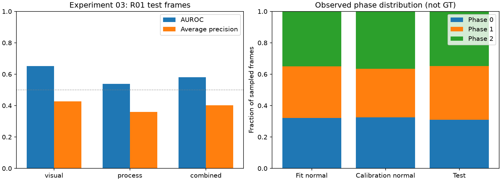

# 실험 03 — 정상 이동 영역 안에서 제품 재검출

## 실행 전 설계

실험 02의 1순위 권고를 적용한다. 정상 FIT 영상 01의 일정 간격 8프레임을 점검했을 때 이동 제품 대신 하단 고정 빨간 부품이 검출됐다. 제품 prompt를 바꾸기 전에 **검출 입력 영역**을 변경한다.

- 실험 01의 정상 FIT product track 중 관측 3개 이상·이동 범위 0.1 이상인 track을 사용한다. 이동축은 전체 범위를 보존하고 직교축은 bbox 경계의 2–98% 분위수에 0.03 여유를 더한다.
- 기존과 동일한 전체 vocabulary, GroundingDINO 가중치, threshold, NMS로 이 영역을 검출한다. 제품 역할의 결과만 가져와 원본 좌표로 복원하고 원본 이미지 crop에서 같은 frozen CLIP 특징을 얻는다.
- 실험 02의 공간 phase 지도는 그대로 고정한다. 새 제품 관측으로 phase를 추정하며 PCA·전이·calibration은 같은 정상 분할에서 다시 적합한다.
- 다른 역할의 bbox·track·특징과 전체 프레임 특징은 그대로 보존하고 배열 동일성을 검사한다. 제품 track ID는 기존 ID와 겹치지 않게 새 범위를 사용한다.
- R01 정상 fit 27개/calibration 7개, 테스트 15개, seed 42, sampling 4프레임, 결합 0.5/0.5 및 q99 규칙을 유지한다. 로컬 Qwen의 기존 정상 영상 discovery를 재사용한다.

ROI는 배경 문맥과 입력 확대 비율을 동시에 바꾸는 하나의 검출 방식이다. 둘의 효과를 분리한 실험으로 해석하지 않는다. 경로 밖 제품 이상을 놓칠 수 있으며, 전체 프레임 branch가 이를 보완한다는 보장도 없다. 작은 bbox subset의 독립 주석이 없으므로 관측률을 제품 recall로 보고하지 않는다.

설계와 threshold를 테스트 지표에 맞춰 수정하지 않았다. 아래는 전체 실행을 완료한 결과다.


## 이번 실험 결과

R01 전체 49개 시퀀스(정상 34개, 테스트 15개), sampled 시점 2,893개를 처리했다. 평가는 테스트 3,685프레임 중 이상 1,254프레임을 포함한다. 원본 라벨·데이터는 변경하지 않았다.

| 지표 | 실험 02 | 실험 03 |
|---|---:|---:|
| Visual AUROC | 0.5787 | 0.6514 |
| Visual AP | 0.3798 | 0.4260 |
| Process AUROC | 0.5471 | 0.5388 |
| Process AP | 0.3749 | 0.3603 |
| Combined AUROC | 0.5959 | 0.5814 |
| Combined AP | 0.4031 | 0.4018 |
| 정상 q99 기준 테스트 정상 오탐률 | 14.85% | 2.96% |
| 정상 q99 기준 테스트 이상 recall | 23.37% | 3.83% |
| 직접 phase 관측률 (전체 sampled 시점) | 13.24% | 94.75% |

각 모델이 자신의 정상 calibration에서 정한 q99를 적용했다. 동일 테스트 오탐률 비교가 아니다. 실험 03의 임계값은 0.9605다. 전체 FIT phase 분포는 `[500, 512, 544]`이며 균등에 가까워졌지만 정답 phase 정확도를 뜻하지 않는다.

| 직접 phase 관측 진단 | 실험 02 | 실험 03 |
|---|---:|---:|
| 정상 FIT 관측률 | 16.84% | 94.15% |
| 정상 calibration 관측률 | 3.90% | 94.15% |
| 테스트 관측률 | 11.33% | 96.01% |
| 테스트 최대 연속 미관측 길이 (원본 프레임) | 290 | 16 |

직접 관측은 공간 phase band 안에서 bbox가 선택된 시점이다. 실제 제품 recall이 아니며 미관측에는 정상적인 제품 부재도 포함된다. ROI 범위는 정규화 좌표 `[0, 0.2350, 1, 0.5647]`이다. 49개 영상의 추가 ROI 검출·제품 CLIP·이미지 IO 합계는 248.68초다. 기존 특징 추출, 모델 로딩, VLM discovery, 모델 적합·평가 비용을 제외하므로 end-to-end 처리 속도가 아니다.




[전체 지표](../results/experiment03/metrics.json) · [영상별 지표](../results/experiment03/per_sequence.csv) · [관측 진단](../results/experiment03/observations.json) · [정상 ROI 근거](../results/experiment03/grounding.json) · [정성 점검 기록](../results/experiment03/qualitative_review.json) · [비교 CSV](../results/comparison02_03/metrics.csv)

## 실험 결과의 의의

정상 trajectory가 검출 입력 영역을 정하도록 연결하면 고정 배경 혼동과 작은 제품의 관측 부족을 줄일 가능성이 있음을 확인했다. 동일한 detector와 prompt에서 실제 이동 제품을 따라가는 박스가 정성 점검에서 관측됐고, 공간 phase 관측률과 Visual AUROC가 함께 상승했다. 단순히 검출 박스 수가 늘었다는 사실만을 근거로 삼지 않았다. 이는 구성 요소 간 연결 방식을 구현·검증한 가치이며, ROI 검출 자체의 알고리즘 novelty나 다른 장면 일반화 입증은 아니다.

동시에 **관측 개선과 최종 이상탐지 개선은 다르다**는 결과를 얻었다. Process AUROC는 0.5471→0.5388이며 Combined도 하락했다. Visual 단독 AUROC 0.6514보다 결합 점수 0.5814가 낮다. 더 나은 관측을 확보한 후에도 현재 전이 빈도 기반 process score가 유용한 공정 이상 신호를 충분히 제공하지 못한다는 진단이며, process가 모든 오류의 원인임을 입증한 것은 아니다.

## 보완할 점

- **경보 민감도 감소:** 정상 오탐률 14.85%→2.96%와 함께 이상 recall도 23.37%→3.83%로 줄었다. 낮은 오탐률만으로 성공이라고 판단하지 않는다.
- **공정 시간 정보 부족:** 같은 phase에 머무는 전이가 정상 FIT에서 흔하다. 현재 전이 점수는 정상 진행과 장시간 정지를 명시적으로 구분하지 않는다. 실제 이동량·속도는 아직 점수에 없다.
- **경로 밖 이상 및 빈 구간:** ROI가 경로 밖 제품을 배제할 수 있다. 정상 calibration 09/11의 시작·끝 빈 벨트에서 가장자리 배경이 product로 검출됐다. 미관측을 실제 부재와 검출 실패로 구분하는 검증이 필요하다.
- **GT 및 범위:** 독립 bbox/phase GT가 없다. 16프레임의 assistant 정성 점검은 주석 기반 precision/recall 평가가 아니다. R01·seed 42에 한정된 개발 결과이며 유의성·최종 benchmark 성능을 주장하지 않는다.
- **효과의 분리:** ROI에 의한 배경 제거와 detector 입력 확대 효과가 함께 바뀐다. 제품 crop과 phase 관측이 함께 바뀌므로 Visual 상승을 그중 하나에만 귀속할 수 없다.

## 다음 Recommended improvements — 추천순 3개

| 추천순 | 개선 후보와 변경 내용 | 이번 결과의 근거 | 검증 기준 및 주의점 |
|---|---|---|---|
| 1 | **정상 궤적의 진행량 기반 공정 점수:** 동일 track의 프레임당 이동량을 정상 phase 조건으로 모델링 | 관측률 94.75%에도 Process AUROC 0.5388. 전이 빈도만으로 같은 phase 내 정상 진행과 정지를 구분하지 못함 | 정상 FIT에서 유효한 연속 track 쌍과 속도 분포를 먼저 진단하고, 검출·phase map·외형 특징을 고정해 추가 시간 신호의 효과 비교. FPS를 가정하지 않으며 ID switch/미관측을 이상 속도로 오해하지 않음 |
| 2 | **관측 상태와 실제 부재 구분:** 빈 벨트 상태, 누락, 재관측을 명시적으로 처리 | 제품 없는 정상 시작·끝 구간에서 벨트 가장자리 오검출, 잔여 미관측 | 독립 bbox/부재 주석 subset 또는 명확히 표시한 정성 점검으로 구분 검증. 빈 구간 정상 오탐과 실제 제품 누락 이상의 recall을 함께 확인 |
| 3 | **공정 신호의 기여를 검증하는 결합·보정:** Visual 단독과 고정 결합, 정상 신뢰도 기반 결합 비교 | Visual AUROC 0.6514 대비 Combined 0.5814, q99 recall 3.83% | 가중치를 test 지표로 탐색하지 않고 정상 데이터에서 규칙 고정. AUROC/AP·오탐·recall을 함께 보고해 점수 희석과 경보 상충을 분리 |

다음 실험은 1순위의 진행량 신호를 대상으로 한다. [다음 실험 계획](EXPERIMENT04_PLAN.md)은 직전 결과에 기반한 한 단계 계획이며 2·3순위를 확정된 후속 실험으로 정하지 않는다.

## 재현 및 검증

실험 01·02 특징 캐시가 먼저 필요하다. 이 실험은 로컬 Qwen을 다시 호출하지 않고 기존 정상 영상 discovery를 재사용한다.

```bash
export PYTHONPATH=src
HF_HUB_OFFLINE=1 TRANSFORMERS_OFFLINE=1 .venv/bin/python scripts/extract_product_roi.py \
  --data-root /path/to/IPAD_dataset
.venv/bin/python scripts/evaluate_baseline.py --data-root /path/to/IPAD_dataset \
  --config configs/experiment03.json
.venv/bin/python scripts/diagnose_observations.py --experiment 02
.venv/bin/python scripts/diagnose_observations.py --experiment 03
MPLCONFIGDIR=.cache/matplotlib .venv/bin/python scripts/plot_experiment.py --experiment 03
MPLCONFIGDIR=.cache/matplotlib .venv/bin/python scripts/compare_runs.py --experiments 02 03
.venv/bin/python -m pytest -q
```

14개 테스트를 통과했다. 49개 캐시의 전체 프레임 특징·다른 역할 배열 보존, 좌표 범위, 특징 유한성, 제품 track ID 비충돌을 검사했다. ROI 좌표 복원 및 고정 배경 track 배제 검사도 포함한다. 비교 스크립트는 예측 라벨 배열과 분할의 일치를 확인한다. [검증 결과](../results/experiment03/validation.json)
