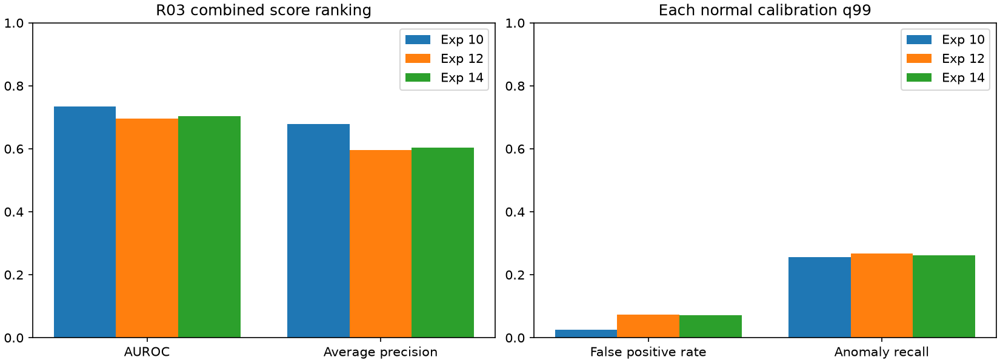

# 실험 14 — 완결 정상 길이 기준 체류 percentile

## 이번 실험 결과

**정상 holdout에서 추가 오탐 40프레임을 제거했지만, R03 테스트에서는 실험 12보다 정상 경보 20프레임과 이상 경보 24프레임이 함께 줄었다.** 체류 없는 실험 10보다 정상 오탐이 308프레임 많고, 추가 탐지는 이상 32프레임에 그쳤다. 새 GT 이상 구간은 찾지 못했다. 정상 support 왜곡의 한 사례를 교정했으며 체류 모듈의 유용성을 입증하지는 못했다.

### 변경과 고정 조건

실험 13의 정상 영상 22는 1→2 완결 구간 길이 232가 FIT 정상 최대 244 이내였는데도 보정 영상의 경과 시간 범위를 넘어 체류 점수가 1로 포화됐다. 이를 근거로 실험 12의 체류 점수만 바꿨다.

각 진입 맥락 c의 FIT 완결 길이 집합 D_c에 대해 현재 관측 경과 시간 a의 점수를 다음처럼 계산한다.

`s_dwell(a,c) = (count(D_c < a) + count(D_c <= a)) / (2 * len(D_c))`

기존 `정상 생존 빈도 → calibration 경과 시간 raw CDF` 대신 FIT 완결 길이의 empirical midrank percentile을 직접 쓴다. 미래 종료 시점은 입력으로 사용하지 않는다. 처음부터 진행 중인 구간·누락·지원 부족은 기존처럼 체류 점수를 사용하지 않고 전이 점수를 유지한다. 실제 작업 길이의 정답을 학습한 것이 아니라 관계 군집에 머문 길이를 모델링한다.

- R03, seed 42, 정상 FIT 18개 / calibration 4개(07/08/15/22), 테스트 17개·12,005프레임(이상 5,068 / 정상 6,937).
- 특징 39개 캐시, 관계 phase, 맥락별 길이 은행, 유효 마스크, Visual/기존 전이 점수를 보존했다. 맥락별 최소 완결 구간 10개도 그대로다.
- Visual/전이 reference와 최종 q99는 정상 calibration으로 적합한다. 체류의 2차 경과 시간 CDF만 없앴다. 지표의 `dwell.normal_calibration_samples=0`은 이 사용하지 않는 CDF의 표본 수이며, 전체 파이프라인이 calibration을 사용하지 않는다는 의미가 아니다.
- 최종 점수는 max 결합, q99는 `higher` 분위수와 strict `>` 경보다. 4프레임 sampling 후 이전 점수 유지로 복원한다. 시간 단위는 원본 프레임 인덱스다.
- 평가 전 설정·관련 코드·특징 hash를 저장했다. 먼저 정상 4-fold를 평가하고, 설정을 바꾸지 않고 R03 개발 테스트를 평가했다. 새 VLM 호출·특징 추출은 없으며 실행 시간/운용 지연은 측정하지 않았다.

### 정상 영상 holdout

FIT 18개를 고정하고 calibration 4개 중 하나씩 제외했다. 모든 Visual/전이 reference와 q99는 나머지 3개로만 적합했다. 표의 12는 실험 13에서 실행한 진입별 체류 설정이다.

| 제외 영상 | 기존 12 오탐 | 새 14 오탐 | 새 14 오탐률 |
|---|---:|---:|---:|
| 07 | 20 | 20 | 2.90% |
| 08 | 8 | 8 | 1.13% |
| 15 | 4 | 4 | 0.57% |
| 22 | 52 | 12 | 1.71% |
| 합계 / 2,806프레임 | 84 | 44 | **1.568%** |

전체 프레임 가중 오탐률은 2.994%→1.568%, 영상별 오탐률 평균은 2.999%→1.577%다. 네 fold 모두 이전과 q99가 같았으며 새로운 경보는 없었다. 실험 13에서 지적한 정상 영상 22의 추가 경보 40프레임이 제거됐다. 이 정상 자료는 변경을 설계할 때 이미 본 개발 자료이므로 **알려진 문제의 회귀 검증**이며 새로운 독립 검증은 아니다.


### R03 개발 테스트

| 지표 | 체류 없음 (10) | 기존 진입별 (12) | 완결 FIT 기준 (14) |
|---|---:|---:|---:|
| Visual AUROC | 0.7330 | 0.7330 | 0.7330 |
| Combined AUROC | 0.7339 | 0.6968 | 0.7042 |
| Combined AP | 0.6784 | 0.5953 | 0.6036 |
| 정상 q99 | 0.997354497 | 0.997641509 | 0.997354497 |
| 정상 오탐률 | 2.62% | 7.35% | 7.06% |
| 이상 프레임 recall | 25.59% | 26.70% | 26.22% |
| 정상 오탐 프레임 | 182 | 510 | 490 |
| 이상 탐지 프레임 | 1,297 | 1,353 | 1,329 |
| 경보가 발생한 GT 이상 구간 | 11 / 17 | 11 / 17 | 11 / 17 |



각 모델의 정상 q99를 사용했으며 같은 테스트 오탐률 비교는 아니다. 12→14의 제거된 정상 20/이상 24프레임은 모두 2→3 맥락이었다. 새 경보는 없다. 10→14는 정상 308/이상 32프레임 경보를 추가했고 제거는 없다. 따라서 12 대비 일부 회복을 체류 없는 기준선 대비 개선으로 해석할 수 없다.

세 설정은 같은 11개 GT 구간을 탐지하고 같은 6개를 놓쳤다. 공통 탐지 구간의 지연 변화 중앙값은 0프레임이다. 탐지된 구간만의 지연 중앙값 52프레임은 미탐 6개를 제외한 조건부 통계다. 시작 전에 이미 경보가 켜진 탐지 구간 1개, 영상 왼쪽 경계에서 시작하는 GT 구간 4개가 있다. point adjustment는 하지 않았다.

### 점수 해상도와 남은 실패

| 지원 진입 맥락 | FIT 완결 구간 수 | FIT 최대 길이 | FIT 범위 안 최대 percentile |
|---|---:|---:|---:|
| 0→1 | 17 | 244 | 0.9706 |
| 1→2 | 18 | 244 | 0.9722 |
| 2→3 | 23 | 108 | 0.9783 |
| 3→2 | 16 | 112 | 0.9688 |

이 값은 최종 q99 0.99735보다 낮다. **이번 설정에서 체류 branch가 독자적으로 경보를 만들려면 현재 경과 시간이 해당 FIT 최대 길이를 넘어야 한다.** 그때 점수는 1이다. 다른 branch는 그보다 먼저 경보를 낼 수 있다. 이 성질은 정상 범위 안의 추가 체류 오탐을 줄이는 동시에, 그 안에서 발생하는 이상에 체류 신호가 기여하지 못하게 한다.

테스트에서 유효 체류 점수가 1인 프레임은 정상 336 / 이상 136이었다. 관측한 FIT 최댓값을 넘었다는 사실 자체가 이상을 잘 구별하지 못한다. 체류 가용성은 기존과 같은 6,910/12,005=57.56%이고, 유효 구간만의 체류 AUROC/AP는 0.5222/0.4307이다. 시작 진입 미관측 4,096프레임과 지원 없는 맥락 999프레임에서는 체류를 사용하지 않는다. 이 부분집합 지표를 전체 Visual 성능과 직접 비교하지 않는다.

## 결과의 의의

정상 완결 길이와 관측 중 경과 시간을 이중 보정할 때 발생하는 정상 support 왜곡을 분리하고, 다른 branch와 유효 마스크를 고정한 채 교정 효과를 확인했다. 정상 holdout을 거쳐 개발 테스트의 손실까지 함께 기록하는 검증 절차도 구현했다.

캡스톤 파이프라인의 기여는 정상 자료로 만든 객체·관계 상태·외형·공정 모듈과 실패 조건을 재현 가능하게 연결하는 데 있다. 이번 국소 변경의 성능 상승 자체는 novelty가 아니다. 현재 체류 모듈은 기본 모델보다 나쁘므로 필수 개선 요소로 주장할 근거가 없다.

## 보완할 점

- R03의 반복 관찰로 설계가 장면에 종속될 위험이 있다. 더 많은 R03 점수 조정보다, 고정한 방법이 새 장면에서 작동하는지 확인할 필요가 있다.
- 정상 holdout의 알려진 반례는 해결됐으나 테스트 정상 오탐은 7.06%다. q99가 새 정상 분포에서 1% 오탐을 보장하지 않는다.
- 맥락별 길이는 16~23개로 거칠며 영상 내 구간은 독립 표본이 아니다. 정상 속도·작업 길이 변동과 군집/검출 오차 중 어느 것이 남은 오탐을 만드는지는 분리하지 못했다.
- 잠재 관계 상태는 실제 작업 단계 GT가 아니다. 객체 bbox·phase 정답 부재로 관측률을 localization 정확도나 공정 이해로 해석할 수 없다.
- 전체 IPAD 결과가 아니며 단일 seed 기술 통계다. 원본 녹화 그룹 독립성·FPS는 미확인이다. Stage 00의 11개 라벨 길이 불일치는 여전히 정렬 미확정이고 임의 보정하지 않았다. R03은 길이가 일치한다.

## 다음 Recommended improvements — 추천순 3개

| 추천순 | 개선 후보와 변경 내용 | 이번 결과의 근거 | 검증 기준 및 주의점 |
|---|---|---|---|
| 1 | **R04에서 고정 파이프라인 적용성 검증**: 새 장면 정상 FIT로 객체 vocabulary·관계 상태·정상 모델만 적합하고, 체류 없는 구성과 14 체류 구성을 비교 | R03 정상 반례를 해결해도 체류 없는 모델보다 오탐 308프레임 증가, 새 이상 구간 없음. 장면에 맞춘 반복 조정의 한계 | 테스트 전 역할/설정 동결. AUROC/AP·오탐/recall·구간 지연·관계/체류 가용성과 두 구성의 차이 보고. 같은 데이터셋의 새 장면이지 외부 독립 검증은 아님 |
| 2 | **관계 상태와 관측 품질 진단**: 정상 대표 구간의 bbox·track 변경·군집 전환을 실제 영상과 대조 | 최대 정상 길이를 넘는 정상 프레임 336개, 체류 유효 구간 AUROC 0.5222 | 정상 작업 변동과 관측 오류를 구분하고 보조 주석의 범위를 공개. 관측률을 정확도로 대체하거나 테스트 라벨로 상태를 재정의하지 않음 |
| 3 | **영상 단위 길이 support와 불확실성 반영**: 각 맥락에 기여한 영상 수와 길이 꼬리의 안정성으로 신뢰도를 진단 | 16~23개 구간, q99보다 낮은 FIT 범위 내 percentile 상한, 정상 holdout 개선과 개발 테스트 실패의 차이 | 정상 영상 제외에 따른 최대 길이/경보 변화를 측정. 구간을 독립 영상처럼 세지 않고, 추가 abstention의 이상 탐지 손실도 평가 |

다음 실험 15는 1순위만 구체화한다. 두 나머지 후보는 확정 실험 일정이 아니다. [실험 15 계획](EXPERIMENT15_PLAN.md)

## 검증과 재현

42개 단위 테스트가 통과했다. 완결 길이의 동률 percentile, calibration 경과 시간 불변성, 시간 인과성 및 기존 branch/마스크 보존을 검사했다. 실제 특징 39개·테스트 17개·정상 holdout 4개에서 점수·정상 q99를 재구성했고, FIT 길이 은행과 Visual/전이·관측·라벨이 보존됨을 확인했다. 평가 전 hash도 일치했다. 그래프는 수치와 렌더링을 확인했다.

특징 입력은 실험 12의 캐시를 바이트 그대로 복사한다. 캐시 출처는 실험 13에서 정상 FIT vocabulary와 관계 모델의 적합 범위를 검증했다. 모델 가중치·원본 영상·캐시·로그는 로컬에 보존하고 공개하지 않는다.

```bash
export PYTHONPATH=src
export MPLCONFIGDIR=.cache/matplotlib
.venv/bin/python scripts/evaluate_completed_dwell_holdout.py
.venv/bin/python scripts/evaluate_baseline.py --data-root /path/to/IPAD_dataset --config configs/experiment14.json
.venv/bin/python scripts/validate_completed_dwell.py
.venv/bin/python scripts/compare_runs.py --experiments 10 12 14
.venv/bin/python scripts/compare_event_delays.py --experiments 12 14
.venv/bin/python scripts/compare_event_delays.py --experiments 10 14
.venv/bin/python scripts/plot_experiment.py --experiment 14
.venv/bin/python scripts/plot_completed_dwell.py
.venv/bin/python -m pytest -q
```

사전 hash는 원본 실행 기록이며 새 구현/캐시로 재실행하면 별도 provenance를 남긴다.

[설정](../configs/experiment14.json) · [사전 고정 기록](../results/experiment14/pre_evaluation_protocol.json) · [전체 지표](../results/experiment14/metrics.json) · [영상별 결과](../results/experiment14/per_sequence.csv) · [정상 holdout](../results/experiment14/normal_holdout.json) · [체류 진단](../results/experiment14/completed_dwell_diagnostic.json) · [체류 없는 기준선 대비](../results/experiment14/no_dwell_comparison.json) · [12 대비 구간/지연](../results/comparison12_14/events.json) · [10 대비 구간/지연](../results/comparison10_14/events.json) · [검증](../results/experiment14/validation.json)
