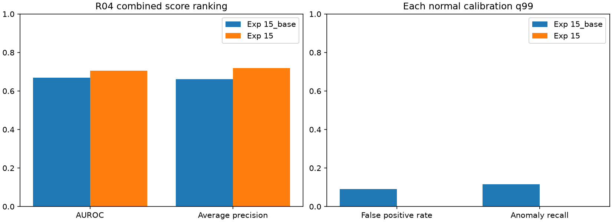

# 실험 15 — R04에서 고정 파이프라인 적용성

상태: 두 구성의 R04 전체 평가·검증 완료. **체류 추가로 ranking은 상승했지만 정상 q99가 점수 상한 1이 되어 경보가 전혀 발생하지 않았다.** 정상 역할 오검출도 확인했으므로 성공한 공정 이해나 운용 성능 개선으로 보고하지 않는다.

## 이번 실험 결과

### 질문과 범위

실험 14는 R03에서 정상 holdout의 알려진 오탐 사례를 교정했지만, 체류 없는 모델보다 정상 오탐 308프레임을 더 만들고 새 GT 이상 구간을 찾지 못했다. R03의 추가 점수 조정 대신 다른 실제 장면 R04에서 파이프라인이 성립하고 체류가 기여하는지 확인한다.

R04 정상 FIT 20개 / calibration 5개(02/08/10/12/15), 테스트 19개를 사용한다. Stage 00의 seed 42 분할과 strict label 정책을 유지한다. 정상 영상은 총 9,732프레임, 테스트는 8,154프레임이다. R04는 길이 불일치가 없는 장면이다. 같은 IPAD의 장면별 적용이므로 외부 독립 검증으로 부르지 않는다.

두 구성은 동일한 R04 특징·관계 상태·PCA·전이 모델을 사용한다. `15_base`는 실험 10의 체류 없는 구성, `15`는 실험 14의 완결 FIT 길이 percentile 체류 구성이다. R03의 정상 모델 가중치를 그대로 옮긴 zero-shot 평가가 아니라 **고정한 절차를 R04 정상 자료에 재적합**한 비교다. Visual 단독 ranking도 branch 지표로 보고한다.

### 로컬 VLM과 정상 역할 선택

Qwen에는 정상 FIT 01/03의 6프레임씩, 총 12프레임만 제공했다. `brown cardboard sheet`, `hinged metal lid`, `galvanized metal trough` 세 vocabulary를 생성했다. 정상 시각 증거를 확인하고 role 1 금속판을 anchor, role 0 판재를 target으로 지정했다. 세 역할 모두 외형 crop에는 사용한다.

실제 서버의 요청당 context 65,536, 슬롯 1, temperature 약 0.2, `--gpu-layers all`, reasoning on을 확인했다. Qwen3.8-27B-Q8_0와 대응 mmproj를 사용했고 나머지 옵션은 기본값이다. 생성에는 143.96초가 걸렸으며 서버/모델 로딩은 포함하지 않는다. reasoning 텍스트는 저장하지 않았다. 객체 생성 이후 이번 서버를 종료했다. 외부 유료 API는 사용하지 않았다.

GroundingDINO tiny와 frozen CLIP ViT-B/32, 4프레임 sampling, role-gated tracking, 기존 관계 descriptor·K=4·normal FIT area gate·PCA·이전 상태별 보정·max 결합을 유지했다. 맥락별 완결 구간 최소 10개와 시작/누락/지원 부족 abstention도 같다. q99는 각 구성의 정상 calibration 점수로 따로 계산한다. FPS를 가정하지 않고 원본 프레임 인덱스를 쓴다.

### 정상 FIT에서 먼저 확인한 관측 실패

동일한 두 FIT 영상에서 첫·중간 sampled·마지막 sampled 프레임 6개를 bbox와 함께 확인했다. 01의 0/156/308, 03의 0/232프레임에서 `lid` 역할 bbox는 의도한 금속판 대신 오른쪽 고정 바이스를 가리켰다. 03의 460프레임에서는 올라간 금속판을 가리켰다. 판재 bbox는 배경 조각이나 이미 잘린 판재도 포함했다.

이는 지정한 6개 사례의 **정성적 역할 불일치**다. 전체 검출 정확도 1/6이라는 통계로 보고하지 않는다. 정상 역할 관측률이 높아도 실제 공정 부품을 추적한다는 근거가 될 수 없다. 원본/overlay 이미지는 로컬에 두고 공개 저장소에 업로드하지 않았다.

정상 FIT 1,960개 sampled 관측 중 두 역할의 관계를 계산한 것은 1,644개(83.88%)였다. 유효 관측의 군집 크기는 `[3, 746, 827, 68]`이다. 하나의 군집은 3개뿐이며 실제 공정 단계를 뜻하지 않는다. 정상 누락 시 이전 상태 유지 및 처음 latent 0 규칙 때문에 모든 sample의 phase 점유 수와 이 유효 관측 군집 크기는 다를 수 있다.

| 체류 지원 맥락 | 완결 FIT 구간 | 기여 정상 영상 | 최소/최대 길이 |
|---|---:|---:|---:|
| 1→2 | 29 | 18 | 4 / 60프레임 |
| 2→1 | 26 | 12 | 4 / 76프레임 |

다른 관측 맥락은 1~2개의 완결 구간뿐이라 미지원이다. 구간 수를 독립 영상 수로 세지 않는다. 수치상 관계/체류 모델을 적합할 지원은 있으므로 역할 오류를 수정하지 않고 두 구성을 평가한다. 결과가 좋아도 올바른 lid–cardboard 공정 이해를 입증한 것으로 해석하지 않는다.

정상 진단 뒤 설정·관련 코드·정상 FIT 특징 hash를 동결했다. 그 후 calibration/테스트 특징을 추출한다. 평가기는 각 영상의 점수를 먼저 계산한 뒤 라벨을 읽으며 라벨은 모델·점수·q99에 영향을 주지 않는다. 기존 계획의 “점수 저장 후 라벨 로드” 표현은 테스트 전에 실제 순서인 “점수 계산 후 라벨 로드”로 명확히 했다. 역할 오류가 있어도 지원이 충분하면 고정한 파이프라인의 후단 결과를 보고한다는 해석도 평가 전에 기록했다.

### R04 평가 결과

| 지표 | 체류 없음 (15_base) | 완결 FIT 체류 (15) |
|---|---:|---:|
| Visual AUROC / AP | 0.6817 / 0.6707 | 0.6817 / 0.6707 |
| Process AUROC / AP | 0.5435 / 0.5845 | 0.6354 / 0.6808 |
| Combined AUROC / AP | 0.6692 / 0.6614 | **0.7061 / 0.7191** |
| 정상 q99 | 0.997457627 | **1.000000000** |
| 정상 calibration sampled 경보율 | 0.830% | 0% |
| 테스트 정상 오탐률 | 9.12% (326/3,576) | 0% (0/3,576) |
| 이상 프레임 recall | 11.51% (527/4,578) | **0% (0/4,578)** |
| 경보가 발생한 GT 이상 구간 | 12 / 26 | **0 / 26** |

각 구성의 정상 q99이며 동일 테스트 오탐률 비교는 아니다. 실험 15의 오탐 0%는 정상/이상을 잘 구분한 결과가 아니라 **경보가 수학적으로 불가능한 설정**의 결과다. 비교군의 정상 326/이상 527프레임 경보가 모두 사라졌고 추가 경보는 없다. R04는 이후 개선의 개발 장면으로 취급한다.



체류 없는 구성은 26개 GT 구간 중 12개를 탐지하고 14개를 놓쳤다. 탐지된 구간만의 지연 중앙값은 19프레임이며, 4개는 GT 시작 전에 이미 경보가 켜져 있었다. 체류 구성은 26개 모두 미탐이어서 지연 중앙값은 0이 아니라 **미정의(null)**다. 공통 탐지 구간도 없어 paired 지연 변화는 계산할 수 없다. point adjustment나 임의 FPS 변환은 하지 않았다.

### 정상 calibration만으로 확인 가능한 경보 불능

정상 calibration 영상 08의 1→2 구간에서 관측 경과 시간이 64/68/72/76/80프레임인 5개 sample이 FIT 완결 길이 최댓값 60을 넘었다. empirical percentile이 모두 1이 됐다. 전체 calibration 482개 중 5개(1.037%)이며, `higher` q99는 정렬된 0-based index 477의 값인 1이다.

Visual/기존 전이의 calibration 최댓값은 각각 0.999153/0.994083이고 상한 1에 도달한 것은 체류뿐이다. max 결합으로 이 포화가 최종 q99까지 전달됐다. 모든 최종 점수는 1 이하이고 경보 규칙은 `score > q99`이므로 가능한 경보가 없다. 테스트에도 점수 1인 정상 177/이상 768프레임이 있으나 strict `>`를 만족하지 않는다. 이를 보고 `>=`나 임계값 epsilon 조정으로 결과를 바꾸지 않았다.


R03에서 발견하지 못한 이 실패는 **새로운 이상 라벨 없이도 정상 보정 단계에서 판정할 수 있는 조건**이다. ranking 상승과 실제 경보 가능성을 별도로 검증해야 한다는 근거다. 이미 R04 평가를 마쳤으므로 다음 변경은 R04 개발 실험이며 독립 테스트를 주장하지 않는다.

### 관측·가용성·비용

| sampled 관측 진단 | FIT 20개 | calibration 5개 | 테스트 19개 |
|---|---:|---:|---:|
| sampled 수 | 1,960 | 482 | 2,047 |
| 판재 역할 bbox 관측률 | 92.40% | 93.36% | 90.67% |
| lid 역할 bbox 관측률 | 97.60% | 98.76% | 98.44% |
| 관계 계산 가능 비율 | 83.88% | 84.23% | 84.47% |

이 표는 bbox 존재/관계 계산 가능성이지 검출 recall이나 의미 정확도가 아니다. 정상 정성 확인의 오검출과 함께 읽어야 한다. 원래 CLIP 언어 phase는 FIT에서 `[0,1789,1,170]`으로 한 상태에 치우쳤다. 관계 상태로 바꾸어도 실제 공정 단계의 정답이 생기는 것은 아니다.

테스트의 체류 유효 구간은 3,411/8,154=41.83%이며, 관계 누락 1,272 / 진입 미관측 3,347 / 미지원 맥락 124프레임에서 체류를 사용하지 않았다. 유효 구간 단독 체류 AUROC/AP는 0.6832/0.8136이지만, 전체 지표와 평가 subset이 다르고 최종 경보는 불능이다.

특징 추출의 영상별 시간 합은 FIT 188.53초, calibration 44.53초, 테스트 187.76초로 총 420.83초다. 영상 IO·GroundingDINO·tracking·CLIP을 포함하고, 모델 로딩·VLM·정상 모델 적합·최종 평가를 제외한 측정이다. 전체 운용 지연이나 실시간 카메라 처리량을 뜻하지 않는다. 별도 VLM 생성은 143.96초였다.

## 결과의 의의

정상 자료로 장면별 vocabulary와 관계 모델을 적합하는 절차를 R04에 재현하고, 체류 유무를 동일 특징으로 비교했다. 동시에 **역할 오검출을 높은 관측률로 숨길 수 있는 문제**와 **bounded percentile의 포화가 정상 q99를 경보 불능으로 만드는 문제**를 분리해 확인했다.

학부 캡스톤 수준에서는 구성 요소를 연결한 구현과 실패 조건을 재현하는 실험 근거다. AUROC +0.0369만으로 공정 이해·운용 성능 개선·novelty를 주장하지 않는다. 개별 통계 기법의 새로움도 주장하지 않는다. 다음 개선은 이상 라벨에 맞춘 임계값 조정보다 정상 보정 단계의 실패 조건을 처리하는 데 초점을 둔다.

## 보완할 점

- 체류 포함 모델은 경보가 불가능하다. q99가 높다는 일반적인 민감도 문제를 넘어 점수의 닫힌 상한과 같아진 명확한 실패다.
- 정상 길이 은행은 맥락별 29/26개이고 정상 calibration 영상 하나만으로 포화가 발생했다. empirical 최댓값 밖의 길이를 모두 같은 값으로 만드는 점수 표현과 정상 길이 다양성을 함께 고려해야 한다.
- `lid` 역할은 확인한 정상 예시에서 바이스를 자주 가리킨다. 후단 점수가 높아도 intended-object localization이나 올바른 lid–cardboard 관계 학습을 입증하지 않는다. 실제 bbox/phase GT와 전수 의미 검증은 없다.
- 관계가 없는 sample에도 이전 phase 또는 초기 latent 0을 부여한다. FIT latent 0은 유효 군집 관측 3개인데 전체 할당은 127개다. 124개는 관계 미관측 할당이며 phase-conditioned appearance가 실제 관계를 관측한 것처럼 이를 학습하는 한계가 있다.
- 체류 유효 비율은 41.83%다. subset의 AP를 전체 성능으로 대체하지 않는다. 정상 calibration 5개·단일 seed·동일 IPAD의 한 장면 결과이며 유의성/외부 일반화는 미검증이다.
- 원본 녹화 그룹 독립성·FPS는 미확인이고, Stage 00의 다른 장면 11개 라벨 불일치는 여전히 정렬 미확정이다. R04 성능으로 전체 IPAD의 정합성 문제가 해결됐다고 주장하지 않는다.

## 다음 Recommended improvements — 추천순 3개

| 추천순 | 개선 후보와 변경 내용 | 이번 결과의 근거 | 검증 기준 및 주의점 |
|---|---|---|---|
| 1 | **완결 길이의 연속 꼬리 점수와 경보 가능성 검사**: FIT 완결 길이의 lognormal CDF로 체류 점수만 교체하고 정상 q99가 상한에 닿는지 검사 | 정상 482개 중 5개가 empirical 최대 밖에서 1로 같아져 q99=1, 이상 경보 0 | 동일 support·특징·기존 branch 유지. 정상 보정에서 finite/포화 조건 확인 후 고정한 R04 개발 평가. 분포 가정·작은 표본·오탐/recall 절충 공개, `>=`나 test threshold 탐색으로 해결하지 않음 |
| 2 | **정상 영상 기반 객체 역할 grounding 검증**: VLM vocabulary가 의도한 부품 bbox를 만드는지 정상 crop을 점검하고 혼동 객체를 명시 | lid 관측률 97.60%여도 정상 예시 6개 중 5개에서 바이스 bbox | 검증에 쓴 정상 영상과 보조 주석 범위 공개. 올바른 역할 관측과 단순 bbox 존재를 구분하고, 검출 누락/후단 변화 함께 평가 |
| 3 | **미관측 관계 상태의 명시적 처리**: phase-conditioned appearance에서 초기·유지된 미관측 상태를 직접 관측 상태와 구분 | latent 0의 FIT 유효 군집 3개 대비 전체 할당 127개, 테스트 관계 누락 1,272프레임 | 정상 FIT와 추론의 동일 규칙, global/pooled fallback과 가용성·성능 손실 비교. 미관측을 자동 이상으로 간주하지 않음 |

다음 실험 16은 1순위만 구체화한다. 2/3순위는 아직 확정 실행 일정이 아니다. [실험 16 계획](EXPERIMENT16_PLAN.md)

## 검증과 재현

기존 테스트 42개가 통과했다. 실제 44개 특징 캐시에서 원래 객체·tracking·CLIP 특징 보존과 두 구성의 바이트 동일 입력을 확인했다. 정상 FIT로 관계 모델을 재적합하여 모든 phase·유효 마스크·관계 descriptor를 재현했다. 공통 정상 모델과 Visual/기존 전이·객체 점수·라벨을 비교했고, 체류 percentile·normal q99·19개 영상의 전체 지표를 재계산했다. 평가 전 코드/설정/정상 FIT hash도 일치했다. 별도 진단으로 정상 포화 5개와 최종 경보 0개를 검증하고 그래프를 확인했다.

```bash
export PYTHONPATH=src
export MPLCONFIGDIR=.cache/matplotlib
bash scripts/start_local_vlm.sh
# 별도 터미널: 승인된 로컬 서버가 준비된 후
.venv/bin/python scripts/discover_process.py --data-root /path/to/IPAD_dataset --config configs/experiment15_raw.json
.venv/bin/python scripts/extract_features.py --data-root /path/to/IPAD_dataset --config configs/experiment15_raw.json --fit-only
.venv/bin/python scripts/audit_relational_support.py --config configs/experiment15.json
# 정상 진단·역할 선택·설정 동결 후
.venv/bin/python scripts/extract_features.py --data-root /path/to/IPAD_dataset --config configs/experiment15_raw.json
.venv/bin/python scripts/prepare_relational_phase.py --config configs/experiment15.json
mkdir -p artifacts/experiment15_base/features/R04
cp artifacts/experiment15/features/R04/*.npz artifacts/experiment15_base/features/R04/
.venv/bin/python scripts/evaluate_baseline.py --data-root /path/to/IPAD_dataset --config configs/experiment15_base.json
.venv/bin/python scripts/evaluate_baseline.py --data-root /path/to/IPAD_dataset --config configs/experiment15.json
.venv/bin/python scripts/validate_scene_transfer.py
.venv/bin/python scripts/compare_runs.py --experiments 15_base 15
.venv/bin/python scripts/compare_event_delays.py --experiments 15_base 15
.venv/bin/python scripts/diagnose_threshold_ceiling.py --experiment 15
.venv/bin/python scripts/plot_experiment.py --experiment 15
.venv/bin/python -m pytest -q
```

사전 hash는 원본 실행 기록이다. VLM을 다시 생성하면 출력이 달라질 수 있으므로 정확한 재현은 저장된 discovery를 사용한다. 새 discovery/코드/캐시로 재실행할 때는 새로운 provenance를 기록하고 원본을 덮어쓰지 않는다. 원본 영상·가중치·특징·서버 로그는 업로드하지 않는다.

[체류 설정](../configs/experiment15.json) · [비교군 설정](../configs/experiment15_base.json) · [VLM 출력](../results/experiment15_raw/process_discovery.json) · [실제 서버 설정](../results/experiment15_raw/vlm_runtime.json) · [정상 역할 선택](../results/experiment15/role_selection.json) · [정상 정성 검토](../results/experiment15/normal_qualitative_review.json) · [정상 지원](../results/experiment15/normal_support.json) · [평가 전 고정](../results/experiment15/pre_evaluation_protocol.json) · [체류 지표](../results/experiment15/metrics.json) · [비교군 지표](../results/experiment15_base/metrics.json) · [영상별 결과](../results/experiment15/per_sequence.csv) · [공통 입력·경보 비교](../results/experiment15/transfer_diagnostic.json) · [구간/지연](../results/comparison15_base_15/events.json) · [상한 포화](../results/experiment15/threshold_ceiling.json) · [검증](../results/experiment15/validation.json)
