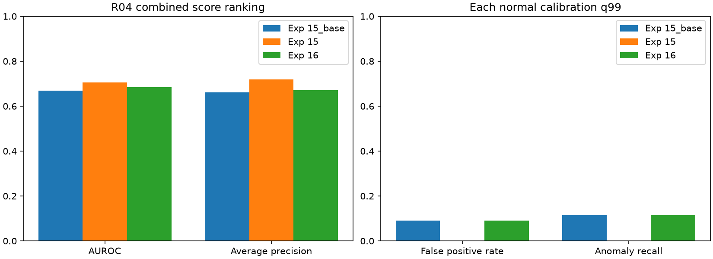

# 실험 16 — 연속 체류 점수와 경보 가능성

## 이번 실험 결과

**정상 q99가 1에서 0.997458로 내려가 경보가 복구됐지만, 경보 마스크는 체류 없는 기준선과 완전히 같았다.** 실험 15의 닫힌 상한 포화는 이번 자료에서 해소됐다. 체류의 추가 경보나 새 이상 구간 탐지는 없었으며, ranking은 실험 15보다 낮아졌다.

### 질문·변경·고정 조건

실험 15는 정상 calibration 482개 중 체류 점수 5개가 empirical 최댓값 밖에서 1로 포화되어, `score > q99` 경보가 불가능했다. 이 결과를 근거로 **체류 점수만 연속 분포 기반으로 교체**했다. 정상 완결 길이 D의 로그 평균 mu와 표준편차 sigma(ddof=0)를 진입 맥락별로 적합한다.

`sigma = max(std(log(D)), 0.05)`

`s_dwell(a) = Phi((log(a) - mu) / sigma)` (a>0), `s_dwell(0)=0`

Phi는 표준 정규 CDF다. 미래 종료 길이를 입력으로 쓰지 않고 calibration 경과 시간 CDF로 다시 보정하지 않는다. 이는 lognormal 분포를 가정한 점수이며 실제 길이의 분포 적합성이 독립적으로 입증됐다는 뜻은 아니다. 표준 통계 모형 자체를 novelty로 주장하지 않는다.

- R04, seed 42, 정상 FIT 20개 / calibration 5개(02/08/10/12/15), 테스트 19개·8,154프레임(정상 3,576 / 이상 4,578).
- 실험 15의 44개 특징 캐시를 그대로 사용했다. 객체 vocabulary, 역할 오검출, 관계 상태, 완결 길이 은행, 체류 지원 구간, Visual·기존 전이, max 결합을 유지했다.
- 1→2와 2→1만 최소 10개 완결 길이 기준을 충족한다. 시작·누락·미지원 시 체류를 사용하지 않는 규칙도 같다.
- 기존 정상 calibration으로 Visual/전이 reference와 최종 q99를 적합한다. strict `>`, `higher` 분위수, 4프레임 sampling 후 이전 점수 유지, 원본 프레임 시간 단위를 유지했다.
- 설정·코드·입력 hash를 동결하고 먼저 정상 FIT/calibration만으로 finite/포화/q99를 검사했다. 결과에 따라 함수를 재선택하지 않고 동일 설정으로 R04 개발 테스트를 평가했다. 각 영상의 점수 계산 후 라벨을 읽는다.
- 새로운 VLM 호출·GPU 특징 추출은 없었다. 로컬 VLM의 기존 설정과 discovery를 그대로 계승했다. 이번 실행 시간·운용 지연은 측정하지 않았다.

### 정상 보정에서 경보 가능성 확인

| 진입 맥락 | 완결 구간 수 | mu | sigma | FIT 최대 길이 |
|---|---:|---:|---:|---:|
| 1→2 | 29 | 3.155555 | 0.699700 | 60 |
| 2→1 | 26 | 2.820262 | 1.124666 | 76 |

sigma floor 0.05는 두 맥락에서 작동하지 않았다. 구간 수는 독립 영상 수가 아니며 기여 영상은 각각 18/12개다.

이전에 1이던 정상 영상 08의 경과 시간 64/68/72/76/80에서 새 점수는 0.924205/0.935818/0.945452/0.953477/0.960186이었다. 정상 calibration 482개에서 체류·최종 점수의 1 포화는 모두 0개, 모든 점수는 유한하고 [0,1] 안이었다. q99는 0.997457627118644로 내려갔다. 정상 sampled 경보는 4/482=0.830%다.

이 확인은 경보가 수학적으로 막혀 있지 않다는 **필요 조건**이며 유용한 추가 탐지를 보장하지 않는다. 부동소수점 CDF는 극단적인 입력에서 1이 될 수 있고, 이를 숨기는 clipping이나 임계값 epsilon 보정은 하지 않았다.

### R04 개발 테스트 비교

| 지표 | 체류 없음 (15_base) | empirical 체류 (15) | lognormal 체류 (16) |
|---|---:|---:|---:|
| Visual AUROC | 0.6817 | 0.6817 | 0.6817 |
| Process AUROC | 0.5435 | 0.6354 | 0.6307 |
| Combined AUROC | 0.6692 | 0.7061 | 0.6851 |
| Combined AP | 0.6614 | 0.7191 | 0.6712 |
| 정상 q99 | 0.997458 | 1.000000 | 0.997458 |
| 정상 오탐률 | 9.12% | 0% | 9.12% |
| 이상 프레임 recall | 11.51% | 0% | 11.51% |
| 정상 오탐 프레임 | 326 | 0 | 326 |
| 이상 탐지 프레임 | 527 | 0 | 527 |
| 경보가 발생한 GT 이상 구간 | 12 / 26 | 0 / 26 | 12 / 26 |



각 모델의 정상 q99로 평가했다. 이번 실행에서 15_base와 16의 q99는 정확히 같았다. 실험 15의 오탐 0%는 경보 불능의 결과다. 15→16은 정상 326/이상 527프레임 경보를 되살렸지만, **15_base→16은 추가·제거 경보가 모두 0개**다. 개수만 같은 것이 아니라 프레임별 경보 마스크가 동일하다.

체류 없는 기준선 대비 Combined AUROC +0.0159/AP +0.0099지만, 실험 15 대비 AUROC −0.0210/AP −0.0478이다. 이 기술 통계로 유의성·일반화 또는 성능 우위를 주장하지 않는다. Visual 단독 AUROC 0.6817과의 차이도 작다.

실험 16은 기준선과 동일한 GT 12개 구간을 탐지하고 14개를 놓쳤다. 공통 탐지 구간의 지연 변화 중앙값은 0프레임이다. 탐지된 구간만의 지연 중앙값은 19프레임이며 그중 4개는 GT 시작 전에 이미 경보가 켜져 있었다. 15는 전부 미탐이므로 지연은 null이고, 15와 16의 공통 탐지 지연 차이도 정의하지 않는다. point adjustment·FPS 가정은 없다.

### 왜 체류의 추가 경보가 없었는가

| 맥락 | 테스트 유효 최대 경과 시간 | 그때 체류 점수 | q99에 해당하는 연속 경과 시간 |
|---|---:|---:|---:|
| 1→2 | 104 | 0.983324 | 166.642 |
| 2→1 | 332 | 0.996023 | 391.954 |

두 맥락 모두 테스트에서 관측한 유효 체류 점수 전체가 q99보다 낮았다. 오른쪽 열은 `exp(mu + sigma * Phi_inverse(q99))`로 계산한 사후 해석값이며, 새로 고른 임계값이나 FPS 기반 시간은 아니다. 체류가 ranking은 바꿔도 이번 경보에는 직접 기여하지 못한 이유다.


테스트 체류 점수의 1 포화는 0개다. 최종 점수에는 여전히 1인 정상 157/이상 233프레임이 있지만, 이는 기존 Visual/전이에서 온 값이며 정상 q99<1이므로 이번에는 경보가 가능하다. 점수 1의 존재 자체와 **보정 q99가 상한과 같아지는 문제**를 구분한다.

체류 유효 비율은 기존과 같은 3,411/8,154=41.83%다. 유효 부분집합의 체류 AUROC/AP는 0.6876/0.8224이며 전체 Combined 성능과 직접 비교할 수 없다. 역할 오검출·관계 누락·초기 미관측 phase의 강제 할당은 그대로다.

## 결과의 의의

완결 길이의 최댓값 밖을 하나의 값으로 만드는 empirical 점수의 약점을 연속 분포 표현으로 분리해 검증했다. 다른 입력과 branch를 보존한 상태에서, 정상 자료만으로 경보 가능성을 먼저 확인하고 실제 경보를 복구했다.

그러나 복구된 경보는 모두 체류 없는 기준선의 경보였다. 따라서 이번 기여는 **포화 실패 교정과 검증 절차**이며 추가 공정 이상 탐지의 입증은 아니다. 잘못 관측한 객체 관계를 더 정교한 길이 분포로 보정하는 데 한계가 있어, 다음 우선순위는 객체 역할 관측의 검증으로 옮긴다. 캡스톤 파이프라인 구현과 모듈 역할 분해의 근거로 정리하며 개별 CDF의 새로움을 주장하지 않는다.

## 보완할 점

- 정상 오탐 9.12%, 이상 recall 11.51%, 구간 미탐 14/26이 남는다. 경보 가능성 복구만으로 충분한 탐지기가 되지 않는다.
- 완결 길이 29/26개와 lognormal 가정으로 꼬리를 외삽한다. 적합성·미래 정상 변동·통계적 신뢰 구간은 검증하지 않았다. 실제 표본에서 sigma floor가 작동하지 않았어도 미래의 수치 안정성을 보장하지 않는다.
- 유효 체류 점수가 q99를 넘지 못했다는 결과를 보고 test threshold나 sigma를 조정하지 않았다. 표본 분포와 branch 점수 스케일의 차이를 정상 영상 단위로 검증할 여지가 있다.
- 실험 15에서 확인한 정상 6개 사례 중 5개의 lid→바이스 오검출을 그대로 계승했다. 정성 사례이며 전수 정확도가 아니다. 관측률을 올바른 역할 grounding으로 간주하지 않는다.
- FIT latent 0의 유효 군집 관측 3개 대비 전체 phase 할당 127개, 관계 미관측 할당 124개도 그대로다. 잠재 상태가 실제 작업 단계라는 GT는 없다.
- R04는 반복 관찰한 개발 장면, 단일 seed·동일 데이터셋 평가다. 원본 녹화 그룹 독립성·FPS가 없고, 다른 장면의 라벨 정렬 미확정 11개도 해결되지 않았다. 전체 IPAD 결과나 외부 검증으로 보고하지 않는다.

## 다음 Recommended improvements — 추천순 3개

| 추천순 | 개선 후보와 변경 내용 | 이번 결과의 근거 | 검증 기준 및 주의점 |
|---|---|---|---|
| 1 | **혼동 객체와 대조하는 anchor 역할 검증**: 기존 frozen CLIP crop 특징으로 의도한 금속판/혼동 바이스 문장의 유사도를 비교해 관계 anchor 후보를 걸러냄 | 길이 보정 후에도 추가 경보 0개이며, 기초 입력의 lid→바이스 오류는 그대로 | 정상 근거로 문장과 margin>0 규칙을 테스트 전에 고정. 올바른 부품의 누락·관계/체류 support 붕괴를 함께 확인하고 지원 실패를 숨기지 않음 |
| 2 | **미관측 관계 상태의 명시적 처리**: 직접 관측과 이전 상태 유지/초기 상태를 구분해 appearance subspace 적용 | 체류 가용성 41.83%, latent 0의 FIT 할당 중 124개가 미관측 | 정상 FIT/추론에 동일한 unknown/fallback 규칙 적용. 미관측 자체를 이상으로 취급하지 않고 관측 감소·오탐·미탐을 함께 비교 |
| 3 | **정상 영상 단위 경보 지점 안정성**: calibration 영상 제외에 따른 q99·포화·branch 기여를 검증 | q99 복구 후에도 모든 체류 점수가 그 아래, 최종 경보는 기존 기준선과 같음 | 정상 영상 단위 검증으로 대표성·극단값 영향을 분리. R04 이상 라벨로 임계값·가중치를 탐색하지 않고 경보 가능성과 실제 효용을 구분 |

다음 실험 17은 1순위만 구체화한다. 나머지는 확정 실험 일정이 아니다. [실험 17 계획](EXPERIMENT17_PLAN.md)

## 검증과 재현

45개 테스트가 통과했다. 알려진 CDF 값, calibration 경과 시간 불변성, 시간 인과성, 동률 길이의 sigma floor, 극단 입력의 실제 수치 포화 및 공통 branch 보존을 검사했다.

실제 44개 특징 캐시의 바이트와 평가 전 hash를 확인했다. 저장된 정상 길이 은행에서 mu/sigma를 재계산하고 별도 `scipy.stats.lognorm.cdf` 경로로 점수를 재구성했다(절대 허용오차 1e-14). 정상 사전 검사 점수와 최종 calibration 점수는 정확히 같았다. 공통 모델·Visual/전이·체류 마스크/age·객체·라벨, q99 및 19개 영상의 지표를 검증했다. 그래프와 보고서 링크도 확인했다.

```bash
export PYTHONPATH=src
export MPLCONFIGDIR=.cache/matplotlib
mkdir -p artifacts/experiment16/features/R04
cp artifacts/experiment15/features/R04/*.npz artifacts/experiment16/features/R04/
.venv/bin/python -m pytest -q
.venv/bin/python scripts/prepare_lognormal_calibration.py
.venv/bin/python scripts/evaluate_baseline.py --data-root /path/to/IPAD_dataset --config configs/experiment16.json
.venv/bin/python scripts/validate_lognormal_dwell.py
.venv/bin/python scripts/compare_runs.py --experiments 15_base 15 16
.venv/bin/python scripts/compare_event_delays.py --experiments 15_base 16
.venv/bin/python scripts/compare_event_delays.py --experiments 15 16
.venv/bin/python scripts/diagnose_threshold_ceiling.py --experiment 16
.venv/bin/python scripts/plot_lognormal_dwell.py
.venv/bin/python scripts/plot_experiment.py --experiment 16
```

공통 평가기를 확장했으므로 이전 실험의 코드 hash는 해당 과거 커밋에서 검증해야 한다. 원본 평가 전 기록을 현재 코드에 맞춰 덮어쓰지 않았다. 새 실행의 provenance는 별도로 보존한다. 원본 영상·가중치·특징·로그는 업로드하지 않는다.

[설정](../configs/experiment16.json) · [사전 고정](../results/experiment16/pre_evaluation_protocol.json) · [정상 경보 가능성](../results/experiment16/normal_feasibility.json) · [전체 지표](../results/experiment16/metrics.json) · [영상별 결과](../results/experiment16/per_sequence.csv) · [경보 비교](../results/experiment16/lognormal_diagnostic.json) · [꼬리 관측 범위](../results/experiment16/tail_operating_range.json) · [기준선 대비 구간/지연](../results/comparison15_base_16/events.json) · [실험 15 대비 구간/지연](../results/comparison15_16/events.json) · [검증](../results/experiment16/validation.json)
