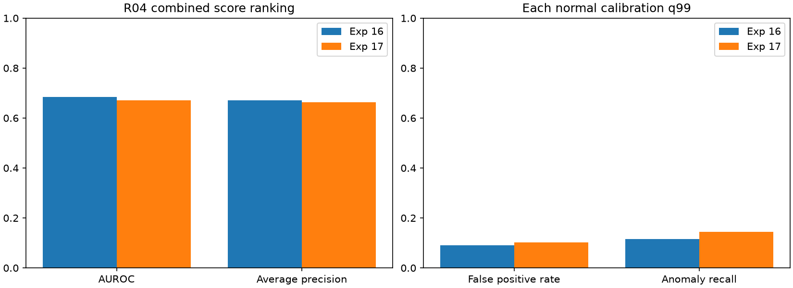

# 실험 17 — 혼동 객체와 대조하는 anchor 역할 검증

## 이번 실험 결과

**확인한 정상 바이스 오검출 5개 중 3개를 gate가 차단했지만, 전체 ranking은 하락하고 체류 가용성은 41.83%→4.03%로 줄었다.** 이상 구간 탐지는 12→14개로 늘었으나 정상 오탐도 증가했다. 일부 정성 사례의 교정을 전수 grounding 정확도나 파이프라인 전체 개선으로 주장하지 않는다.

### 질문·변경·고정 조건

실험 16은 경보 불능을 고쳤지만 체류 없는 기준선과 경보가 같았고, 정상 영상의 lid→바이스 역할 오검출을 계승했다. 이번에는 검출기의 역할 이름을 그대로 믿기 전에 **의도한 객체와 혼동 객체의 CLIP 유사도를 대조하는 관계용 gate**를 추가했다.

- positive: `A photo of the hinged metal cutting blade of a manual shear.`
- negative: `A photo of a bench vise fixed on a workbench.`
- L2 정규화한 crop/text 특징으로 `margin = cosine(crop, positive) - cosine(crop, negative)`를 계산했다. role 1 bbox 중 **margin > 0**인 후보만 관계 anchor로 허용했다. 동률도 제외한다.
- 문장은 정상 영상 정성 확인에서 정했으며 margin 계산 전에 고정했다. 정상·테스트 결과로 prompt나 threshold를 탐색하지 않았다. 이는 수작업 정상 의미 지식을 포함하며 완전 자동 vocabulary 발견이 아니다.
- 기존 CLIP ViT-B/32의 같은 고정 revision으로 text embedding 두 개를 GPU에서 생성했다. Qwen 재호출·검출기 재실행·crop 재추출은 없었다. 기존 로컬 VLM 설정은 유지하며 외부 API를 사용하지 않았다.
- 원래 bbox/crop 특징/track·appearance 후보·판재 target은 보존했다. gate 이후 정상 area gate와 관계 KMeans K=4를 다시 적합하고, 새 정상 phase로 PCA·전이·lognormal 체류를 재적합했다. 따라서 입력 crop이 같아도 Visual 점수는 달라질 수 있다.
- R04 정상 FIT 20개 / calibration 5개, 테스트 19개·8,154프레임(정상 3,576 / 이상 4,578), seed 42. 기존 분할·sampling 4프레임·strict q99·이전 점수 유지·max 결합을 유지했다. 시간은 원본 프레임 인덱스다.
- 정상 FIT에서 먼저 지원 조건을 확인한 뒤 설정·text embedding·코드·입력을 동결했다. 정상 calibration의 finite/포화/q99 검사 후 테스트 점수를 계산했고 라벨은 평가에만 사용했다. 새 실행 시간/운용 지연은 측정하지 않았다.

### 정상 FIT의 역할 및 지원 진단

| 이전에 확인한 정상 사례 | 시각적 대상 | margin | gate |
|---|---|---:|---|
| 01 / frame 0 | 바이스 | +0.021142 | 통과: 오류 남음 |
| 01 / frame 156 | 바이스 | −0.007756 | 제외 |
| 01 / frame 308 | 바이스 | −0.005292 | 제외 |
| 03 / frame 0 | 바이스 | +0.006910 | 통과: 오류 남음 |
| 03 / frame 232 | 바이스 | −0.009397 | 제외 |
| 03 / frame 460 | 의도한 금속판 | +0.074168 | 통과 |

기존 정상 확인 사례 6개에 대한 결과다. 새로운 독립 정답 세트나 전수 검출 정확도가 아니다. 이전 관계 모델은 area gate/target 조건 때문에 일부 후보를 사용하지 않았을 수 있으므로, 이 표의 gate 통과와 최종 관계 관측도 구분한다.


정상 FIT의 anchor bbox 2,162개 중 592개를 제외해 1,570개가 남았다. 유효 관계는 1,644→1,101/1,960개로 감소했다. 새 area gate를 적합하면서 기존 미관측 12개가 관측으로 바뀌었고 기존 관측 555개를 잃었다. 따라서 단순히 같은 관측의 부분집합만 남긴 대조는 아니다. anchor 면적 상한은 0.210023→0.211729로 바뀌었다.

유효 관계 군집 크기는 `[662,328,8,103]`이며 여전히 희소 군집이 있다. 체류 지원은 **0→1의 완결 구간 12개·정상 영상 8개** 하나만 남았다. 길이는 8~40프레임이고 최소 10개 기준은 바꾸지 않았다. 군집 번호는 재적합 후의 잠재 ID로, 실험 16의 같은 번호와 의미가 일치한다고 가정하지 않는다.

### R04 개발 테스트 결과

| 지표 | 실험 16 | 실험 17 |
|---|---:|---:|
| Visual AUROC / AP | 0.6817 / 0.6707 | 0.6808 / 0.6683 |
| Process AUROC / AP | 0.6307 / 0.6528 | 0.4638 / 0.5479 |
| Combined AUROC / AP | 0.6851 / 0.6712 | 0.6711 / 0.6630 |
| 정상 q99 | 0.997457627 | 0.997457627 |
| 정상 오탐률 | 9.12% (326/3,576) | 10.15% (363/3,576) |
| 이상 프레임 recall | 11.51% (527/4,578) | 14.48% (663/4,578) |
| 경보가 발생한 GT 이상 구간 | 12 / 26 | 14 / 26 |
| 체류 유효 프레임 비율 | 41.83% | 4.03% |



각 모델의 정상 calibration으로 q99를 적합했고 이번에는 값이 정확히 같았다. 경보는 정상 78/이상 207프레임을 추가하고 정상 41/이상 71프레임을 제거했다. 순변화는 정상 오탐 +37, 이상 탐지 +136프레임이다. ranking 하락과 recall 증가·오탐 증가를 함께 기록한다.

새로 탐지한 GT 구간은 R04_04의 `[261,379)`, R04_10의 `[88,223)` 두 개이고 잃은 구간은 없다. 공통 12개 탐지 구간의 지연 변화 중앙값은 0프레임이다. 탐지된 구간만의 지연 중앙값은 19→23.5프레임이며 대상 집합이 달라 단순한 속도 개선/악화로 해석하지 않는다. 실험 17은 12개 구간을 놓쳤고, 탐지 14개 중 2개는 onset 이전부터 경보가 켜져 있었다. point adjustment·FPS 가정은 없다.

실험 17의 최종 경보는 Visual branch 경보와 프레임별로 같다. 기존 전이의 정상 16/이상 12프레임 경보는 모두 Visual 경보에 포함됐고 체류의 독자 경보는 0개다. 체류 최대 점수 0.993421은 q99보다 낮았다. **새 GT 구간 두 개를 체류 모듈의 기여로 해석할 수 없다.** phase 변경에 따라 재적합한 외형 모델의 영향과도 분리해야 한다.

### 관측 끊김과 체류 지원 손실

| sampled 관계 진단 | 실험 16 | 실험 17 |
|---|---:|---:|
| 정상 FIT | 83.88% (1,644/1,960) | 56.17% (1,101/1,960) |
| 정상 calibration | 84.23% (406/482) | 60.58% (292/482) |
| 테스트 | 84.47% (1,729/2,047) | 68.05% (1,393/2,047) |

정상 calibration의 체류 유효 sample은 85→8개, 최대 유효 age는 80→4프레임이다. 정상 q99는 유한하고 1 미만이며 calibration 점수 1 포화도 없지만, 이것이 체류 보정의 대표성을 보장하지 않는다. 체류 분포 자체는 정상 FIT 완결 길이로 적합한다.

테스트의 체류 유효 프레임은 3,411→329개다. 실험 17에서 관계 누락 2,606 / 진입 미관측 3,285 / 미지원 맥락 1,934프레임은 체류를 사용하지 않는다. 유효 subset의 체류 AUROC/AP 0.5604/0.6248은 전체 지표가 아니며 이전과 subset도 다르다.

사후 정상 FIT 전용 진단에서 같은 anchor track의 연속 관측 1,868쌍 중 margin 부호가 190번(10.17%) 바뀌었다. 새로 관계를 잃은 555개 sample은 136개 연속 구간으로 나뉘며 그중 62개는 한 sample 길이, 길이 중앙값은 2 samples다. 이는 짧은 gate 변동을 검토할 근거지만 부호 변화가 모두 역할 오류라는 뜻은 아니다. area gate·target 관측·후보 선택도 관계 누락에 영향을 준다.

## 결과의 의의

정상 영상에서 확인한 혼동 객체를 언어로 명시하고, 원래 visual 특징을 보존하면서 관계 후보의 역할을 검증하는 단계를 구현했다. 일부 알려진 오검출을 차단했지만 관측 연속성과 체류 지원이 손상될 수 있음을 실제 비교로 확인했다.

이는 개별 CLIP 유사도 기법의 novelty나 전수 객체 정확도 개선을 입증하지 않는다. 새 이상 구간 탐지와 동시에 ranking 저하·오탐 증가·공정 branch 약화가 발생했다. 캡스톤에서는 언어 기반 후보 검증과 후단 공정 모델 사이의 절충을 재현한 결과로 정리한다. 이번 gate를 전반적으로 더 좋은 모델로 채택할 근거는 부족하다.

## 보완할 점

- 정상 오검출 두 사례는 gate를 통과한다. 실제 금속판이 검출되지 않은 프레임을 복원하는 방법도 아니므로 gate만으로 올바른 부품 추적을 보장하지 않는다.
- 체류 지원이 1개 맥락·12개 구간으로 줄고 테스트 가용성이 4.03%에 그쳤다. frame별 semantic margin의 변동과 관측 누락을 함께 다룰 필요가 있다.
- 정상 area gate·관계 군집·PCA·전이·체류가 다시 적합됐다. 동일 관측 마스크 대조가 없어 의미 검증의 효과와 관측 감소·phase 변경 효과를 인과적으로 분리하지 못했다.
- 초기/유지된 미관측 phase를 appearance 학습에 포함하는 한계, 잠재 phase/bbox GT 부재, 정상 calibration 5개의 대표성 부족이 남는다.
- R04는 반복 개발 장면이며 단일 seed 결과다. 모델 선택에 테스트 라벨을 직접 쓰지 않았어도 프로젝트 차원의 적응적 개발은 존재한다. 유의성·외부 일반화·전체 IPAD 성능은 주장하지 않는다.
- 원본 녹화 그룹 독립성과 FPS는 미확인이고 다른 장면의 라벨 길이 불일치 11개는 여전히 정렬 미확정이다. 정상 의미 사례 확인은 보조 수작업 검토이며 anomaly 학습 라벨과 구분한다.

## 다음 Recommended improvements — 추천순 3개

| 추천순 | 개선 후보와 변경 내용 | 이번 결과의 근거 | 검증 기준 및 주의점 |
|---|---|---|---|
| 1 | **track 단위 인과적 semantic margin 집계**: 같은 track의 최근 3개 연속 관측 margin 중앙값으로 gate 판정 | 정상 같은-track 연속 관측 190/1,868 부호 전환, 새 누락 구간 62/136이 한 sample, 체류 가용성 4.03% | 문장·threshold 고정. 짧은 끊김·지원 회복과 잘못된 anchor 지속·반응 지연을 함께 평가. 미래 관측이나 gap 보간 금지 |
| 2 | **관측 지원을 맞춘 대조 실험**: 의미 후보 변경과 관측 감소의 효과를 동일 관측 범위에서 분리 | 일부 사례 교정에도 Process AUROC 0.6307→0.4638, phase/정상 모델을 함께 재적합 | 공통 관측 범위·입력 차이·분할을 공개하고 지원 부족도 보고. 단순 coverage 차이를 semantic 개선으로 해석하지 않음 |
| 3 | **정상 역할 검증 범위 확대**: 다양한 부품 자세와 배경을 포함한 정상 crop 보조 검토 | 바이스 2개 사례가 여전히 통과하고 전수 bbox GT가 없음 | 개발에 사용한 사례와 별도 정상 검토 사례를 구분하고 주석 비용/범위 공개. 테스트 이상 라벨로 prompt/threshold를 튜닝하지 않음 |

다음 실험 18은 1순위만 구체화한다. 2/3순위는 확정 실험 일정이 아니다. [실험 18 계획](EXPERIMENT18_PLAN.md)

## 검증과 재현

47개 테스트가 통과했다. 역할별 gate 범위, 동률 제외, 원본 배열 보존, cosine scale 불변성, 미래 특징 변경의 과거 상태 불변성을 검사했다. 실제 44개 캐시의 입력·설정 hash와 정상 모델 재적합, 모든 선택 anchor의 margin>0 조건을 검증했다. 원래 객체·특징·track 보존을 확인하고 정상 FIT/calibration으로 모델을 다시 적합해 calibration 및 테스트 19개 영상의 점수·q99·전체 지표를 재현했다. 정상 사전 검사와 최종 calibration 점수도 같았다. 그래프·수치·링크를 확인했다.

```bash
export PYTHONPATH=src
export MPLCONFIGDIR=.cache/matplotlib
.venv/bin/python scripts/encode_anchor_prompts.py
.venv/bin/python scripts/prepare_verified_anchor.py
# 정상 지원 통과 및 동결 후
.venv/bin/python scripts/prepare_verified_anchor.py --all-sequences
.venv/bin/python scripts/check_normal_feasibility.py --experiment 17
.venv/bin/python scripts/evaluate_baseline.py --data-root /path/to/IPAD_dataset --config configs/experiment17.json
.venv/bin/python scripts/validate_verified_anchor.py
.venv/bin/python scripts/compare_runs.py --experiments 16 17
.venv/bin/python scripts/compare_event_delays.py --experiments 16 17
.venv/bin/python scripts/diagnose_gate_continuity.py
.venv/bin/python scripts/diagnose_threshold_ceiling.py --experiment 17
.venv/bin/python scripts/plot_anchor_gate.py
.venv/bin/python scripts/plot_experiment.py --experiment 17
.venv/bin/python -m pytest -q
```

사전 기록은 원본 실행의 hash다. 새 코드·embedding·캐시로 재실행하면 별도 provenance를 남긴다. 원본 이미지·overlay·가중치·특징·로그는 로컬에 보존하며 업로드하지 않는다.

[설정](../configs/experiment17.json) · [문장 사전 고정](../results/experiment17/pre_margin_protocol.json) · [text encoding](../results/experiment17/text_encoding.json) · [정상 후보/지원](../results/experiment17/normal_anchor_audit.json) · [평가 전 고정](../results/experiment17/pre_evaluation_protocol.json) · [정상 경보 가능성](../results/experiment17/normal_feasibility.json) · [지표](../results/experiment17/metrics.json) · [영상별 결과](../results/experiment17/per_sequence.csv) · [관측·경보 변화](../results/experiment17/gate_diagnostic.json) · [정상 연속성](../results/experiment17/normal_gate_continuity.json) · [branch 경보](../results/experiment17/branch_alarms.json) · [구간/지연](../results/comparison16_17/events.json) · [검증](../results/experiment17/validation.json)
