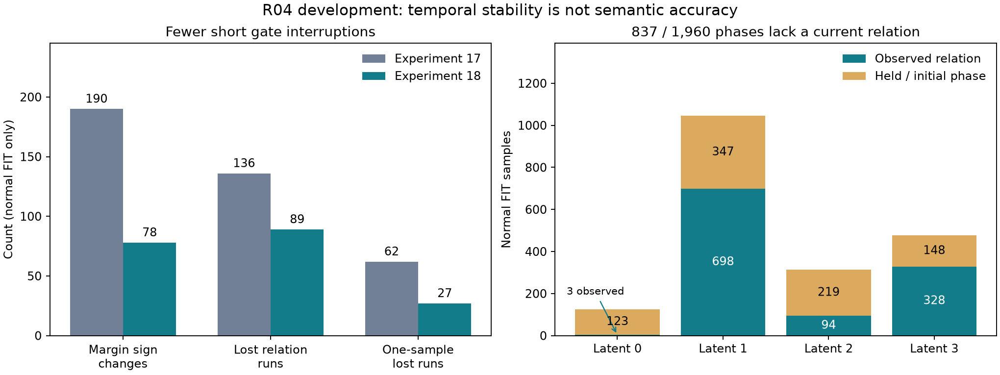
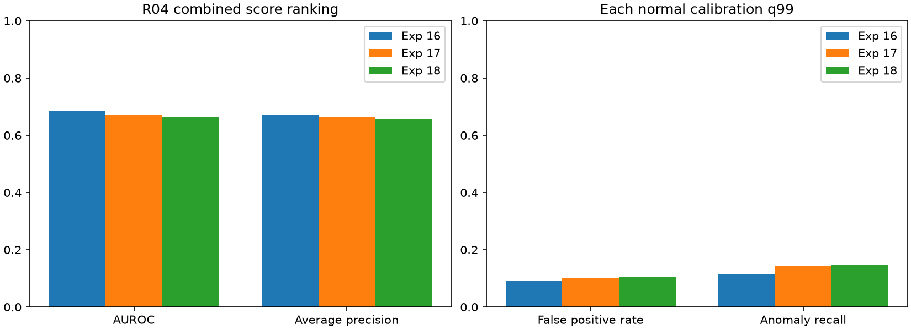

# 실험 18 — track 단위 인과적 의미 점수 집계

## 이번 실험 결과

**짧은 gate 변동은 줄었지만 Combined AUROC/AP는 낮아지고 정상 오탐이 늘었다.** 같은 track의 margin 부호 전환은 190→78회, 한 sample 관계 누락 구간은 62→27개로 줄었다. 그러나 알려진 바이스 오류 한 사례가 다시 gate를 통과했다. 안정성을 의미 정확도나 종합 성능 개선으로 해석하지 않는다.

### 질문·변경·고정 조건

실험 17에서 역할 gate가 일부 오검출을 제외했지만 관측 끊김과 체류 지원 손실이 발생했다. 이번에는 같은 anchor track의 **현재와 직전 최대 2개 연속 sampled 관측 margin 중앙값**으로 `margin > 0`을 판정했다. window=3을 미리 고정하고 첫 1/2개 관측에서는 이용 가능한 관측만 사용한다. sample gap, 새로운 track, 새 영상에서 history를 초기화한다. 미래 관측·gap 보간·누락 bbox 생성은 없다.

원래 CLIP 특징·두 text embedding·문장·검출·crop·track·appearance 후보를 유지했다. 관계 후보를 집계 margin으로 거른 뒤 기존 정상 area gate, K=4 관계 군집, phase별 PCA, 전이, lognormal 체류 모델을 다시 적합했다. 따라서 변경은 gate 집계이지만 재적합에 따른 후단 변화도 포함한다. Qwen/검출기/CLIP 재추론은 없었고 고정한 로컬 VLM 설정을 변경하지 않았다.

R04 정상 FIT 20개 / calibration 5개 / 테스트 19개, seed 42다. 정상 FIT 1,960 samples, calibration 482 samples, 테스트 2,047 samples를 사용하고 평가에는 원본 **8,154프레임(정상 3,576 / 이상 4,578)**으로 이전 점수를 유지해 확장했다. sampling은 4프레임이며 시간 단위는 원본 프레임 인덱스다. 정상 q99, strict `>`, max 결합, 지원 최소 10개를 유지했다. 정상 FIT 진단 후 입력·설정·코드를 고정하고 정상 calibration 가능성 검사 후 테스트를 평가했다. 테스트 라벨은 모델 적합·임계값 선택에 사용하지 않았다. 실행 시간과 운용 지연은 새로 측정하지 않았다.

### 정상 관측 연속성과 의미 오류

| 정상 FIT 진단 | 실험 17 | 실험 18 |
|---|---:|---:|
| 같은-track 연속 관측 쌍 | 1,868 | 1,868 |
| margin 부호 전환 | 190 | 78 |
| 실험 16 대비 관계를 잃은 samples | 555 | 532 |
| 위 누락의 연속 구간 수 | 136 | 89 |
| 한 sample 길이 누락 구간 | 62 | 27 |
| 누락 구간 길이 중앙값 (samples) | 2 | 3 |
| gate 통과 anchor bbox | 1,570 / 2,162 | 1,597 / 2,162 |

누락 진단은 두 실험 모두 동일한 gate 없는 실험 16의 관측을 기준으로 계산했다. 짧은 끊김 감소와 남은 누락 길이 분포를 함께 기록한다. 부호 전환 감소 자체는 객체 역할 정확도의 정답이 아니다.



| 기존 정상 정성 사례 | 대상 | 원래 margin | 집계 margin | 실험 18 gate |
|---|---|---:|---:|---|
| 01 / 0 | 바이스 | +0.021142 | +0.021142 | 통과: 오류 남음 |
| 01 / 156 | 바이스 | −0.007756 | −0.007050 | 제외 |
| 01 / 308 | 바이스 | −0.005292 | +0.002064 | **다시 통과: 오류 복원** |
| 03 / 0 | 바이스 | +0.006910 | +0.006910 | 통과: 오류 남음 |
| 03 / 232 | 바이스 | −0.009397 | −0.005265 | 제외 |
| 03 / 460 | 의도한 금속판 | +0.074168 | +0.074168 | 통과 |

알려진 바이스 5개 사례 중 제외된 수가 3→2개로 줄고 확인한 금속판 1개는 유지됐다. 이 여섯 사례는 전수 정확도/독립 평가 세트가 아니며 gate 통과와 최종 관계 관측도 다르다. 이 오류를 정상 단계에서 확인했지만 window/문장/threshold를 사후 조정하지 않았다.

| 관계 관측 | 실험 17 | 실험 18 |
|---|---:|---:|
| FIT | 56.17% (1,101/1,960) | 57.30% (1,123/1,960) |
| calibration | 60.58% (292/482) | 61.62% (297/482) |
| 테스트 | 68.05% (1,393/2,047) | 68.69% (1,406/2,047) |

FIT에서 관계 61개가 새로 관측되고 39개가 사라져 순 +22개다. 테스트는 +61/−48개다. 새 area gate/후보 선택도 영향을 주므로 원래 관측을 단순히 복원한 모델은 아니다. 유효 FIT 군집 크기는 `[3,698,94,328]`이며 **1→3 맥락의 완결 구간 12개·영상 9개**만 체류 지원 조건을 통과했다. 잠재 군집 번호는 실험 17과 의미가 같다고 가정하지 않는다. 해당 lognormal μ=2.943622, σ=0.535787이다.

### R04 개발 테스트 결과

| 지표 | 실험 16: 참고 | 실험 17 | 실험 18 |
|---|---:|---:|---:|
| Visual AUROC / AP | 0.6817 / 0.6707 | 0.6808 / 0.6683 | 0.6806 / 0.6688 |
| Process AUROC / AP | 0.6307 / 0.6528 | 0.4638 / 0.5479 | 0.5688 / 0.5941 |
| Combined AUROC / AP | 0.6851 / 0.6712 | 0.6711 / 0.6630 | **0.6655 / 0.6572** |
| 정상 q99 | 0.997457627 | 0.997457627 | 0.997457627 |
| 정상 오탐률 | 9.12% (326/3,576) | 10.15% (363/3,576) | **10.60% (379/3,576)** |
| 이상 프레임 recall | 11.51% (527/4,578) | 14.48% (663/4,578) | 14.64% (670/4,578) |
| 경보가 발생한 GT 이상 구간 | 12 / 26 | 14 / 26 | 15 / 26 |
| 체류 유효 프레임 비율 | 41.83% | 4.03% | 5.11% |



정상 calibration으로 각 모델의 임계값을 재적합했으며 값은 정확히 같았다. 모든 정상 branch 점수는 유한하고 [0,1] 범위였고, calibration 점수 1 포화는 없었으며 482 samples 중 경보 4개였다. 이 검사는 테스트 효용을 보장하지 않는다.

실험 17 대비 정상 52/이상 88프레임 경보를 추가하고 정상 36/이상 81프레임 경보를 제거했다. 순변화는 정상 오탐 +16, 이상 탐지 +7이다. 새 GT 탐지 구간은 **R04_11 `[170,240)`** 하나이며 잃은 구간은 없다. 공통 14개 탐지 구간의 지연 변화 중앙값은 0프레임이다. 탐지된 구간만의 지연 중앙값 23.5→32프레임은 탐지 집합이 달라 직접 속도 비교가 아니다. 실험 18은 11개 구간을 놓쳤고 탐지 15개 중 2개는 onset 이전부터 경보가 켜져 있었다. point adjustment와 FPS 가정은 없다.

같은 최종 q99를 넘는 Visual 경보는 정상 359/이상 666프레임, 전이는 정상 32/이상 12프레임이다. 둘은 겹치며 **공정 branch가 Visual에 추가한 경보는 정상 20/이상 4프레임**이다. 체류 경보는 0개이고 최대 유효 체류 점수 0.993577은 q99보다 낮았다. 추가 이상 구간을 체류의 기여로 주장할 수 없다.

체류 유효 프레임은 329→417개(정상 146 / 이상 271)로 늘었다. 나머지는 관계 누락 2,555 / 진입 미관측 3,064 / 미지원 맥락 2,118프레임이다. 유효 subset의 체류 AUROC/AP 0.5531/0.6919는 전체 지표가 아니며 이전과 subset도 다르다.

### 다음 변경을 위한 관측 조건 진단

| 정상 FIT 잠재 phase | 전체 samples | 현재 관계 관측 | 초기/이전 phase 유지 |
|---|---:|---:|---:|
| 0 | 126 | 3 | 123 |
| 1 | 1,045 | 698 | 347 |
| 2 | 313 | 94 | 219 |
| 3 | 476 | 328 | 148 |
| 합계 | 1,960 | 1,123 | **837** |

현재 구현은 미관측 837개에도 초기/유지 phase를 부여하고 그 phase의 appearance PCA 학습에 포함한다. 특히 latent 0은 126개 중 직접 관계 관측이 3개뿐이다. 이는 모델의 조건화 가정을 드러내며 phase GT 오답 837개라는 뜻은 아니다. 테스트에서도 관계 미관측 2,555프레임(정상 1,334 / 이상 1,221)에 정상 120/이상 258개 경보가 있다. 관측 여부에 따라 외형 subspace를 선택하는 별도 검증의 근거이지, 이번 성능 저하 원인으로 입증한 것은 아니다.

## 결과의 의의

같은 track의 과거 관측만으로 언어 기반 역할 판정을 집계하고, 인과성·입력 보존·normal-only 적합을 검증한 파이프라인을 구현했다. 짧은 변동 감소, 잘못된 후보 유지, 관계/체류 지원, 종합 경보의 차이를 각각 측정했다. 정상 연속성은 좋아져도 잘못된 객체의 안정적 추적과 오탐 증가가 함께 발생할 수 있었다.

캡스톤에서는 구성 요소의 상호작용과 실패 조건을 재현한 결과다. 시간 중앙값 자체나 성능 변화를 알고리즘 novelty로 주장하지 않는다. 새 구간 하나의 탐지보다 ranking 저하와 오탐 증가를 함께 보고하며, 이번 구성을 종합적으로 더 우수하다고 채택할 근거는 부족하다.

## 보완할 점

- 알려진 바이스 사례 하나의 잘못된 통과가 복원됐다. 후보가 없는 실제 금속판을 새로 찾는 방법이 아니며 전수 bbox/phase GT가 없다.
- 체류 가용성은 5.11%에 불과하고 추가 경보는 없다. 전이의 독자 경보도 정상 20/이상 4프레임으로 정상 부담이 크다.
- phase 재적합·관측 변경·후단 모델 변화가 함께 발생했다. 동일 관측 지원 대조 없이 의미 검증 효과를 분리할 수 없다.
- 정상 미관측 상태의 외형 학습 포함과 희소 군집이 남는다. 관측별 fallback의 효용과 정상 보정 대표성도 아직 미검증이다.
- R04는 반복 관찰한 개발 장면·단일 seed다. 적응적 실험 설계가 있으므로 독립 최종 평가, 통계적 유의성, 전체 IPAD 일반화를 주장하지 않는다. 정상 영상의 원본 녹화 그룹 독립성도 미확인이다.
- FPS/실제 timestamp가 없고 다른 장면의 원본 라벨 불일치 11개는 정확한 정렬 미확정 상태다. 원본을 임의 교정하지 않으며 unknown 평가 제외 규칙을 유지한다.

## 다음 Recommended improvements — 추천순 3개

| 추천순 | 개선 후보와 변경 내용 | 이번 결과의 근거 | 검증 기준 및 주의점 |
|---|---|---|---|
| 1 | **관측 여부를 반영하는 외형 subspace 선택**: 관계 관측이 있는 FIT만 phase별 PCA에 사용하고 미관측 때는 역할별 전체 정상 PCA로 fallback | FIT 837/1,960개가 미관측 phase이며 latent 0은 직접 관측 3개뿐. 테스트 미관측 2,555프레임 | 관계·process 모델을 고정하고 정상 calibration을 재적합. 관측별/전체 지표·지원 부족·경보 변화를 평가. 결측 프레임을 평가에서 제외하지 않으며 미관측=이상으로 간주하지 않음 |
| 2 | **관측 지원을 맞춘 대조 실험**: 공통 관측 범위에서 역할 gate와 집계의 영향을 분리 | FIT +61/−39 관계 변화와 후단 재적합이 공존, 오탐 +16 | 동일 마스크·입력·적합 범위를 공개하고 정상/이상 subset 변화를 함께 보고. 공통 subset 성능을 전체 성능으로 대체하지 않음 |
| 3 | **정상 역할 검증 범위 확대**: 자세·배경별 실제 부품 누락과 혼동 객체를 보조 주석으로 확인 | 알려진 바이스 5개 중 3개가 통과, 집계가 한 오류를 복원 | 기존 개발 사례와 별도 정상 사례를 구분하고 bbox/역할 검토 범위·비용을 공개. 테스트 이상 라벨로 문장·threshold를 튜닝하지 않음 |

다음은 1순위만 구체화한 [실험 19 계획](EXPERIMENT19_PLAN.md)이다. 나머지는 확정 실험 일정이 아니다.

## 검증과 재현

51개 테스트가 통과했다. causal prefix, gap/track/clip reset, 중복 track 거부, 입력 순서·원본 보존을 검사했다. 실제 44개 캐시에서 인과적 중앙값을 별도로 재구성하고 선택 anchor 조건, 정상 관계 모델 재적합, 입력/설정 hash를 확인했다. 정상 FIT/calibration으로 점수 모델을 재적합해 calibration과 테스트 19개 영상의 점수·q99·전체 지표를 재현했다. 사전 정상 검사와 최종 calibration 점수도 같았다.

```bash
export PYTHONPATH=src
export MPLCONFIGDIR=.cache/matplotlib
# 실험 17의 특징과 고정 text embedding을 사용
.venv/bin/python scripts/prepare_temporal_anchor.py
.venv/bin/python scripts/diagnose_temporal_gate.py
# 정상 지원 진단 및 동결 후
.venv/bin/python scripts/prepare_temporal_anchor.py --all-sequences
.venv/bin/python scripts/check_normal_feasibility.py --experiment 18
.venv/bin/python scripts/evaluate_baseline.py --data-root /path/to/IPAD_dataset --config configs/experiment18.json
.venv/bin/python scripts/validate_temporal_anchor.py
.venv/bin/python scripts/diagnose_temporal_outcome.py
.venv/bin/python scripts/compare_runs.py --experiments 16 17 18
.venv/bin/python scripts/compare_event_delays.py --experiments 17 18
.venv/bin/python scripts/compare_event_delays.py --experiments 16 18
.venv/bin/python scripts/diagnose_threshold_ceiling.py --experiment 18
.venv/bin/python scripts/plot_temporal_anchor.py
.venv/bin/python scripts/plot_experiment.py --experiment 18
.venv/bin/python -m pytest -q
```

사전 기록은 원본 실행의 hash이며 새 코드/캐시 재실행은 별도 provenance를 남긴다. 원본 영상·가중치·특징·로그는 업로드하지 않는다.

[설정](../configs/experiment18.json) · [정상 전 고정](../results/experiment18/pre_normal_protocol.json) · [정상 지원](../results/experiment18/normal_anchor_audit.json) · [정상 연속성](../results/experiment18/normal_temporal_continuity.json) · [평가 전 고정](../results/experiment18/pre_evaluation_protocol.json) · [정상 가능성](../results/experiment18/normal_feasibility.json) · [테스트 전 기록](../results/experiment18/pre_test_checkpoint.json) · [지표](../results/experiment18/metrics.json) · [영상별](../results/experiment18/per_sequence.csv) · [경보 변화](../results/experiment18/gate_diagnostic.json) · [관측 조건/branch](../results/experiment18/observation_conditioning.json) · [구간/지연](../results/comparison17_18/events.json) · [검증](../results/experiment18/validation.json)
