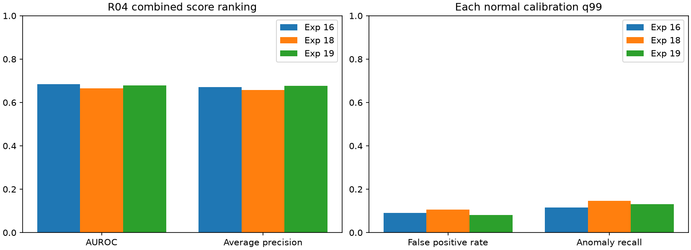

# 실험 19 — 관계 관측 여부에 따른 외형 subspace 선택

## 이번 실험 결과

**관계 미관측 프레임을 pooled 외형 모델로 처리하자 ranking과 정상 오탐은 개선됐지만, 이상 recall과 구간 탐지는 감소했다.** Combined AUROC는 0.6655→0.6792, 정상 오탐은 379→288프레임이다. 이상 탐지는 670→601프레임, 탐지 구간은 15→14개로 줄었다. 이를 일방적인 개선으로 해석하지 않는다.

### 질문·변경·고정 조건

실험 18의 정상 FIT 1,960 samples 중 837개는 현재 객체 관계를 관측하지 못했는데도 초기/이전 phase로 외형 PCA를 학습했다. 이번에는 **외형 모델의 학습·선택에만 관계 관측 여부를 반영**했다.

- 역할×phase PCA에는 `relation_valid=True`인 정상 FIT 특징만 사용했다. global-frame 역할에도 동일 규칙을 적용했다.
- 역할별 pooled PCA에는 모든 정상 FIT 특징을 기존대로 한 번씩 넣었다. 미관측 특징의 중복 삽입은 없다.
- calibration/추론에서 관계 미관측이면 역할별 pooled PCA로 점수를 계산한다. 관계가 관측돼도 해당 phase 지원이 10개 미만이면 pooled 모델을 사용한다. 역할 pooled가 없을 때의 기존 global pooled fallback도 유지한다.
- 객체·특징·track·집계 margin·관계 phase/관측 mask는 실험 18 캐시를 바이트 단위로 재사용했다. 관계 모델은 재적합하지 않았다. 전이/체류의 입력·정상 모델·원점수·보정 점수는 그대로다. 외형 정상 calibration CDF와 최종 q99만 새 외형 residual로 다시 적합했다.
- R04 정상 FIT 20개 / calibration 5개 / 테스트 19개, seed 42. 평가 **8,154프레임: 정상 3,576 / 이상 4,578**. sampling 4프레임, causal 이전 점수 유지, 정상 q99와 strict `>`, max 결합, PCA 95%/최대 rank 32/최소 10개를 유지했다.
- 정상 학습 전 코드·설정·입력·계획을 고정하고 정상 지원/보정 가능성 검사 후 테스트를 평가했다. 테스트 라벨은 점수 계산 후 평가에만 읽었다. 새 VLM/검출/CLIP 추론은 없고 로컬 Qwen 설정을 유지한다. 실행 시간·운용 지연은 새로 측정하지 않았다.

`appearance_conditioning=observed_relation`에서만 새 경로가 활성화된다. 기존 설정의 동작은 유지하며 실제 실험 18의 저장된 모델과 점수도 재현했다.

### 정상 외형 모델과 fallback 지원

| 역할 | phase 0: 기존 / 관측 FIT | phase 1 관측 | phase 2 관측 | phase 3 관측 | pooled 전체 FIT |
|---|---:|---:|---:|---:|---:|
| 전체 프레임 | 126 / 3 | 698 | 94 | 328 | 1,960 |
| 판재 (0) | 13 / 3 | 838 | 139 | 475 | 2,462 |
| anchor 후보 (1) | 128 / 3 | 790 | 137 | 389 | 2,162 |
| trough (2) | 126 / 3 | 698 | 94 | 328 | 1,960 |

객체 역할 행은 crop 관측 수라 한 sample의 여러 후보가 포함될 수 있다. 역할×phase bank는 **16→12개**로 줄었다. phase 0의 네 bank는 관측 FIT가 각각 3개여서 생성하지 않았다. pooled bank 네 개의 mean/basis/표본 수는 실험 18과 정확히 같다. phase별 bank의 표본 수와 rank 변화는 [정상 진단](../results/experiment19/normal_appearance_audit.json)에 공개했다.

테스트 global-frame 2,047 samples 중 641개는 관계 미관측 pooled, 11개는 관측됐지만 지원 부족 pooled, 1,395개는 phase bank를 사용했다. 미관측 sample도 추론과 전체 평가에 포함했으며 미관측을 점수 0 또는 이상으로 지정하지 않았다. 정상 calibration은 global 기준 관측 297 / 미관측 185개이고 관측 phase 지원 부족 fallback은 없었다.

### R04 개발 테스트 결과

| 지표 | 실험 16: 참고 | 실험 18 | 실험 19 |
|---|---:|---:|---:|
| Visual AUROC / AP | 0.6817 / 0.6707 | 0.6806 / 0.6688 | **0.6971 / 0.6939** |
| Process AUROC / AP | 0.6307 / 0.6528 | 0.5688 / 0.5941 | 0.5688 / 0.5941 |
| Combined AUROC / AP | 0.6851 / 0.6712 | 0.6655 / 0.6572 | **0.6792 / 0.6767** |
| 정상 q99 | 0.997457627 | 0.997457627 | 0.997457627 |
| 정상 오탐률 | 9.12% (326) | 10.60% (379) | **8.05% (288)** |
| 이상 프레임 recall | 11.51% (527) | 14.64% (670) | **13.13% (601)** |
| 경보가 발생한 GT 이상 구간 | 12 / 26 | 15 / 26 | 14 / 26 |
| 체류 유효 비율 | 41.83% | 5.11% | 5.11% |

괄호는 경보 프레임 수다. 모델별 정상 calibration으로 q99를 재적합했으며 이번 값은 정확히 같았다. calibration 482 samples 중 경보 4개, 점수 1 포화 0개, 모든 branch 점수 finite/[0,1] 검사를 통과했다. 정상 경보 가능성과 유용한 테스트 탐지는 별개다.



실험 18 대비 정상 23/이상 93프레임 경보를 추가하고 정상 114/이상 162프레임 경보를 제거했다. 순 오탐 −91, 이상 탐지 −69다. 실험 16과 비교해도 AUROC는 낮고 AP·recall은 높으므로 모든 지표의 우위를 주장하지 않는다.

### 고정 관측 mask로 나눈 변화

| 동일 subset | 정상 프레임 | 이상 프레임 | 정상 경보 18→19 | 이상 경보 18→19 | Combined AUROC 18→19 |
|---|---:|---:|---:|---:|---:|
| 관계 미관측 | 1,334 | 1,221 | 120→48 | 258→134 | 0.7730→0.7802 |
| 관계 관측 | 2,242 | 3,357 | 259→240 | 412→467 | 0.6083→0.6248 |


미관측 subset에서는 새 경보가 없고 정상 72/이상 124개만 제거됐다. 관측 subset에서는 정상 순 −19/이상 +55개다. 관측률 자체를 바꾸지 않았으므로 단순 coverage 증가에 의한 차이는 아니다. 하지만 phase bank 학습 표본 제한·추론 fallback·외형 CDF 재적합의 개별 기여는 아직 분리하지 않았다.

잃은 GT 구간은 **R04_04 `[261,379)`** 하나이고 새 구간은 없다. 해당 118프레임 중 관계 관측은 35프레임이며 실험 18의 유일한 경보 4프레임은 모두 미관측 구간에 있었다. 실험 19에서는 경보가 없다. 이 구간은 사후 진단이며 모델 변경/선택에 사용하지 않았다.

공통 탐지 14개 구간의 지연 변화 중앙값은 0프레임이다. 탐지된 구간만의 지연 중앙값은 32→56.5프레임이며 대상 집합이 달라 전체 지연 악화량으로 해석하지 않는다. 실험 19의 미탐 구간은 12개이고 탐지 14개 중 3개는 onset 전부터 경보가 켜져 있었다. point adjustment와 FPS 가정은 없다.

같은 q99를 넘는 Visual 경보는 정상 256/이상 593프레임, 전이는 정상 32/이상 12프레임이다. 서로 겹치며 공정이 Visual에 추가한 경보는 **정상 32/이상 8프레임**이다. 체류 경보는 0개이고 최대 점수 0.993577도 그대로다. 공정 추가 경보 수가 달라진 이유는 Visual과의 겹침 변화이며 공정 모델 개선이 아니다.

### 정상 calibration 분포 진단

현재 외형 보정은 같은 역할의 phase/pooled residual을 하나의 CDF로 섞는다. 정상 calibration에서 판재 역할의 관측/미관측 raw residual 중앙값은 **0.02045 / 0.01816**, 99% 분위는 **0.07117 / 0.04933**이다. 현재 CDF로 보정된 99% 분위는 **0.99271 / 0.96329**다. anchor 후보의 보정 중앙값도 관측 0.55064 / 미관측 0.43738로 다르다. 전체 프레임과 trough의 중앙값 차이는 작아 모든 역할에서 같은 차이를 주장하지 않는다.

이 진단은 경로별 보정의 검토 근거다. 표본 차이·영상 의존성·정상 혼합 비율도 영향을 줄 수 있으며 미관측 recall 손실의 원인이 보정이라고 입증한 것은 아니다. 관측 여부와 실제 bank 종류는 지원 부족 시 다를 수 있다. 후속 검증은 실제 선택 bank가 phase인지 pooled인지로 구분해야 한다.

## 결과의 의의

관계 상태를 직접 관측한 경우에만 공정별 외형 모델을 적용하고, 관측 불확실성이 있을 때 전체 정상 모델로 되돌아가는 경로를 구현했다. 같은 특징·관측 mask·공정 점수를 보존한 비교에서 정상 오탐 감소와 이상 경보 손실을 함께 확인했다. 원래 미관측 phase를 그대로 확정적으로 사용하던 가정을 명시적으로 검증했다는 구현상의 의미가 있다.

관측 여부에 따른 모델 선택이 novelty로 입증된 것은 아니다. 단일 개발 장면의 성능 변화로 통계적 유의성·일반화도 주장하지 않는다. 캡스톤에서는 정상 학습 지원, 추론 경로, 보정, 경보 절충을 연결하는 재현 가능한 파이프라인 결과로 정리한다.

## 보완할 점

- 미관측 구간의 이상 경보가 258→134개로 크게 줄었고 구간 하나를 놓쳤다. pooled 모델이 공정 특이 이상을 정상 범위로 흡수할 수 있다.
- 정상 calibration에서 phase/pooled 경로의 residual 분포가 일부 역할에서 다르지만 보정은 합쳐져 있다. 반대로 경로별로 나누면 표본이 줄고 꼬리 보정이 불안정해질 수 있어 정상 영상 holdout 검증이 필요하다.
- phase 학습 표본 제한·fallback·CDF 재적합을 하나의 일관된 변경으로 적용했다. 각각의 기여를 인과적으로 분리한 대조는 아직 없다.
- 객체 역할 오검출과 체류 가용성 5.11%는 그대로다. bbox/phase GT가 없어 관측 여부를 의미 정확도로 간주할 수 없다.
- R04 반복 개발·단일 seed·정상 calibration 5개에 제한된다. 원본 녹화 그룹 독립성, FPS/실제 timestamp는 미확인이다. 다른 장면의 원본 라벨 불일치 11개는 정렬 미확정이며 임의 수정하지 않는다.

## 다음 Recommended improvements — 추천순 3개

| 추천순 | 개선 후보와 변경 내용 | 이번 결과의 근거 | 검증 기준 및 주의점 |
|---|---|---|---|
| 1 | **외형 bank 경로별 정상 보정**: 역할×{phase bank, pooled bank} CDF를 비교하고 정상 영상 하나씩 제외하는 검증 추가 | 판재 정상 보정 99% 분위가 관측 0.99271 / 미관측 0.96329, 미관측 이상 경보 −124 | PCA/공정/관측 mask 고정. normal-only holdout의 경로별 오탐·포화·지원 수와 전체 테스트 recall/오탐 동시 평가. 경로별 표본 감소·정상 꼬리 불안정을 보고하며 테스트 threshold 탐색 금지 |
| 2 | **학습 표본 제한과 추론 fallback의 분리 대조**: 관측 FIT 제한만/추론 fallback만 적용한 구성을 비교 | 관측/미관측에서 변화 방향이 다르고 세부 기여가 섞임 | 같은 특징·공정 모델·분할에서 보정까지 각 구성에 맞게 재적합. 동일 q99 수치를 강제하지 않고 전체/subset 결과 공개 |
| 3 | **정상 객체 역할과 관측 누락 원인 검증**: 별도 정상 사례에서 실제 부품 누락과 혼동 후보를 확인 | 관측 모델을 바꿔도 기존 역할 오류·체류 가용성 5.11% 지속 | 개발 사례와 보조 검토 사례를 구분하고 주석 비용/범위 공개. coverage와 정확도를 구분하며 테스트 이상 라벨로 gate 튜닝 금지 |

다음은 1순위만 구체화한 [실험 20 계획](EXPERIMENT20_PLAN.md)이다. 다른 후보는 확정 일정이 아니며 새 결과로 순위를 갱신한다.

## 검증과 재현

55개 테스트가 통과했다. 관측 FIT만 phase bank에 포함, pooled 단일 삽입, 최소 지원과 global fallback, 정상 보정/추론의 같은 경로, 원본 phase 보존, 기존 동작 일치를 검사했다.

실제 44개 특징 파일의 byte hash와 사전 고정 기록을 확인했다. 독립적으로 bank 입력 행과 PCA를 재구성하고 모든 영상의 appearance route/residual을 검사했다. pooled 모델과 전이/체류 모델 보존, raw/보정 공정 점수 일치, 실험 18의 저장된 예측 재현을 확인했다. 실험 19의 정상 사전 보정과 최종 보정도 같고 테스트 19개 점수·원본 라벨·전체 지표를 재계산했다.

```bash
export PYTHONPATH=src
export MPLCONFIGDIR=.cache/matplotlib
# 실험 18 특징을 그대로 재사용하며 로컬 symlink 생성
.venv/bin/python scripts/prepare_observed_appearance.py
.venv/bin/python scripts/check_normal_feasibility.py --experiment 19
# 정상 가능성 확인과 테스트 전 고정 기록 후
.venv/bin/python scripts/evaluate_baseline.py --data-root /path/to/IPAD_dataset --config configs/experiment19.json
.venv/bin/python scripts/validate_observed_appearance.py
.venv/bin/python scripts/compare_runs.py --experiments 16 18 19
.venv/bin/python scripts/compare_event_delays.py --experiments 18 19
.venv/bin/python scripts/diagnose_observed_appearance.py
.venv/bin/python scripts/diagnose_threshold_ceiling.py --experiment 19
.venv/bin/python scripts/plot_observed_appearance.py
.venv/bin/python scripts/plot_experiment.py --experiment 19
.venv/bin/python -m pytest -q
```

사전 hash는 원본 실행의 provenance이며 코드/캐시를 바꾸는 재실행에는 별도 기록이 필요하다. [실험 19 계획](EXPERIMENT19_PLAN.md)은 정상 학습 전 고정한 문서이므로 작성 당시 상태 문구도 보존한다. 현재 완료 상태는 이 보고서와 README를 따른다. 검증 스크립트의 원본 라벨 경로는 이 작업 환경에 고정되어 있어 다른 환경에서는 경로와 실행 기록을 갱신해야 한다. 원본 영상·가중치·특징·로그는 업로드하지 않는다.

[설정](../configs/experiment19.json) · [정상 학습 전 고정](../results/experiment19/pre_normal_protocol.json) · [정상 bank 진단](../results/experiment19/normal_appearance_audit.json) · [정상 가능성](../results/experiment19/normal_feasibility.json) · [테스트 전 기록](../results/experiment19/pre_test_checkpoint.json) · [지표](../results/experiment19/metrics.json) · [영상별](../results/experiment19/per_sequence.csv) · [관측별/bank 진단](../results/experiment19/appearance_diagnostic.json) · [공정 기여/놓친 구간](../results/experiment19/branch_alarms.json) · [구간/지연](../results/comparison18_19/events.json) · [재현 검증](../results/experiment19/validation.json)
