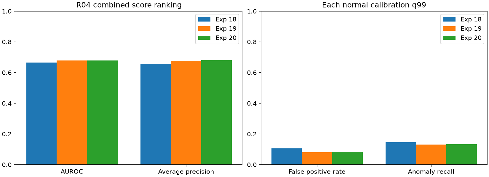
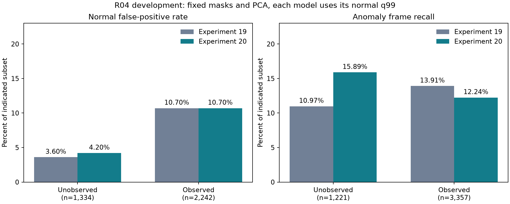

# 실험 20 — 외형 bank 경로별 정상 보정과 영상 holdout

## 이번 실험 결과

**경로별 CDF는 정상 영상 holdout의 오탐을 늘렸고, 테스트에서의 순 이상 탐지 증가는 4프레임에 그쳤다.** 정상 holdout 오탐은 44→68/1,920프레임, 테스트 정상 오탐은 288→296프레임이다. 테스트 탐지 구간 수는 14개로 같지만 두 구간을 얻고 두 구간을 잃었다. 이번 구성을 전반적으로 더 좋은 파이프라인으로 채택할 근거는 부족하다.

### 질문·변경·고정 조건

실험 19는 관측 여부에 따라 phase/pooled 외형 모델을 선택했지만 두 경로의 residual을 역할 전체 CDF로 섞었다. 일부 역할에서 정상 점수 분포가 달랐고 미관측 구간 recall이 줄었다. 이번에는 **외형 residual의 정상 보정만 역할×실제 bank 종류 `{phase, pooled}`로 분리**했다.

관계가 관측됐어도 해당 phase의 FIT 지원이 부족해 pooled PCA를 사용하면 pooled 경로로 보정한다. latent phase 번호별로 추가 분할하지 않는다. 경로별 정상 calibration 관측 50개·서로 다른 정상 시퀀스 2개 이상일 때만 해당 CDF를 사용하고, 부족하면 기존 역할 전체 CDF로 fallback한다. 두 기준은 실행 전에 고정한 지원 guard이며 독립 표본 수나 꼬리 보정 신뢰도를 보장하지 않는다. 동률은 기존 midrank percentile로 처리한다.

실험 19의 특징·관계 phase·관측 mask·모든 PCA mean/basis·raw residual·전이/체류 모델과 점수를 보존했다. 외형 CDF 및 최종 정상 q99만 재적합했다. 역할별 보정 reference에는 실제 시퀀스 ID를 기록하고 중복 calibration 시퀀스를 거부한다. reference 배열도 로컬 모델 artifact에 저장한다.

R04 정상 FIT 20개 / calibration 5개 / 테스트 19개, seed 42다. 정상 holdout은 calibration 5개·**1,920프레임 / 482 samples**, 테스트는 **8,154프레임: 정상 3,576 / 이상 4,578**이다. sampling 4프레임, 이전 점수 유지, max 결합, q99/strict `>`를 유지했다. VLM·검출기·CLIP 재추론은 없었고 기존 로컬 Qwen 설정도 유지했다. 실행 시간·운용 지연은 새로 측정하지 않았다.

### 정상 영상 holdout: 테스트 전 확인한 실패

정상 FIT 모델은 고정하고 calibration 영상 하나씩을 제외했다. 남은 4개로 외형/공정 보정과 최종 q99를 적합한 뒤 제외 정상 영상의 경보를 계산했다. 제외 영상은 모든 reference와 q99에서 빠지며, 같은 fold의 두 모델은 동일한 공정 점수를 사용한다. 총 5개 fold×2개 구성을 비교했다.

| 제외 정상 영상 | 원본 프레임 | 역할 전체 CDF (19) 오탐 | 경로별 CDF (20) 오탐 |
|---|---:|---:|---:|
| 02 | 409 | 16 | 16 |
| 08 | 413 | 8 | 8 |
| 10 | 376 | 0 | 4 |
| 12 | 382 | 16 | 32 |
| 15 | 340 | 4 | 8 |
| 합계 | **1,920** | **44 (2.29%)** | **68 (3.54%)** |

sample 기준으로는 11→17/482개이고 모두 결합 점수가 1인 관측이다. 기존 경보를 제거하지 않고 6개 sample을 추가했으며, 이들이 24개 원본 프레임으로 확장됐다. 추가 6개 중 5개는 관계 미관측, 1개는 관측 상태다.

fold별 q99 범위는 실험 19에서 0.998677~0.998741, 실험 20에서 0.997674~0.997967이다. 같은 임계값이나 같은 정상 오탐률에 맞춘 비교가 아니다. 모든 fold에서 정상 보정 점수는 finite/[0,1]이고 보정 점수 1 포화는 없었다. 실험 20의 40개 역할×경로 reference는 모두 지원 guard를 통과했다. reference마다 138~321개 관측·4개 시퀀스를 사용했으며 fallback은 없었다.


추가 오탐 6개 모두 **역할 전체 정상 residual 범위 안이지만 해당 경로 reference의 최대를 넘어서 점수 1이 된 사례**가 있었다. 예를 들어 정상 12/frame 260 판재 pooled residual은 0.062880으로 경로 최대 0.049342보다 높지만 역할 전체 최대 0.125942 이하다. 역할 전체 percentile은 0.989540, 경로 percentile은 1이다. 충분한 관측·영상 개수 guard만으로 정상 꼬리의 대표성을 확보하지 못한 구체적 반례다. 이 진단은 고정된 결과의 사후 설명이며 기준을 바꾸지 않았다.

정상 holdout 오탐 악화는 테스트 전 기록했다. 후보를 수정하거나 유리한 fold만 선택하지 않고, 전체 정상 calibration의 경보 가능성 검사를 통과한 동일 후보를 평가했다.

### 전체 정상 calibration의 지원과 경보 가능성

| 역할 | pooled 관측 수 | phase 관측 수 | 각 경로의 정상 영상 수 |
|---|---:|---:|---:|
| 전체 프레임 | 185 | 297 | 5 |
| 판재 (0) | 209 | 381 | 5 |
| anchor 후보 (1) | 189 | 354 | 5 |
| trough (2) | 185 | 297 | 5 |

8개 reference 모두 지원 guard를 통과했고 테스트에서도 역할 전체 CDF fallback은 없었다. 테스트 phase 지원 부족 관측은 pooled CDF를 사용하므로 관측 여부와 bank 경로를 구분한다. 객체 관측 수는 프레임 수와 다르며 한 sample의 여러 crop을 포함할 수 있다.

전체 정상 q99는 **0.997607656**, 정상 보정 482 samples 중 경보 4개, 점수 1 포화 0개다. 경보 불능은 없지만 holdout에서 정상 오탐이 증가했으므로 이 검사만으로 보정이 잘됐다고 주장할 수 없다.

### R04 개발 테스트 결과

| 지표 | 실험 19 | 실험 20 |
|---|---:|---:|
| Visual AUROC / AP | 0.6971 / 0.6939 | 0.6959 / 0.6965 |
| Process AUROC / AP | 0.5688 / 0.5941 | 0.5688 / 0.5941 |
| Combined AUROC / AP | 0.6792 / 0.6767 | **0.6780 / 0.6802** |
| 정상 q99 | 0.997457627 | 0.997607656 |
| 정상 오탐률 | 8.05% (288/3,576) | **8.28% (296/3,576)** |
| 이상 프레임 recall | 13.13% (601/4,578) | **13.22% (605/4,578)** |
| 경보가 발생한 GT 이상 구간 | 14 / 26 | 14 / 26 |
| 체류 유효 비율 | 5.11% | 5.11% |

정상 8/이상 76프레임 경보를 추가하고 정상 0/이상 72프레임 경보를 제거했다. 순변화는 정상 +8, 이상 +4다. 각 구성의 정상 q99를 사용했으며 테스트 FPR이나 threshold를 맞추지 않았다.



| 고정 관계 subset | 정상 경보 19→20 | 이상 경보 19→20 | Combined AUROC 19→20 |
|---|---:|---:|---:|
| 미관측: 정상 1,334 / 이상 1,221프레임 | 48→56 | 134→194 | 0.7802→0.7831 |
| 관측: 정상 2,242 / 이상 3,357프레임 | 240→240 | 467→411 | 0.6248→0.6228 |

미관측에서 이상 탐지 순 +60개지만 관측에서 −56개라 전체 증가는 4개다. 부분집합의 recall 증가를 전체 개선으로 대체하지 않는다.



얻은 구간은 **R04_04 `[261,379)`, R04_09 `[128,334)`**, 잃은 구간은 **R04_11 `[170,240)`, `[279,335)`**다. 총개수가 같아도 탐지 집합은 다르다. 공통 탐지 12개 구간의 지연 변화 중앙값은 0프레임이며, 탐지된 구간만의 지연 중앙값 56.5→69.5프레임은 서로 다른 집합의 조건부 통계다. 실험 20은 12개 구간을 놓쳤고 탐지 14개 중 3개는 onset 전에 경보가 켜져 있었다. point adjustment와 FPS 가정은 없다.

같은 실험 20 q99에서 Visual 경보는 정상 264/이상 597프레임, 전이는 정상 32/이상 12프레임이다. 서로 겹치며 공정의 Visual 외 추가 경보는 정상 32/이상 8프레임이다. 체류의 추가 경보는 0개다. 테스트 최종 경보 901프레임은 모두 결합 점수 1인 프레임과 일치했다. 이는 q99=1 경보 불능과 다른 현상이며, 경로별 경험적 CDF의 상단 값에 경보가 집중된 것으로 기록한다.

## 결과의 의의

실제 외형 bank 경로를 기준으로 정상 보정을 분리하고, 정상 영상 단위 holdout에서 적합 데이터 안의 점수와 제외 영상의 경보를 구분하는 평가 경로를 구현했다. 특징·PCA·raw residual·공정 점수를 보존했으므로 이번 변화는 외형 보정과 그에 따른 q99 변화로 좁혀 설명할 수 있다.

정상 지원 guard를 통과하더라도 경로 reference의 최대 밖에 있는 정상 관측이 쉽게 점수 1을 받을 수 있었다. 파이프라인 구성 요소를 세분화하는 것이 항상 더 나은 보정으로 이어지지 않는다는 반례다. AP 상승이나 미관측 subset recall 상승을 novelty·일반화의 근거로 사용하지 않는다. 캡스톤에서는 구현과 검증, 실패 조건의 재현에 의미가 있다.

## 보완할 점

- 정상 holdout 오탐이 증가했고 테스트 정상 경보도 늘었다. 서로 다른 q99와 CDF 해상도를 포함하는 전체 보정 절차의 결과이며, 단순히 threshold만 낮아진 효과와 완전히 분리하지 않았다.
- 경로별 표본이 138개 이상이어도 최대 밖의 정상 residual이 존재했다. sample 수·영상 수가 독립 관측량이나 꼬리 대표성은 아니다. 정상 영상 간 분포 차이와 연속 frame 상관이 남는다.
- 미관측 탐지 증가는 관측 탐지 손실로 대부분 상쇄됐다. 이전에 놓친 구간 하나를 복구했지만 다른 구간 두 개를 잃었으므로 일괄적인 개선으로 채택하지 않는다.
- 실험 19의 관측 FIT 제한과 추론 fallback의 개별 기여는 여전히 미분리다. 보정만 바꿔 해결할 수 없는 pooled 외형 모델의 특이성 손실도 가능하다.
- 역할 오검출·관계 미관측·체류 지원 5.11%는 그대로다. bbox/phase GT가 없으며 R04는 반복 개발 장면·단일 seed다. 독립 최종 평가·통계적 유의성·전체 IPAD 일반화를 주장하지 않는다.
- 원본 녹화 그룹 독립성, FPS/실제 timestamp는 미확인이다. 다른 장면의 라벨 불일치 11개는 정렬 미확정 상태이며 원본을 임의 수정하지 않는다.

## 다음 Recommended improvements — 추천순 3개

| 추천순 | 개선 후보와 변경 내용 | 이번 결과의 근거 | 검증 기준 및 주의점 |
|---|---|---|---|
| 1 | **관측 FIT 제한과 추론 fallback의 2×2 분리 대조**: 두 요소의 단독/결합 구성을 역할 전체 CDF 조건에서 비교 | 경로별 CDF의 전체 탐지 순증가는 4개에 그치고 정상 holdout은 악화. 기존 외형 변경의 개별 효용은 미분리 | 같은 특징·공정·관측 mask에서 정상 holdout과 전체/관측별 지표 비교. 모든 셀을 공개하고 테스트로 유리한 조합만 선택하지 않음 |
| 2 | **경로 reference와 역할 전체 reference의 부분 공유**: 조건별 CDF를 전체 역할 분포 쪽으로 완화하는 후보 | 추가 정상 6 samples 모두 경로 최대 밖이지만 역할 전체 범위 안 | 별도 실행 전 공유 규칙을 고정하고 정상 holdout 오탐/포화와 이상 탐지 손실 검증. 이번 6개만 복구하는 규칙이나 테스트 가중치 탐색 금지 |
| 3 | **정상 역할·누락 검증 범위 확대**: 별도 자세/배경 사례에서 실제 부품 누락과 혼동 후보를 검토 | 보정 변경에도 기존 역할 오류와 낮은 체류 가용성 지속 | 기존 개발 사례와 별도 정상 보조 주석을 구분하고 비용/범위 공개. 관측률을 의미 정확도로 대체하지 않음 |

다음은 1순위만 구체화한 [실험 21 계획](EXPERIMENT21_PLAN.md)이다. 실험 20의 경로별 CDF는 기본 구성으로 승격하지 않고 비교 결과로 남긴다. 이후 후보는 새 결과에 따라 갱신한다.

## 검증과 재현

60개 테스트가 통과했다. 실제 pooled/phase 경로, 최소 관측·서로 다른 영상 지원, fallback, 상수 residual 동률, 재보정 reference 초기화, 중복 시퀀스 거부, holdout 영상의 reference/q99 제외를 검사했다.

실제 특징 44개 파일의 byte hash와 PCA/raw residual 보존을 확인했다. 10개 정상 holdout 구성의 reference·경로·CDF·q99·예측·관측별 경보를 별도로 재구성했다. 실험 19의 저장된 모델/정상 보정/테스트 점수도 재현했다. 실험 20의 정상 사전 보정과 최종 보정은 같고, 테스트 19개 영상의 객체/프레임 점수·공정 보존·원본 라벨·지표를 검증했다.

```bash
export PYTHONPATH=src
export MPLCONFIGDIR=.cache/matplotlib
.venv/bin/python scripts/prepare_route_calibration.py
.venv/bin/python scripts/evaluate_route_holdout.py
.venv/bin/python scripts/check_normal_feasibility.py --experiment 20
# 정상 실패도 기록한 뒤, 경보 가능성 확인과 테스트 전 고정
.venv/bin/python scripts/evaluate_baseline.py --data-root /path/to/IPAD_dataset --config configs/experiment20.json
.venv/bin/python scripts/validate_route_calibration.py
.venv/bin/python scripts/compare_runs.py --experiments 18 19 20
.venv/bin/python scripts/compare_event_delays.py --experiments 19 20
.venv/bin/python scripts/diagnose_route_tails.py
.venv/bin/python scripts/diagnose_threshold_ceiling.py --experiment 20
.venv/bin/python scripts/plot_route_calibration.py
.venv/bin/python scripts/plot_experiment.py --experiment 20
.venv/bin/python -m pytest -q
```

사전 hash는 원본 실행 기록이다. 고정된 [실험 20 계획](EXPERIMENT20_PLAN.md)의 작성 당시 상태 문구도 보존하며 현재 완료 상태는 이 보고서와 README를 따른다. 다른 코드/환경의 재실행에는 별도 provenance가 필요하다. 검증 스크립트의 원본 라벨 경로는 이 환경에 고정되어 있다. 원본 영상·특징·가중치·서버 로그는 업로드하지 않는다.

[설정](../configs/experiment20.json) · [정상 실행 전 고정](../results/experiment20/pre_normal_protocol.json) · [정상 holdout](../results/experiment20/normal_holdout.json) · [정상 꼬리 반례](../results/experiment20/normal_tail_diagnostic.json) · [전체 정상 가능성](../results/experiment20/normal_feasibility.json) · [테스트 전 기록](../results/experiment20/pre_test_checkpoint.json) · [지표](../results/experiment20/metrics.json) · [영상별](../results/experiment20/per_sequence.csv) · [관측·경로·branch 진단](../results/experiment20/route_diagnostic.json) · [구간/지연](../results/comparison19_20/events.json) · [재현 검증](../results/experiment20/validation.json)
