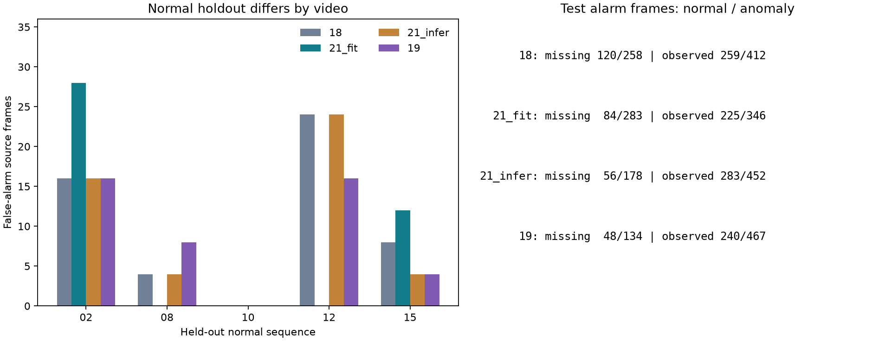

# 실험 21 — 관측 FIT 제한과 추론 fallback의 2×2 대조

## 이번 실험 결과

**학습 표본 제한과 추론 fallback은 각각 오탐을 줄였지만, 이상 경보·구간 탐지에 서로 다른 영향을 줬다.** 두 요소의 결합이 모든 지표에서 우수하지 않았다. 학습 제한만 적용한 구성은 정상 holdout 오탐이 가장 적었고, 추론 fallback만 적용한 구성은 테스트 구간을 가장 많이 탐지했다. 네 구성을 모두 공개하며 하나를 종합적인 승자로 선택하지 않는다.

### 질문·변경·고정 조건

실험 19는 관측된 정상 FIT만 phase PCA에 사용하고 미관측 추론에서는 pooled PCA로 전환했다. 실험 20의 경로별 CDF는 정상 holdout을 악화시켰다. 이번에는 역할 전체 CDF로 돌아가 실험 19의 두 변경을 분리했다.

| 구성 | A: 관측 FIT만 phase PCA 학습 | B: 미관측 추론 시 pooled PCA | 상태 |
|---|---|---|---|
| 18 | 꺼짐 | 꺼짐 | 기존 결과 재현 |
| 21_fit | 켜짐 | 꺼짐 | 새 평가 |
| 21_infer | 꺼짐 | 켜짐 | 새 평가 |
| 19 | 켜짐 | 켜짐 | 기존 결과 재현 |

A는 PCA 학습 표본만 바꾸고 B는 정상 calibration/테스트에서 외형 bank 선택만 바꾼다. B가 꺼져도 phase bank 지원이 부족하면 기존 pooled fallback은 작동한다. 모든 pooled bank에는 전체 정상 FIT 특징을 한 번씩 사용했다. 각 구성의 residual로 역할 전체 CDF와 정상 q99를 다시 적합했고 경로별 CDF는 사용하지 않았다.

특징·bbox·track·관계 phase·관측 mask·temporal gate·공정 모델은 동일하다. VLM/검출기/CLIP 재추론과 관계 군집 재적합은 없다. 로컬 Qwen 설정을 유지한다. R04 FIT 20개 / calibration 5개 / 테스트 19개, seed 42, sampling 4프레임, causal hold, PCA 95%/최대 rank 32/최소 10개, max 결합, q99/strict `>`를 유지했다.

정상 holdout은 calibration 5개·1,920프레임(482 samples), 테스트는 **8,154프레임: 정상 3,576 / 이상 4,578**이다. 정상 실행 전 네 셀과 입력/코드를 고정하고 정상 검사 이후 두 새 셀을 각각 한 번 평가했다. 테스트 라벨은 평가에만 사용했다. 실행 시간·운용 지연은 새로 측정하지 않았다.

### 정상 영상 holdout과 보정 가능성

정상 FIT의 PCA/공정 모델은 고정하고 정상 calibration 영상 하나씩을 제외했다. 남은 4개로 외형/공정 reference와 q99를 적합했으며 제외 영상은 어떤 reference나 q99에도 포함되지 않는다.

| 제외 정상 영상 | 18 | 21_fit | 21_infer | 19 |
|---|---:|---:|---:|---:|
| 02 | 16 | 28 | 16 | 16 |
| 08 | 4 | 0 | 4 | 8 |
| 10 | 0 | 0 | 0 | 0 |
| 12 | 24 | 0 | 24 | 16 |
| 15 | 8 | 12 | 4 | 4 |
| 오탐 합계 / 1,920프레임 | **52 (2.71%)** | **40 (2.08%)** | **48 (2.50%)** | **44 (2.29%)** |

sample 경보 수는 각각 13/10/12/11개다. 같은 fold의 네 q99는 같았으며 fold 간 범위는 0.998677~0.998741이다. 학습 제한만 적용한 구성의 합계는 가장 작지만 영상 02·15에서는 기준보다 나빠졌다. 합계만으로 정상 영상 전반의 개선을 주장하지 않는다.

전체 정상 calibration 5개로 적합한 네 q99는 모두 **0.997457627118644**였다. 모든 구성은 finite/[0,1], 보정 점수 1 포화 0개, 보정 482 samples 중 경보 4개로 정상 경보 가능성 검사를 통과했다. 값이 같도록 강제하거나 테스트 오탐률을 맞추지 않았다.

### R04 개발 테스트 결과

| 지표 | 18: 둘 다 없음 | 21_fit: A만 | 21_infer: B만 | 19: A+B |
|---|---:|---:|---:|---:|
| Visual AUROC / AP | 0.6806 / 0.6688 | 0.7001 / 0.6970 | 0.6852 / 0.6759 | 0.6971 / 0.6939 |
| Combined AUROC / AP | 0.6655 / 0.6572 | **0.6765 / 0.6753** | **0.6715 / 0.6647** | 0.6792 / 0.6767 |
| 정상 오탐률 | 10.60% (379) | **8.64% (309)** | **9.48% (339)** | 8.05% (288) |
| 이상 프레임 recall | 14.64% (670) | **13.74% (629)** | **13.76% (630)** | 13.13% (601) |
| 탐지한 GT 이상 구간 | 15 / 26 | **13 / 26** | **17 / 26** | 14 / 26 |
| 체류 유효 비율 | 5.11% | 5.11% | 5.11% | 5.11% |

괄호는 경보 프레임 수다. Process AUROC/AP는 네 구성 모두 0.5688/0.5941이며 공정 점수 배열도 정확히 같다. 같은 정상 q99에서 서로 다른 외형 모델/보정의 결과를 비교한다.


### 다른 요소를 고정했을 때의 차이

| 비교 | 정상 경보 순변화 | 이상 경보 순변화 | Combined AUROC 변화 | 구간 탐지 변화 |
|---|---:|---:|---:|---:|
| A 추가, B 꺼짐: 18→21_fit | −70 | −41 | +0.011016 | 15→13 |
| A 추가, B 켜짐: 21_infer→19 | −51 | −29 | +0.007702 | 17→14 |
| B 추가, A 꺼짐: 18→21_infer | −40 | −40 | +0.005978 | 15→17 |
| B 추가, A 켜짐: 21_fit→19 | −21 | −28 | +0.002664 | 13→14 |

A는 B의 두 조건에서 ranking과 정상 오탐을 개선했지만 이상 경보 및 구간 탐지는 감소했다. B도 두 조건에서 정상·이상 경보 수를 함께 줄였지만 탐지 구간 수는 증가했다. frame recall과 구간 coverage는 다른 측정이므로 한 지표로 다른 지표를 대체하지 않는다. 표는 각 구성의 보정 재적합까지 포함하는 기술적 차이이며 통계적 요인 효과/인과적 일반화의 증명이 아니다.

### 고정 관측 subset과 실제 bank 사용

| 구성 | 미관측 정상 / 이상 경보 | 관측 정상 / 이상 경보 |
|---|---:|---:|
| 18 | 120 / 258 | 259 / 412 |
| 21_fit | 84 / 283 | 225 / 346 |
| 21_infer | 56 / 178 | 283 / 452 |
| 19 | 48 / 134 | 240 / 467 |

미관측 subset은 정상 1,334 / 이상 1,221프레임, 관측 subset은 정상 2,242 / 이상 3,357프레임으로 네 셀 모두 같다.

B는 미관측 raw score 경로를 바꾸지만 **관측 상태의 경보도 달라진다.** A 고정 시 관측 상태의 PCA와 raw residual은 동일하나 역할 전체 CDF에 들어가는 미관측 calibration residual이 달라지기 때문이다. B를 추가하면 관측 subset의 정상/이상 경보가 A=0에서 +24/+40, A=1에서 +15/+121개다. 따라서 B의 기여를 미관측 프레임의 직접 변화만으로 설명할 수 없다.



테스트 global-frame 2,047 samples의 실제 경로는 다음과 같다. 객체별 상세 수는 기계 판독 결과에 기록했다.

| 구성 | 직접 관측 phase bank | 미관측 phase bank | B의 명시적 pooled | 관측 지원 부족 pooled | 미관측 지원 부족 pooled |
|---|---:|---:|---:|---:|---:|
| 18 | 1,406 | 641 | 0 | 0 | 0 |
| 21_fit | 1,395 | 471 | 0 | 11 | 170 |
| 21_infer | 1,406 | 0 | 641 | 0 | 0 |
| 19 | 1,395 | 0 | 641 | 11 | 0 |

A를 켜면 latent 0의 정상 관측 지원이 3개뿐이라 네 역할의 phase 0 bank가 사라진다. 따라서 21_fit은 B를 껐어도 지원 부족 fallback이 있다. A의 효과에는 정상 학습 표본 수·구성 및 지원 부족 bank 제거가 함께 포함된다. 이 점이 다음 동일 표본 수 대조의 근거다.

### 구간 탐지·지연과 branch 기여

- 18→21_fit: R04_09 `[128,334)`를 얻고 R04_04 `[261,379)`, R04_11 `[170,240)`, R04_15 `[54,376)`를 잃었다.
- 18→21_infer: R04_05 `[135,465)`, R04_09 `[128,334)`를 얻었고 잃은 구간은 없다.
- 21_fit→19: R04_11 `[170,240)`, R04_15 `[54,376)`를 얻고 R04_09 `[128,334)`를 잃었다.
- 21_infer→19: R04_04 `[261,379)`, R04_05 `[135,465)`, R04_09 `[128,334)`를 잃었고 새 구간은 없다.

네 비교 모두 공통 탐지 구간의 지연 변화 중앙값은 0프레임이다. 탐지된 구간만의 지연 중앙값은 18/21_fit/21_infer/19 순서로 32/75/38/56.5프레임이며 탐지 집합이 달라 직접적인 속도 순위가 아니다. onset 이전부터 경보가 켜진 탐지 구간은 각각 2/2/2/3개다. 미탐은 각각 11/13/9/12개로 남겨 두며 point adjustment·FPS 가정은 없다.

| 구성 | Visual 정상 / 이상 경보 | Visual 외 공정 추가 경보 |
|---|---:|---:|
| 18 | 359 / 666 | 20 / 4 |
| 21_fit | 277 / 617 | 32 / 12 |
| 21_infer | 319 / 626 | 20 / 4 |
| 19 | 256 / 593 | 32 / 8 |

공정 점수가 같아도 Visual 경보와의 겹침이 달라 독자 경보 수는 다르다. 체류의 추가 경보는 네 셀 모두 0개다. 외형 AUROC가 높아져도 결합 점수의 AUROC는 더 낮으며 공정 모듈의 효용 문제는 남아 있다.

## 결과의 의의

관측 정보를 학습에 사용하는 역할과 추론 경로 선택에 사용하는 역할을 분리했다. 실제 특징·관측 mask·공정 모델을 보존한 네 셀 비교로, 학습 제한이 외형 분포를 바꾸는 효과와 fallback/보정의 상호작용을 구체화했다. 결합 구성의 지표만 보고 두 요소 모두 유익하다고 주장하는 오류를 피할 근거를 마련했다.

A는 두 B 조건에서 ranking·정상 오탐의 개선 방향을 보였지만 이것이 관계 관측의 의미적 품질 덕분인지, 표본 수 감소와 bank 제거 때문인지는 아직 구분되지 않는다. 동일 표본 수의 대조가 필요하다. 이 결과는 캡스톤 파이프라인의 구성 근거를 강화하지만 성능 상승만으로 novelty를 입증하지 않는다.

## 보완할 점

- 지표별로 유리한 구성이 다르며 정상 holdout의 합계 순위가 영상별 순위와 같지 않다. 시험 결과로 하나의 최고 조합을 선택하지 않는다.
- A가 표본 수·분포·PCA rank·bank 지원을 함께 바꾼다. 단순한 표본 감소 효과를 관측 품질 개선으로 잘못 해석할 수 있다.
- B는 pooled 전환뿐 아니라 역할 전체 CDF의 정상 혼합 비율을 바꾼다. 짧은/긴 누락을 같은 방식으로 처리하고, 관측 상태의 경보에도 간접 영향이 있다.
- 역할 오검출·체류 가용성 5.11%·공정 점수의 제한적 기여는 남는다. 관계 관측이 있다고 의미적으로 올바른 상태라는 보장은 없다.
- R04 반복 개발·단일 seed·정상 calibration 5개에 한정된다. bbox/phase GT, 독립 녹화 그룹, FPS/실제 timestamp는 확인되지 않았다. 다른 장면의 라벨 불일치 11개는 정렬 미확정이며 원본을 임의 수정하지 않는다.

## 다음 Recommended improvements — 추천순 3개

| 추천순 | 개선 후보와 변경 내용 | 이번 결과의 근거 | 검증 기준 및 주의점 |
|---|---|---|---|
| 1 | **동일 표본 수 무작위 FIT 대조**: 역할×phase별 관측 FIT 수만큼 전체 정상 FIT에서 무작위 선택한 PCA와 비교 | A가 두 B 조건에서 AUROC를 높였지만 표본 수 감소·phase 0 bank 제거가 혼재 | B를 끈 21_fit을 기준으로 사전 고정 seed 0~4 전부 보고. bank별 수·지원 조건·pooled 보존 검증, 정상 holdout·전체 지표 비교. 최고 seed 선택이나 의미 정확도 주장 금지 |
| 2 | **미관측 길이를 반영하는 인과적 fallback**: 짧은 누락과 긴 누락을 구분하는 후보 | A 고정 시 B가 미관측 이상 경보 283→134개를 줄임. 초기/이전 phase의 신뢰도가 모두 같지는 않을 수 있음 | 정상 FIT 누락 분포로만 규칙을 정하고 누락 길이별 오탐/미탐·경계 지연 검증. 미래 보간·테스트 기간/길이로 gate 결정 금지, CDF 간접 효과도 보고 |
| 3 | **정상 객체 역할·누락 검증 확대**: 별도 정상 자세/배경 사례에서 실제 부품과 혼동 후보 검토 | 모든 대조가 동일한 역할 오류·낮은 체류 지원을 계승 | 개발 사례와 보조 주석 범위를 구분하고 비용 공개. 관측 mask를 역할/phase 정답으로 대체하지 않음 |

다음은 1순위만 구체화한 [실험 22 계획](EXPERIMENT22_PLAN.md)이다. 관측 조건의 기여를 표본 수 효과와 구분하기 위한 검증이며 후속 모든 단계를 미리 확정하지 않는다.

## 검증과 재현

64개 테스트가 통과했다. A/B 독립 동작, 기존 18/19 모드 일치, B가 꺼져도 최소 지원 fallback 유지, calibration/추론 경로 일치, 원본 phase/mask와 pooled 단일 삽입을 검사했다.

실제 44개 특징 파일의 byte hash를 확인하고 정상 FIT 입력 행과 PCA를 독립적으로 재구성했다. 같은 A 사이의 PCA, 네 셀의 pooled PCA와 공정 보존을 검증했다. 정상 holdout **20개 구성**의 reference/q99/예측·관측별 경보를 재구성했고, 네 셀의 전체 정상 calibration이 테스트 전 기록과 일치했다. 테스트 **76개 예측(19개 영상×4셀)**의 객체/프레임 점수·원본 라벨·지표를 재현했다. 기존 18/19 결과도 저장값과 정확히 일치했다.

```bash
export PYTHONPATH=src
export MPLCONFIGDIR=.cache/matplotlib
.venv/bin/python scripts/prepare_factorial_appearance.py
.venv/bin/python scripts/evaluate_route_holdout.py --experiments 18 21_fit 21_infer 19 --output-experiment 21 --feature-source-experiment 21
.venv/bin/python scripts/audit_factorial_normal.py
# 정상 가능성 확인 및 테스트 전 고정 후
.venv/bin/python scripts/evaluate_baseline.py --data-root /path/to/IPAD_dataset --config configs/experiment21_fit.json
.venv/bin/python scripts/evaluate_baseline.py --data-root /path/to/IPAD_dataset --config configs/experiment21_infer.json
.venv/bin/python scripts/validate_factorial_appearance.py
.venv/bin/python scripts/compare_runs.py --experiments 18 21_fit 21_infer 19
.venv/bin/python scripts/compare_event_delays.py --experiments 18 21_fit
.venv/bin/python scripts/compare_event_delays.py --experiments 18 21_infer
.venv/bin/python scripts/compare_event_delays.py --experiments 21_fit 19
.venv/bin/python scripts/compare_event_delays.py --experiments 21_infer 19
.venv/bin/python scripts/plot_factorial_appearance.py
.venv/bin/python -m pytest -q
```

사전 hash는 원본 실행 provenance다. 고정한 [실험 21 계획](EXPERIMENT21_PLAN.md)의 작성 당시 상태도 보존하며 현재 완료 상태는 이 보고서와 README를 따른다. 다른 환경의 재실행에는 코드/캐시 기록과 검증 스크립트의 원본 라벨 경로를 갱신해야 한다. 원본 영상·특징·가중치·로그는 업로드하지 않는다.

[21_fit 설정](../configs/experiment21_fit.json) · [21_infer 설정](../configs/experiment21_infer.json) · [정상 실행 전 고정](../results/experiment21/pre_normal_protocol.json) · [정상 holdout](../results/experiment21/normal_holdout.json) · [정상 모델/보정](../results/experiment21/normal_audit.json) · [테스트 전 기록](../results/experiment21/pre_test_checkpoint.json) · [21_fit 지표](../results/experiment21_fit/metrics.json) · [21_infer 지표](../results/experiment21_infer/metrics.json) · [네 셀 비교 CSV](../results/comparison18_21_fit_21_infer_19/metrics.csv) · [요인·관측·bank 진단](../results/experiment21/factorial_diagnostic.json) · [재현 검증](../results/experiment21/validation.json)
