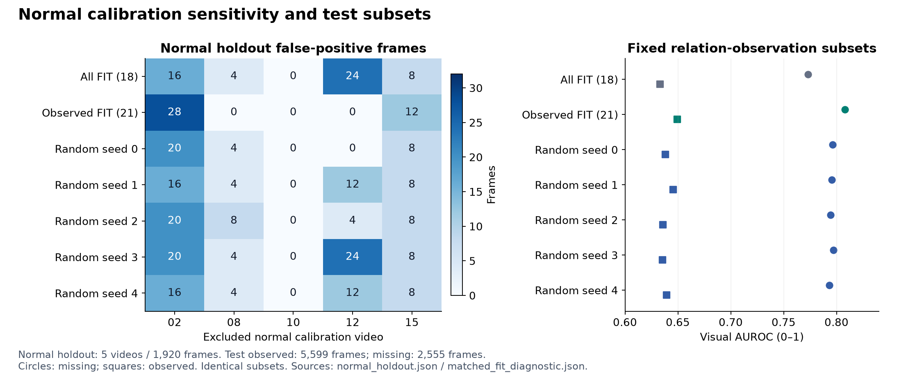

# 실험 22 — 같은 표본 수의 무작위 FIT 대조

## 이번 실험 결과

**표본 수·bank 지원을 맞추어도 관측 FIT의 Visual ranking과 낮은 오탐은 다섯 무작위 구성보다 유리했다. 그러나 Combined AUROC는 무작위 범위 안이고 탐지 구간 수는 더 적었다.** 정상 holdout에서도 관측 선택의 일관된 우위는 없었다. 관측 FIT를 종합적인 승자로 채택하거나 특정 무작위 seed를 고르지 않는다.

### 질문과 실행 범위

실험 21의 A(관측 FIT 제한)는 정상 학습 표본 수·구성과 phase 0 bank 지원을 동시에 바꾸었다. 이번에는 같은 bank별 표본 수만큼 전체 정상 FIT에서 균등·비복원 추출한 대조를 추가했다. 전체 FIT(18), 관측 FIT(21_fit), 사전 고정 무작위 seed 0–4를 전부 비교했다. **B(미관측 시 명시적 pooled 전환)는 모두 꺼져 있다.** 최소 지원 미달에 의한 기존 pooled fallback은 계속 작동한다.

R04 FIT 20개 / calibration 5개 / 테스트 19개를 유지했다. 테스트는 8,154프레임(정상 3,576 / 이상 4,578), 정상 calibration은 1,920프레임(482 samples)이다. seed 42의 특징·관계 phase, 객체/track·관측 mask·공정 모델을 재사용했고 새 선택 seed만 0–4다. VLM/검출기/CLIP 재추론은 없으며 사용자가 지정한 로컬 Qwen 설정도 유지한다. sampling 4프레임/causal hold, PCA 95%·최대 rank 32·최소 10개, 역할 전체 CDF, max 결합, 정상 q99/strict `>`를 고정했다. 실행 시간·운용 지연은 새로 측정하지 않았다.

정상 실행 전 입력·코드·선택 규칙을 고정했고, 정상 holdout/전체 보정 검사를 마친 뒤 다섯 새 구성을 각각 한 번 평가했다. 재현 검증의 반복 계산은 모델 선택에 사용하지 않았다. 테스트 라벨은 평가용이며 FIT 표본 선택·rank·임계값에 쓰지 않았다.

### 표본·지원·rank 통제

각 역할×phase 안에서 정상 FIT 시퀀스/배열 순서로 관측을 모았다. 관계 관측 mask는 **목표 개수**에만 쓰고, random 선택에는 특정 관측의 mask 값을 사용하지 않았다. bank key를 정렬해 난수 추출하고 선택 인덱스도 정렬했다. 같은 프레임에 여러 crop이 있으면 각각 별도 관측이며 역할별로 따로 추출한다. 모든 pooled bank는 전체 정상 FIT를 한 번씩 사용한다.

| 역할×phase | 전체 FIT 모집단 | 관측 FIT = 각 무작위 선택 수 | 관측 rank | 무작위 rank 범위 |
|---|---:|---:|---:|---:|
| -1 × 0 | 126 | 3 | 미지원 | 미지원 |
| -1 × 1 | 1045 | 698 | 32 | 32–32 |
| -1 × 2 | 313 | 94 | 30 | 31–32 |
| -1 × 3 | 476 | 328 | 32 | 32–32 |
| 0 × 0 | 13 | 3 | 미지원 | 미지원 |
| 0 × 1 | 1309 | 838 | 32 | 32–32 |
| 0 × 2 | 459 | 139 | 32 | 32–32 |
| 0 × 3 | 681 | 475 | 32 | 32–32 |
| 1 × 0 | 128 | 3 | 미지원 | 미지원 |
| 1 × 1 | 1134 | 790 | 32 | 32–32 |
| 1 × 2 | 361 | 137 | 31 | 29–32 |
| 1 × 3 | 539 | 389 | 32 | 32–32 |
| 2 × 0 | 126 | 3 | 미지원 | 미지원 |
| 2 × 1 | 1045 | 698 | 32 | 32–32 |
| 2 × 2 | 313 | 94 | 32 | 32–32 |
| 2 × 3 | 476 | 328 | 32 | 32–32 |

역할 −1은 전체 frame, 0/1/2는 기존 객체 역할이다. 관측 FIT와 다섯 무작위 구성은 12개 지원 phase bank + 4개 pooled bank가 동일하다. phase 0의 목표 3개는 최소 10개를 충족하지 못한다. 모든 pooled PCA와 process 점수는 정확히 보존됐다. **95% 규칙으로 선택되는 PCA rank까지 같지는 않았다.** global phase 2와 role 1 phase 2에 남은 차이가 다음 실험의 근거다.

테스트 global 2,047 samples에서 관측 FIT/무작위 모두 관측 phase bank 1,395, 미관측 phase bank 471, 관측 지원 부족 pooled 11, 미관측 지원 부족 pooled 170개다. 실제 객체별 경로도 동일함을 검사했다. 표본 선택 인덱스와 원본 feature hash는 로컬에, 공개 결과에는 선택 hash·모집단/선택 개수·rank를 기록했다.

### 정상 영상 holdout

정상 FIT는 고정하고 정상 calibration 영상 하나씩을 제외해 나머지 4개로 역할 CDF/공정 reference/q99를 적합했다. 제외 영상은 모든 reference/q99에서 빠졌다. 값은 false-positive **프레임 수**다.

| 제외 정상 영상 | 전체 FIT | 관측 FIT | s0 | s1 | s2 | s3 | s4 |
|---|---:|---:|---:|---:|---:|---:|---:|
| 02 | 16 | 28 | 20 | 16 | 20 | 20 | 16 |
| 08 | 4 | 0 | 4 | 4 | 8 | 4 | 4 |
| 10 | 0 | 0 | 0 | 0 | 0 | 0 | 0 |
| 12 | 24 | 0 | 0 | 12 | 4 | 24 | 12 |
| 15 | 8 | 12 | 8 | 8 | 8 | 8 | 8 |
| 합계 / 1,920프레임 | 52 | 40 | 32 | 40 | 40 | 56 | 40 |

관측 FIT의 40개(2.08%)는 무작위 범위 32–56개(1.67–2.92%), 평균 41.6개 안이다. 관측 FIT는 영상 12에서 모든 random보다 같거나 적지만 영상 02·15에서는 모든 random보다 많다. 정상 오탐 합계나 평균만으로 관측 선택의 우위를 주장하지 않는다. 정상 fold q99의 전체 범위는 0.996732–0.998741이다.

전체 정상 보정에서는 모든 구성 finite/[0,1], 점수 1 포화 0개, 482 samples 중 경보 4개로 경보 가능성을 통과했다. s3의 q99는 **0.9972375690607734**, 나머지는 **0.997457627118644**다. 각 구성에서 정상 CDF/q99를 다시 적합한 비교이며 동일 테스트 오탐률로 맞추지 않았다.

### R04 개발 테스트

| 구성 | Visual AUROC / AP | Combined AUROC / AP | 정상 오탐률 (FP) | 이상 recall (TP) | 탐지 구간 / 26 |
|---|---:|---:|---:|---:|---:|
| 18: 전체 FIT | 0.6806 / 0.6688 | 0.6655 / 0.6572 | 10.60% (379) | 14.64% (670) | 15 |
| 21_fit: 관측 FIT | 0.7001 / 0.6970 | 0.6765 / 0.6753 | 8.64% (309) | 13.74% (629) | 13 |
| 22_s0: 무작위 0 | 0.6912 / 0.6835 | 0.6737 / 0.6672 | 9.31% (333) | 13.65% (625) | 17 |
| 22_s1: 무작위 1 | 0.6955 / 0.6866 | 0.6781 / 0.6709 | 9.87% (353) | 13.54% (620) | 16 |
| 22_s2: 무작위 2 | 0.6889 / 0.6829 | 0.6722 / 0.6679 | 10.88% (389) | 17.15% (785) | 18 |
| 22_s3: 무작위 3 | 0.6894 / 0.6814 | 0.6738 / 0.6670 | 9.20% (329) | 12.84% (588) | 16 |
| 22_s4: 무작위 4 | 0.6908 / 0.6846 | 0.6749 / 0.6694 | 8.86% (317) | 12.84% (588) | 17 |


무작위 Combined AUROC 평균은 0.674554, 범위는 0.672190–0.678088이다. 관측 FIT 0.676498은 범위 안이며 s1보다 낮다. 반면 관측 FIT의 Visual AUROC 0.700129는 무작위 평균 0.691160/범위 0.688919–0.695486보다 높고, Combined AP 0.675283도 무작위 0.667009–0.670904보다 높다. 정상 오탐 309개는 무작위 317–389개보다 적지만, 탐지 구간 13개는 모든 무작위 구성의 16–18개보다 적다.

무작위 다섯 구성도 전체 FIT의 Combined AUROC 0.665482보다 높았다. 따라서 실험 21의 개선 전체를 관측 정보의 의미적 품질로 돌릴 수 없다. 표본 감소·지원 부족 bank 제거가 포함된 변화만으로도 일부 차이가 나타났다. 다섯 seed의 평균·범위는 동일 데이터에서의 표본 선택 민감도이며 신뢰구간·유의성·독립 반복 실험이 아니다.

### 고정 관측 subset

미관측 subset은 정상 1,334 / 이상 1,221프레임, 관측 subset은 정상 2,242 / 이상 3,357프레임이며 모든 구성에서 동일하다.

| 구성 | 미관측 Combined AUROC / AP | 관측 Combined AUROC / AP | 미관측 정상 / 이상 경보 | 관측 정상 / 이상 경보 |
|---|---:|---:|---:|---:|
| 18: 전체 FIT | 0.7730 / 0.6755 | 0.6083 / 0.6525 | 120 / 258 | 259 / 412 |
| 21_fit: 관측 FIT | 0.8078 / 0.7300 | 0.6086 / 0.6570 | 84 / 283 | 225 / 346 |
| 22_s0: 무작위 0 | 0.7962 / 0.7085 | 0.6088 / 0.6539 | 88 / 267 | 245 / 358 |
| 22_s1: 무작위 1 | 0.7956 / 0.7055 | 0.6161 / 0.6603 | 100 / 258 | 253 / 362 |
| 22_s2: 무작위 2 | 0.7942 / 0.7074 | 0.6083 / 0.6557 | 108 / 315 | 281 / 470 |
| 22_s3: 무작위 3 | 0.7971 / 0.7070 | 0.6092 / 0.6540 | 92 / 254 | 237 / 334 |
| 22_s4: 무작위 4 | 0.7932 / 0.7055 | 0.6129 / 0.6589 | 100 / 230 | 217 / 358 |

관측 FIT의 미관측 Combined AUROC 0.8078은 random 0.7932–0.7971보다 높지만, 관측 subset의 Combined AUROC 0.6086은 random 0.6083–0.6161 안이다. Visual AUROC는 관측 subset에서도 관측 FIT 0.6494 대 random 0.6354–0.6456으로 높았다. 외형 차이가 결합 점수에 그대로 전달되는 것은 아니다. 전체/관측별 AP와 branch별 수치는 기계 판독 결과에 포함했다.



전이·체류·process 점수 배열은 일곱 구성 모두 같다. Process AUROC/AP는 0.5688/0.5941, 체류 유효 프레임은 417/8,154(5.11%)다. 어떤 의미적 검출·phase 정확도가 좋아졌는지는 측정하지 않았다.

### 구간 탐지와 지연

| 구성 | 탐지 / 미탐 | 탐지 구간만의 지연 중앙값 (프레임) | onset 이전 경보가 이미 켜진 탐지 |
|---|---:|---:|---:|
| 18: 전체 FIT | 15 / 11 | 32 | 2 |
| 21_fit: 관측 FIT | 13 / 13 | 75 | 2 |
| 22_s0: 무작위 0 | 17 / 9 | 65 | 2 |
| 22_s1: 무작위 1 | 16 / 10 | 67.5 | 2 |
| 22_s2: 무작위 2 | 18 / 8 | 41.5 | 2 |
| 22_s3: 무작위 3 | 16 / 10 | 70 | 2 |
| 22_s4: 무작위 4 | 17 / 9 | 65 | 2 |

무작위 다섯 구성은 관측 FIT가 탐지한 13개 구간을 모두 유지했고 각각 4/3/5/3/4개를 추가했다. 다섯 구성 공통 추가 구간은 R04_04 `[261,379)`, R04_11 `[170,240)`, R04_15 `[54,376)`이다. 세부 추가 구간과 모든 26개 구간은 JSON에 공개했다. 이는 정상 오탐 증가를 동반한 결과이며 관측 FIT에 대한 일방적 우위가 아니다.

지연은 탐지된 구간에만 조건부로 계산했고 미탐은 제외된 채 개수로 남긴다. 탐지 집합이 다르므로 중앙값을 전체 속도 순위로 해석하지 않는다. onset 이전 경보가 이미 켜진 경우를 표시했으며 point adjustment나 FPS 가정은 없다.

## 결과의 의의

표본 수·bank 지원·fallback 경로를 맞춘 대조로 관측 FIT 선택의 기여를 더 좁혀 설명할 수 있게 됐다. 전체 FIT 대비 개선에는 관측 의미와 무관한 표본 감소/지원 변화도 포함되며, 관측 선택이 더 나은 외형 ranking·낮은 오탐을 보이는 동시에 특정 이상 구간을 놓치는 상충도 확인했다.

이는 새 파이프라인의 정상 학습 표본 선택을 설계·검증하는 근거다. 실제 객체 의미 품질이 좋아졌다는 증명, 통계적 유의성, novelty의 확정은 아니다. 논문 주제는 계속 넓게 두고 구성 요소별 재현 가능한 근거를 축적한다.

## 보완할 점

- 관측 FIT는 정상 holdout에서 일관되게 우수하지 않고 테스트 구간 탐지 수는 모든 random보다 적다. 높은 Visual AUROC만으로 채택하기 어렵다.
- 두 phase bank의 rank가 달라 같은 표본 수가 곧 같은 모델 용량을 뜻하지 않는다. 관측 표본의 영상별/시간적 구성 차이도 남는다.
- B를 끈 조건에 한정된다. 역할 CDF 재적합과 process max 결합의 상호작용 때문에 raw 외형 개선이 최종 경보에 그대로 전달되지 않는다.
- 5개 seed는 같은 영상의 상관된 특징을 재선택한 것이다. 다른 seed·다른 장면에 대한 보장이나 bootstrap 신뢰구간이 아니다.
- 반복 개발 중인 R04 단일 장면이며 객체/semantic phase GT·독립 녹화 그룹·FPS·실제 timestamp가 없다. 기존 역할 오검출과 체류 가용성 한계도 유지된다. 다른 장면의 라벨 불일치 11개는 정렬 미확정으로 남고 임의 보정하지 않았다.

## 다음 Recommended improvements — 추천순 3개

| 추천순 | 개선 후보와 변경 내용 | 이번 결과의 근거 | 검증 기준 및 주의점 |
|---|---|---|---|
| 1 | **표본 수와 PCA rank를 함께 맞춘 관측 FIT 대조**: 같은 표본·bank별 공통 rank로 비교 | Visual AUROC/AP·오탐 차이는 무작위 범위 밖에 있지만 phase 2의 PCA rank가 다름 | 정상 FIT rank만으로 공통 값을 고정하고 여섯 구성 모두 정상 holdout·전체/관측별 점수·구간 탐지를 비교. 최고 seed 선택 금지, capacity 통제 후에도 의미 정확도/novelty로 해석하지 않음 |
| 2 | **미관측 지속 길이에 따른 인과적 fallback**: 짧은 누락과 긴 누락을 구분 | 관측 FIT는 미관측 AUROC가 높지만, 미관측 이상 경보 283개·구간 탐지 13개로 지표 간 차이가 남음 | 정상 FIT 누락 분포로만 규칙을 정하고 길이별 오탐/미탐·경계 지연과 CDF 간접 효과를 보고. 미래 프레임·테스트 길이를 gate 결정에 사용하지 않음 |
| 3 | **정상 영상의 객체 역할·관계 관측 감사 확대**: 부품과 혼동 객체의 추가 사례 점검 | 모든 대조가 같은 검출/관계 mask에 의존하고 체류 유효 비율은 계속 5.11% | 별도 정상 사례에서 역할 오류·누락을 검증하고 보조 주석 범위/비용 공개. 관측 mask나 5개 seed를 정답/독립 검증으로 간주하지 않음 |

다음은 1순위만 구체화한 [실험 23 계획](EXPERIMENT23_PLAN.md)이다. 세 후보를 확정된 세 실험으로 취급하지 않고 다음 결과에서 다시 우선순위를 정한다.

## 검증과 재현

**72개 테스트 통과.** 표본 개수/비복원/seed 재현, 같은 count의 mask 교체 시 선택 불변, 지원 미달·빈 선택, pooled 단일 삽입, 잘못된 설정 거부를 검증했다. 실제 44개 특징 파일 hash와 정상 FIT 모집단/선택 인덱스/PCA를 독립적으로 재구성했다. 35개 정상 holdout 구성의 reference/q99/예측과 테스트 133개 예측(19영상×7구성)의 객체·프레임 점수/원본 라벨/지표를 재현했다. 기존 18/21_fit도 정확히 재현됐다. 그래프는 저장 JSON/CSV로 생성하고 렌더링을 확인했다.

```bash
export PYTHONPATH=src
export MPLCONFIGDIR=.cache/matplotlib
.venv/bin/python scripts/prepare_matched_fit.py
.venv/bin/python scripts/audit_matched_fit.py
.venv/bin/python scripts/evaluate_route_holdout.py --experiments 18 21_fit 22_s0 22_s1 22_s2 22_s3 22_s4 --output-experiment 22 --feature-source-experiment 22
.venv/bin/python scripts/prepare_matched_fit.py --pre-test
for seed in 0 1 2 3 4; do
  .venv/bin/python scripts/evaluate_baseline.py --data-root /path/to/IPAD_dataset --config "configs/experiment22_s${seed}.json"
done
.venv/bin/python scripts/validate_matched_fit.py
.venv/bin/python scripts/plot_matched_fit.py
.venv/bin/python -m pytest -q
```

사전 hash는 원본 실행 provenance다. [실험 22 계획](EXPERIMENT22_PLAN.md)의 작성 당시 상태도 동결해 보존하며 완료 상태는 이 보고서/README를 따른다. 과거 실험의 hash는 해당 Git commit 기준이고 이후 코드 변경에 의해 달라질 수 있다. 다른 환경 재실행 시 입력 캐시/원본 라벨 경로와 새 실행 기록을 준비해야 한다. 원본 영상·특징·가중치·로그는 업로드하지 않는다.

[전체 비교 CSV](../results/experiment22/comparison.csv) · [모든 지표·subset·구간](../results/experiment22/matched_fit_diagnostic.json) · [정상 bank/선택 감사](../results/experiment22/normal_audit.json) · [정상 holdout](../results/experiment22/normal_holdout.json) · [사전 protocol](../results/experiment22/pre_normal_protocol.json) · [테스트 전 고정](../results/experiment22/pre_test_checkpoint.json) · [검증](../results/experiment22/validation.json)

- seed 0: [설정](../configs/experiment22_s0.json) · [지표](../results/experiment22_s0/metrics.json) · [영상별 결과](../results/experiment22_s0/per_sequence.csv)
- seed 1: [설정](../configs/experiment22_s1.json) · [지표](../results/experiment22_s1/metrics.json) · [영상별 결과](../results/experiment22_s1/per_sequence.csv)
- seed 2: [설정](../configs/experiment22_s2.json) · [지표](../results/experiment22_s2/metrics.json) · [영상별 결과](../results/experiment22_s2/per_sequence.csv)
- seed 3: [설정](../configs/experiment22_s3.json) · [지표](../results/experiment22_s3/metrics.json) · [영상별 결과](../results/experiment22_s3/per_sequence.csv)
- seed 4: [설정](../configs/experiment22_s4.json) · [지표](../results/experiment22_s4/metrics.json) · [영상별 결과](../results/experiment22_s4/per_sequence.csv)
