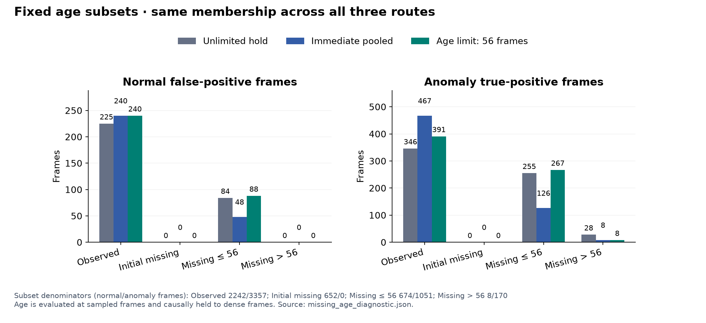

# 실험 24 — 관측 누락 지속 길이에 따른 인과적 fallback

## 이번 실험 결과

**정상 FIT로 정한 56프레임 유지 한도는 테스트 오탐을 늘리고 ranking을 낮췄다.** 무기한 유지 대비 Combined AUROC 0.6765→0.6735, 정상 오탐 309→328프레임, 탐지 구간 13→13개였다. 긴 누락에서 이상 경보가 사라지는 직접 효과와, 정상 CDF 재적합으로 다른 구간의 경보가 추가되는 간접 효과를 확인했다. 이번 시간 제한을 개선된 기본 구성으로 채택하지 않는다.

### 질문과 구현

실험 23의 관측 FIT 기준은 관계가 끊겨도 기존 phase를 계속 유지했다. 이번에는 짧은 누락은 유지하고 긴 누락은 pooled PCA로 전환하는 규칙을 추가했다. 23_obs의 FIT 표본·공통 rank·모든 PCA bank를 고정하고 세 경로를 비교했다.

| 구성 | 외형 추론 경로 |
|---|---|
| 23_obs | 원본 초기/유지 phase 사용. phase bank 미지원이면 기존 pooled fallback |
| 24_pool | 관측 시 phase, 모든 미관측에서 즉시 pooled |
| 24_age | 관측 시 phase, 초기 미관측은 pooled, 마지막 유효 관측 이후 age≤56이면 유지 phase, age>56이면 pooled |

정상 FIT에서 관측으로 양쪽이 닫힌 누락 `[s,e)`만 사용했다. 길이는 `source_frame_index[e] - source_frame_index[s]`, 구간 단위 90분위수(`higher`)를 τ로 정했다. 추론 나이는 **현재 원본 인덱스 − 마지막 유효 관측 인덱스**이며 재관측 때 0으로 재설정한다. 시퀀스 사이에 상태를 전달하지 않고 미래 재관측·전체 영상 길이를 쓰지 않는다. 기준과 코드/입력 hash는 정상 calibration 전에 고정했다.

| 정상 FIT 누락 통계 | 값 |
|---|---:|
| 완결 구간 / 해당 FIT 영상 | 139개 / 20개 |
| 길이 최소 / 중앙값 / 90분위수 / 최대 | 4 / 8 / **56** / 128프레임 |
| 제외한 경계 구간 | 23개: 시작 경계 17 / 끝 경계 6 |
| 경계 구간 길이 기록 | 관측 sample 수와 span 하한. 완결 길이로 사용하지 않음 |

한도를 여러 개 sweep하거나 테스트 결과로 변경하지 않았다. 정상 FIT의 완결 구간을 확인하는 학습 단계와 미래를 쓰지 않는 추론 단계를 구분했다. FPS가 없어 56프레임을 초 단위로 환산하지 않는다.

### 고정 조건과 범위

R04 FIT 20개 / calibration 5개 / 테스트 19개, seed 42의 기존 관계 모델, 4프레임 sampling/causal hold를 유지했다. 테스트는 8,154프레임(정상 3,576 / 이상 4,578), calibration은 1,920프레임(482 samples)이다. PCA는 실험 23_obs의 관측 FIT/common-rank 모델과 정확히 같고 모든 pooled bank·전이/체류도 보존했다. process score와 기존 phase/mask 배열은 변경하지 않았다.

VLM/검출기/CLIP 재추론은 없고 로컬 Qwen 설정도 유지했다. 새로 바뀐 것은 외형 경로와 그 경로로 계산한 정상 역할 전체 CDF다. 모든 구성에서 q99/strict `>`·max 결합을 유지하고 CDF/q99를 각각 적합했다. 실행 비용·운용 지연은 새로 측정하지 않았다.

### 정상 영상 holdout과 보정

FIT의 τ=56은 모든 fold에서 고정했다. 제외 정상 영상은 외형/공정 reference와 q99에 들어가지 않도록 검사했다.

| 제외 정상 영상 | 무기한 유지 | 즉시 pooled | 56프레임 제한 |
|---|---:|---:|---:|
| 02 | 28 | 16 | 28 |
| 08 | 0 | 8 | 0 |
| 10 | 0 | 0 | 0 |
| 12 | 0 | 16 | 4 |
| 15 | 12 | 4 | 8 |
| 합계 / 1,920프레임 | 40 | 44 | 40 |

시간 제한의 합계는 기준과 같은 40개(2.08%)지만 영상 12에서 +4, 15에서 −4프레임으로 경보 위치는 달라졌다. 즉시 pooled는 44개(2.29%)로 더 많다. 동일 정상 합계를 일반화 개선으로 해석하지 않는다.

전체 정상 calibration에서는 세 구성 모두 finite/[0,1], 점수 1 포화 0개, 482 samples 중 경보 4개였다. q99는 모두 **0.997457627118644**로 결과적으로 같았으며 이를 강제하거나 테스트 FPR을 맞추지 않았다. 기준은 긴 누락 정상 구간에서 4프레임을 경보했고 시간 제한은 0으로 줄였지만, 짧은 누락에서 8→12프레임으로 늘었다.

### R04 개발 테스트

| 구성 | Visual AUROC / AP | Combined AUROC / AP | 정상 오탐률 (FP) | 이상 recall (TP) | 탐지 구간 / 26 |
|---|---:|---:|---:|---:|---:|
| 23_obs: 무기한 유지 | 0.7001 / 0.6971 | 0.6765 / 0.6753 | 8.64% (309) | 13.74% (629) | 13 |
| 24_pool: 즉시 pooled | 0.6971 / 0.6940 | 0.6792 / 0.6768 | 8.05% (288) | 13.13% (601) | 14 |
| 24_age: 56프레임 제한 | 0.6966 / 0.6934 | 0.6735 / 0.6725 | 9.17% (328) | 14.55% (666) | 13 |


24_age는 기준 대비 Combined AUROC −0.003038, 정상 오탐 +19, 이상 경보 +37프레임이었다. 정상 오탐률은 8.64→9.17%, 프레임 recall은 13.74→14.55%지만 탐지 구간은 같은 13개다. frame recall 상승만으로 개선을 주장하지 않는다.

24_pool은 기준 대비 Combined AUROC +0.002665, 정상 오탐 −21, 이상 경보 −28프레임, 탐지 구간 +1개였다. 다만 정상 holdout이 나빠졌고 잃는 이상 구간도 있어 종합적인 승자로 채택하지 않는다.

### 누락 나이별 고정 subset

나이는 sampled frame에서 계산하고 다음 sample까지 인과적으로 유지해 dense 평가와 맞췄다. 아래 subset의 구성원은 세 모델에서 완전히 같다.

| 고정 subset | 정상 / 이상 프레임 | 무기한 정상 / 이상 경보 | 즉시 pooled 정상 / 이상 경보 | 시간 제한 정상 / 이상 경보 |
|---|---:|---:|---:|---:|
| 관측 | 2242 / 3357 | 225 / 346 | 240 / 467 | 240 / 391 |
| 초기 미관측 | 652 / 0 | 0 / 0 | 0 / 0 | 0 / 0 |
| 0 < age ≤ 56 | 674 / 1051 | 84 / 255 | 48 / 126 | 88 / 267 |
| age > 56 | 8 / 170 | 0 / 28 | 0 / 8 | 0 / 8 |



**긴 누락 subset의 정상은 8프레임뿐이고 이상은 170프레임이다.** 여기서 pooled 전환은 정상 오탐을 줄이지 못하고 이상 경보만 28→8프레임으로 줄였다. 이 subset의 높은 AP는 이상 비율 95.51%의 영향을 받으므로 강한 탐지 성능의 근거로 쓰지 않는다. 초기 미관측 652프레임은 전부 정상이라 AUROC/AP는 정의되지 않으며 JSON에 null로 남겼다.

전체 2,047개 global feature sample의 실제 bank 경로는 다음과 같다. crop별 관측 집계도 JSON에 공개했다.

| 고정 subset | 무기한 phase / pooled | 즉시 전환 phase / pooled | 시간 제한 phase / pooled |
|---|---:|---:|---:|
| 관측 | 1395 / 11 | 1395 / 11 | 1395 / 11 |
| 초기 미관측 | 0 / 163 | 0 / 163 | 0 / 163 |
| 0 < age ≤ 56 | 426 / 7 | 0 / 433 | 426 / 7 |
| age > 56 | 45 / 0 | 0 / 45 | 0 / 45 |

초기 미관측은 기존 phase 0 bank의 지원 부족 때문에 기준에서도 이미 pooled다. 따라서 시간 제한이 새로 전환한 global sample은 긴 누락의 **45개**다. 정상 calibration에서는 같은 전환이 11 samples/44프레임에 적용됐다.

### 직접 경로 변화와 CDF 간접 효과

24_age의 관측·짧은 누락은 기준과 같은 bank/raw residual을 사용한다. 그러나 역할 전체 CDF를 다시 적합하면서 다음 경보가 추가됐다.

| 23_obs→24_age | 정상 경보 순변화 | 이상 경보 순변화 | 원인 구분 |
|---|---:|---:|---|
| 관측 | +15 | +45 | raw residual·공정·q99 동일, CDF 변화 |
| 초기 미관측 | 0 | 0 | 기존에도 pooled |
| 0<age≤56 | +4 | +12 | raw residual·공정·q99 동일, CDF 변화 |
| age>56 | 0 | −20 | bank 전환과 CDF 변화가 함께 포함 |
| 합계 | **+19** | **+37** | 직접/간접 효과의 합 |

q99 값도 같고 raw를 독립적으로 비교했으므로, 경로가 그대로인 두 subset의 추가 경보는 CDF의 간접 효과로 좁혀 설명할 수 있다. 긴 누락의 −20개는 bank와 CDF 변화가 혼재해 bank 전환만의 효과라고 단정하지 않는다. 즉시 pooled에서도 관측 raw는 같은데 관측 정상/이상 경보가 +15/+121개다.

Process AUROC/AP는 세 구성 모두 0.5688/0.5941, 체류 유효 비율은 417/8,154(5.11%)로 같다. 이 개선은 잘못된 역할·phase 입력이나 공정 분기의 정확도를 교정하지 않았다.

### 구간 탐지와 지연

| 구성 | 탐지 / 미탐 | 탐지된 구간의 지연 중앙값 (프레임) | onset 이전 경보 활성 탐지 |
|---|---:|---:|---:|
| 무기한 유지 | 13 / 13 | 75 | 2 |
| 즉시 pooled | 14 / 12 | 56.5 | 3 |
| 56프레임 제한 | 13 / 13 | 75 | 3 |

시간 제한은 기준과 같은 13개 구간을 탐지해 얻거나 잃은 구간이 없다. 즉시 pooled는 R04_11 `[170,240)`, R04_15 `[54,376)`를 얻고 R04_09 `[128,334)`를 잃었다. 24_pool→24_age에서는 이 변화가 반대다.

지연은 탐지된 구간만의 조건부 값이다. 미탐은 개수로 남기고 onset 이전 경보를 별도 표시했다. 같은 13개 구간/같은 지연 중앙값이어도 개별 경보 양상이 모두 같다는 의미는 아니다. 모든 구간 상세를 JSON에 공개하며 point adjustment·FPS 가정은 없다.

## 결과의 의의

정상 FIT에서 얻은 관측 누락 길이를 인과적인 경로 제어에 연결했고, 미래 정보를 쓰지 않는 동작을 검증했다. 그러나 길이 기반 전환이 유리할 것이라는 가설은 이번 고정 규칙에서 지지되지 않았다.

실패의 범위를 경로 변화와 정상 reference 혼합으로 나눠 확인한 점이 다음 설계의 근거다. 같은 외형 모델을 사용해도 gate가 정상 CDF를 바꾸면 경로가 그대로인 프레임까지 영향을 받는다. 신규 파이프라인의 구성 원리를 명확히 하는 결과이며, 성능 상승이나 novelty의 확정으로 포장하지 않는다.

## 보완할 점

- 56프레임 제한은 정상 holdout 합계를 유지했지만 테스트 오탐·ranking을 악화시켰다. 한도를 테스트 결과에 맞춰 바꾸지 않는다.
- 경로별 정상 혼합 변화가 전체 역할 CDF에 전파된다. 누락 처리의 효과를 해당 구간 변화만으로 설명하기 어렵다.
- 정상 FIT의 긴 누락과 테스트의 긴 누락은 구성·이상 비율이 다르다. 테스트 긴 누락 subset의 정상 8프레임으로 안정적인 정상 오탐 결론을 내릴 수 없다.
- 구간 90분위수는 사전 고정된 하나의 규칙이다. 최적 한도, 다른 장면 일반화, 실제 가림/오검출 원인과의 관계는 미검증이다.
- 역할/semantic phase GT, 독립 녹화 그룹, FPS/실제 timestamp가 없고 R04를 반복 개발에 사용했다. 다른 장면의 라벨 불일치 11개는 정렬 미확정으로 남고 원본을 임의 수정하지 않는다.

## 다음 Recommended improvements — 추천순 3개

| 추천순 | 개선 후보와 변경 내용 | 이번 결과의 근거 | 검증 기준 및 주의점 |
|---|---|---|---|
| 1 | **두 외형 경로를 모두 계산하는 고정 정상 CDF**: 정상 calibration을 phase 요청/pooled 요청 양쪽으로 통과시켜 gate와 무관한 reference를 만듦 | 24_age에서 raw가 같은 관측·짧은 누락 구간에 정상 19/이상 57 경보 추가. q99도 같아 CDF 혼합의 간접 효과임 | 같은 요청 경로의 보정 점수 불변과 holdout 비누출 확인, 전체 지표·포화·임계값 효과 공개. 실험 20의 부분 표본 route CDF와 구분하고 개선을 보장하지 않음 |
| 2 | **관측 근거를 반영한 공정 점수 신뢰도**: 불확실한 phase에서 분기 기여를 구분 | 모든 구성에서 process 점수 동일, 관측 subset process AUROC 0.4812, 전체 Combined AUROC가 Visual보다 낮음 | 정상 지원 정보로만 규칙을 정하고 독자 TP/FP·정상 보정 확인. 테스트 라벨로 분기 가중치 선택 금지 |
| 3 | **정상 역할·누락 원인 감사 확대**: 실제 부품, 혼동 객체, 가림의 사례를 구분 | 누락 길이만으로 pooled 전환의 이점을 얻지 못했고 역할 오류는 그대로임 | 별도 정상 사례/보조 주석의 범위와 비용 공개. 긴 누락을 이상 정답으로 간주하거나 관측률을 semantic 정확도로 대체하지 않음 |

다음은 1순위만 구체화한 [실험 25 계획](EXPERIMENT25_PLAN.md)이다. 같은 정상 관측을 두 외형 요청 경로에 모두 통과시켜 gate에 따라 reference 모집단이 바뀌지 않게 한다. 실험 20의 실제 bank 경로별 부분 표본 CDF와 구분해 비교하며, 개선/포화 해소를 보장하지 않는다.

## 검증과 재현

**92개 테스트 통과.** 완결·경계 구간, 불규칙 원본 인덱스, τ 경계 포함, 재관측/시퀀스 reset, 미지원 phase fallback, 미래 prefix 불변, 잘못된 mask/시간 입력과 가용성 실패를 검사했다. 실제 정상 구간 metadata와 τ를 독립적으로 재구성했다. 44개 특징 byte hash·모든 경로의 raw residual 관계·과거 경로의 미래 prefix 불변을 확인했다. 15개 정상 holdout 구성의 reference/q99/예측과 테스트 57개 예측(3×19)의 객체/프레임 점수·원본 라벨·지표를 재현했다. 기존 23_obs도 정확히 재현됐다. 그래프는 JSON/CSV로 생성하고 렌더링을 확인했다.

```bash
export PYTHONPATH=src
export MPLCONFIGDIR=.cache/matplotlib
.venv/bin/python scripts/prepare_missing_age.py
.venv/bin/python scripts/audit_missing_age.py
.venv/bin/python scripts/evaluate_route_holdout.py --experiments 23_obs 24_pool 24_age --output-experiment 24 --feature-source-experiment 24
.venv/bin/python scripts/prepare_missing_age.py --pre-test
for variant in pool age; do
  .venv/bin/python scripts/evaluate_baseline.py --data-root /path/to/IPAD_dataset --config "configs/experiment24_${variant}.json"
done
.venv/bin/python scripts/validate_missing_age.py
.venv/bin/python scripts/plot_missing_age.py
.venv/bin/python -m pytest -q
```

사전 hash는 원본 실행 provenance다. [실험 24 계획](EXPERIMENT24_PLAN.md)의 작성 당시 상태는 동결해 보존하고 완료 상태는 이 보고서/README를 따른다. 다른 환경 재실행에는 입력 캐시/원본 라벨 경로와 새 실행 기록이 필요하다. 원본 영상·특징·가중치·로그는 업로드하지 않는다.

[비교 CSV](../results/experiment24/comparison.csv) · [전체/subset/구간 진단](../results/experiment24/missing_age_diagnostic.json) · [FIT 누락 구간·τ](../results/experiment24/fit_gap_profile.json) · [정상 감사](../results/experiment24/normal_audit.json) · [정상 holdout](../results/experiment24/normal_holdout.json) · [사전 protocol](../results/experiment24/pre_normal_protocol.json) · [테스트 전 기록](../results/experiment24/pre_test_checkpoint.json) · [검증](../results/experiment24/validation.json)

- 24_pool: [설정](../configs/experiment24_pool.json) · [지표](../results/experiment24_pool/metrics.json) · [영상별 결과](../results/experiment24_pool/per_sequence.csv)
- 24_age: [설정](../configs/experiment24_age.json) · [지표](../results/experiment24_age/metrics.json) · [영상별 결과](../results/experiment24_age/per_sequence.csv)
