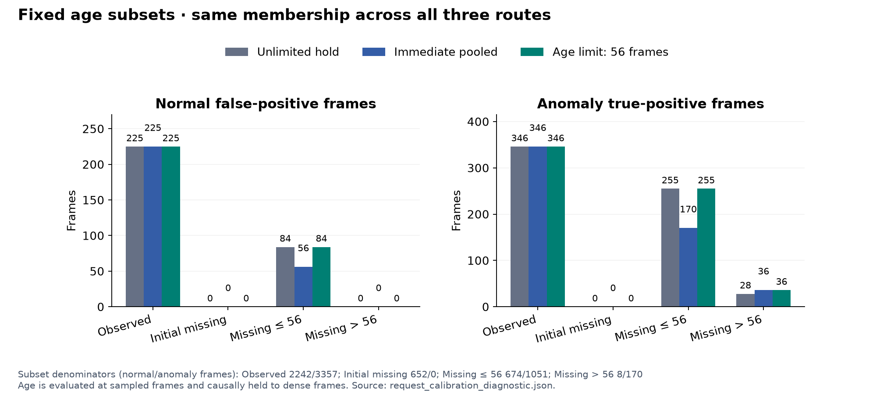

# 실험 25 — gate와 독립적인 두 정상 요청 경로 CDF

## 이번 실험 결과

**같은 외형 요청 경로의 보정 점수를 gate와 독립적으로 만드는 데 성공했지만, 즉시 pooled·시간 제한 구성의 전체 ranking은 낮아졌다.** 관측 상태의 점수/경보는 세 새 구성에서 정확히 같아졌다. 정상 holdout 오탐은 모두 40프레임이며, 이전 즉시 pooled의 44개보다 줄었다. 구조적 일관성 확보와 성능 개선을 구분해 보고하고 종합적인 승자를 선택하지 않는다.

### 질문과 구현

실험 24에서 누락 gate를 바꾸면 역할 CDF의 정상 residual 혼합이 달라져 관측·짧은 누락의 경보까지 바뀌었다. 이번에는 정상 calibration의 **모든 global/crop 특징을 두 경로에 모두 통과**시켰다.

- **phase 요청 기준:** 원본 phase의 bank를 사용하고 지원 부족이면 기존 pooled fallback을 사용한다. 미관측의 초기/유지 phase도 원본 그대로 포함한다.
- **pooled 요청 기준:** 같은 특징을 역할 pooled bank에 직접 통과시킨다.

역할마다 두 reference를 만들고, gate는 해당 요청의 CDF를 선택한다. reference 자체는 gate에 따라 바뀌지 않는다. 같은 정상 관측을 각 reference에 한 번씩 사용하며 표본을 gate별로 나누지 않았다. 실험 20의 실제 bank 경로별 부분 표본 CDF와 다른 설계다.

| 요청 CDF 쌍의 역할 | phase 요청 reference 관측 수 | pooled 요청 reference 관측 수 | 정상 영상 수 |
|---|---:|---:|---:|
| −1: 전체 frame | 482 | 482 | 5 |
| 0 | 590 | 590 | 5 |
| 1 | 543 | 543 | 5 |
| 2 | 482 | 482 | 5 |

총 8개 reference 배열이 세 새 구성에서 정확히 같다. crop 관측 수는 여러 객체 후보 때문에 frame sample 수와 다르다. normal holdout에서는 각각 남은 4개 영상만 사용하며 reference 수는 378–485개다.

25_hold / 25_pool / 25_age의 gate는 각각 23_obs / 24_pool / 24_age와 같다. 정상 FIT 20 / calibration 5 / 테스트 19개, 특징·역할/track·phase/mask·관측 FIT/common-rank PCA·pooled bank·process·τ=56을 고정했다. 테스트 8,154프레임(정상 3,576 / 이상 4,578), calibration 1,920프레임(482 samples), sampling 4프레임/causal hold, max 결합, q99/strict `>`를 유지했다.

VLM/검출기/CLIP 재추론은 없고 로컬 Qwen 설정도 그대로다. 부동소수점 tie가 gate별 batch 구성에 영향받지 않도록 두 경로를 일정한 단위로 계산했다. 이전과 수학적인 PCA residual은 같고 실제 배열은 1e−12 허용 오차로 확인했다. 현재 추론 구현도 두 경로를 모두 계산하므로 연산 증가 가능성이 있으며 **실행 시간/운용 지연은 측정하지 않았다.**

### 정상 영상 holdout과 보정 가능성

두 reference와 process/q99에서 제외 영상을 모두 빼고, FIT의 τ는 고정했다. 값은 false-positive 프레임 수다.

| 제외 정상 영상 | 23_obs | 24_pool | 24_age | 25_hold | 25_pool | 25_age |
|---|---:|---:|---:|---:|---:|---:|
| 02 | 28 | 16 | 28 | 28 | 16 | 28 |
| 08 | 0 | 8 | 0 | 0 | 0 | 0 |
| 10 | 0 | 0 | 0 | 0 | 0 | 0 |
| 12 | 0 | 16 | 4 | 0 | 16 | 4 |
| 15 | 12 | 4 | 8 | 12 | 8 | 8 |
| 합계 / 1,920프레임 | 40 | 44 | 40 | 40 | 40 | 40 |

세 새 구성의 합계는 모두 40개(2.08%)지만 영상별 위치는 같지 않다. 25_pool은 24_pool 대비 영상 08에서 8개 감소하고 영상 15에서 4개 증가했다. 정상 합계 개선만으로 일반적인 우위를 주장하지 않는다.

전체 정상 calibration에서 여섯 기존/새 구성 모두 finite/[0,1], 점수 1 포화 0개, 482 samples 중 경보 4개다. 각 gate의 정상 점수로 적합한 q99는 다음과 같다.

| 구성 | 정상 q99 |
|---|---:|
| 기존 세 구성·25_hold | 0.997457627118644 |
| 25_pool | 0.9968879668049793 |
| 25_age | 0.9972375690607734 |

CDF가 같아도 gate가 만드는 최종 정상 점수 분포가 다르므로 q99까지 같아야 하는 것은 아니다. 임계값을 맞추거나 테스트 FPR로 조정하지 않았다.

### R04 개발 테스트

| 구성 | Visual AUROC / AP | Combined AUROC / AP | 정상 오탐률 (FP) | 이상 recall (TP) | 탐지 구간 / 26 |
|---|---:|---:|---:|---:|---:|
| 25_hold | 0.7001 / 0.6971 | 0.6765 / 0.6753 | 8.64% (309) | 13.74% (629) | 13 |
| 25_pool | 0.6883 / 0.6861 | 0.6657 / 0.6654 | 7.86% (281) | 12.06% (552) | 14 |
| 25_age | 0.6912 / 0.6903 | 0.6681 / 0.6692 | 8.64% (309) | 13.91% (637) | 13 |


각 경로의 이전 버전과 비교하면 다음과 같다.

| 이전→이번 | Combined AUROC | 정상 FP | 이상 TP | 탐지 구간 |
|---|---:|---:|---:|---:|
| 23_obs→25_hold | 0.6765→0.6765 | 309→309 | 629→629 | 13→13 |
| 24_pool→25_pool | 0.6792→0.6657 | 288→281 | 601→552 | 14→14 |
| 24_age→25_age | 0.6735→0.6681 | 328→309 | 666→637 | 13→13 |

25_hold는 기존 23_obs의 정상·테스트 점수/경보를 **정확히 재현**했다. 25_pool은 이전보다 정상 FP −7/이상 TP −49, 25_age는 FP −19/TP −29프레임이었다. 오탐 감소와 함께 Combined/Visual AUROC·AP도 낮아졌다. 탐지 구간 수는 각각 같지만 25_pool의 탐지 집합은 바뀌었다.

### 같은 요청의 점수 불변성과 누락 subset

실제 44개 특징 파일에서 gate 쌍별 같은 요청의 **44,747개 특징 점수 비교**가 정확히 일치했다. 이 수는 여러 gate 쌍의 비교 건수이며 고유 frame 수가 아니다. 같은 요청을 쓰는 sampled frame의 Visual/Combined score도 정확히 같았다.

| 고정 subset | 정상 / 이상 프레임 | 25_hold 정상 / 이상 경보 | 25_pool 정상 / 이상 경보 | 25_age 정상 / 이상 경보 |
|---|---:|---:|---:|---:|
| 관측 | 2242 / 3357 | 225 / 346 | 225 / 346 | 225 / 346 |
| 초기 미관측 | 652 / 0 | 0 / 0 | 0 / 0 | 0 / 0 |
| 0<age≤56 | 674 / 1051 | 84 / 255 | 56 / 170 | 84 / 255 |
| age>56 | 8 / 170 | 0 / 28 | 0 / 36 | 0 / 36 |



관측 5,599프레임의 점수는 세 새 구성 모두 정확히 같고 정상/이상 경보도 225/346개로 같다. 25_hold와 25_age의 짧은 누락 점수/경보도 같다. 실험 24에서 관측·짧은 누락에 생겼던 추가 경보가 gate 간 CDF 혼합에 의존했음을 분리할 수 있게 됐다.

긴 누락은 정상 8 / 이상 170프레임뿐이다. 여기서 25_pool과 25_age의 경보는 같고 기준 hold 대비 이상 경보 순증가는 8프레임(24개 추가, 16개 제거)이다. 초기 미관측은 전부 정상이라 AUROC/AP는 null이며 세 구성 모두 경보가 없다. 긴 누락의 높은 이상 비율이나 초기 subset의 단일 class를 탐지 성능 근거로 과장하지 않는다.

Process 점수 배열과 AUROC/AP 0.5688/0.5941, 체류 유효 비율 417/8,154(5.11%)는 그대로다. 관측/누락별 Visual·Combined AUROC/AP는 JSON에 공개했다.

### 임계값 효과를 분리한 사후 진단

각 새 모델의 저장 점수를 그대로 두고 자체 q99와 **짝지은 기존 정상 q99**에서 경보를 비교했다. 세 모델 모두 추가/제거 경보가 0개였고 구간 탐지도 같았다. 이번 테스트에서는 q99가 조금 낮아져도 그 사이에 경보를 바꿀 점수가 없었다. 따라서 보고된 경보 차이를 임계값 변화로 설명할 수 없다.

이 계산은 변경된 임계값을 선택하는 새 실험이 아닌 사후 원인 분해다. 주 결과에는 자체 q99를 유지하며 다른 데이터에서도 임계값 차이가 무효라는 뜻은 아니다. [진단 수치](../results/experiment25/threshold_decomposition.json)

### 남은 문제: 같은 bank인데 다른 요청 이름

첫째 CDF는 **phase 요청**을 기준으로 만들기 때문에 지원 부족으로 실제 pooled PCA를 쓴 경우도 첫째 CDF를 받는다. 명시적 pooled 요청은 같은 PCA residual이라도 둘째 CDF를 받는다.

| 새 gate 쌍 | 실제 bank는 같고 요청이 다른 특징 관측 | 보정 점수가 달라진 관측 |
|---|---:|---:|
| hold→pool | 531 | 519 |
| hold→age | 504 | 492 |
| pool→age | 27 | 27 |

global/crop을 합친 특징 관측 수이며 고유 frame 수가 아니다. 초기 미관측의 실제 bank는 모두 pooled지만 hold와 pool/age 사이에 **336프레임의 Combined score**가 달랐다. 경보는 모두 0개지만 전체 ranking에 영향을 줄 수 있다. 같은 요청의 불변성을 확보한 것과 같은 실제 bank의 불변성을 확보한 것은 다르다. 이 남은 설계 문제가 다음 변경의 근거다.

### 구간 탐지와 지연

| 구성 | 탐지 / 미탐 | 탐지 구간만의 지연 중앙값 | onset 이전 경보 활성 탐지 |
|---|---:|---:|---:|
| 25_hold | 13 / 13 | 75프레임 | 2 |
| 25_pool | 14 / 12 | 64.5프레임 | 2 |
| 25_age | 13 / 13 | 75프레임 | 2 |

24_pool→25_pool은 R04_04 `[261,379)`, R04_09 `[128,334)`를 얻고 R04_11 `[170,240)`, R04_15 `[54,376)`를 잃었다. 구간 수가 14개로 같아도 탐지 대상은 바뀌었다. 24_age→25_age는 구간 탐지 집합이 같다.

새 구성끼리는 25_pool이 25_hold/25_age보다 R04_04 `[261,379)` 한 구간을 더 탐지한다. 지연은 탐지된 구간만의 조건부 값이고 미탐을 제외한 속도 순위로 일반화하지 않는다. point adjustment·FPS 가정은 없다.

## 결과의 의의

동일한 정상 관측 전체를 두 외형 경로에 통과시켜, gate 변화가 정상 CDF 자체를 바꾸지 않도록 만들었다. 같은 요청 경로 점수의 불변성을 실데이터에서 확인했고, 이전 혼합 CDF의 간접 효과와 실제 누락 경로의 효과를 분리할 수 있게 됐다.

이는 파이프라인의 구성 요소를 독립적으로 비교할 수 있게 하는 구조 개선이다. 성능 우위는 확인되지 않았고 동일 실제 bank에 대한 보정 불일치가 남았다. 이 구현 원리만으로 신규성·통계적 유의성·다른 장면 일반화를 주장하지 않는다.

## 보완할 점

- 25_pool·25_age의 오탐은 이전보다 적지만 ranking·이상 프레임 recall도 낮아졌다. 지표 하나만으로 채택하지 않는다.
- 요청 기준 CDF는 실제 bank의 정체와 다를 수 있다. 지원 부족 fallback에서 같은 pooled residual이 다른 percentile을 받는 문제를 해결해야 한다.
- 전체 정상 모집단을 쓰므로 reference는 늘었지만 특정 관측 상태에서 잘 보정된다는 보장은 없다. 두 reference를 각각 전체 표본으로 만드는 가정 자체도 후속 검증 대상이다.
- 두 경로를 추론에서도 계산하며 비용은 미측정이다. 기존의 잘못된 역할·phase 입력이나 제한적인 공정 기여도 교정하지 않았다.
- 반복 R04 개발, 정상 calibration 5개, 역할/semantic phase GT·독립 녹화 그룹·FPS 부재를 유지한다. 다른 장면 라벨 불일치 11개는 정렬 미확정으로 남고 원본을 임의 수정하지 않는다.

## 다음 Recommended improvements — 추천순 3개

| 추천순 | 개선 후보와 변경 내용 | 이번 결과의 근거 | 검증 기준 및 주의점 |
|---|---|---|---|
| 1 | **실제 bank에 일치하는 CDF 선택**: 지원 부족 pooled fallback도 pooled 기준 CDF로 보정 | 같은 pooled bank·다른 요청인 관측에서 hold→pool 531개 중 519개, hold→age 504개 중 492개의 점수가 달라짐 | reference는 그대로 두고 실제 bank dispatch만 변경. 같은 bank 점수 불변·지원 부족 subset·q99 효과와 전체 성능 검증. 일관성 확보를 성능/novelty로 동일시하지 않음 |
| 2 | **관측 근거를 반영한 공정 점수 신뢰도**: 불확실한 phase에서 분기 기여를 구분 | 모든 공정 배열은 같고 전체 Combined ranking이 여전히 Visual보다 낮음 | 정상 지원 정보로만 규칙을 정하고 독자 TP/FP·정상 보정 확인. 테스트 라벨로 가중치 선택 금지 |
| 3 | **정상 역할·누락 원인 감사 확대**: 실제 부품·혼동 객체·가림 사례 검증 | 보정 구조를 바꿔도 역할/관계 mask의 의미 품질은 검증되지 않음 | 별도 정상 사례/보조 주석 범위와 비용 공개. 누락률을 의미 정확도로 대체하지 않고 반복 R04를 독립 평가로 부르지 않음 |

다음은 1순위만 구체화한 [실험 26 계획](EXPERIMENT26_PLAN.md)이다. 두 reference 배열을 그대로 유지한 채 실제 pooled fallback에 pooled CDF를 선택하도록 변경한다. 후속 전체 실험은 미리 확정하지 않는다.

## 검증과 재현

**96개 테스트 통과.** 두 reference의 같은 정상 모집단·순서/개수, gate 독립성, 지원 부족 시 요청 정의, 제외 영상 비누출, 잘못된 설정/요청 거부를 검사했다. 실제 44개 특징 파일 hash와 각 역할의 두 reference를 독립 계산으로 재구성했다. 30개 정상 holdout 구성의 reference/q99/예측, 테스트 114개 예측(6×19)의 객체/프레임 점수·원본 라벨·지표를 재현했다. 세 기존 버전과 25_hold의 정확한 baseline 일치를 확인했다. 그림은 저장 JSON/CSV로 생성하고 렌더링을 확인했다.

```bash
export PYTHONPATH=src
export MPLCONFIGDIR=.cache/matplotlib
.venv/bin/python scripts/prepare_request_calibration.py
.venv/bin/python scripts/audit_request_calibration.py
.venv/bin/python scripts/evaluate_route_holdout.py --experiments 23_obs 24_pool 24_age 25_hold 25_pool 25_age --output-experiment 25 --feature-source-experiment 25
.venv/bin/python scripts/prepare_request_calibration.py --pre-test
for variant in hold pool age; do
  .venv/bin/python scripts/evaluate_baseline.py --data-root /path/to/IPAD_dataset --config "configs/experiment25_${variant}.json"
done
.venv/bin/python scripts/validate_request_calibration.py
.venv/bin/python scripts/diagnose_request_thresholds.py
.venv/bin/python scripts/plot_request_calibration.py
.venv/bin/python -m pytest -q
```

사전 hash는 원본 실행 provenance다. [실험 25 계획](EXPERIMENT25_PLAN.md)의 작성 당시 상태는 동결해 보존하고 완료 상태는 이 보고서/README를 따른다. 다른 환경 재실행에는 입력 캐시/원본 라벨 경로와 새 실행 기록이 필요하다. 원본 영상·특징·가중치·로그는 업로드하지 않는다.

[6개 버전 비교 CSV](../results/experiment25/comparison.csv) · [전체/paired/subset/구간 진단](../results/experiment25/request_calibration_diagnostic.json) · [정상 reference 감사](../results/experiment25/normal_audit.json) · [정상 holdout](../results/experiment25/normal_holdout.json) · [사전 protocol](../results/experiment25/pre_normal_protocol.json) · [테스트 전 기록](../results/experiment25/pre_test_checkpoint.json) · [검증](../results/experiment25/validation.json)

- 25_hold: [설정](../configs/experiment25_hold.json) · [지표](../results/experiment25_hold/metrics.json) · [영상별 결과](../results/experiment25_hold/per_sequence.csv)
- 25_pool: [설정](../configs/experiment25_pool.json) · [지표](../results/experiment25_pool/metrics.json) · [영상별 결과](../results/experiment25_pool/per_sequence.csv)
- 25_age: [설정](../configs/experiment25_age.json) · [지표](../results/experiment25_age/metrics.json) · [영상별 결과](../results/experiment25_age/per_sequence.csv)
