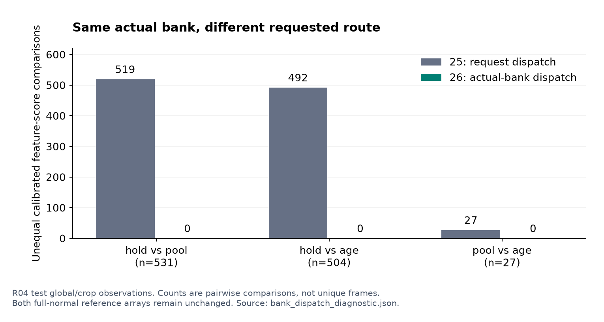

# 실험 26 — 실제 subspace에 일치하는 보정 CDF 선택

## 이번 실험 결과

**같은 실제 bank인데 요청 이름 때문에 점수가 달라지는 문제를 제거했다. 하지만 Visual·Combined ranking은 낮아졌고 경보는 그대로였다.** 이번 변경을 성능 향상으로 보고하지 않는다. 파이프라인의 보정 일관성을 확인한 실험이며 세 외형 gate의 승자를 선택하지 않았다.

### 질문과 변경 범위

실험 25에서 hold→pool 비교의 같은 bank·다른 요청 관측 531개 중 519개에 다른 보정 점수가 나왔다. 이번에는 역할별 실제 subspace key가 phase bank이면 기존 phase 요청 reference, pooled bank이면 기존 pooled 요청 reference를 선택한다. 지원 부족 fallback도 pooled reference를 받는다. pooled residual은 일정한 batch로 계산해 요청별 부동소수점 tie 차이를 피했다.

두 reference 배열 자체는 실험 25와 **정확히 동일**하다. 첫 reference는 원래 phase 요청을 전체 정상 calibration에 적용한 값으로, 지원 부족 fallback을 포함한다. 실제 phase bank로 처리된 표본만 따로 적합한 CDF가 아니다. 둘째는 같은 전체 정상 특징을 역할 pooled bank에 통과시킨 값이다. 역할 −1/0/1/2별 reference 표본 수는 각각 482/590/543/482개씩이며 두 경로에 동일 모집단을 사용했다. 총 8개 배열, 정상 영상 5개다. 정상 holdout에서는 제외 영상을 빼고 남은 4개만 사용했다.

R04 정상 FIT 20 / calibration 5 / 테스트 19개, seed 42, 원본 특징·phase/mask·관측 FIT/common-rank PCA·process·τ=56·4프레임 sampling·causal hold를 고정했다. 테스트는 8,154프레임(정상 3,576 / 이상 4,578), 정상 calibration은 1,920프레임(482 samples)이다. 기존 25_hold/pool/age와 새 26_hold/pool/age를 각각 비교했다. 원래 PCA residual은 1e−12 허용 오차로 보존되고 지원되는 phase·명시적 pooled 관측 점수는 짝지은 기존 구성과 정확히 같다.

VLM/검출기/CLIP 재추론은 없으며 사용자 지정 로컬 Qwen 설정은 그대로다. 캐시를 사용하는 CPU 실험이다. 추론에서 두 residual 경로를 계산하는 비용과 실제 운용 지연은 **미측정**이다.

### 정상 데이터 검증

6개 구성×5개 제외 영상의 30개 정상 holdout을 재구성했다. 세 짝 모두 기존과 같은 오탐 수이며 합계는 각각 **40/1,920프레임(2.08%)**이다.

| 제외 정상 영상 | 25/26_hold | 25/26_pool | 25/26_age |
|---|---:|---:|---:|
| 02 | 28 | 16 | 28 |
| 08 | 0 | 0 | 0 |
| 10 | 0 | 0 | 0 |
| 12 | 0 | 16 | 4 |
| 15 | 12 | 8 | 8 |
| 합계 | 40 | 40 | 40 |

전체 정상 calibration은 모두 finite/[0,1], 점수 1 포화 0개, 경보 4/482 samples다. 각 구성에서 q99를 다시 적합했지만 짝지은 실험 25와 수치가 같았다. hold 0.997457627118644, pool 0.9968879668049793, age 0.9972375690607734다. gate 간에는 다른 임계값이며 strict `>`를 쓴다. 기존 q99와 자체 q99를 같은 새 점수에 적용한 진단도 차이가 0개다.

### R04 개발 테스트

| 구성 | Visual AUROC / AP | Combined AUROC / AP | 정상 오탐률 (FP) | 이상 recall (TP) | 탐지 / 26 |
|---|---:|---:|---:|---:|---:|
| 25_hold | 0.7001 / 0.6971 | 0.6765 / 0.6753 | 8.64% (309) | 13.74% (629) | 13 |
| 25_pool | 0.6883 / 0.6861 | 0.6657 / 0.6654 | 7.86% (281) | 12.06% (552) | 14 |
| 25_age | 0.6912 / 0.6903 | 0.6681 / 0.6692 | 8.64% (309) | 13.91% (637) | 13 |
| 26_hold | 0.6899 / 0.6899 | 0.6669 / 0.6689 | 8.64% (309) | 13.74% (629) | 13 |
| 26_pool | 0.6875 / 0.6857 | 0.6650 / 0.6650 | 7.86% (281) | 12.06% (552) | 14 |
| 26_age | 0.6898 / 0.6891 | 0.6669 / 0.6681 | 8.64% (309) | 13.91% (637) | 13 |


hold의 Combined AUROC는 0.6765→0.6669, pool은 0.6657→0.6650, age는 0.6681→0.6669로 낮아졌다. AP도 낮아졌다. 세 짝 모두 테스트 경보 배열이 정확히 같아 추가/제거 정상·이상 경보가 각각 0개다. 순위 지표와 특정 임계값의 경보 동작은 다른 결과임을 보여준다.

탐지 구간은 hold 13/26, pool 14/26, age 13/26이며 짝지은 기존 탐지 집합도 같다. 탐지된 구간만의 지연 중앙값은 각각 75/64.5/75프레임, onset 전부터 경보가 켜진 탐지 구간은 각각 2개다. 미탐을 제외한 조건부 지연이며 FPS 가정·point adjustment는 없다. 새 구성끼리는 pool이 hold/age보다 R04_04 `[261,379)` 한 구간을 더 탐지한다.

### 실제 bank 점수의 일관성

44개 정상·테스트 특징 파일의 gate 쌍별 **46,691개 특징 비교**에서 같은 실제 bank의 raw/calibrated score가 정확히 같았다. 이 수는 global/crop과 여러 gate 쌍의 비교 건수이며 고유 frame 수가 아니다.

| 테스트 gate 쌍 | 같은 bank·다른 요청 관측 | 실험 25 점수 불일치 | 실험 26 점수 불일치 |
|---|---:|---:|---:|
| hold→pool | 531 | 519 | 0 |
| hold→age | 504 | 492 | 0 |
| pool→age | 27 | 27 | 0 |



관측 5,599프레임과 초기 미관측 652프레임의 Visual/Combined 점수는 세 새 gate 사이에서 정확히 같다. 초기 미관측에서 이전에는 hold와 pool/age 사이에 336프레임의 Combined score 차이가 있었으나 이제 0개다. 초기 미관측은 모두 정상이고 경보는 모두 0개이므로 이 부분에서 이상 탐지 효용을 추정할 수 없다.

지원 부족으로 pooled bank를 쓰지만 phase CDF를 받았던 관측의 변경을 따로 집계했다.

| 구성 | 관측 상태: 대상 / 점수 변경 | 초기 미관측: 대상 / 변경 | 짧은 누락: 대상 / 변경 | 긴 누락: 대상 / 변경 |
|---|---:|---:|---:|---:|
| 26_hold | 52 / 52 | 504 / 492 | 27 / 27 | 0 / 0 |
| 26_pool | 52 / 52 | 0 / 0 | 0 / 0 | 0 / 0 |
| 26_age | 52 / 52 | 0 / 0 | 27 / 27 | 0 / 0 |

위 값은 특징 관측 수다. dense Combined score의 변경은 hold에서 관측 24 / 초기 336 / 짧은 누락 28프레임, pool에서 관측 24프레임, age에서 관측 24 / 짧은 누락 28프레임이었다. 어느 변경도 q99 경보를 바꾸지 않았다. 관측이라고 항상 phase bank 지원이 충분한 것은 아니다.

| 고정 subset | 정상 / 이상 프레임 | 26_hold 정상 / 이상 경보 | 26_pool 정상 / 이상 경보 | 26_age 정상 / 이상 경보 |
|---|---:|---:|---:|---:|
| 관측 | 2242 / 3357 | 225 / 346 | 225 / 346 | 225 / 346 |
| 초기 미관측 | 652 / 0 | 0 / 0 | 0 / 0 | 0 / 0 |
| 0<age≤56 | 674 / 1051 | 84 / 255 | 56 / 170 | 84 / 255 |
| age>56 | 8 / 170 | 0 / 28 | 0 / 36 | 0 / 36 |

Process 배열 및 AUROC/AP 0.5688/0.5941은 그대로다. 체류 유효 범위도 417/8,154프레임(5.11%)이다. Combined ranking은 세 구성 모두 Visual보다 낮다. 이것만으로 공정 신호가 전부 무용하다고 결론내리지 않고, 다음에는 공정의 관측 근거와 독자 TP/FP를 분리한다.

## 결과의 의의

요청 경로와 실제 사용 bank가 어긋날 수 있다는 fallback 특유의 보정 문제를 식별하고 수정했다. 정상 reference를 다시 적합하지 않아 CDF 선택 규칙 자체의 효과를 분리했다. 같은 실제 계산 경로에 같은 점수를 주는 불변성을 구현·검증한 것이 이번 기여다.

Ranking 저하와 경보 불변도 함께 보고한다. 코드의 일관성, 임계값 기반 운영 결과, ranking을 구분하는 근거가 생겼다. 이를 단독으로 새로운 알고리즘의 novelty, 통계적 유의성 또는 장면 일반화로 주장하지 않는다.

## 보완할 점

- 세 구성의 Visual·Combined AUROC/AP가 모두 낮아졌고 새로운 구간 탐지는 없다. 일관성 개선을 성능 개선으로 표현하지 않는다.
- 첫 reference에는 phase 요청의 지원 부족 fallback이 여전히 섞여 있다. 실제 bank dispatch의 일관성이 조건별 정상 보정의 정확성을 보장하지 않는다.
- 공정 신호는 관측되지 않은 유지 phase의 전이도 사용한다. 체류의 좁은 가용 범위, 역할/관계 의미 오류는 이번 변경에서 해결하지 않았다.
- 정상 calibration 5개와 반복 사용한 R04 개발 데이터다. 독립 녹화 그룹, bbox/semantic phase GT, FPS가 없고 다른 장면 일반화는 미확인이다. 11개 라벨 길이 불일치는 정렬 미확정으로 남긴다.
- 비용·지연과 통계적 불확실성은 미측정이다. frame 수를 독립 표본 수처럼 취급하지 않는다.

## 다음 Recommended improvements — 추천순 3개

| 추천순 | 개선 후보와 변경 내용 | 이번 결과의 근거 | 검증 기준 및 주의점 |
|---|---|---|---|
| 1 | **연속 관측으로 뒷받침되는 전이만 결합**: 이전·현재 관계가 모두 관측된 경우에만 transition score 기여 | 세 구성 모두 Combined AUROC 0.6650–0.6669로 Visual 0.6875–0.6899보다 낮음. 외형 보정 불일치를 제거해도 공정 기여 문제는 남음 | 전이 확률·CDF는 고정하고 결합 gate만 변경. 정상 holdout, 공정 독자 TP/FP·구간 및 gate 경계 검사. 누락 자체가 이상 단서일 수 있어 미탐 증가도 보고 |
| 2 | **정상 역할·누락 원인 감사 확대**: 실제 부품·혼동 객체·가림 사례를 구분 | 같은 bank 불변성을 확보했어도 관계 의미 정확도는 미검증이고 체류 유효 범위는 5.11% | 정상 사례와 보조 주석 범위/비용 명시. 관측률을 검출 recall 또는 phase 정확도로 대체하지 않음 |
| 3 | **정상 상태별 보정 진단**: reference와 실제 경로의 분포 차이를 영상 단위로 점검 | 정상 오탐·q99가 같아도 ranking은 낮아짐. 첫 reference는 여전히 phase 요청과 지원 부족 fallback을 함께 포함 | 정상 holdout의 관측/누락·bank별 percentile 및 support를 보고. 작은 subset CDF 재적합이나 테스트 순위에 맞춘 선택을 바로 도입하지 않음 |

1순위만 [실험 27 계획](EXPERIMENT27_PLAN.md)으로 구체화한다. 세 외형 gate를 유지한 상태에서 연속 관측 전이의 결합 여부만 바꾼다. 후속 전체 실험을 미리 확정하지 않는다.

## 검증과 재현

99개 테스트 통과. 정상 30개 holdout의 제외 영상·reference/q99/예측, 테스트 114개 예측(6×19)의 global/crop/프레임 점수·라벨·지표, 44개 특징 파일 hash, 정상 gap 및 인과적 prefix를 재검증했다. 두 reference와 PCA는 기존과 일치하고 process는 보존된다. 그림은 저장 JSON/CSV로 생성해 렌더링을 확인했다.

초기 준비 스크립트의 aggregate feature 링크 이름을 교정했다. 첫 실행은 로그 경로가 없어 **정상 FIT/calibration 시작 전에** 멈췄으며 과학적 설정은 바꾸지 않았다. 최초 기록과 [교정 근거](../results/experiment26/setup_correction.json)를 보존하고 수정된 스크립트로 사전 hash를 다시 동결했다. 검증은 canonical protocol과 테스트 전 checkpoint를 기준으로 한다.

```bash
export PYTHONPATH=src
export MPLCONFIGDIR=.cache/matplotlib
.venv/bin/python scripts/prepare_bank_dispatch.py
.venv/bin/python scripts/audit_bank_dispatch.py
.venv/bin/python scripts/evaluate_route_holdout.py --experiments 25_hold 25_pool 25_age 26_hold 26_pool 26_age --output-experiment 26 --feature-source-experiment 26
.venv/bin/python scripts/prepare_bank_dispatch.py --pre-test
for variant in hold pool age; do
  .venv/bin/python scripts/evaluate_baseline.py --data-root /path/to/IPAD_dataset --config "configs/experiment26_${variant}.json"
done
.venv/bin/python scripts/validate_bank_dispatch.py
.venv/bin/python scripts/diagnose_bank_thresholds.py
.venv/bin/python scripts/plot_bank_dispatch.py
.venv/bin/python -m pytest -q
```

사전 hash는 원본 실행 provenance다. 계획 문서는 작성 당시 상태를 보존하고 완료 상태는 본 보고서/README를 따른다. 다른 환경에서는 입력 캐시/원본 라벨 경로와 새 실행 기록이 필요하다. 원본 데이터·특징·가중치·로그는 업로드하지 않는다.

[6개 구성 CSV](../results/experiment26/comparison.csv) · [전체/paired/subset/구간 진단](../results/experiment26/bank_dispatch_diagnostic.json) · [정상 감사](../results/experiment26/normal_audit.json) · [정상 holdout](../results/experiment26/normal_holdout.json) · [임계값 진단](../results/experiment26/threshold_decomposition.json) · [검증](../results/experiment26/validation.json) · [사전 protocol](../results/experiment26/pre_normal_protocol.json) · [테스트 전 기록](../results/experiment26/pre_test_checkpoint.json)

- 26_hold: [설정](../configs/experiment26_hold.json) · [지표](../results/experiment26_hold/metrics.json) · [영상별 결과](../results/experiment26_hold/per_sequence.csv)
- 26_pool: [설정](../configs/experiment26_pool.json) · [지표](../results/experiment26_pool/metrics.json) · [영상별 결과](../results/experiment26_pool/per_sequence.csv)
- 26_age: [설정](../configs/experiment26_age.json) · [지표](../results/experiment26_age/metrics.json) · [영상별 결과](../results/experiment26_age/per_sequence.csv)
