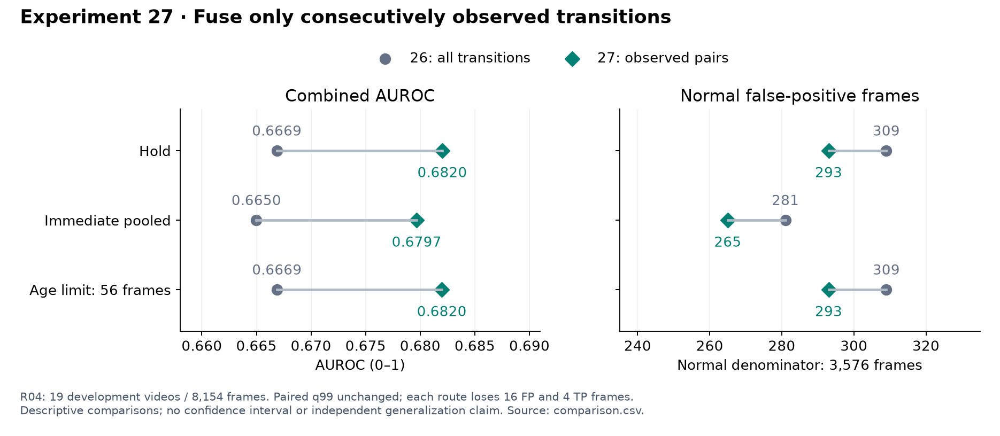
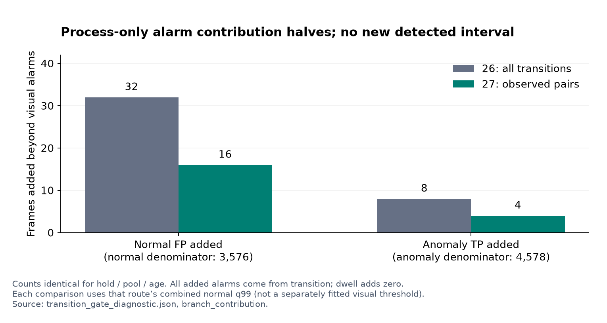

# 실험 27 — 연속 관측 전이만 공정 점수에 결합

## 이번 실험 결과

**관측 근거가 없는 전이 기여를 제한하자 Combined ranking과 정상 오탐이 개선됐지만 이상 탐지 프레임도 일부 줄었다.** 세 구성 모두 정상 holdout 오탐 40→32프레임, 테스트 FP −16/TP −4프레임이며 탐지 구간 집합은 유지됐다. Combined ranking은 여전히 Visual보다 낮고 공정이 새로 탐지한 구간은 없다.

### 질문과 구현

실험 26의 실제 bank 보정 일관성을 유지하면서 전이의 관측 근거만 바꿨다. sampled frame i에서 `i>0 AND relation_valid[i-1] AND relation_valid[i]`이면 기존 보정 transition을 사용하고, 아니면 기여를 0으로 둔다. 같은 phase 유지도 관측 쌍이면 포함한다. 첫 sample·누락·누락 뒤 첫 재관측은 제외한다. raw transition과 원래 보정 transition, 적용 mask와 적용 후 transition을 모두 저장한다.

`process=max(gated_transition, valid_dwell_score)`, `combined=max(visual,process)`다. 정상 FIT의 전이 확률·공정 reference·체류 모델은 그대로다. 외형 global/crop 점수·두 정상 CDF·실제 bank dispatch·common-rank PCA·세 외형 gate·τ=56도 보존했다. 전이 CDF를 관측 쌍만으로 다시 적합하는 변경은 이번에 하지 않았다.

R04 정상 FIT 20 / calibration 5 / 테스트 19개, seed 42, 4프레임 sampling과 causal hold를 유지했다. 테스트 8,154프레임(정상 3,576 / 이상 4,578), 정상 calibration 1,920프레임(482 samples)이다. 관측 gate의 test mask는 현재/직전 입력만 사용하고 인과적 prefix를 검증했다. 이전 26_hold/pool/age와 각각 비교했다. VLM/검출기/CLIP 재추론은 없고 사용자 지정 로컬 Qwen 설정은 그대로다.

### 정상 교차검증

6개 구성×5개 제외 영상에서 reference·process/q99의 제외 영상 비누출을 확인했다. 오탐 프레임 수는 다음과 같다.

| 제외 정상 영상 | 26_hold→27_hold | 26_pool→27_pool | 26_age→27_age |
|---|---:|---:|---:|
| 02 | 28→20 | 16→8 | 28→20 |
| 08 | 0→0 | 0→0 | 0→0 |
| 10 | 0→0 | 0→0 | 0→0 |
| 12 | 0→0 | 16→16 | 4→4 |
| 15 | 12→12 | 8→8 | 8→8 |
| 합계 / 1,920 | 40→32 | 40→32 | 40→32 |

정상 holdout FPR은 2.08%→1.67%다. 감소한 8프레임은 모두 영상 02에서 발생해 영상 전반의 일관된 개선으로 확대 해석하지 않는다.

전체 정상 calibration은 여섯 구성 모두 finite/[0,1], 점수 1 포화 0개, 경보 4/482 samples다. gate가 열린 정상 sample은 247/482개다. 자체 q99를 다시 적합했으나 이전과 같았다: hold 0.997457627118644, pool 0.9968879668049793, age 0.9972375690607734. gate 간에는 서로 다른 q99를 쓰며 경보는 strict `>`다.

### R04 개발 테스트

| 구성 | Visual AUROC / AP | Combined AUROC / AP | 정상 오탐률 (FP) | 이상 recall (TP) | 탐지 / 26 |
|---|---:|---:|---:|---:|---:|
| 26_hold | 0.6899 / 0.6899 | 0.6669 / 0.6689 | 8.64% (309) | 13.74% (629) | 13 |
| 26_pool | 0.6875 / 0.6857 | 0.6650 / 0.6650 | 7.86% (281) | 12.06% (552) | 14 |
| 26_age | 0.6898 / 0.6891 | 0.6669 / 0.6681 | 8.64% (309) | 13.91% (637) | 13 |
| 27_hold | 0.6899 / 0.6899 | 0.6820 / 0.6816 | 8.19% (293) | 13.65% (625) | 13 |
| 27_pool | 0.6875 / 0.6857 | 0.6797 / 0.6774 | 7.41% (265) | 11.97% (548) | 14 |
| 27_age | 0.6898 / 0.6891 | 0.6820 / 0.6808 | 8.19% (293) | 13.83% (633) | 13 |



외형 점수는 짝지은 이전 버전과 정확히 같다. Combined AUROC/AP는 세 구성에서 모두 상승했지만 Visual보다 낮다. Process AUROC는 0.5688→0.5679로 소폭 낮아지고 AP는 0.5941→0.5981로 올랐다. 공정 단독 ranking과 결합 효과가 같지 않다.

모든 짝에서 추가 경보는 0개, 제거 경보는 정상 16 / 이상 4프레임이다. own q99와 기존 q99가 같아 임계값 변화로 설명되는 경보 차이는 0개다. 고정 임계값에서 gate 적용 후 점수/경보가 증가하지 않음을 확인했다.

탐지/미탐은 hold 13/13, pool 14/12, age 13/13이며 이전과 탐지 집합이 같다. 탐지된 구간만의 지연 중앙값은 75/64.5/75프레임, onset 전부터 경보가 켜진 탐지는 각각 2개다. 지연은 미탐을 제외한 조건부 값이다. point adjustment·FPS 가정·test threshold sweep은 없다.

### 어떤 관측에서 바뀌었는가

표의 상태는 서로 배타적이다. `첫 sample`은 각 영상의 첫 sampled 상태를 dense frame으로 유지한 구간이다. 아래 표는 hold의 경보이며 paired 제거량은 세 구성 모두 같다.

| 전이 근거 subset | 정상 / 이상 프레임 | 26_hold 정상 / 이상 경보 | 27_hold 정상 / 이상 경보 |
|---|---:|---:|---:|
| 첫 sample | 76 / 0 | 0 / 0 | 0 / 0 |
| 연속 관측 쌍 | 1926 / 3049 | 177 / 298 | 177 / 298 |
| 누락 (첫 sample 제외) | 1258 / 1221 | 84 / 283 | 84 / 283 |
| 누락 뒤 첫 재관측 | 316 / 308 | 48 / 48 | 32 / 44 |

제거된 경보는 전부 재관측 624프레임 subset에서 나왔다. 재관측의 Combined AUROC/AP는 0.5177/0.5100→0.6475/0.5987로 변해 Visual과 같아졌다. 누락의 Combined score도 일부 달라졌지만 경보는 유지됐다. hold/age에서 누락 356·재관측 256프레임, pool에서 누락 336·재관측 256프레임의 Combined score가 달라졌다. 연속 관측·첫 sample에서는 Combined score가 그대로다.

gate가 열린 테스트 범위는 4,975/8,154프레임(61.01%)이다. 이는 객체/phase 정확도가 아니라 관계 mask에 따른 가용 범위다. 기존 age subset별 지표와 경보도 JSON에 기록했다.

### 공정 분기의 독자 기여

각 구성의 **자체 Combined 정상 q99를 동일하게** Visual/transition/dwell에도 적용해 기여를 분해했다. Visual 단독의 q99를 따로 적합한 독립 모델 비교가 아니다.

| 기여 (세 외형 gate에서 동일) | 실험 26 정상 / 이상 경보 | 실험 27 정상 / 이상 경보 |
|---|---:|---:|
| Visual을 넘어서 transition만 추가 | 32 / 8 | 16 / 4 |
| Visual/transition을 넘어서 dwell만 추가 | 0 / 0 | 0 / 0 |
| Visual을 넘어서 두 공정 분기가 함께 추가 | 0 / 0 | 0 / 0 |
| Visual 대비 새로 탐지한 이상 구간 | 0 | 0 |



전이가 Visual·dwell보다 엄격히 높은 점수를 만드는 범위도 hold/age 정상 1030·이상 334→정상 494·이상 258프레임으로 줄었다. pool은 정상 1010·이상 334→494·258프레임이다. dwell 지배 범위는 정상 36·이상 47프레임이며 바뀌지 않았다. 점수 지배가 q99를 넘는 경보나 새 구간 탐지를 뜻하지 않는다. 체류 유효 범위도 417/8,154프레임(5.11%)로 그대로다.

### 남은 정상 보정 모집단의 차이

사후 정상 데이터 진단에서 기존 reference의 전이 표본과 실제 결합에 쓰는 연속 관측 쌍의 차이를 확인했다. 모델/임계값을 다시 적합하거나 선택하지 않았다.

| 이전 상태 | calibration 전체 전이 | calibration 연속 관측 전이 | FIT 전체 전이 / 연속 관측 |
|---|---:|---:|---:|
| 0 | 20 | 0 | 126 / 3 |
| 1 | 206 | 127 | 1039 / 619 |
| 2 | 88 | 20 | 308 / 55 |
| 3 | 163 | 100 | 467 / 287 |
| 합계 | 477 | 247 | 1940 / 964 |

기존 global process reference는 영상별 첫 sample까지 포함한 482개이고, 상태별 reference는 첫 sample을 제외한 합계 477개다. 이번 gate는 247개 관측 쌍에서만 전이를 쓰지만 CDF는 여전히 미관측/held phase 표본을 포함한다. 모집단 정렬을 다음 변경 후보로 삼되, 표본 감소와 상태 0의 지원 부재 때문에 더 좋아질 것이라고 가정하지 않는다.

## 결과의 의의

공정 점수의 관측 근거를 명시하고, 재관측 경계에서 발생하던 간섭을 외형 변경 없이 분리했다. 같은 정상 reference·임계값에서 오탐 16개와 TP 4개의 감소를 함께 설명할 수 있다. 새로운 탐지 능력을 만들었다기보다 관측되지 않은 전이가 결합에 기여하는 범위를 제한한 구현 개선이다.

파이프라인을 관측 mask·전이 evidence·정상 보정·결합으로 나누어 검증할 근거가 쌓였다. 성능 상승 자체를 novelty나 통계적 유의성으로 주장하지 않으며 아직 논문 주제를 좁혀 고정하지 않는다.

## 보완할 점

- TP 4프레임을 함께 잃었고 새 구간 탐지는 없다. 남은 공정 추가 경보도 FP 16/TP 4여서 독자 효용이 제한적이다.
- 연속 관측 subset에서도 Combined AUROC 0.6358은 Visual 0.6560보다 낮다. 단순 관측 여부는 의미 신뢰도를 보장하지 않는다.
- 결합 gate와 정상 전이 CDF 모집단이 다르다. 이를 맞출 경우 정상 표본 부족·global fallback·점수 포화가 생길 수 있다.
- 정상 holdout 개선은 5개 중 영상 02에 집중한다. 반복 R04 개발, 단일 분할/seed, 독립 녹화 그룹·bbox/phase GT·FPS 부재의 한계가 남는다. 다른 장면의 라벨 불일치 11개는 정렬 미확정 상태를 유지한다.
- 진단용 raw transition 저장은 현재 추가 raw 계산을 수행한다. 캐시 CPU 실험의 전체 운용 지연·처리량·비용과 통계적 불확실성은 미측정이다.

## 다음 Recommended improvements — 추천순 3개

| 추천순 | 개선 후보와 변경 내용 | 이번 결과의 근거 | 검증 기준 및 주의점 |
|---|---|---|---|
| 1 | **전이 보정 모집단을 연속 관측에 맞추기**: 정상 CDF에 관측 쌍만 포함하고 전이 확률·gate는 고정 | 결합에서는 관측 쌍만 쓰지만 정상 reference에는 전체 477개 전이가 남음. 관측 쌍은 247개, 이전 상태 0은 20→0개. 공정 추가 경보는 여전히 FP 16/TP 4 | 이전 상태별 support·global fallback·정상 holdout·q99 포화와 독자 TP/FP를 검사. 작은 표본에서 포화/오탐 증가 가능, 테스트로 cutoff 선택 금지 |
| 2 | **정상 역할·누락 원인 감사 확대**: 실제 부품·혼동 객체·재관측 사례를 구분 | 재관측 경보 간섭은 확인했으나 관측 쌍에서도 Combined ranking이 Visual보다 낮고 의미 정확도는 미검증 | 정상 영상의 보조 사례/주석 범위를 명시. 관측 mask를 semantic 정답으로 취급하지 않음 |
| 3 | **고정 설정의 다른 장면 적용성 검증**: 새 장면의 정상 데이터로만 적합·보정 | 개선과 실패가 반복 사용한 R04에 한정되고 정상 holdout 개선은 영상 02에 집중 | 대상과 protocol을 먼저 고정하고 test를 한 번 평가. 장면별 object/phase 의미 차이와 지원 부족, 전체 실패도 보고 |

1순위만 [실험 28 계획](EXPERIMENT28_PLAN.md)으로 구체화한다. 전이 확률과 관측 gate는 유지하고 정상 보정 모집단만 바꾼다. 이후 전체 실험을 미리 확정하지 않는다.

## 검증과 재현

101개 테스트 통과. 44개 특징 hash와 인과적 gate 경계/prefix, 정상 30개 holdout의 제외 영상·reference/q99/예측, 테스트 114개 예측의 객체/프레임 점수·원본 라벨·지표·분기 기여·구간을 재구성했다. 모든 짝에서 PCA/외형 점수·reference·원래 전이·체류가 보존됨을 확인했다. 6개 full-normal 실행 모두 사전 감사와 최종 저장 값이 같다. 그림은 저장 JSON/CSV로 생성해 렌더링을 확인했다.

```bash
export PYTHONPATH=src
export MPLCONFIGDIR=.cache/matplotlib
.venv/bin/python scripts/prepare_transition_gate.py
.venv/bin/python scripts/audit_transition_gate.py
.venv/bin/python scripts/evaluate_route_holdout.py --experiments 26_hold 26_pool 26_age 27_hold 27_pool 27_age --output-experiment 27 --feature-source-experiment 27
.venv/bin/python scripts/prepare_transition_gate.py --pre-test
for variant in hold pool age; do
  .venv/bin/python scripts/evaluate_baseline.py --data-root /path/to/IPAD_dataset --config "configs/experiment27_${variant}.json"
done
.venv/bin/python scripts/validate_transition_gate.py
.venv/bin/python scripts/diagnose_transition_population.py
.venv/bin/python scripts/plot_transition_gate.py
.venv/bin/python -m pytest -q
```

사전 hash는 원본 실행 provenance다. 계획 문서의 작성 당시 상태는 보존하며 완료 상태는 이 보고서/README를 따른다. 다른 환경에서는 입력 캐시/라벨 경로와 새 실행 기록이 필요하다. 원본 데이터·특징·가중치·로그는 업로드하지 않는다.

[6개 구성 CSV](../results/experiment27/comparison.csv) · [전체/paired/subset/분기/구간 진단](../results/experiment27/transition_gate_diagnostic.json) · [정상 보정 모집단](../results/experiment27/normal_transition_population.json) · [정상 감사](../results/experiment27/normal_audit.json) · [정상 holdout](../results/experiment27/normal_holdout.json) · [검증](../results/experiment27/validation.json) · [사전 protocol](../results/experiment27/pre_normal_protocol.json) · [테스트 전 기록](../results/experiment27/pre_test_checkpoint.json)

- 27_hold: [설정](../configs/experiment27_hold.json) · [지표](../results/experiment27_hold/metrics.json) · [영상별 결과](../results/experiment27_hold/per_sequence.csv)
- 27_pool: [설정](../configs/experiment27_pool.json) · [지표](../results/experiment27_pool/metrics.json) · [영상별 결과](../results/experiment27_pool/per_sequence.csv)
- 27_age: [설정](../configs/experiment27_age.json) · [지표](../results/experiment27_age/metrics.json) · [영상별 결과](../results/experiment27_age/per_sequence.csv)
