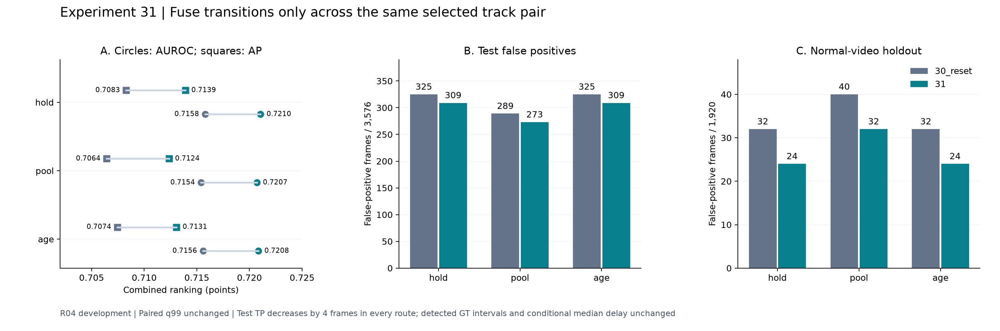

# 실험 31 — 같은 객체 쌍의 연속 관측 전이만 결합

상태: 완료. 실험 30 reset 세 구성과 새로운 gate 세 구성의 정상 holdout 30 cell, 테스트 예측 114개 재구성을 마쳤다. 새로운 테스트 평가는 `31_hold/pool/age` 각각 한 번 실행했다. 기존 `30_reset_*`는 저장 결과를 비교·검증했다. [사전 계획](EXPERIMENT31_PLAN.md)은 동결된 실행 전 문서로 유지한다.

## 1. 이번 실험 결과

### 질문·구현·고정 조건

연속 두 sample에서 관계가 관측되어도 선택된 anchor/target이 바뀌었다면, 같은 객체의 상태 전이로 결합할 근거가 있는가? 실험 30의 정상 오탐 frame 76/252는 모두 anchor 교체 경계였다.

새 `same_track_pair` gate는 `valid[t-1] & valid[t]`에 선택된 anchor와 target track ID가 각각 같다는 조건을 추가한다. 첫 sample·누락·재관측·track 교체에서는 전이 결합 점수만 0으로 한다. `-1` missing index를 실제 detection으로 읽지 않도록 검증하며 선택 index의 범위·sample 정렬·track 메타데이터를 검사한다. 같은 ID가 실제 같은 객체라는 보장은 없다.

실험 30 reset의 모든 입력 feature·relation descriptor/phase·선택·관측 mask·PCA/rank·전이 확률/allowed grammar·전이 CDF·외형 CDF·체류 분포/가용성을 고정했다. full-transition CDF를 유지하고 실험 28의 observed-only CDF를 재도입하지 않았다. 외형 hold/pool/age(τ=56) 세 경로를 모두 비교하며 테스트로 하나를 선택하지 않는다. Combined q99는 새 gate를 사용해 정상 데이터에서 다시 계산했다.

**실제 q99는 세 경로와 15개 paired 정상 holdout 모두 기존과 같았다.** 따라서 이번 경보 변화는 임계값 이동의 결과가 아니다. 원래 transition percentile은 그대로 두고 결합할 때만 제한한다. 체류의 identity 정책은 이번에 바꾸지 않았다.

### 데이터·범위

| 항목 | 범위 |
|---|---|
| 정상 FIT | R04 20개 영상, 7,812프레임 / 1,960 samples |
| 정상 calibration | 별도 5개 영상, 1,920프레임 / 482 samples |
| 정상 검증 | FIT 고정, calibration 영상 하나를 정상 CDF/q99에서 제외; 6구성×5 holdout |
| 테스트 | 19개 영상, 8,154프레임 / 2,047 samples |
| 라벨 | 정상 3,576 / 이상 4,578프레임, GT 연속 이상 구간 26개 |
| 공통 설정 | 기존 sequence split, seed 42, stride 4, causal zero-order hold, strict score > q99 |
| 시간·평가 | source frame index, point adjustment 없음, AP는 step-integral average precision |
| 실행 | 기존 캐시 재사용, detector/VLM/CLIP 재호출 없음. 비용·지연 미측정 |

R04는 라벨 길이가 일치한다. 전체 데이터셋의 11개 길이 불일치 시퀀스는 계속 정렬 미확정이며 원본을 수정하지 않았다. FPS/timestamp, semantic phase/object GT와 독립 녹화 그룹은 없다. R04 테스트는 반복 개발용 결과다.

### 성능과 정상 holdout

| 구성 | Visual AUROC / AP | Combined AUROC / AP | 정상 오탐률 (FP) | 이상 recall (TP) | 탐지 / 26 |
|---|---:|---:|---:|---:|---:|
| 30_reset_hold | 0.6905 / 0.6896 | 0.7158 / 0.7083 | 9.09% (325) | 18.20% (833) | 16 |
| 30_reset_pool | 0.6889 / 0.6861 | 0.7154 / 0.7064 | 8.08% (289) | 16.78% (768) | 17 |
| 30_reset_age | 0.6902 / 0.6886 | 0.7156 / 0.7074 | 9.09% (325) | 18.37% (841) | 16 |
| 31_hold | 0.6905 / 0.6896 | 0.7210 / 0.7139 | 8.64% (309) | 18.11% (829) | 16 |
| 31_pool | 0.6889 / 0.6861 | 0.7207 / 0.7124 | 7.63% (273) | 16.69% (764) | 17 |
| 31_age | 0.6902 / 0.6886 | 0.7208 / 0.7131 | 8.64% (309) | 18.28% (837) | 16 |



| 경로 | 정상 q99 (전후 동일) | 정상 holdout FP / 1,920 | 테스트 FP / TP 변화 | 탐지 구간 및 조건부 지연 |
|---|---:|---:|---:|---|
| hold | 0.9974576271 | 32 → 24 | −16 / −4 | 16개 / 70.5프레임, 동일 |
| pool | 0.9968879668 | 40 → 32 | −16 / −4 | 17개 / 65프레임, 동일 |
| age | 0.9974576271 | 32 → 24 | −16 / −4 | 16개 / 70.5프레임, 동일 |

정상 calibration은 전후 모두 4/482 samples 경보, 점수 1은 0개다. 6개 full-normal 모델과 30개 holdout이 finite/[0,1]/q99<1 조건을 통과했다. holdout 감소 8프레임은 모두 영상 02의 `[76,80)`, `[252,256)`이며 다른 영상의 최종 경보 변화는 없다. 이전 상태 reference 31개가 있어도 나머지 영상에 해당 2→1 edge가 없던 반례다. raw/CDF 점수 1은 그대로지만 객체 교체 경계여서 더 이상 전이 증거로 결합하지 않는다.

테스트에서는 추가 경보 0, 제거 경보 정상 16/이상 4프레임이다. 모두 anchor 교체 경계다. 탐지된 구간의 **집합**과 미탐 수 10/9/10개, 조건부 지연 중앙값, 시작 전부터 경보가 켜진 탐지 구간 2개가 그대로다. 짧은 GT 구간(≤12프레임)은 없다. 구간 수가 유지된다고 이상 경보 손실이 없었다고 해석하지 않는다.

동일 새 점수에 baseline q99를 적용한 사후 진단도 완전히 같다. 임계값을 테스트에 맞춰 조정하지 않았다.

### 닫힌 전이와 최종 점수의 차이

| 파티션 | 기존 관측 전이 samples | 같은 쌍 전이 samples | anchor 교체 | target 교체 | 동시 교체 |
|---|---:|---:|---:|---:|---:|
| FIT | 964 | 895 | 24 | 45 | 0 |
| calibration | 247 | 231 | 8 | 8 | 0 |
| test | 1,250 | 1,181 | 20 | 49 | 0 |

각 열은 frame이 아닌 sample 수다. 기존 관측 gate가 열리던 test 4,975프레임 중 276프레임(정상 131/이상 145)이 닫혀 4,699프레임이 남았다. anchor 교체 80프레임(정상 20/이상 60), target 교체 196프레임(정상 111/이상 85)이다. 유효 관계 mask 자체는 그대로이고, 이 수치를 객체 검출 recall이나 identity 정확도로 해석하지 않는다.

세 경로 모두 Combined 점수가 실제로 달라진 것은 140프레임(정상 76/이상 64)뿐이다. 전이가 낮아져도 max 결합의 외형/체류가 지배하면 점수가 그대로다. 닫힌 경계에서 최종 경보가 남은 것은 정상 16/이상 32프레임이며, 전이 gate는 외형/체류 경보를 강제로 제거하지 않는다. 새로 닫힌 경계 밖의 공정/Combined 점수는 배열 단위로 같다.

### 남은 공정 기여

공정 단독 AUROC/AP는 0.5946/0.6615→0.5995/0.6752다. 체류 가용성 2,433/8,154프레임(29.84%), 모든 체류 점수·분포·진입 맥락은 그대로다. 아래는 각 경로의 Combined q99에서 다른 branch가 경보하지 않는 독자 경보다.

| 경로 | 전이 독자 FP / TP (전 → 후) | 체류 독자 FP / TP (불변) | 공정 추가 탐지 구간 (불변) |
|---|---:|---:|---:|
| hold | 16 / 4 → 0 / 0 | 12 / 180 | 1 |
| pool | 16 / 4 → 0 / 0 | 12 / 196 | 1 |
| age | 16 / 4 → 0 / 0 | 12 / 180 | 1 |

남은 추가 구간은 테스트 08의 start 134이며, 실험 30에서 새로 지원된 체류 3→1에서 나온다. 체류 독자 FP 12개도 동일 영상 `[244,256)`에 남는다. 현재 q99에서 전이의 독자 경보는 없지만 임계값 아래 ranking 기여가 없다는 뜻은 아니다. 전이를 제거한 별도 모델을 이번에 평가하지 않았다.

### 결과 이후의 정상 체류 provenance 감사

전이는 같은 쌍만 쓰는데 체류는 진입부터 현재까지 다른 쌍을 이어서 세고 있을 수 있다. 결과를 본 뒤 **정상 FIT/calibration만** 추가 감사했다. 점수·지원 규칙·모델은 변경하지 않았다.

| FIT 맥락 | 현재 완결 runs / 영상 | 같은 쌍으로 진입·유지·종료한 runs / 영상 | 기존 최소 지원 10개 충족 여부 |
|---|---:|---:|---|
| 1→3 | 14 / 10 | 3 / 2 | 미달 |
| 3→1 | 10 / 6 | 4 / 3 | 미달 |

현재 지원 체류 samples 중 진입 이후 같은 쌍으로 계속 관측되지 않은 것은 FIT 166/273, calibration 32/61이다. 같은 쌍으로 관측한 것은 각각 107/29 samples다. 이 감사는 track 메타데이터의 연속성 검사이며 semantic GT가 아니다. 표의 순수 완결 run 수를 기존 `complete_context_runs` 결과 및 선택 track 배열의 직접 동일성 검사로 확인했다.

**같은 객체 쌍을 요구하면 현재 두 체류 맥락 모두 기존 최소 지원에 미달한다.** 이번 실험에서는 그 조건을 체류에 적용하지 않았고, 새로운 anomaly score를 만들지 않았다. 객체 교체·관측 중단을 실제 체류 종료로 취급해도 되는지, 끝을 관측하지 못한 길이 정보를 어떻게 보존할지가 다음 보완점이다. [정상 체류 감사](../results/experiment31/normal_dwell_identity_audit.json)

## 2. 실험 결과의 의의

관계 평균 초기화만으로 해결되지 않던 객체 교체 경계의 전이 간섭을, 상태/분포/보정을 고정한 대조로 분리했다. 정상 두 반례와 test 독자 전이 경보가 제거되면서 이상 경보 4프레임도 함께 사라졌다. q99와 다른 branch가 불변이므로 변화를 전이 증거 gate로 추적할 수 있다.

파이프라인 구현의 기여는 객체 관계 추정값을 무조건 공정 흐름으로 취급하지 않고 **관측 여부와 선택 객체 쌍의 연속성에 따라 증거를 제한하고 출처를 추적**할 수 있다는 점이다. 성능 상승 자체를 novelty로 주장하지 않는다. 관련 연구 대비 신규성·의미 정확도·통계적 유의성·일반화는 아직 입증하지 않았고 논문 주제를 고정하지 않는다.

## 3. 보완할 점

- 테스트 이상 경보 4프레임이 제거됐다. 실제 객체 교체나 동일 객체의 track 단절에도 gate가 닫히므로 정당한 전이 신호를 잃을 수 있다.
- 정상 holdout 개선이 한 영상 02의 두 경계에 집중한다. 5개 calibration 영상만으로 전이 coverage를 보장할 수 없다.
- 같은 ID의 역할 오류는 그대로다. 추가 경보는 체류에만 남고, 그 체류 모델은 객체 쌍 연속성을 적용하면 최소 지원에 미달한다. 현재 체류 기여를 검증된 동일 객체의 공정 지속 시간 효과로 부르면 안 된다.
- 외형/체류 오탐과 누락 문제는 gate만으로 해결되지 않는다. 전이 reference는 여전히 전체 전이 모집단이므로 결합 gate와 모집단이 일치하지 않지만 실험 28의 실패를 이유 없이 재도입하지 않았다.
- R04 단일 split/seed 반복 개발, 독립 녹화 그룹·object/semantic phase GT·FPS 부재. 프레임은 독립 표본이 아니며 object localization 정확도·운용 비용·추론 지연은 미측정이다.

## 4. 다음 Recommended improvements — 추천순 3개

| 추천순 | 개선 후보와 변경 내용 | 이번 결과의 근거 | 검증 기준 및 주의점 |
|---|---|---|---|
| 1 | **객체 쌍의 연속성을 반영한 체류 episode 재구성**: 실제 관측한 종료, 객체 교체·누락·영상 끝의 우측 검열, 진입 미관측을 분리해 정상 학습 자료를 만듦 | 남은 공정 독자 경보는 전부 체류. 같은 쌍으로 진입·유지·종료한 정상 FIT 완결 run은 1→3 3개/2영상, 3→1 4개/3영상으로 기존 최소 10개에 미달 | 우선 normal-only로 complete/censored/unknown-entry·맥락별 영상 수와 관측 길이를 검증하고 원본 sample까지 추적. 검열 경계를 실제 종료로 대체하거나 지원 threshold를 낮춰 성능을 만들지 않음. 체류 분포 재설계는 이 자료를 본 뒤 결정 |
| 2 | **정상 시공간 근거로 역할 검증 보강**: blade/바이스·제품 후보 혼동을 구분할 근거 추가 | 평균과 전이에서 track 경계를 제어해도 동일 ID의 잘못된 역할은 그대로이며 객체/phase GT는 없음. 체류 독자 FP 12개가 남음 | 정상 사례/보조 주석 범위를 명시하고 객체 선택·가용성·최종 탐지를 각각 검증. 오탐의 원인을 역할 오류로 단정하거나 test로 margin을 조정하지 않음 |
| 3 | **고정 설정의 다른 장면 적용성 검증** | 정상 holdout 개선은 영상 02 한 곳에 집중하고 현재 탐지 근거는 반복 R04의 체류 맥락에 의존 | 대상/프로토콜을 먼저 동결하고 새 장면 정상 FIT/calibration으로만 적합. 객체·phase 의미 차이와 지원 부족/실패를 포함해 보고하고 단일 장면 개선을 일반화하지 않음 |

1순위만 [실험 32 계획](EXPERIMENT32_PLAN.md)으로 구체화했다. 완결 duration만 무조건 버리거나 검열을 실제 종료로 대체하기 전에, 정상 체류 자료의 관측 근거를 재구성한다. 다른 두 후보는 확정된 후속 실험이 아니다.

## 검증·산출물·재현

- 단위 테스트 **119개 통과**. 두 역할 각각/동시 교체, 동일 쌍, missing/reacquired, 시작·빈 캐시·prefix, 잘못된 index/정렬·dtype, score/CDF/dwell 보존 포함.
- feature 44개, 정상 holdout 30개, 테스트 예측 114개를 재구성했다. baseline의 정상 모델·holdout·test 저장값을 그대로 재현했다. 114개에는 새 prediction 57개와 기존 prediction 57개가 포함된다.
- 정상 CDF·q99·전이 raw/percentile/gate·max 결합을 독립 재계산하고, 새 gate가 기존 관측 gate의 부분집합 및 인과적 prefix 불변임을 확인했다.
- [정상 사전 동결](../results/experiment31/pre_normal_protocol.json), [정상 audit](../results/experiment31/normal_audit.json), [holdout](../results/experiment31/normal_holdout.json), [test eligibility](../results/experiment31/test_eligibility.json), [test 전 동결](../results/experiment31/pre_test_checkpoint.json).
- [비교 CSV](../results/experiment31/comparison.csv), [전체 진단·evidence strata·구간](../results/experiment31/diagnostic.json), [검증](../results/experiment31/validation.json), 설정 `configs/experiment31_{hold,pool,age}.json`, 각 구성 `results/experiment31_*/metrics.json` 및 `per_sequence.csv`.
- 원본 영상/가중치/feature cache·예측 배열·서버 로그는 업로드하지 않는다. figure는 집계치만 표시한다. 실행 환경과 캐시 의존성은 이전 실험과 같고 이 단계에서는 로컬 VLM 서버를 호출하지 않았다.

실험 30 reset feature와 baseline 모델·예측/holdout 저장본이 필요하다. hash checkpoint는 해당 실행의 증거이므로 소스나 환경이 바뀐 재현은 별도 실행 디렉터리에서 수행한다.

```bash
PYTHONPATH=src .venv/bin/python -m pytest -q
PYTHONPATH=src .venv/bin/python scripts/experiment31_pair_gate.py prepare
PYTHONPATH=src .venv/bin/python scripts/experiment31_pair_gate.py normal
PYTHONPATH=src .venv/bin/python scripts/evaluate_route_holdout.py \
  --experiments 30_reset_hold 30_reset_pool 30_reset_age 31_hold 31_pool 31_age \
  --output-experiment 31 --feature-source-experiment 31
PYTHONPATH=src .venv/bin/python scripts/experiment31_pair_gate.py pre_test
# test_eligibility.json에서 통과한 구성만 실행
for gate in hold pool age; do
  PYTHONPATH=src .venv/bin/python scripts/evaluate_baseline.py \
    --data-root /media/jeong/ExtHDD/IPAD_vLLM/IPAD_dataset \
    --config "configs/experiment31_${gate}.json"
done
PYTHONPATH=src .venv/bin/python scripts/validate_pair_gate.py
PYTHONPATH=src .venv/bin/python scripts/audit_dwell_identity_support.py
MPLCONFIGDIR=.cache/matplotlib .venv/bin/python scripts/plot_pair_gate.py
```
