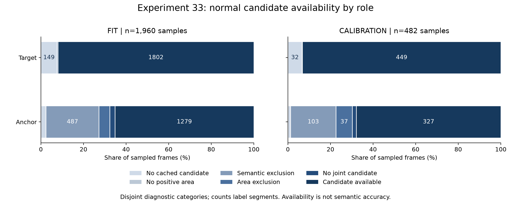

# 실험 33 — 관계 관측 손실과 객체 선택 근거 추적

## 1. 이번 실험 결과

**완료: normal-only 진단 파이프라인과 사전 선정한 정상 사례 검토.** 실험 32의 1순위 개선을 구현했다. 정상 체류 FIT episode 257개 중 228개가 진입 미확인이었던 원인을 후보 부재, filter 탈락, 선택 track 교체까지 추적한다. 모델·점수 변경과 새 테스트 평가는 없다.

R04 정상 FIT 20영상/7,812 source frames/1,960 samples, calibration 5영상/1,920 frames/482 samples를 사용했다. stride는 4 source frames이며 FPS·timestamp가 없어 초로 환산하지 않는다. 총 25영상/9,732 frames/2,442 samples다. 실험 30 reset 정상 캐시, 실험 18 relation 중심/면적 gate, 실험 17 고정 text embedding, 실험 32 episode를 유지했다. 기존 KMeans seed 42의 모델을 그대로 복원했으며 새 확률적 학습은 없다. VLM·GroundingDINO·CLIP 재호출도 없다.

### 관측 손실의 역할별 위치

| 진단 | FIT (1,960 samples) | calibration (482 samples) |
|---|---:|---:|
| 두 역할 모두 선택됨 | 1,123 (57.30%) | 297 (61.62%) |
| anchor만 미선택 | 679 | 152 |
| target만 미선택 | 156 | 30 |
| 둘 다 미선택 | 2 | 3 |
| 전체 관계 누락 | 837 | 185 |

역할의 가용성과 의미 정확도는 다르다. 검토 사례에서는 관계가 valid인 경우에도 바이스가 blade anchor로, 금속 칼날이 cardboard target으로 선택되는 듯한 경우가 있었다.

| 역할 / 후보 상태 | FIT | calibration |
|---|---:|---:|
| anchor: 캐시 후보 없음 | 47 | 6 |
| anchor: 양의 면적 없음 | 0 | 0 |
| anchor: semantic 배제 | 487 | 103 |
| anchor: 면적 배제 | 100 | 37 |
| anchor: 두 filter의 교집합 없음 | 47 | 9 |
| anchor: 선택 가능 후보 있음 | 1,279 | 327 |
| target: 캐시 후보 없음 | 149 | 32 |
| target: 면적 배제 | 9 | 1 |
| target: 선택 가능 후보 있음 | 1,802 | 449 |

각 역할의 표는 해당 파티션 전체 sample 수로 합산된다. target의 나머지 상태는 0이며 **target에는 semantic gate가 적용되지 않는다.** raw 후보는 detector threshold/NMS/role 처리 후 캐시에 남은 후보다. 검출기의 모든 proposal이나 실제 화면 내 객체 수를 의미하지 않는다.

진단 우선순위는 후보 없음 → 양의 면적 없음 → 양의 면적 중 semantic 통과 없음 → 면적 통과 없음 → 교집합 없음 → 후보 있음이다. 따라서 semantic/면적 실패가 겹칠 때 하나의 원인으로 집계하는 규약이며 물리적 원인을 확정하는 분류가 아니다. 별도 후보별 독립 mask와 margin을 보존했다. 면적은 양수이며 role별 상한+1e-8 이하, anchor temporal margin은 0 초과여야 한다.



### episode 중단과 재관측 연결

| 진단 | FIT | calibration |
|---|---:|---:|
| 연속 누락 구간 | 162 | 48 |
| 양쪽 관측 경계가 있는 누락 구간 | 139 | 45 |
| 그중 같은 선택 track 쌍으로 재관측 | 49 | 19 |
| 그중 다른 선택 track 쌍으로 재관측 | 90 | 26 |
| 연속 valid sample 사이 target 교체 | 45 | 8 |
| 연속 valid sample 사이 anchor 교체 | 24 | 8 |
| 그중 이전 anchor 후보 자체 소실 | 20 | 5 |
| 그중 이전 anchor 후보 filter 탈락 | 4 | 3 |

양쪽 역할이 동시에 바뀐 연속 valid 경계는 0개다. target 교체 53개는 모두 이전 ID 후보가 해당 sample에 없어서 발생했다. 이 사실만으로 tracking 오류 또는 실제 객체 교체를 구분할 수 없다. 누락 뒤 같은 ID가 돌아온 68개도 과거 누락/진입을 복원하는 데 쓰지 않았다.

진입이 확인된 episode의 **관계 누락에 의한 검열**은 FIT 11개/calibration 6개다. 경계의 직접 원인은 다음과 같다.

| 경계의 실패 조합 | FIT | calibration |
|---|---:|---:|
| anchor semantic 배제, target 가능 | 4 | 4 |
| anchor 면적 배제, target 가능 | 3 | 1 |
| anchor 교집합 없음, target 가능 | 2 | 0 |
| anchor 후보 없음, target 가능 | 1 | 1 |
| anchor 가능, target 후보 없음 | 1 | 0 |

재관측으로 시작한 unknown-entry 156/48개의 직전 실패 조합도 [집계](../results/experiment33/diagnostic_summary.json)에 남겼다. 실제 동작 종료나 새 진입으로 바꾸지 않았다. 335개 episode 각각의 이전/시작/마지막 관측/종료 경계는 [출처 연결](../results/experiment33/episode_boundary_trace.json)에서 확인할 수 있다.

### 사전 선택한 24개 사례의 시각 검토

검열 누락·재관측·track 교체·complete control에서 각 6개를 영상별 round-robin과 source frame 순으로 **이미지를 보기 전에 동결**했다. 24개 고유 경계의 이전/현재/다음 sample, 총 72개 정상 이미지와 로컬 접촉 시트 12장을 확인했다. 다음 frame은 사후 진단에만 사용했다. 이는 Codex의 탐색적 시각 메모이며 사람이 검증한 bbox/action GT가 아니다. 아래 사례를 포함한 **24개 전체 메모와 불확실성**은 [visual_review.json](../results/experiment33/visual_review.json)에 있다. 원본·접촉 시트는 업로드하지 않는다.

| 사례 | 관찰과 코드 근거 | 해석의 한계 |
|---|---|---|
| 04_0352, 06_0256의 다음 sample | blade로 보이는 후보가 양수 margin이지만 면적 .227/.245 등으로 상한 .21158을 넘음 | 실제 bbox GT 없음. 면적 gate가 역할 정확도를 보장하지 않음 |
| 01_0100 | 큰 blade 후보는 제외되고 바이스로 보이는 후보가 선택되면서 관계가 재관측됨 | 관측률 회복을 올바른 역할 복구로 볼 수 없음 |
| 01_0024, 02_0176 | gate를 통과한 blade로 보이는 대안의 margin이 더 높아도 기존 바이스 track이 유지됨 | margin 자체도 역할 정답이 아니며 우선순위 변경은 track 단절을 늘릴 수 있음 |
| 03_0092 | 세워진 blade로 보이는 후보가 선택되고 다음 sample에도 유지됨 | 모든 재관측이 잘못된 것은 아님. 사례 일부를 선택 정확도로 환산하지 않음 |
| 04_0028, 06_0028, 05_0032 | blade/trough로 보이는 영역이 target으로 선택되거나 cardboard와 번갈아 선택됨 | target에는 semantic 검증이 없고 움직임/가림의 원인은 미확인 |
| 06_0384 | 아래쪽 cardboard 더미로 보이는 영역의 target ID가 10→17로 바뀜 | ID 교체가 실제 제품 교체라고 단정할 수 없음 |
| 02_0176 등 complete control | 같은 ID가 유지돼도 anchor는 바이스로 보이고 box 면적이 변함 | 코드상 complete가 실제 공정의 완결 또는 phase 정답은 아님 |

시각 검토 후 **전체 정상 후보 metadata**에서 얻은 추가 진단이다. threshold를 새로 정하거나 선택을 변경하지 않았다.

| 진단 (sample 단위) | FIT | calibration |
|---|---:|---:|
| 선택 anchor 수 | 1,279 | 327 |
| 선택 anchor보다 temporal margin이 높은 eligible 대안 있음 | 84 | 28 |
| 그중 이전 anchor track을 유지한 선택 | 82 | 28 |
| 양수 semantic 후보가 면적으로 제외되는 sample | 224 | 64 |
| 그중 anchor 미선택이며 target은 선택됨 | 146 | 43 |
| 선택 anchor의 raw margin≤0, temporal margin>0 | 67 | 23 |

146/43은 면적 제한 제거를 실행한 결과가 아닌 **현재 후보 mask의 구조적 가능성**이다. 반대로 84/28의 대안을 선택하면 의미 정확도가 개선된다는 보장도 없다. 완화·최대 margin 선택을 성능 개선으로 미리 판단하지 않는다.

### 성능 및 비용

| 항목 | 실험 33 |
|---|---|
| 새 AUROC / AP | 미평가 (test 미접근) |
| 새 q99 / FPR / recall / 구간 탐지 | 미평가 (점수·모델 변경 없음) |
| phase 관측률 | FIT 57.30%, calibration 61.62%; 기존 캐시와 동일 |
| 역할·검출·localization 정확도 | GT 부재로 미측정 |
| 운용 비용·추론 지연 | 미측정 |

실험 31의 성능을 이번 실험의 성능으로 복사하지 않았다. 재학습하지 않았고 기존 정상 입력/모델/점수 105개 파일 hash가 불변이다.

## 2. 실험 결과의 의의

**후보 → 독립 filter → 선택 track → 관계 관측 → episode 경계**를 연결하는 재현 가능한 진단 기능을 구현했다. 누락을 단순히 하나의 missing 값으로만 보지 않고, 현재 파이프라인의 어느 단계에서 선택이 불가능해졌는지 설명할 수 있다. 전체 정상 2,442 samples에서 기존 선택·phase·descriptor·margin을 정확히 복원했다.

관측률과 의미 정확도를 분리해야 한다는 근거를 얻었다. 바이스가 semantic gate에서 제외되는 것은 관측률을 낮추더라도 역할 검증의 바람직한 결과일 수 있다. 반대로 complete episode도 잘못된 역할을 계속 관측한 기록일 수 있다. 따라서 체류 분포를 복잡하게 만들기 전에 후보 선택의 역할 근거를 개선하는 순서가 합리적이다. 이 결과는 파이프라인 구현의 설명 가능성을 보완하지만 새 알고리즘의 우월성·독창성·통계적 유의성을 입증하지 않는다.

## 3. 보완할 점

- 정상 목적 표집 24개는 모집단의 정확도 표본이 아니다. 특히 6개 complete control의 역할 혼동 관찰을 전체 오류율로 계산할 수 없다. 의미/action 정답은 null로 유지했다.
- semantic margin은 영상 crop과 두 문장 embedding의 차이이며 작은 양수 값만으로 blade를 확정할 수 없다. temporal median이 음수 raw margin을 90 samples에서 양수로 유지했고 이전 track 우선 규칙이 더 높은 margin의 대안을 110 samples에서 선택하지 않았다.
- 면적 상한이 blade로 보이는 후보를 제외하는 사례가 있으나, 단순 상한 제거는 큰 배경 box나 혼합 객체를 늘릴 수 있다. target 역할 혼동도 별도로 남아 있다.
- 후보 부재는 detector의 threshold/NMS 전 자료를 포함하지 않는다. 가림·실제 부재·검출 실패를 구분할 GT가 없다. track ID 지속/교체 또한 실제 물체의 동일성 정답이 아니다.
- source frame 간격 4 사이의 움직임과 정확한 진입·종료, FPS·timestamp는 미확인이다. Stage 00의 원본 라벨 불일치 11영상은 정확한 재정렬이 해결되지 않았고 기존 제외 정책을 유지한다.
- R04 단일 장면/고정 split의 개발 진단이다. calibration 사례도 확인했으므로 향후 독립 평가로 부를 수 없다. 정상 샘플은 시간적으로 의존하고 녹화 그룹 독립성은 불명확하다. 새 성능·비용은 측정하지 않았다.

## 4. 다음 Recommended improvements — 추천순 3개

| 추천순 | 개선 후보와 변경 내용 | 이번 결과의 근거 | 검증 기준 및 주의점 |
|---|---|---|---|
| 1 | **anchor 선택에 semantic 근거 우선 적용**: 현재 gate를 통과한 후보 중 temporal margin 최대를 먼저 선택하고 동점에서 기존 track·confidence 사용 | 더 높은 margin의 eligible 대안이 FIT 84/calibration 28 samples에 있으며 82/28은 이전 track 유지. 01_0024·02_0176에서 blade로 보이는 대안보다 바이스가 유지됨 | 후보 집합/관측 mask를 고정한 단일 변경 대조. 역할 사례·선택 변경·track 단절·episode support·정상 holdout·최종 탐지 함께 검증. margin은 GT가 아니고 빈번한 교체로 연속성이 나빠질 수 있음 |
| 2 | **anchor 면적 상한의 역할별 적합성 대조**: 다른 gate/선택 규칙을 고정한 상한 제거 또는 정상 역할 근거에 따른 대체를 한 변경으로 검증 | 양수 semantic anchor가 면적으로 제외되는 sample 224/64, anchor만 누락된 가능 구간 146/43. 04_0352·01_0100에서 blade 후보 제외 관찰 | 정상 FIT로 규칙을 먼저 동결하고 큰 배경/혼합 box 증가, 역할 관찰·가용성·최종 경보를 함께 확인. 관측률 회복을 정확도 향상으로 해석하거나 test로 상한을 조정하지 않음 |
| 3 | **target의 혼동 객체 대비 역할 검증 보강**: cardboard와 blade/trough·고정부 혼동을 구분하는 정상 근거 추가 | target에는 semantic gate가 없으며 04_0028·06_0028·05_0032에서 금속 칼날을 선택하는 듯한 사례. 연속 valid target 교체 53회는 모두 이전 ID 후보 부재 | 정상 자료만으로 검증 규칙을 정하고 실제 제품의 가림/퇴장과 filter 누락, 선택 정확도 보조 주석·관측률을 분리. 목적 표집 메모를 학습 GT로 사용하지 않음 |

1순위만 [실험 34 계획](EXPERIMENT34_PLAN.md)으로 구체화했다. 나머지 두 후보는 확정된 후속 일정이 아니다.

## 검증·산출물·재현

- 전체 단위 테스트 **135개 통과**. 새 3개는 실패 분류/상한 경계, prior-track 선택·누락 보존·target semantic 미적용, 순서 독립적 round-robin 표집을 검증한다.
- 별도 scalar 구현으로 후보 mask/count/이전 ID/선택 이벤트를 검증하고 CLIP raw margin과 causal track median을 독립 재계산했다. 정상 **2,442 samples**, episode **335개**, 누락 구간 **210개**, 연속 valid 쌍 교체 **85개**가 일치한다.
- 사전 고정한 사례 **24개**, 원본 hash **72개**, 로컬 접촉 시트 **12장**, 전체 검토 메모를 확인했다. 수치 validator는 검토 메모의 의미적 정확성을 인증하지 않는다.
- 정상 입력/모델/점수 **105개 불변**. test 특징/영상/라벨/예측은 데이터 접근 hook으로 차단했다. 집계 그래프는 PNG 렌더링을 열어 값·범례·잘림을 확인했다.
- [설정](../configs/experiment33.json), [사전 protocol](../results/experiment33/pre_audit_protocol.json), [사례 사전 동결](../results/experiment33/pre_visual_checkpoint.json), [전체 후보/영상 집계](../results/experiment33/candidate_audit.json), [CSV](../results/experiment33/candidate_reasons.csv), [추가 진단](../results/experiment33/diagnostic_summary.json), [검증](../results/experiment33/validation.json), [접근 기록](../results/experiment33/validation_access.json).

동일한 로컬 데이터·실험 17/18/30/32 산출물을 전제로 저장소 루트에서 실행한다. 코드 hash가 다른 checkout으로 옮기면 기존 protocol을 덮어쓰지 말고 별도 결과 경로와 provenance를 만든다.

```bash
PYTHONPATH=src .venv/bin/python scripts/experiment33_observation_trace.py prepare
PYTHONPATH=src .venv/bin/python scripts/experiment33_observation_trace.py audit
PYTHONPATH=src .venv/bin/python scripts/validate_observation_trace.py --before-review
PYTHONPATH=src .venv/bin/python scripts/render_observation_cases.py
# 로컬 접촉 시트를 실제로 검토하고 visual_review.json에 관찰/불확실성을 기록한다.
PYTHONPATH=src .venv/bin/python scripts/validate_observation_trace.py
MPLCONFIGDIR=.cache/matplotlib .venv/bin/python scripts/summarize_observation_trace.py
PYTHONPATH=src .venv/bin/python -m pytest -q
```
