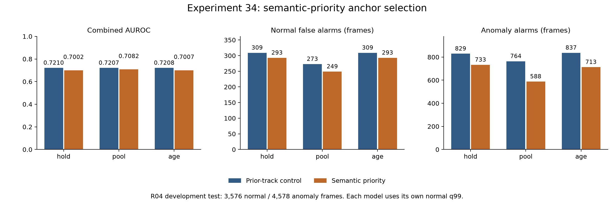

# 실험 34 — eligible anchor의 semantic 근거 우선 선택

## 1. 이번 실험 결과

**완료: 선택 규칙 변경·정상 재적합·holdout·테스트·사례 검토.** 실험 33의 1순위 개선을 적용했다. 더 높은 semantic 근거를 선택하면 바이스에 고착되는 문제를 줄일 수 있는지, 동시에 track 연속성을 해치는지 비교했다. 일부 정상 사례의 선택은 blade로 보이는 후보로 바뀌었지만 **세 경로 모두 ranking과 구간 탐지가 낮아졌다.** 성공한 개선으로 채택하지 않는다.

### 단일 변경과 고정 조건

- `control`: eligible 후보 중 이전 track을 우선하고 그 안에서 detector confidence 최대를 선택한다. 없으면 전체 eligible에서 confidence 최대를 선택한다.
- `semantic`: **anchor만** temporal semantic margin 최대를 먼저 선택한다. 정확한 동점이면 이전 track, confidence, 작은 cache index 순으로 고른다. 새 margin 차이 threshold나 hysteresis는 없다.
- 후보·bbox·role·track·confidence·CLIP 특징·semantic/면적 gate·3회 causal median·target 선택은 동일하다. 두 구성의 relation-valid mask도 정확히 같다. 기존 역할별 prior ID는 선택될 때 갱신되고 누락에서 유지된다.
- 선택된 쌍이 바뀌면 관계 평균을 reset한다. 실험 18 정상 관계 중심/scale을 고정하고 descriptor/phase를 재계산했다. 외형 PCA, 전이/체류, CDF/q99는 각 구성의 정상 자료에서 재적합했다.
- 공유 phase bank rank를 정상 FIT의 두 자연 rank와 실험 31 상한의 최소값으로 맞췄다. 결과적으로 두 구성의 rank map은 기존 실험 31과 같고 bank의 신설/소실도 없다. global phase 2 rank=30, role 1 phase 2=29, 나머지 지원 phase bank=32다. pooled PCA는 정확히 같다. phase별 표본 배정은 바뀐다.
- 전이 결합은 같은 선택 쌍의 연속 관측만 사용한다. 기존 체류 모델의 ID 미검증 정책은 유지하고, 실험 32의 엄격한 episode는 별도 진단으로 재구성한다. hold/pool/age 세 외형 fallback을 모두 비교했다. age τ=56은 같다.

R04, seed 42, stride 4 source frames. FIT 20영상/7,812 frames/1,960 samples, calibration 5영상/1,920 frames/482 samples, test 19영상/8,154 frames/2,047 samples다. test는 정상 3,576/이상 4,578 frames, 이상 구간 26개다. 이 장면은 반복 관찰한 개발 자료이며 독립 평가가 아니다. FPS·timestamp가 없어 시간 단위는 source frame이다. 원본·검출기·encoder·로컬 VLM 서버 설정은 바꾸지 않았고 새 VLM/검출/embedding 호출도 없다.

### 최종 성능

아래 경보는 **각 구성의 정상 calibration q99를 사용한 strict `>`** 결과다. 임계값이 서로 다르다. AP는 step integral 방식의 average precision이며 구간 탐지는 구간 내 한 frame 이상 경보가 있는 경우다.

| 구성 | Visual AUROC / AP | Combined AUROC / AP | 정상 FPR (FP) | 이상 recall (TP) | 탐지 / 26 |
|---|---:|---:|---:|---:|---:|
| control_hold | 0.6905 / 0.6896 | 0.7210 / 0.7139 | 8.64% (309) | 18.11% (829) | 16 |
| control_pool | 0.6889 / 0.6861 | 0.7207 / 0.7124 | 7.63% (273) | 16.69% (764) | 17 |
| control_age | 0.6902 / 0.6886 | 0.7208 / 0.7131 | 8.64% (309) | 18.28% (837) | 16 |
| semantic_hold | 0.6794 / 0.6781 | 0.7002 / 0.6964 | 8.19% (293) | 16.01% (733) | 12 |
| semantic_pool | 0.6864 / 0.6837 | 0.7082 / 0.7027 | 6.96% (249) | 12.84% (588) | 11 |
| semantic_age | 0.6797 / 0.6777 | 0.7007 / 0.6960 | 8.19% (293) | 15.57% (713) | 12 |



모든 control 모델·정상 점수와 test 예측 57개는 실험 31을 정확히 재현했다. semantic hold/pool/age는 FP가 각각 16/24/16 줄었지만 TP가 96/176/124 줄고 탐지 구간은 4/6/4개 줄었다. 새로 얻은 구간은 없다. 탐지된 구간만의 지연 중앙값은 control 70.5/65/70.5, semantic 45.5/75/45.5 source frames다. 미탐 구간이 늘었으므로 조건부 지연 감소를 전반적인 조기 탐지 개선으로 해석하지 않는다.

### 정상 보정과 임계값 효과

| 구성 | control q99 → semantic q99 | 정상 holdout FP / 1,920 frames |
|---|---|---:|
| hold | 0.9974576271 → 0.9989626556 | 24 → 28 |
| pool | 0.9968879668 → 0.9989626556 | 32 → 36 |
| age | 0.9974576271 → 0.9989626556 | 24 → 28 |

5개 calibration 영상의 leave-one-video-out에서 FIT는 고정하고 held-out 영상을 CDF/q99 적합에서 제외했다. 30개 구성×fold cell 모두 finite/bounded 및 q99<1을 확인하고, 모델·점수를 별도 재계산했다. hold/age의 정상 FP는 영상 02에서 16→12로 줄지만 08/12에서 각각 0→4가 된다. pool에서는 영상 02가 8→16, 08이 0→4로 늘고 12/15에서는 줄었다. 전체가 한 방향으로 개선되지 않는다.

동일한 semantic 점수에 **control q99만 적용한 사후 진단**은 다음과 같다. 새 임계값을 선택하거나 재평가 설정으로 채택하지 않았다.

| semantic 점수의 임계값 | hold FP / TP / 구간 | pool FP / TP / 구간 | age FP / TP / 구간 |
|---|---:|---:|---:|
| 각 semantic q99 | 293 / 733 / 12 | 249 / 588 / 11 | 293 / 713 / 12 |
| 대응 control q99 | 321 / 889 / 14 | 281 / 836 / 16 | 321 / 901 / 14 |

control q99에서는 원래 control보다 FP/TP가 모두 늘지만 탐지 구간은 여전히 2/1/2개 적다. 따라서 semantic 자체의 FP 감소 주장은 임계값 변화에 의존한다. ranking 하락과 구간 손실 전체를 임계값 상승만으로 설명할 수도 없다.

### 관측 mask는 같지만 선택·phase·연속성은 변함

| 진단 | FIT | calibration | test |
|---|---:|---:|---:|
| 바뀐 anchor 선택 sample | 84 | 28 | 92 |
| 바뀐 phase sample / source frames | 88 / 349 | 49 / 196 | 90 / 355 |
| 연속 valid 사이 쌍 교체: control → semantic | 69 → 135 | 16 → 37 | 69 → 146 |
| 엄격한 same-pair complete episode | 7 → 6 | 5 → 2 | 5 → 6 |
| unknown-entry episode | 228 → 294 | 66 → 87 | 225 → 302 |
| right-censored episode | 22 → 20 | 7 → 7 | 21 → 20 |

정상 유효 관계는 FIT 1,123/1,960 (57.30%), calibration 297/482 (61.62%), test 1,406/2,047 (68.69%)로 두 구성에서 같다. target 선택도 그대로지만, anchor 교체와 동시에 발생한 기존 target 경계가 `both`로 재분류된다. 그러므로 target-only 경계 수 감소를 target tracking 개선으로 볼 수 없다.

semantic의 연속 valid anchor 교체는 FIT 97/calibration 30회이며 다음 원인으로 나뉜다. `both`에서도 anchor 교체를 한 번 센다.

| 직전 anchor track을 바꾼 직접 근거 | FIT | calibration |
|---|---:|---:|
| 이전 후보는 eligible, 더 높은 margin의 대안 선택 | 36 | 11 |
| 이전 ID의 캐시 후보 없음 | 57 | 16 |
| 이전 후보가 면적 gate 탈락 | 1 | 3 |
| 이전 후보가 semantic gate 탈락 | 3 | 0 |
| 다음 valid sample에 이전 track으로 돌아옴 — 위 분류와 중첩 | 38 | 9 |

47회의 한-sample 왕복은 실제 객체/가림 변화일 수도 있고 후보의 불안정성일 수도 있다. 이를 tracking 오류율로 계산하지 않는다. 확인 없이 즉시 갈아타는 36/11회와 후보 부재로 강제 교체되는 57/16회를 분리해야 한다.

### 체류 지원과 독자 기여

기존 체류 학습은 같은 객체 쌍의 연속성을 강제하지 않는다. 이 정책을 유지한 결과, 지원 맥락은 control의 `1→3(14 runs), 3→1(10)`에서 semantic의 `3→2(17), 2→3(13), 2→1(11), 1→3(14), 1→2(19)`로 바뀐다. `3→1`은 9개로 최소 10개 기준 아래로 내려간다. phase와 지원 집합의 변화가 함께 발생하므로 score 변화를 단순히 선택 bbox의 개선/악화로 해석할 수 없다.

엄격하게 진입·유지·종료의 같은 쌍을 요구하면 정상 FIT complete는 control `1→3:3, 3→1:4`, semantic `1→3:3, 3→1:3`뿐이다. 새 지원 3→2/2→3/2→1/1→2는 엄격한 complete가 0개다. 두 지원 정의를 혼동하지 않는다.

| 독자 공정 경보 | control hold / pool / age | semantic hold / pool / age |
|---|---|---|
| 전이 단독 FP / TP | 모두 0 / 0 | 모두 0 / 0 |
| 체류 단독 FP / TP | 12/180 · 12/196 · 12/180 | 모두 13/167 |
| Visual에 추가한 이상 구간 | 모두 1개 | 모두 0개 |
| 체류 점수 가용 test frames | 모두 2,433 | 모두 2,121 |

control 체류 단독 경보는 3→1이고, semantic은 2→3(FP 13/TP 55)과 2→1(FP 0/TP 112)이다. 이전에 체류가 추가하던 영상 08의 134 시작 구간은 이번에는 놓친다. 최종 TP 167개에 기여해도 새 구간을 찾았다는 뜻은 아니다.

### 24개 고정 사례 비교

실험 33의 24개 경계/72개 정상 원본을 그대로 사용했다. 전후 선택을 표시한 로컬 접촉 시트 12장을 테스트 평가 전에 모두 확인하고 메모를 동결했다. 세 frame 중 anchor가 달라진 사례는 5개, 해당 frame은 8개다. 이는 목적 표집 안의 변경 수이며 모집단 정확도가 아니다.

- `01_0024`: 세 frame 모두 바이스 대신 세워진 blade로 보이는 track 3를 선택한다.
- `05_0032`, `06_0384`, `13_0124`: 검토 구간의 마지막 frame에서 바이스 대신 blade로 보이는 후보를 선택한다. target 혼동/ID 교체는 남는다.
- `02_0176`: 172/176에서는 blade로 보이는 track 13을 선택하나 180에는 다시 바이스 track 15를 선택한다. control의 같은 쌍 complete 경계가 새로운 역할 선택 교체로 바뀌는 사례다.
- 나머지 19개 사례의 세 frame 선택은 같다. 면적 gate로 blade가 제외되거나 raw 후보가 없던 문제는 해결되지 않는다. `03_0092`의 88 frame은 두 구성 모두 missing이지만 이전 이력에서 유지된 phase는 다르다.

모든 사례의 [관찰과 불확실성](../results/experiment34/visual_review.json)을 공개하고 의미/action GT는 null로 유지했다. 이미지/접촉 시트는 로컬에만 둔다.

## 2. 실험 결과의 의의

동일한 eligible 후보·관측 mask·PCA rank·고정 관계 중심에서 **역할 근거를 우선하는 선택과 track 연속성을 우선하는 선택의 상충**을 구현·검증했다. 정상 사례 일부에서 의도한 역할에 가까워 보이는 선택을 얻어도, 시간적 연속성과 체류 지원 및 정상 보정이 달라져 최종 탐지가 낮아질 수 있음을 확인했다.

오탐 감소를 성공으로 단정하지 않고, 동일 점수의 threshold 대조와 새로 잃은 구간, 바뀐 체류 맥락까지 분리했다. 이는 학부 캡스톤 파이프라인의 구성 요소를 이해하는 근거다. 높은 margin·낮은 FP·구현 자체를 기존 연구 대비 novelty, 의미 정확도, 통계적 유의성 또는 일반화의 증거로 주장하지 않는다.

## 3. 보완할 점

- 세 경로 모두 AUROC/AP·recall·탐지 구간이 낮아지고 정상 holdout FP는 늘었다. 이 변경을 검증된 개선으로 채택할 근거가 없다.
- 즉시 semantic 최대를 선택하면 짧은 대안 후보에도 track이 바뀐다. 반대로 이전 후보 자체가 없어진 교체가 더 많아 선택 hysteresis만으로 해결할 수 없는 관측 문제가 남는다.
- strict same-pair complete는 FIT 6개뿐이다. 기존 체류 모델이 새로 지원한다고 판단한 네 맥락은 엄격한 complete가 없으며, 의미 역할/공정의 정답으로 볼 수 없다.
- 관계 중심을 고정해 선택 변경만 대조했으나 새 descriptor의 역할 분포와 중심이 맞지 않을 수 있다. 재적합 효과와 혼합하지 않은 한계이며 이번 결과에서 중심 재학습의 효과는 미측정이다.
- 24개 사례는 탐색적 시각 검토이며 독립적 bbox/action 주석이 아니다. calibration도 개발 중 관찰했으므로 정상 holdout은 일반화의 최종 증거가 아니다.
- source frame 시간축·단일 R04/seed·녹화 그룹 독립성 미확인·Stage 00의 11영상 정확한 라벨 정렬 미해결을 유지한다. 운용 비용·지연과 localization 정확도는 미측정이다.

## 4. 다음 Recommended improvements — 추천순 3개

| 추천순 | 개선 후보와 변경 내용 | 이번 결과의 근거 | 검증 기준 및 주의점 |
|---|---|---|---|
| 1 | **자발적 anchor 교체에 연속 우위 확인**: 기존 anchor가 아직 eligible이면 같은 대안 track이 2개 연속 sample에서 margin 최대일 때 교체. 기존 후보 부재/탈락 시 즉시 기존 semantic 규칙으로 선택 | semantic anchor 교체 중 이전 후보가 eligible인 즉시 교체 36/11회, 한-sample 왕복 38/9회. 쌍 교체 증가와 strict complete 감소 | margin·후보 gate·관측 mask를 고정하고 2회 확인을 사전 고정. 선택 지연·왕복·역할 사례·episode 지원·holdout·탐지를 함께 검증. 올바른 역할로 복구가 늦어질 수 있고 후보 부재 57/16회는 해결하지 못함 |
| 2 | **anchor 후보 연속성 및 면적 gate 보강**: blade 후보의 실제 부재와 상한 배제를 구분해 정상 근거로 한 요소씩 변경 | 이전 ID 후보 부재에 따른 anchor 교체 57/16회, 면적 탈락 1/3회. 24개 사례 중 19개 선택이 그대로이며 이전 면적/후보 소실 문제 잔존 | 정상 자료로 후보 생성/area 대조를 고정하고 역할 품질·누락·강제 교체·큰 배경 box 증가를 함께 측정. 관측률을 검출 정확도로 쓰지 않음 |
| 3 | **체류 점수의 객체 쌍 연속성 검증**: 관측된 진입 이후 같은 쌍으로 유지됐는지를 체류 결합 근거로 요구하는 대조 | 기존 지원은 5맥락으로 늘지만 strict FIT complete는 1→3·3→1 각 3개뿐. 새 맥락의 strict complete는 0, 체류 독자 FP 13/TP 167에도 추가 구간 없음 | 우선 기존 분포를 고정하고 가용성/독자 경보 손실을 분리. 지원 부족을 threshold 완화로 숨기지 않고, 참 이상 지속을 차단할 위험을 보고 |

1순위만 [실험 35 계획](EXPERIMENT35_PLAN.md)으로 구체화했다. 후보 2·3은 확정 일정이 아니며 다음 결과에 따라 순서를 갱신한다.

## 검증·산출물·재현

- 전체 단위 테스트 **138개 통과**. 새 3개는 semantic 우선·정확한 동점·빈 후보·target 정책, gate/valid 불변·평균 reset, 모든 prefix/미래 비참조를 검사한다.
- 새 객체를 만들 때 이미 정규화한 text embedding을 다시 정규화한 최초 구현에서 최대 약 8.33e-17의 차이가 발견돼 exact 검사에 실패했다. 원본 embedding을 한 번만 정규화하도록 수정했으며 허용오차를 완화하지 않았다. [최초 protocol](../results/experiment34/pre_normal_protocol_initial.json)과 [수정 기록](../results/experiment34/preparation_repair.json)을 보존했다. 정상 학습·보정·test 전에 수정했다.
- scalar 선택 순위와 별도 관계 평균 계산으로 정상/test **88개 derived feature 파일**을 재구성했다. raw/temporal margin, target 선택, valid mask, 원본 특징 불변을 검증했다. 같은 미래가 아닌 prefix로 선택이 정해진다.
- 정상 holdout **30개 cell**, test 예측 **114개**의 모델/점수·q99·CDF·같은 쌍 전이 gate·metric/event를 재계산했다. control 예측 57개는 기존 실험 31의 모든 저장 배열과 정확히 같다.
- 정상 처리에는 test 데이터 접근 차단을 적용하고, 정상 학습/보정/시각 메모를 동결한 다음 test 입력을 열었다. 원본 데이터·weights·특징·예측·이미지·로그는 공개하지 않는다. 그래프는 실제 PNG를 열어 수치/범례/잘림을 검토했다.
- [설정 예시](../configs/experiment34_semantic_hold.json), [정상 변환](../results/experiment34/normal_transform.json), [rank 대조](../results/experiment34/fit_rank_control.json), [정상 audit](../results/experiment34/normal_audit.json), [교체 원인](../results/experiment34/normal_switch_mechanism.json), [전체 진단](../results/experiment34/diagnostic.json), [비교 CSV](../results/experiment34/comparison.csv), [검증](../results/experiment34/validation.json).

동일한 로컬 데이터와 선행 캐시를 전제로 저장소 루트에서 실행한다. 기존 protocol은 덮어쓰지 않는다.

```bash
PYTHONPATH=src .venv/bin/python -m pytest -q
PYTHONPATH=src .venv/bin/python scripts/experiment34_semantic_priority.py prepare
PYTHONPATH=src .venv/bin/python scripts/experiment34_semantic_priority.py normal
PYTHONPATH=src .venv/bin/python scripts/review_semantic_priority.py
# 실제 시각 검토 후 visual_review.json 및 pre_evaluation_review_checkpoint를 보존한다.
PYTHONPATH=src .venv/bin/python scripts/experiment34_semantic_priority.py test_prepare
# normal_audit.json의 eligible 구성만 각각 실행한다. 예:
PYTHONPATH=src .venv/bin/python scripts/evaluate_baseline.py --config configs/experiment34_semantic_hold.json --data-root /media/jeong/ExtHDD/IPAD_vLLM/IPAD_dataset
PYTHONPATH=src .venv/bin/python scripts/diagnose_semantic_priority.py
PYTHONPATH=src .venv/bin/python scripts/audit_semantic_switches.py
MPLCONFIGDIR=.cache/matplotlib .venv/bin/python scripts/report_semantic_priority.py
```
