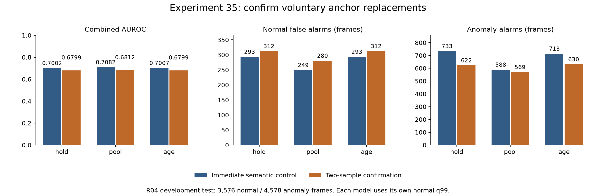

# 실험 35 — 자발적 anchor 교체의 연속 우위 확인

## 1. 이번 실험 결과

**완료: 2회 확인 선택기·정상 재적합·holdout·테스트·고정 사례 검토.** 실험 34의 1순위 개선을 적용했다. 정상의 짧은 왕복 선택과 진입 미확인 episode는 줄었지만, 세 경로 모두 combined AUROC/AP와 frame recall이 낮아지고 정상 오탐이 늘었다. 구간 탐지는 증가했으나 임계값 하락의 효과가 섞여 있다. 안정화 구현은 확인했지만 검증된 탐지 성능 개선으로 채택하지 않는다.

### 단일 변경

`control`은 실험 34의 즉시 semantic 우선 선택이다. `confirmed`는 기존 anchor가 아직 eligible이면 **같은 대안 track이 2개 연속 sampled step에서 margin 최대일 때 교체**한다. 첫 우위 관측에서는 현재 유효한 이전 anchor를 유지한다. 동점은 이전 track→confidence→작은 cache index 순이다. 기존 후보가 없거나 filter에서 탈락하면 즉시 현재 최대 후보를 선택하며, bbox를 만들어 유지하지 않는다.

대안 확인 상태는 후보 소실·기존 후보 우위 회복·확인 완료 때 비우고, 대안 ID가 바뀌거나 sample이 끊기면 새로 센다. 상태는 descriptor 호출/영상마다 새로 시작한다. target이 누락돼도 anchor가 관측되면 역할별 선택 상태를 갱신한다. 2라는 값은 실행 전에 고정했고 다른 값 탐색은 하지 않았다.

후보·role·bbox·track·confidence·CLIP·semantic/면적 gate·3회 causal median·target 선택·valid mask는 그대로다. 선택된 쌍 변경 시 관계 평균 reset, **실험 18의 고정 관계 중심/scale**, 같은 쌍 전이 결합, 기존 체류 정책, hold/pool/age fallback과 τ=56도 유지한다. phase를 새 선택으로 계산하고 정상 PCA/전이/체류/CDF/q99는 재적합했다. 공유 bank rank는 양 구성 자연 rank와 실험 34 상한의 최소값이며 결과적으로 기존 map과 같고 신설/소실 bank는 없다. pooled PCA도 같다.

### 평가 범위

R04, seed 42, stride 4 source frames. FIT 20영상/7,812 frames/1,960 samples, calibration 5영상/1,920 frames/482 samples, test 19영상/8,154 frames/2,047 samples다. test 정상 3,576/이상 4,578 frames, 이상 구간 26개다. 정상 단계와 24개 고정 사례 검토를 동결한 뒤 테스트했다. R04는 반복 관찰한 개발 자료이며 독립 평가가 아니다. FPS/timestamp가 없어 초 단위 시간은 보고하지 않는다. VLM·검출기·encoder 재호출 및 로컬 서버 설정 변경은 없다.

### 성능

각 구성의 정상 calibration **q99에서 strict `>`**를 사용하며 서로 다른 임계값이다. AP는 average precision이고 구간 탐지는 구간 내 한 frame 이상 경보가 있는 경우다.

| 구성 | Visual AUROC / AP | Combined AUROC / AP | 정상 FPR (FP) | 이상 recall (TP) | 탐지 / 26 |
|---|---:|---:|---:|---:|---:|
| control_hold | 0.6794 / 0.6781 | 0.7002 / 0.6964 | 8.19% (293) | 16.01% (733) | 12 |
| control_pool | 0.6864 / 0.6837 | 0.7082 / 0.7027 | 6.96% (249) | 12.84% (588) | 11 |
| control_age | 0.6797 / 0.6777 | 0.7007 / 0.6960 | 8.19% (293) | 15.57% (713) | 12 |
| confirmed_hold | 0.6819 / 0.6769 | 0.6799 / 0.6745 | 8.72% (312) | 13.59% (622) | 14 |
| confirmed_pool | 0.6830 / 0.6774 | 0.6812 / 0.6752 | 7.83% (280) | 12.43% (569) | 15 |
| confirmed_age | 0.6818 / 0.6761 | 0.6799 / 0.6737 | 8.72% (312) | 13.76% (630) | 14 |



control은 실험 34 semantic의 정상 모델/점수와 test 예측 57개를 정확히 재현했다. confirmed hold/pool/age의 FP는 각각 +19/+31/+19, TP는 −111/−19/−83프레임이다. 구간은 +2/+4/+2개이며 잃은 구간은 없다. hold/age에서는 영상 09의 128 시작, 11의 170 시작 구간을 추가했다. pool은 이 두 구간과 04의 261, 11의 279 시작 구간을 추가했다.

탐지된 구간만의 지연 중앙값은 control 45.5/75/45.5→confirmed 57.5/40/57.5 source frames다. 탐지 대상 집합이 달라져 이를 전체 탐지 지연의 개선/악화로 단정하지 않는다. 실험 31 hold(AUROC .7210, FP 309/TP 829, 16구간)와 비교해도 confirmed hold(.6799, 312/622, 14구간)는 종합 개선이 아니다. 이번 대조군을 더 낮은 성능의 실험 34로 삼았다는 점을 숨기지 않는다.

### 정상 holdout과 임계값 효과

| 경로 | control q99 → confirmed q99 | 정상 holdout FP / 1,920 frames |
|---|---|---:|
| hold | 0.9989626556 → 0.9974576271 | 28 → 36 |
| pool | 0.9989626556 → 0.9968879668 | 36 → 40 |
| age | 0.9989626556 → 0.9974576271 | 28 → 36 |

FIT를 고정한 calibration 영상 5개 leave-one-video-out 보정에서 held-out 영상을 CDF/q99 적합에 넣지 않았다. 30개 cell 모두 finite/bounded·q99<1이다. hold/age의 영상 08은 FP 4→0이지만 12는 4→16으로 늘었다. pool은 02·08에서 줄지만 12는 12→24, 15는 4→8로 늘었다.

동일 confirmed 점수에 대응 control q99를 적용한 **사후 진단**이다. 테스트에 맞춰 threshold를 선택하지 않았다.

| confirmed 점수에 적용한 임계값 | hold FP / TP / 구간 | pool FP / TP / 구간 | age FP / TP / 구간 |
|---|---:|---:|---:|
| 자신의 정상 q99 | 312 / 622 / 14 | 280 / 569 / 15 | 312 / 630 / 14 |
| control q99 | 285 / 529 / 13 | 241 / 388 / 11 | 285 / 509 / 13 |

임계값 하락으로 hold/pool/age에서 각각 FP 27/39/27, TP 93/181/121과 구간 1/4/1개가 추가된다. 특히 pool의 순 구간 증가 4개는 이 공통 임계값 대조에서 사라진다. 구간 수 증가를 선택 안정화 자체의 독립 효과로 주장할 수 없다.

### 선택과 관측의 변화

| 진단 | FIT | calibration | test |
|---|---:|---:|---:|
| 바뀐 anchor 선택 sample | 43 | 15 | 65 |
| 바뀐 phase sample / source frames | 47 / 188 | 35 / 140 | 67 / 266 |
| 연속 valid 쌍 교체: control → confirmed | 135 → 85 | 37 → 29 | 146 → 81 |
| strict same-pair complete episode | 6 → 7 | 2 → 2 | 6 → 6 |
| unknown-entry episode | 294 → 244 | 87 → 79 | 302 → 237 |
| right-censored episode | 20 → 21 | 7 → 8 | 20 → 22 |

유효 관계는 두 구성에서 FIT 1,123/1,960, calibration 297/482, test 1,406/2,047로 같다. target 선택도 같으며 target-only/both 경계 재분류를 target tracking 개선으로 해석하지 않는다.

연속 valid sample의 anchor 교체 원인은 다음과 같다. `both`의 anchor 변화도 포함한다.

| 원인/진단 | FIT control → confirmed | calibration control → confirmed |
|---|---:|---:|
| 이전 후보도 eligible인 자발적 교체 | 36 → 9 | 11 → 7 |
| 이전 ID 캐시 후보 부재 | 57 → 30 | 16 → 11 |
| 이전 후보 면적 탈락 | 1 → 1 | 3 → 3 |
| 이전 후보 semantic 탈락 | 3 → 3 | 0 → 0 |
| 한 sample 뒤 이전 ID로 복귀 — 위 분류와 중첩 | 38 → 11 | 9 → 5 |

후보 생성/면적 gate가 바뀐 것은 아니다. 짧은 후보를 처음부터 선택하지 않으면 그 후보가 사라질 때 되돌아가는 경계도 줄기 때문에, 동일한 강제 교체 규칙 아래에서도 부재 기반 교체 수가 달라질 수 있다. 왕복 감소는 tracking/역할 정확도 개선의 GT 지표가 아니다.

### 확인 상태와 지연

모든 sample에서 확인을 기다린 사건은 FIT 43/calibration 15개다. 다음 sample의 결과는 다음과 같다.

| 다음 step의 결과 | FIT | calibration |
|---|---:|---:|
| 두 번째 우위 확인 후 교체 | 10 | 8 |
| 기존 anchor 우위 회복으로 유지 | 32 | 5 |
| eligible anchor 누락 | 1 | 1 |
| 영상 종료 | 0 | 1 |

확인된 18개 사건은 모두 첫 pending 관측보다 4 source frames 뒤에 교체됐다. 이는 코드의 확인 지연이며 실제 물체 인식/공정 전환의 정답 지연이 아니다. FIT 확인 교체 10개와 연속 valid 자발적 교체 9개가 다른 것은 관계의 양쪽 관측 조건과 역할별 선택 조건의 집계 범위가 다르기 때문이다.

### 체류 지원과 독자 기여

기존 체류 정책의 지원 맥락은 control 5개 `3→2:17, 2→3:13, 2→1:11, 1→3:14, 1→2:19 runs`에서 confirmed의 **1→3:13 하나**로 줄었다. 나머지는 최소 10개에 미달한다(`3→2:9, 2→3:6, 2→1:4, 1→2:4, 3→1:9`). 성능을 회복하려고 최소 지원을 9로 낮추지 않았다.

strict same-pair FIT complete는 control 1→3/3→1 각 3개, confirmed 3/4개뿐이다. 기존 체류 분포가 지원한다고 판단하는 1→3의 13 runs가 모두 같은 객체 쌍의 완결 관측이라는 뜻은 아니다.

| 공정 진단 | control hold / pool / age | confirmed hold / pool / age |
|---|---|---|
| 체류 점수 가용 test frames | 모두 2,121 | 모두 429 |
| 전이 독자 FP / TP | 모두 0 / 0 | 모두 0 / 0 |
| 체류 독자 FP / TP | 모두 13 / 167 | 모두 0 / 0 |
| Visual에 추가한 구간 | 모두 0 | 모두 0 |

confirmed의 최종 경보 집합은 같은 combined q99를 적용한 Visual과 정확히 같다. 공정 점수는 경보를 추가하지 못하면서 combined ranking을 Visual보다 낮췄다. 예를 들어 hold Visual AUROC .6819/AP .6769 대비 combined .6799/.6745다. 이는 체류 지원·phase·정상 CDF 변화가 함께 작용한 결과이며 선택 지연 하나만의 원인으로 단정하지 않는다.

### 같은 24개 사례의 시각 비교

실험 33에서 고정한 24개 경계/72개 정상 이미지를 유지했다. 접촉 시트 12장을 모두 확인한 뒤 메모를 동결했다. 세 frame 중 선택이 바뀐 사례는 4개, 해당 frame도 4개다.

- `05_0032`의 36, `06_0384`의 388, `13_0124`의 128 frame에서 즉시 선택군은 blade로 보이는 후보를 고르지만 확인군은 바이스를 유지한다. 연속성 안정화가 올바른 역할 복구를 늦출 수 있다는 반례다.
- `02_0176`은 172에서 바이스를 한 번 더 유지하고 176에서 blade로 보이는 후보를 선택하며 180에는 두 구성 모두 다시 바이스를 선택한다. 모든 짧은 역할 교체를 제거하지는 못한다.
- `01_0024`의 세 frame은 두 구성 모두 blade로 보이는 같은 track을 유지한다. 나머지 동일 선택 사례의 후보 부재·면적 제외·target 혼동은 여전하다.

24개 전체 [관찰/불확실성](../results/experiment35/visual_review.json)을 기록했다. 탐색 메모이고 bbox/action GT가 아니며 목적 표집의 정확도를 계산하지 않는다. 원본/접촉 시트는 공개하지 않는다.

## 2. 실험 결과의 의의

**현재 역할 근거가 더 강하다는 사실과 시간적으로 같은 객체를 계속 관측했다는 사실을 구분하는 선택기**를 구현했다. eligible 이전 객체가 있을 때만 확인을 기다리고, 후보가 사라지면 즉시 전환하며, 미래를 쓰거나 누락 bbox를 만들어내지 않는 동작을 검증했다.

선택의 왕복이 줄어도 체류 학습 지원과 score calibration이 바뀌어 전체 탐지가 낮아질 수 있음을 확인했다. 특히 관측 mask는 동일한데 지원 맥락이 5→1로 줄고 공정 독자 경보가 0이 된 점은 관측률만으로 공정 모델의 유용성을 판단할 수 없음을 보여준다. 단일 heuristic 구현이나 일부 지표 향상을 논문 novelty·의미 정확도·일반화·통계적 유의성으로 간주하지 않는다.

## 3. 보완할 점

- combined ranking·frame recall·정상 holdout은 악화됐다. 자신의 q99에서 구간 수가 늘었지만 threshold 하락이 상당 부분 설명한다. 모든 지표를 한 줄의 성공/실패 성능으로 압축할 수 없다.
- 시각 사례에서 blade로 보이는 후보의 선택을 늦추고 바이스를 유지했다. 더 안정적인 오선택일 가능성을 GT 없이 배제할 수 없다.
- 실험 18 phase 중심/scale은 다른 선택 정책에서 적합됐다. 현재 confirmed의 정상 유효 sample 분포는 latent 0/1/2/3에 2/697/132/292로 크게 불균형하며, latent 0의 외형 phase bank는 지원되지 않는다. 기존 중심과 현재 관측 정책의 정합성은 미검증이다. 이를 이번 성능 저하의 확정 원인으로 부르지는 않는다.
- strict complete는 FIT 7개이고 기존 체류 지원과 불일치한다. 누락·교체·검열 자료를 실제 완결 체류로 대체할 수 없으며 최소 지원 완화로 해결해서는 안 된다.
- 24개 목적 표집과 단일 R04/seed, 반복 개발 평가, 녹화 그룹 독립성/역할·action GT/FPS 부재를 유지한다. Stage 00 원본 라벨 불일치 11영상의 정확한 정렬은 미해결이다. 비용·추론 지연·localization 정확도는 미측정이다.

## 4. 다음 Recommended improvements — 추천순 3개

| 추천순 | 개선 후보와 변경 내용 | 이번 결과의 근거 | 검증 기준 및 주의점 |
|---|---|---|---|
| 1 | **현재 선택 정책에 맞춘 정상 phase 모델 재적합**: confirmed 선택·관측·descriptor는 고정하고 정상 FIT의 location/scale·KMeans 중심만 재학습 | 다른 선택 정책의 실험 18 중심을 계속 사용. 정상 유효 phase 분포 2/697/132/292, 체류 지원 5→1, 공정 독자 경보 0이며 combined ranking이 Visual보다 낮음 | gate/선택/이력은 고정하고 정상 FIT만 사용. cluster label permutation·새 bank/support·normal holdout·최종 성능을 분리. 중심 불일치는 가설이고 재학습이 역할 오류를 해결하지는 않음 |
| 2 | **체류 관측 근거를 같은 객체 쌍의 연속성으로 제한**: 실제 진입 이후 ID 연속성을 체류 사용/학습 근거와 연결하는 대조 | 기존 1→3 support 13개 대비 strict same-pair complete 3개. 전체 strict FIT complete 7개뿐이며 체류 가용성도 429프레임으로 줄어듦 | 기존 분포를 고정한 결합 gate와 학습 자료 변경을 동시에 하지 않고 각각 분리. support 부족을 숨기거나 threshold를 낮추지 않으며 참 이상 지속 차단도 보고 |
| 3 | **정상 역할·후보 연속성 검증 보강**: blade/바이스와 target 혼동, 후보 부재/면적 탈락을 구분해 관측 근거 개선 | 확인군에서도 anchor 후보 부재 기반 교체 30/11회, 면적 탈락 1/3회. 4개 변경 사례에서 blade 선택 지연·바이스 유지 관찰 | 정상 근거로 한 요소씩 고정하고 별도 보조 역할 주석·관측률·최종 탐지를 분리. 안정적인 track을 정확한 역할로 취급하거나 목적 표집을 정확도로 환산하지 않음 |

1순위만 [실험 36 계획](EXPERIMENT36_PLAN.md)으로 구체화한다. 확인 횟수의 추가 탐색은 하지 않는다. 현재 branch를 연구용 대조로 유지하며 검증된 성능 향상으로 채택한다는 뜻은 아니다.

## 검증·산출물·재현

- 단위 테스트 **147개 통과**. 새 9개는 두 번 확인·동점·대안 변경, 후보 누락/강제 교체, 기존 후보 우위 회복, step gap, target 누락 중 상태 갱신, 입력 불변/새 호출 초기화, prefix·미래 불변, 잘못된 설정을 검사한다.
- 정상/test **88개 derived feature 파일**에서 별도 scalar 상태기로 선택과 확인 이력을 재구성하고 관계 평균/phase를 검증했다. target·margin·valid·원본 특징이 동일하다.
- 정상 holdout **30개 cell**, test 예측 **114개**를 재계산해 model/score/CDF/q99·same-pair 전이 gate·metric/event를 확인했다. control의 test 예측 57개는 실험 34 semantic의 모든 배열과 정확히 같다.
- 기존 정상 입력/모델/점수·relation/text 파일 **208개**와 코드/계획을 사전에 동결했다. 정상 단계에서 test 접근을 차단하고 시각 검토 checkpoint까지 확인한 뒤 test를 열었다. 이미지/특징/가중치/예측/로그는 업로드하지 않는다. 집계 PNG를 열어 렌더링을 확인했다.
- [설정 예시](../configs/experiment35_confirmed_hold.json), [정상 변환](../results/experiment35/normal_transform.json), [rank 대조](../results/experiment35/fit_rank_control.json), [정상 audit](../results/experiment35/normal_audit.json), [확인 상태/교체 원인](../results/experiment35/normal_confirmation_mechanism.json), [전체 진단](../results/experiment35/diagnostic.json), [CSV](../results/experiment35/comparison.csv), [검증](../results/experiment35/validation.json).

동일한 로컬 데이터와 선행 캐시를 전제로 저장소 루트에서 실행한다. 기존 protocol을 덮어쓰지 않는다.

```bash
PYTHONPATH=src .venv/bin/python -m pytest -q
PYTHONPATH=src .venv/bin/python scripts/experiment35_confirmed_anchor.py prepare
PYTHONPATH=src .venv/bin/python scripts/experiment35_confirmed_anchor.py normal
PYTHONPATH=src .venv/bin/python scripts/review_confirmed_anchor.py
# 접촉 시트 실제 검토 후 visual_review.json과 pre_evaluation_review_checkpoint를 보존한다.
PYTHONPATH=src .venv/bin/python scripts/experiment35_confirmed_anchor.py test_prepare
# normal_audit.json의 eligible 구성만 각각 실행한다. 예:
PYTHONPATH=src .venv/bin/python scripts/evaluate_baseline.py --config configs/experiment35_confirmed_hold.json --data-root /media/jeong/ExtHDD/IPAD_vLLM/IPAD_dataset
PYTHONPATH=src .venv/bin/python scripts/diagnose_confirmed_anchor.py
PYTHONPATH=src .venv/bin/python scripts/audit_anchor_confirmation.py
MPLCONFIGDIR=.cache/matplotlib .venv/bin/python scripts/report_confirmed_anchor.py
```
