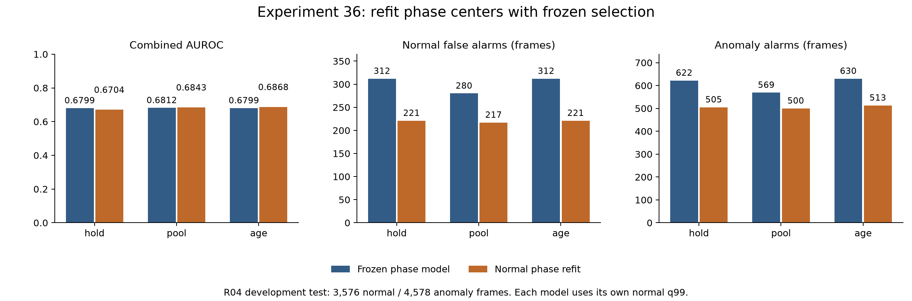
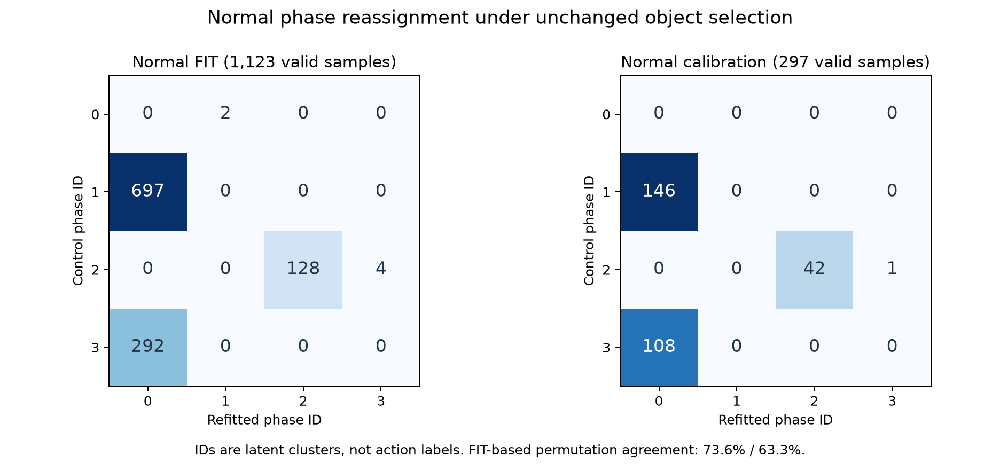

# 실험 36 — 현재 객체 선택에 맞춘 정상 phase 재학습

## 1. 이번 실험 결과

**완료: 정상 FIT 재학습·보정 holdout·기존 사례 metadata 비교·R04 테스트.** 실험 35의 1순위를 적용했다. 객체 선택과 관계 descriptor는 그대로인데 phase 분할이 크게 달라졌다. 정상/test 오탐은 줄었지만 정탐 프레임도 감소했고, 같은 객체 쌍의 연속 관측에서 phase 전환이 사라졌다. 이를 공정 상태 학습의 성공으로 채택하지 않는다.

### 단일 변경과 고정 조건

control은 실험 35 confirmed와 실험 18의 관계 중심/scale이다. refit은 **정상 FIT 20영상만으로 median·IQR(scale floor .05)·KMeans 4개 중심을 재학습**한다. seed=42, n_init=10이며 cluster ID는 정상 FIT median relative frame position 순으로 정한다. calibration/test는 이 적합과 ID 정렬에서 제외했다. 면적 gate 재학습을 하지 않는 함수를 추가했고 기존 클래스/이전 실험 코드는 수정하지 않았다.

검출·track·CLIP·정상 vocabulary·semantic margin/causal median·2회 anchor 확인·target 선택·관계 valid mask·쌍 경계 평균 reset·6차원 descriptor는 고정했다. 같은 쌍 전이 gate, 기존 identity-unaware 체류 모델, self/next/cycle template와 hold/pool/age(τ=56)를 유지한다. 새 phase로 PCA/전이/체류/CDF/q99는 정상에서 재적합한다. 새 VLM·검출기·encoder 호출 및 로컬 llama.cpp 설정 변경은 없다.

R04 FIT 20영상/7,812 frames/1,960 samples, calibration 5영상/1,920 frames/482 samples, test 19영상/8,154 frames/2,047 samples다. test 정상 3,576/이상 4,578 frames, 이상 구간 26개다. stride=4 source frames이며 FPS/timestamp는 없어 초 단위 결과는 없다. R04는 반복 개발 자료이고 독립 평가가 아니다.

### 탐지 결과

각 구성의 정상 q99에서 strict `>`를 사용한다. hold/age는 두 구성의 q99가 같고 pool은 다르다. AP는 average precision, 구간 탐지는 한 frame 이상 경보가 있는 경우다.

| 구성 | Visual AUROC / AP | Combined AUROC / AP | 정상 FPR (FP) | 이상 recall (TP) | 탐지 / 26 |
|---|---:|---:|---:|---:|---:|
| control_hold | 0.6819 / 0.6769 | 0.6799 / 0.6745 | 8.72% (312) | 13.59% (622) | 14 |
| control_pool | 0.6830 / 0.6774 | 0.6812 / 0.6752 | 7.83% (280) | 12.43% (569) | 15 |
| control_age | 0.6818 / 0.6761 | 0.6799 / 0.6737 | 8.72% (312) | 13.76% (630) | 14 |
| refit_hold | 0.6703 / 0.6755 | 0.6704 / 0.6752 | 6.18% (221) | 11.03% (505) | 14 |
| refit_pool | 0.6836 / 0.6840 | 0.6843 / 0.6839 | 6.07% (217) | 10.92% (500) | 15 |
| refit_age | 0.6861 / 0.6856 | 0.6868 / 0.6855 | 6.18% (221) | 11.21% (513) | 14 |



control의 정상 모델/점수 및 test 예측 57개 모든 배열은 실험 35 confirmed와 정확히 같다. refit hold/pool/age의 FP는 −91/−63/−91, TP는 −117/−69/−117프레임이다. 구간 수는 같지만 **각 경로에서 영상 17의 95 시작 구간을 얻고, 11의 170 시작 구간을 잃었다**. 같은 구간을 유지한 것은 아니다.

탐지된 구간만의 지연 중앙값은 57.5/40/57.5→38/32/38 source frames다. 탐지 대상 집합이 달라 전체 탐지 지연 개선으로 단정하지 않는다. Combined AUROC는 hold에서 낮아지고 pool/age에서 높아졌으며, AP는 세 경로 모두 소폭 높아졌다. 과거 실험 31 hold(.7210, FP309/TP829, 16구간)보다 이번 refit hold(.6704, FP221/TP505, 14구간)는 ranking/recall/구간이 낮고 FP만 적다. 연속 실험을 모두 누적 성능 향상으로 부르지 않는다.

### 정상 holdout·임계값

FIT 모델을 고정한 calibration 영상 5개 leave-one-video-out에서 held-out 영상을 CDF/q99 적합에 넣지 않았다. 30개 cell 모두 finite/bounded·q99<1 검증을 통과했다.

| 경로 | control q99 → refit q99 | 정상 holdout FP / 1,920 frames |
|---|---|---:|
| hold | .9974576271 → .9974576271 | 36 → 24 |
| pool | .9968879668 → .9972375691 | 40 → 32 |
| age | .9974576271 → .9974576271 | 36 → 24 |

hold/age는 영상 02 FP12→8, 12 FP16→4지만 08 FP0→4로 늘었다. pool은 02·12·15에서 각각 4프레임 줄고 08에서 4 늘었다. 영상 10은 모두 0이다. 개선이 모든 영상에 동일하지 않다.

refit 점수에 대응 control q99를 적용한 사후 진단에서도 FP/TP/구간이 **221/505/14, 217/500/15, 221/513/14로 동일**하다. 이번 경보 차이를 pool의 작은 q99 변화로 설명할 수 없다. 다만 정상 CDF 자체도 재적합됐으므로 같은 숫자 임계값이 원시 거리의 동일한 기준이라는 뜻은 아니다.

### phase 재분할과 지원

정상 FIT 1,123개의 동일 유효 descriptor에서 재학습했다. 관측 mask·선택 index·raw features·descriptor는 normal/test 전체에서 정확히 같다.

| 집합 | control 유효 phase 0/1/2/3 | refit 유효 phase 0/1/2/3 | FIT 대응표 적용 일치율 |
|---|---|---|---:|
| FIT | 2 / 697 / 132 / 292 | 989 / 2 / 128 / 4 | 73.64% |
| calibration | 0 / 146 / 43 / 108 | 254 / 0 / 42 / 1 | 63.30% |
| test | 7 / 812 / 71 / 516 | 1,328 / 5 / 69 / 4 | 별도 상태 정확도 평가 아님 |



FIT contingency의 Hungarian 대응표는 refit→control `0→1, 1→0, 2→2, 3→3`으로 **정상에서 동결한 진단용**이다. inference/grammar를 이 표로 다시 매핑하지 않았다. FIT의 원래 숫자 ID 일치율은 11.40%로 낮지만, permutation을 보정해도 73.64%다. 기존 phase 1과 3의 697+292 samples가 새 phase 0으로 합쳐졌기 때문이다. 단순 이름 변경만은 아니며, 대응표 일치율은 action 정확도가 아니다.

새 phase 0은 FIT 88.07%이며 20영상에 나타나고 최대 한 영상의 기여는 8.09%다. 단일 영상만의 큰 cluster는 아니다. 희소 phase 1/3은 각각 2/3영상에 2/4 samples뿐이다. K=4는 성립하지만 네 상태 모두 충분한 지원을 갖는다는 가설은 충족하지 못했다.

관측 FIT 기반 외형 bank는 control의 phase 1/2/3에서 refit의 0/2로 바뀐다. 새 phase 0 bank 4개가 생기고 기존 phase 1/3 bank 8개가 사라진다(각각 global 및 3 roles). 공통 numeric phase 2의 rank는 global30/anchor29/다른 role32로 유지되며 나머지는 32다. pooled PCA는 정확히 같다. ID와 표본이 바뀌므로 rank 통제를 동일 의미 bank 비교로 간주하지 않는다.

### 공정 관측 근거와 체류

| 진단 | FIT control → refit | calibration control → refit | test control → refit |
|---|---:|---:|---:|
| 유효 관계 samples | 1,123 → 1,123 | 297 → 297 | 1,406 → 1,406 |
| 연속 valid 쌍 교체 | 85 → 85 | 29 → 29 | 81 → 81 |
| strict same-pair complete episode | 7 → 0 | 2 → 0 | 6 → 0 |
| right-censored episode | 21 → 0 | 8 → 0 | 22 → 0 |
| unknown-entry episode | 244 → 244 | 79 → 79 | 237 → 237 |

FIT/calibration에서 같은 객체 쌍의 연속 valid 전환은 control의 비자기 전이 **28/10회에서 refit 0/0회**로 사라졌다. refit은 같은 쌍 안에서는 phase0 또는 phase2 자기 전이만 남는다. 객체 쌍이 바뀌거나 관측이 끊길 때 달라지는 외형/기하 분할을 실제 공정 진행으로 해석할 수 없다.

기존 체류 모델은 여전히 refit의 **0→2:13 runs**를 지원한다. 하지만 이 13개 모두 진입과 이탈 경계에서 같은 쌍 조건을 만족하지 않으며, 그중 2개는 run 내부에도 쌍 변화가 있다. 정상 FIT/calibration 체류 가용 64/28 samples에서 실제 진입 이후 같은 쌍이 유지된 것은 0이다. 이는 support 수만으로 충분한 관측 근거를 보장할 수 없다는 반례다. 최소 support=10을 낮추지 않았다.

체류 가용 test frames는 429→97로 줄었다. 모든 구성·경로에서 Visual에 추가하는 전이·체류 독자 FP/TP와 새 구간은 **0**이다. 최종 경보 집합은 같은 combined q99를 적용한 Visual과 같다. 공정 점수는 ranking에만 영향을 주며, refit의 Combined AUROC는 Visual보다 아주 조금 높지만 AP는 세 경로 모두 아주 조금 낮다. 유용한 공정 탐지가 확보됐다고 주장하지 않는다.

### 기하 거리의 극단값과 fallback 진단

정상 median/IQR로 정규화한 좌표에서 상대 x의 최대 절댓값은 96.76이다. 희소 phase 1/3의 **6 samples(0.53%)가 median 중심 제곱 에너지의 44.09%**를 차지한다. 상대 x와 anchor y가 전체 에너지의 각각 42.89%/42.05%다. 이 에너지는 KMeans inertia나 원인 기여율이 아니다. 하지만 작은 수의 극단 좌표가 거리 분할에 큰 영향을 줄 수 있다는 다음 가설의 근거다.

phase1의 FIT 두 사례는 03/frame36과 05/frame420이며 선택 anchor의 정규화 폭이 .0287/.0266, 상대 x descriptor는 27.93/21.17이다. 작은 box를 오검출로 확정하지 않는다. phase3의 FIT 네 사례는 01/184·196, 09/348, 24/308이다. 이번 단계에서 이 새 희소 사례의 추가 이미지 판독이나 역할 GT 부여는 하지 않았다.

기존의 첫 관측 전 숫자 phase0 초기값도 유지됐다. refit에서 phase0 bank가 생겨 hold는 이를 요청할 수 있지만 pool/age는 pooled를 요청한다. 첫 관계 관측 전 FIT/calibration/test는 492/80/652 frames이며 test의 652는 모두 정상, 모든 경로의 FP는 0이다. 이 구조 차이와 CDF 재적합을 무시하고 hold와 age의 ranking 차이를 순수한 phase 품질 효과로 해석하지 않는다.

실험 35에서 이미 판독한 **동일 24개 정상 사례/72 frames**는 객체 선택과 descriptor가 같다. 이미지 재선정·새 시각 판독 없이 phase/거리/bank 지원 metadata만 비교했다. 61 frames(유효 관측 47)에서 숫자 ID가 달라졌으며 의미 변화율로 환산하지 않는다. 거리에는 구성별 scale이 쓰여 모델 간 거리 감소를 정확도 향상으로 읽을 수 없다.

## 2. 실험 결과의 의의

객체 관측·관계 표현·잠재 상태 분할·외형 bank·공정 근거의 연결을 단계별로 분리해 확인했다. 정상 phase를 현재 선택으로 다시 학습하는 구현과 FIT-only provenance를 확보했으며, **외형 오탐 감소와 공정 상태 관측의 개선이 서로 다른 주장**임을 실제 반례로 드러냈다.

네 cluster가 만들어지고 보정 검증이 통과해도 동일 객체 쌍의 진입/전환을 관측하지 못할 수 있다. 이 실패 양상과 검증 절차는 캡스톤 파이프라인 구현의 분석 결과로 기록한다. KMeans 재학습이나 일부 지표 상승 자체를 새 알고리즘의 novelty, action 의미 정확도, 일반화 또는 통계적 유의성으로 주장하지 않는다.

## 3. 보완할 점

- 정상/test 오탐은 감소했지만 frame recall은 세 경로 모두 감소했다. hold AUROC는 악화됐고 구간 수가 같아도 한 구간을 잃었다. 종합적으로 우월한 모델로 채택하지 않는다.
- 희소 cluster 지원 부족, 기존 상태 병합, 동일 객체 쌍에서의 phase 전환 소실이 남았다. 거리 재적합이 역할 오류·관측 손실을 해결하지 않는다.
- 체류 지원 13개와 실제 동일 쌍 완결 관측 0개가 모순된 듯 보이는 것은 정의 차이다. 기존 체류가 track 경계를 검사하지 않는 한 공정 근거가 과대 해석될 수 있다.
- 초기 phase0 및 상태별 bank 생성/소실과 CDF가 함께 바뀐다. 상대 좌표의 극단값은 원인 가설이며, clipping이나 다른 K를 사후 적용해 이번 결과를 교체하지 않았다.
- 같은 R04/seed의 반복 개발, 녹화 그룹 독립성 미확인, bbox/역할/action GT·FPS 부재, 비용/실시간 지연·localization 정확도 미측정을 유지한다. Stage00 원본 라벨 불일치 11영상의 정확한 정렬은 미해결이다.

## 4. 다음 Recommended improvements — 추천순 3개

| 추천순 | 개선 후보와 변경 내용 | 이번 결과의 근거 | 검증 기준 및 주의점 |
|---|---|---|---|
| 1 | **phase 거리의 극단값 영향 완화**: 동일 정상 median/IQR 이후 좌표별 `asinh(z)`를 적용해 KMeans와 추론 거리를 함께 변경 | 정상 6/1,123 samples가 median 중심 제곱 에너지 44.09%를 차지. 새 cluster 지원 989/2/128/4, 같은 쌍 phase 전환·strict complete 0 | 선택·관측·descriptor·K/seed·support를 고정. 정상 cluster/영상 지원·같은 쌍 전환·holdout과 최종 경보를 분리. 극단적인 실제 공정 변화를 약화시킬 수 있고 단순 균형이 정확도는 아님 |
| 2 | **체류 점수의 관측 근거를 같은 객체 쌍으로 제한**: 기존 체류 분포를 고정한 채 실제 진입 이후 동일 쌍 이력을 결합 조건으로 대조 | 지원된 새 0→2 정상 FIT 13 runs 모두 진입·이탈 시 쌍이 달라짐. 체류 가용 정상 FIT/calibration 64/28 samples 중 같은 쌍 진입 근거는 0 | 학습 자료와 결합 gate를 동시에 바꾸지 않음. 차단되는 정상/이상 경보·가용성을 보고하고 지원을 낮추지 않음. 현재 모델에서는 branch가 꺼질 수 있어 탐지 개선으로 오해하지 않음 |
| 3 | **역할 및 기하 descriptor 근거 보강**: 작은 anchor box·바이스/칼날 혼동과 실제 관계 변화를 구분하는 정상 진단 | 희소 phase 1의 두 anchor 폭은 약 .027/.029이고 상대 x는 21.17/27.93. 기존 역할 오류는 선택 고정으로 그대로이며 단일 상태가 FIT 88.07%를 차지 | 정상 역할 주석·bbox 근거를 확보하고 후보 필터 또는 descriptor 한 요소만 대조. 작은 box를 자동 오검출로 단정하거나 현재 24개 목적 표집을 정확도로 환산하지 않음 |

1순위만 [실험 37 계획](EXPERIMENT37_PLAN.md)으로 구체화한다. `asinh`는 표준 수학 변환이며 그 자체를 novelty로 부르지 않는다. 성능 향상 약속이 아니라 관측된 거리 편중 가설의 단일 대조다.

## 검증·산출물·재현

- 전체 단위 테스트 **152개 통과**. 새 5개는 기존 학습 recipe 동일성, gate 재적합 금지/선택 불변, prefix·미래·추론 시 frame position 비참조, 실패 시 모델 보존, 잘못된 입력을 검사했다.
- 별도 코드로 정상 median/IQR/KMeans/order/대응표를 정확히 재구성했다. 정상 25영상×2구성×2prefix=**100회** 검증했다. 정상 단계의 numeric 접근 allowlist와 test/label 차단, phase FIT 중 실제로 연 정상 입력 20개 기록을 보존했다.
- 88개 derived feature에서 scalar 선택/관계 평균/phase 재구성, 정상 holdout 30개 cell과 test 예측 114개의 모델/CDF/q99/전이 gate/metric/event 재계산을 통과했다. control test 예측 57개는 이전 실험과 모든 배열이 같다.
- 기존 정상 수치 파일을 보존하고 모델/설정/정상 대응표·진단 checkpoint 이후 test를 열었다. 원본·가중치·feature cache·prediction·서버 로그는 업로드하지 않는다. PNG 두 장은 실제 렌더링을 확인했다.
- [설정](../configs/experiment36_refit_hold.json), [phase 적합](../results/experiment36/phase_fit.json), [정상 audit](../results/experiment36/normal_phase_audit.json), [체류/기하 근거](../results/experiment36/normal_duration_geometry_diagnostic.json), [고정 사례 metadata](../results/experiment36/fixed_case_phase_review.json), [fallback 진단](../results/experiment36/fallback_context.json), [전체 진단](../results/experiment36/diagnostic.json), [CSV](../results/experiment36/comparison.csv), [검증](../results/experiment36/validation.json).

로컬 데이터·이전 캐시를 전제로 저장소 루트에서 실행한다. 기존 동결 protocol을 덮어쓰지 않는다.

```bash
PYTHONPATH=src .venv/bin/python -m pytest -q
PYTHONPATH=src .venv/bin/python scripts/experiment36_phase_refit.py prepare
PYTHONPATH=src .venv/bin/python scripts/experiment36_phase_refit.py normal
PYTHONPATH=src .venv/bin/python scripts/audit_phase_refit.py
PYTHONPATH=src .venv/bin/python scripts/experiment36_phase_refit.py test_prepare
# normal_audit.json의 eligible 구성 각각 평가한다. 예:
PYTHONPATH=src .venv/bin/python scripts/evaluate_baseline.py --config configs/experiment36_refit_hold.json --data-root /media/jeong/ExtHDD/IPAD_vLLM/IPAD_dataset
PYTHONPATH=src .venv/bin/python scripts/diagnose_phase_refit.py
PYTHONPATH=src .venv/bin/python scripts/audit_refit_duration_provenance.py
PYTHONPATH=src .venv/bin/python scripts/audit_refit_fallback.py
MPLCONFIGDIR=.cache/matplotlib .venv/bin/python scripts/report_phase_refit.py
```
