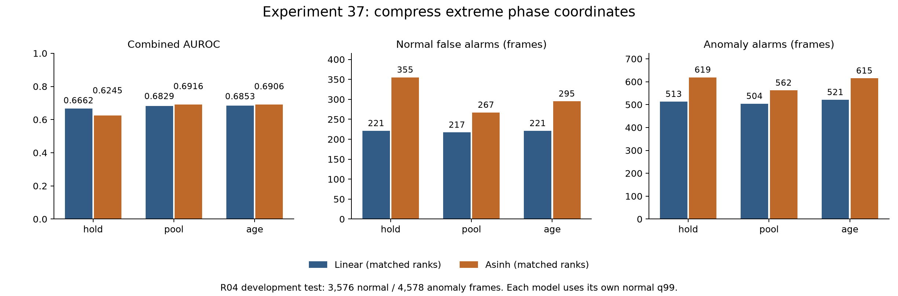
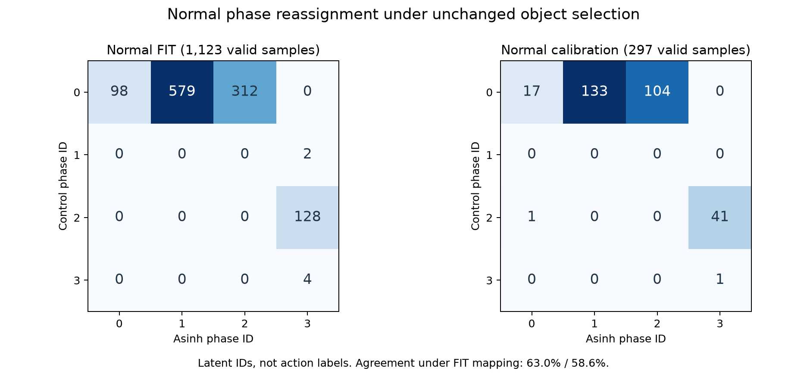

# 실험 37 — phase 좌표의 극단값 영향 완화

## 1. 이번 실험 결과

**완료: asinh 좌표 학습·정상 holdout·고정 사례 metadata 검토·R04 테스트.** 실험 36의 1순위를 적용했다. 네 phase 모두 충분한 표본을 갖고 같은 객체 쌍의 정상 전환도 다시 관측됐지만, 정상 holdout과 test 오탐은 늘었다. hold ranking은 크게 낮아지고 pool/age의 AUROC 상승에도 AP·구간 탐지는 낮아졌다. 전체 성능 개선으로 채택하지 않는다.

### 단일 변경과 범위

control은 실험 36 refit의 선형 좌표 `z=(x−median)/scale`이다. 변경군은 **동일 median/IQR 이후 `asinh(z)`**에서 정상 FIT로 KMeans 중심을 학습하며 추론도 같은 변환을 사용한다. `asinh`는 부호를 보존하는 단조·비선형 압축으로 유계 함수가 아니다. 계수/다른 변환/K/seed 탐색을 하지 않았다.

검출·track·CLIP·vocabulary·semantic margin/median·2회 anchor 확인·target 선택·면적 gate·valid mask·쌍 경계 평균 reset·6차원 descriptor 및 정상 median/scale은 정확히 고정했다. K=4, seed42, n_init10, scale floor .05, 정상 FIT median relative position의 ID 정렬을 유지한다. self/next/cycle template, 같은 쌍 전이 gate, 기존 체류 분포/지원 기준과 hold/pool/age(τ56)를 유지하며 정상 PCA/전이/체류/CDF/q99를 재적합했다. 새 VLM·검출기·encoder 호출과 llama.cpp 설정 변경은 없다.

R04 FIT 20영상/7,812 frames/1,960 samples, calibration 5영상/1,920 frames/482 samples, test 19영상/8,154 frames/2,047 samples다. test 정상 3,576/이상 4,578 frames, 이상 구간26개다. stride4 source frames이며 FPS/timestamp가 없어 초 단위 결과는 없다. R04는 반복 개발 자료이고 독립 검증이 아니다.

### PCA rank 통제와 이전 실험의 구분

이번 공유 rank 정책에 따라 numeric phase0의 **global rank32→31, anchor rank32→20**이 양 구성에 적용됐다. 따라서 control의 phase/입력은 실험 36 refit을 정확히 재현하지만, 외형 모델/보정/최종 점수는 같지 않다. 실험 36 수치를 이번 control로 대신 쓰지 않는다.

| 경로 | 실험 36 refit AUROC / AP | 이번 rank 통제 control AUROC / AP | FP 유지 / TP 변화 |
|---|---:|---:|---:|
| hold | .6704 / .6752 | .6662 / .6721 | 221 / 505→513 |
| pool | .6843 / .6839 | .6829 / .6827 | 217 / 500→504 |
| age | .6868 / .6855 | .6853 / .6845 | 221 / 513→521 |

이번 control과 실험 36의 57개 test 예측 파일에서 phase·label·객체 metadata·전이·체류·process 배열은 같다. pooled PCA도 같다. 그러나 phase0의 의미와 표본 자체가 두 구성에서 달라 numeric ID별 rank 통제가 완전한 의미 대응을 만들지는 않는다.

### 탐지 성능

각 구성의 정상 q99에서 strict `>`를 사용한다. hold/age는 같은 q99, pool은 다르다. AP는 average precision, 구간 탐지는 구간 내 한 frame 이상의 경보다.

| 구성 | Visual AUROC / AP | Combined AUROC / AP | 정상 FPR (FP) | 이상 recall (TP) | 탐지 / 26 |
|---|---:|---:|---:|---:|---:|
| control_hold | 0.6660 / 0.6724 | 0.6662 / 0.6721 | 6.18% (221) | 11.21% (513) | 14 |
| control_pool | 0.6820 / 0.6829 | 0.6829 / 0.6827 | 6.07% (217) | 11.01% (504) | 15 |
| control_age | 0.6843 / 0.6846 | 0.6853 / 0.6845 | 6.18% (221) | 11.38% (521) | 14 |
| asinh_hold | 0.6187 / 0.6363 | 0.6245 / 0.6377 | 9.93% (355) | 13.52% (619) | 14 |
| asinh_pool | 0.6860 / 0.6814 | 0.6916 / 0.6815 | 7.47% (267) | 12.28% (562) | 14 |
| asinh_age | 0.6852 / 0.6809 | 0.6906 / 0.6812 | 8.25% (295) | 13.43% (615) | 13 |



asinh의 hold/pool/age FP는 +134/+50/+74, TP는 +106/+58/+94프레임이다. hold는 영상07의 412 시작 구간을 얻고 10의 88 시작 구간을 잃어 14개를 유지한다. pool/age는 같은 10/88 구간을 잃고 새 구간이 없어 각각 15→14, 14→13개다.

탐지된 구간만의 지연 중앙값은 38/32/38→45.5/48/59 source frames다. 탐지 대상이 달라 전체 지연 변화로 단정하지 않는다. asinh pool/age AUROC는 이번 control보다 높지만 AP는 세 경로 모두 낮다. 실험 31 hold(.7210, FP309/TP829, 16구간)보다 이번 asinh hold(.6245, FP355/TP619, 14구간)는 네 지표 모두 낮다. 누적 성능 개선으로 포장하지 않는다.

### 정상 holdout과 임계값

FIT를 고정한 calibration 영상별 leave-one-video-out에서 held-out은 CDF/q99 적합에서 제외했다. 30개 cell 모두 finite/bounded·q99<1을 통과했다.

| 경로 | control q99 → asinh q99 | 정상 holdout FP / 1,920 frames |
|---|---|---:|
| hold | .9974576271 → .9974576271 | 20 → 44 |
| pool | .9972375691 → .9974576271 | 32 → 40 |
| age | .9974576271 → .9974576271 | 20 → 44 |

hold/age는 영상12 FP4→24, 15 FP4→8에서 증가한다. pool은 02 FP4→8, 12 FP20→24가 증가 원인이다. 영상10은 모두0이며 08은 모두4다. 정상 holdout 증가를 전체 테스트에서만 나타난 현상으로 숨기지 않는다.

동일 asinh 점수에 대응 control q99를 적용한 사후 대조도 FP/TP/구간 **355/619/14, 267/562/14, 295/615/13으로 동일**하다. 이번 경보 차이는 작은 q99 값 변화 때문이 아니다. CDF는 재적합되므로 원시 점수 기준이 같다는 뜻은 아니다.

### phase 분할과 거리 기여

| 집합 | control 유효 phase 0/1/2/3 | asinh 유효 phase 0/1/2/3 | 정상 FIT 대응표 적용 일치율 |
|---|---|---|---:|
| FIT | 989 / 2 / 128 / 4 | 98 / 579 / 312 / 134 | 62.96% |
| calibration | 254 / 0 / 42 / 1 | 18 / 133 / 104 / 42 | 58.59% |
| test | 1,328 / 5 / 69 / 4 | 83 / 698 / 547 / 78 | 의미 정확도 평가 아님 |



FIT에서는 control의 큰 phase0이 새0/1/2로 나뉘고, control1/2/3은 모두 새3에 합쳐진다. 새 네 phase는 FIT 18/20/20/18영상에 나타나며, 최대 한 영상의 기여는 10.20%/10.88%/11.22%/32.09%다. calibration에서는 모두5영상에 나타나지만 phase3의 한 영상 비중은69.05%다. cluster 균형을 의미 정확도로 간주하지 않는다.

FIT Hungarian 대응표 asinh→control은 `0→3, 1→0, 2→1, 3→2`이다. 일부 배정 셀은 관측수0인 강제 일대일 대응이며 의미 대응이 아니다. 진단용으로 정상에서 동결했고 inference/grammar에는 적용하지 않았다. 숫자 ID의 변화율을 action 변화 정확도로 사용하지 않는다.

이전 희소6 samples를 그대로 추적하면 좌표 원점 중심 제곱 에너지 비중은 **44.09%→5.38%**, 상대 x의 최대 절댓값은 **96.76→5.27**이다. 상대 x/anchor y의 에너지 비중도 42.89%/42.05%→16.64%/30.94%로 바뀐다. 좌표 단위가 다르므로 에너지/inertia의 감소를 물리적 오차나 정확도 개선으로 비교할 수는 없다. 관측된 극단값 편중이 완화된 것은 확인했다.

새 numeric phase1/3의 외형 bank8개가 생겨 4개 phase 모두 지원된다. 기존 phase0/2 bank8개는 공유하지만 담긴 상태 의미가 달라졌다. 공통 global/anchor rank는 phase0=31/20, phase2=30/29이며 다른 role와 신규 phase는32다. pooled 모델은 정확히 같다.

### 같은 객체 쌍의 공정 관측 근거

| 진단 | FIT control → asinh | calibration control → asinh | test control → asinh |
|---|---:|---:|---:|
| 유효 relation samples | 1,123 → 1,123 | 297 → 297 | 1,406 → 1,406 |
| 연속 valid 쌍 교체 | 85 → 85 | 29 → 29 | 81 → 81 |
| strict same-pair complete | 0 → 17 | 0 → 4 | 0 → 14 |
| right-censored | 0 → 34 | 0 → 10 | 0 → 32 |
| unknown-entry | 244 → 244 | 79 → 79 | 237 → 237 |

같은 쌍에서 관측된 비자기 phase 전환은 FIT/calibration **0/0→51/14회**다. FIT에서는 0→1=19, 1→2=26, 2→1=6회이고, calibration은 0→1=3, 0→3=1, 1→2=6, 2→1=4회다. 실제 선택/descriptor/관측은 그대로이므로 이전 분할이 구분하지 못했던 내부 변화가 드러났다. 다만 역할·action GT 없이 실제 동작 전환이라고 부를 수 없다.

기존 체류 지원은 control 0→2:13에서 asinh **0→1:13, 1→2:16** 두 맥락으로 늘었다. 같은 쌍이 진입부터 이탈까지 유지된 완결 자료는 각각9/4개로 최소 지원10에 아직 못 미친다. 전체 strict complete17에는 2→1의4개가 추가된다. 지원을9로 낮추거나 검열/미확인 episode를 완결값으로 바꾸지 않았다.

정상 체류 가용 samples는 FIT64→338, calibration28→51이다. 그중 실제 진입 이후 같은 쌍이 유지된 것은 asinh308/50이며, 여전히30/1개는 연속성 근거가 없다. test 체류 가용 frames는97→1,889로 늘었다.

### 공정의 독자 기여

모든 asinh 경로에서 전이 독자 경보는0이고 체류가 Visual에 추가한 것은 **FP13/TP19, 새 이상 구간0**이다. 모두 영상08의1→2 맥락이다. control의 공정 독자 경보는0이다.

asinh의 Combined AUROC/AP는 각 Visual보다 조금 높지만, 추가 공정 경보의 이득은 제한적이고 오탐도 생겼다. 상태별 표본 지원과 동일 쌍 진입 근거를 함께 보고해야 하며, 체류 가용성 증가만으로 공정 모델의 효용을 선언할 수 없다.

### 첫 관측 전 phase0과 fallback

첫 관계 관측 전 구간은 FIT492/calibration80/test652 frames로 같다. 기존 hold는 아직 관측하지 않은 숫자 phase0을 외형 bank로 요청한다. asinh에서 phase0은 정상 FIT98 samples의 상태이며, 예전의 큰989-sample 상태와 의미가 다르다.

| asinh hold 대 age의 기존 실행 대조 | frames | Combined 점수 차이 | hold만의 FP / TP | age만의 FP / TP |
|---|---:|---:|---:|---:|
| 관계 관측 중 | 5,599 | 0 | 0 / 0 | 0 / 0 |
| 첫 관측 전 | 652 | 636 | 60 / 0 | 0 / 0 |
| 누락·τ 이내 | 1,725 | 0 | 0 / 0 | 0 / 0 |
| 누락·τ 초과 | 178 | 170 | 0 / 16 | 0 / 12 |

첫 관측 전 test652는 모두 정상이며 hold FP60, pool/age FP0이다. 관측 중/짧은 누락 구간은 hold와 age 점수가 정확히 같다. 두 경로의 FP 차이60은 이 초기 구간에 집중된다. 반면 오래된 누락 구간에는 서로 다른 정탐이 있어 hold 전체를 age로 바꾸는 것과 초기 조건만 교정하는 것은 다른 변경이다. 이 기존 실행 대조는 다음 설계의 근거이며 새 초기 gate의 성능 예측을 검증한 실험은 아니다.

### 고정 사례와 검증

동일한24개 정상 사례/72 frames에서 객체 선택과 descriptor는 그대로다. 새 이미지 판독 없이 phase/거리/지원 metadata만 비교했다. 숫자 ID가 달라진 것은65 frames(유효50)이고 의미 오류율로 쓰지 않는다. 모델 간 거리는 서로 다른 좌표 공간 값이다.

## 2. 실험 결과의 의의

관계 좌표의 극단값 영향 완화가 phase 지원과 동일 객체 쌍 내부의 전환 관측을 바꾼다는 것을 구현·검증했다. 관측 mask와 선택이 같아도 거리 정의에 따라 공정의 관측 근거가 달라질 수 있다는 파이프라인 분석 결과다.

동시에 초기의 임의 숫자 phase가 실제로 관측한 상태처럼 외형 bank를 요청하는 문제를 분리했다. 학부 캡스톤의 기여는 이 연결 관계와 실패를 재현 가능한 대조로 보여주는 데 있으며, 표준 `asinh` 변환 자체나 일부 AUROC 상승을 novelty·의미 정확도·일반화·통계적 유의성으로 주장하지 않는다.

## 3. 보완할 점

- 네 상태 지원과 strict complete는 늘었지만 normal holdout/test 오탐 및 AP가 악화됐다. pool/age 구간 수는 줄고 hold AUROC 하락도 크다. 전체 성능 우월성을 입증하지 못했다.
- 첫 관측 전 phase0 요청은 현재 관측 근거가 없는 상태 선택이다. 정상 FIT/calibration의 초기 구간도 존재하며 test에서의 오탐 결과만으로 cutoff를 고르면 안 된다.
- strict 완결 지원9/4는 여전히 부족하다. 기존 체류 분포와 동일 쌍 근거가 불일치하며 독자 경보는 한 영상에 몰렸다.
- PCA rank 통제 때문에 선형 대조군도 이전 실험과 다르다. 숫자 ID별 rank는 의미 정렬을 보장하지 않고 self/next/cycle template도 실제 문법 GT가 아니다.
- 동일24개 목적 표집은 정확도 추정용이 아니다. 단일 R04/seed 반복 개발, 녹화 그룹 독립성/역할·action GT/FPS 부재, 비용·실시간 지연·localization 정확도 미측정을 유지한다. Stage00 라벨 불일치11영상의 정확한 정렬은 미해결이다.

## 4. 다음 Recommended improvements — 추천순 3개

| 추천순 | 개선 후보와 변경 내용 | 이번 결과의 근거 | 검증 기준 및 주의점 |
|---|---|---|---|
| 1 | **첫 관측 전 phase 미확정 처리**: 관계를 한 번도 관측하지 못했으면 외형만 pooled bank로 요청하고, 첫 관측 이후 기존 hold/pool/age 정책을 유지 | asinh hold는 처음부터 숫자 phase0을 요청. 첫 관측 전 test 정상 652 frames 중 FP60, 동일 구간 pool/age FP0. 정상 FIT/calibration도 492/80 frames의 미확정 구간 존재 | phase/선택/PCA·공정/정상 CDF를 고정 가능한 범위에서 검증하고 q99는 정상에서만 재보정. 초기 상태 ID에 대한 의존성·초기/이후 구간·prefix·holdout·전체 성능을 분리. 테스트에서 본 FP60 제거를 성능 보장으로 삼지 않음 |
| 2 | **체류 결합의 동일 객체 쌍 근거 확보**: 기존 분포를 유지한 채 실제 진입 이후 같은 쌍이 이어지는지 결합 gate로 대조 | 체류 독자 FP13/TP19는 모두 1→2, 추가 구간0. 기존 0→1/1→2 지원13/16 대비 strict complete9/4, 정상 가용338/51 중 동일 쌍 진입 근거308/50 | 분포 재학습과 결합 gate를 동시에 바꾸지 않고 차단 경보·가용성·지원 불일치를 보고. 최소 지원10을 9로 낮추지 않으며 참 이상 지속을 차단할 수 있음 |
| 3 | **역할 및 phase 의미의 정상 근거 검증**: 새 상태 분할이 역할 혼동/정적 외형과 실제 관계 변화 중 무엇을 반영하는지 확인 | 정상 동일 쌍 전환51/14와 strict complete17/4를 확보했지만 action GT 없음. 예전 희소 상태와 phase2는 모두 새 phase3으로 합쳐지고 24개 사례의 선택은 그대로 | 정상 보조 역할/경계 주석과 sequence별 관찰을 분리하고 실제 의미 정확도·영상 집중·후속 탐지를 검증. balanced cluster, track 동일성, median 시간 순서를 동작 정답으로 쓰지 않음 |

1순위만 [실험 38 계획](EXPERIMENT38_PLAN.md)으로 구체화한다. 이번 결과를 정상 오탐 없이 개선된 모델로 채택한다는 뜻은 아니다.

## 산출물과 재현

- 단위 테스트 **157개 통과**. 새5개는 고정 scaler/선택과 독립 KMeans 적합, 비선형 거리 적용/누락 유지, 저장·복원과 잘못된 변환 거부, prefix·미래·추론 시 시간 비참조, 실패 시 모델 보존을 검사한다.
- 정상20영상만의 phase FIT 접근 기록, 정상 모델 독립 재구성, 정상25영상×2구성×2prefix=100회, 88개 derived feature의 scalar 선택/descriptor/phase 검증을 보존했다.
- 정상 holdout30개 cell·test 예측114개를 모델/CDF/q99/전이 gate/metric/event까지 재계산했다. 이전 실험과는57개 control 파일의 입력·공정 배열 불변 및 외형 rank 차이를 별도로 검사했다. 모델/정상 진단/보정을 동결한 뒤 test를 열었다.
- 원본·가중치·feature cache·예측·서버 로그는 업로드하지 않는다. PNG 두 장을 열어 확인했고 성능 그래프의 수치 겹침을 수정했다.
- [설정](../configs/experiment37_asinh_hold.json), [정상 phase 적합](../results/experiment37/phase_fit.json), [정상 audit](../results/experiment37/normal_phase_audit.json), [체류/기하 근거](../results/experiment37/normal_duration_geometry_diagnostic.json), [rank·fallback 대조](../results/experiment37/historical_rank_and_fallback_contrasts.json), [고정 사례 metadata](../results/experiment37/fixed_case_phase_review.json), [전체 진단](../results/experiment37/diagnostic.json), [CSV](../results/experiment37/comparison.csv), [검증](../results/experiment37/validation.json).

동일 로컬 데이터·선행 캐시를 전제로 저장소 루트에서 실행한다. 기존 protocol은 보존하며 prepare/normal 완료 단계는 동결 검증만 하고 재작성하지 않는다.

```bash
PYTHONPATH=src .venv/bin/python -m pytest -q
PYTHONPATH=src .venv/bin/python scripts/experiment37_asinh_phase.py prepare
PYTHONPATH=src .venv/bin/python scripts/experiment37_asinh_phase.py normal
PYTHONPATH=src .venv/bin/python scripts/audit_asinh_phase.py
PYTHONPATH=src .venv/bin/python scripts/experiment37_asinh_phase.py test_prepare
# normal_audit.json의 eligible 구성 각각 평가한다. 예:
PYTHONPATH=src .venv/bin/python scripts/evaluate_baseline.py --config configs/experiment37_asinh_hold.json --data-root /media/jeong/ExtHDD/IPAD_vLLM/IPAD_dataset
PYTHONPATH=src .venv/bin/python scripts/diagnose_asinh_phase.py
PYTHONPATH=src .venv/bin/python scripts/audit_asinh_duration_provenance.py
PYTHONPATH=src .venv/bin/python scripts/audit_asinh_fallback.py
PYTHONPATH=src .venv/bin/python scripts/audit_asinh_comparisons.py
MPLCONFIGDIR=.cache/matplotlib .venv/bin/python scripts/report_asinh_phase.py
```
