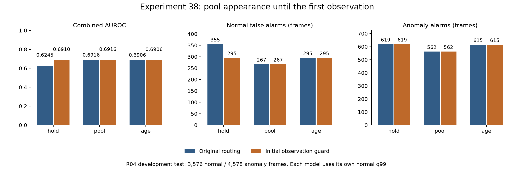

# 실험 38 — 첫 관계 관측 전 phase 미확정 처리

## 1. 이번 실험 결과

**완료: 초기 외형 routing 구현·정상 holdout·R04 테스트·불변 대조.** 실험37의 1순위를 적용했다. hold의 초기 오탐60프레임을 제거하면서 첫 관측 이후 점수와 정탐619프레임을 그대로 유지했다. pool/age는 예상대로 모든 예측 배열이 동일하다. 초기 상태의 잘못된 사용을 교정한 결과이며, 초기 이상 탐지나 공정 모델의 일반적 개선을 입증한 것은 아니다.

### 변경 하나와 고정 조건

`appearance_initial_observation_gate=true`이면 현재까지 `relation_valid=True`를 한 번도 관측하지 않은 sample에서 외형 bank를 pooled(-1)로 요청한다. 첫 관측 sample부터 원래 hold/pool/age 정책을 적용한다. boolean mask의 누적 OR만 사용하며 영상마다 새로 계산한다. 재누락 때 이력을 초기화하지 않고, 끝까지 관측이 없으면 계속 pooled를 쓴다.

공정 `phases` 배열을 수정하지 않고 외형 요청만 바꾼다. 기본값은 false로 기존 동작을 유지한다. fit 단계에는 gate를 적용하지 않는다. 영상·검출·track·CLIP·객체 선택·descriptor·normal scaler/asinh 중심·phase별 rank/PCA·전이·체류·same-pair 전이 gate·실제 사용하는 full-normal dual-request CDF를 고정했다. q99만 각 정책의 동일 정상 calibration 점수로 다시 계산했다. VLM/검출기/encoder 재호출, phase 재학습 또는 llama.cpp 설정 변경은 없다.

R04 FIT20영상/7,812 frames/1,960 samples, calibration5영상/1,920 frames/482 samples, test19영상/8,154 frames/2,047 samples다. test 정상3,576/이상4,578 frames, 구간26개이며 stride4 source frames다. FPS/timestamp가 없어 초 단위 성능은 없다. 반복 관찰한 R04 개발 평가이며 독립 검증이 아니다.

### 탐지 결과

모든 구성의 정상 q99는 **.997457627118644**로 같았고 strict `>`를 사용한다. AP는 average precision, 구간 탐지는 한 frame 이상의 경보다.

| 구성 | Visual AUROC / AP | Combined AUROC / AP | 정상 FPR (FP) | 이상 recall (TP) | 탐지 / 26 |
|---|---:|---:|---:|---:|---:|
| control_hold | 0.6187 / 0.6363 | 0.6245 / 0.6377 | 9.93% (355) | 13.52% (619) | 14 |
| control_pool | 0.6860 / 0.6814 | 0.6916 / 0.6815 | 7.47% (267) | 12.28% (562) | 14 |
| control_age | 0.6852 / 0.6809 | 0.6906 / 0.6812 | 8.25% (295) | 13.43% (615) | 13 |
| guarded_hold | 0.6856 / 0.6822 | 0.6910 / 0.6826 | 8.25% (295) | 13.52% (619) | 14 |
| guarded_pool | 0.6860 / 0.6814 | 0.6916 / 0.6815 | 7.47% (267) | 12.28% (562) | 14 |
| guarded_age | 0.6852 / 0.6809 | 0.6906 / 0.6812 | 8.25% (295) | 13.43% (615) | 13 |



control은 실험37 asinh의 정상 모델/보정 점수와 **57개 test 예측의 모든 배열**을 정확히 재현했다. guarded pool/age의38개 예측 파일도 대응 control과 모든 배열이 같다. hold는 Combined 점수636프레임이 바뀌고 경보는 정상60프레임만 제거됐다. 새 FP/TP 경보는 없고 anomaly 경보 전체가 동일하다. control q99를 적용한 사후 대조도 같은 결과다.

세 경로 모두 구간 gained/lost는0이며 탐지 구간·조건부 지연도 그대로다. hold/pool/age 탐지는14/14/13개, 탐지된 구간만의 지연 중앙값은45.5/48/59 source frames다. guarded hold는 age보다 정탐4프레임·구간1개가 많지만 이미 실험37의 오래된 누락 처리 차이에서 나온 것으로, 이번 초기 gate가 새로 만든 탐지 이득이 아니다.

과거 실험31 hold(.7210, FP309/TP829, 16구간) 대비 guarded hold(.6910, FP295/TP619, 14구간)는 오탐이 적지만 ranking·recall·구간 탐지는 낮다. 이번 교정을 전체 실험 중 최적 모델의 입증으로 해석하지 않는다.

### 바뀐 구간과 바뀌지 않은 구간

| hold 비교 영역 | frames | control FP / TP | guarded FP / TP |
|---|---:|---:|---:|
| 첫 관계 관측 전 | 652 | 60 / 0 | 0 / 0 |
| 첫 관계 관측 이후 전체 | 7,502 | 295 / 619 | 295 / 619 |

초기652 frames는 **모두 정상**이다. 636프레임의 score 변화가 전부 이 영역에 있고, 이후에는 raw 외형·객체 점수·Visual·공정·Combined가 정확히 같다. 제거된 FP는 영상02/03/04/05/10/11/12/17/18에서 각각4/12/8/4/4/4/4/12/8프레임이다. 개선이 단일 영상에만 있는 것은 아니지만 독립 녹화 그룹의 반복이라는 증거도 없다.

pool/age는 이미 첫 관측 전 pooled를 요청하므로 변경이 없다. 별도 시간 cutoff를 선택하거나 테스트 점수에 맞춘 normalizer를 추가하지 않았다. 원시 숫자 초기 phase를 바꿔도 관측 전 pooled 외형 점수는 같다는 조건을 단위 테스트했다. 이는 전체 공정 grammar의 label permutation 불변 주장과 다르다.

### 정상 FIT·calibration·holdout

정상 FIT/PCA를 동일하게 재현하고, calibration5영상의 leave-one-video-out에서 held-out 영상을 CDF/q99 적합에서 제외했다. 30개 cell 모두 finite/bounded·기존 support·q99<1을 통과했다.

| 정상 범위 | 초기 frames | hold 초기 FP control → guarded | 첫 관측 후 FP control → guarded |
|---|---:|---:|---:|
| FIT: full calibration q99 적용 진단 | 492 | 40 → 8 | 164 → 164 |
| full calibration | 80 | 0 → 0 | 16 → 16 |
| leave-one-video-out holdout | 80 | 0 → 0 | 44 → 44 |

FIT의40→8은 학습에 사용한 영상의 진단이며 독립 성능으로 쓰지 않는다. 정상 holdout FP는 hold44/pool40/age44로 모두 그대로다. 초기 holdout이 이미 경보0이어서 test의 FP 감소와 같은 개선을 정상 holdout에서 주장할 수 없다. pooled 초기 오류도 FIT8프레임은 남아 있다.

정상 holdout FP는 hold/age의02·08·10·12·15에서8/4/0/24/8, pool에서는8/4/0/24/4다. 현재 남은 정상 오탐의 주요 영상12는 이 변경으로 개선되지 않았다.

### 모델·CDF 보존

PCA·전이·체류 파라미터·실제로 dispatch하는 8개의 role/request CDF·support와 모든 full/fold q99는 같았다. full 및5개 fold에서 hold의 legacy `calibration_-1/1/2` 원시 참조만 달라졌다. 이 legacy 참조는 현재 dual-request 모드에서 점수 계산에 사용되지 않는다. 이를 실제 사용 CDF의 변경과 혼동하지 않는다. pool/age에서는 이러한 부수 배열 변화도 없다.

초기 처리만 바꾸므로 관측 mask·phase·쌍 교체·episode 근거는 실험37 그대로다. strict same-pair FIT complete17개, calibration4개, test14개다. 기존 체류 지원0→1/1→2는13/16 runs인데 같은 쌍의 완결 자료는9/4개뿐이다. 최소 support10은 유지했다.

### 남은 공정 근거 문제

test 체류 가용1,889프레임 중 실제 진입 이후 같은 객체 쌍이 유지된 것은1,745프레임이며, **144프레임은 그 근거가 없다**. 이번 외형 gate는 이를 바꾸지 않는다.

체류가 Visual에 추가한 FP13/TP19는 모든 경로에서 그대로이고 새 구간0이다. 모두 영상08의1→2이며 **32프레임 전부 동일 쌍 진입 근거를 갖는다**. 따라서 다음 동일 쌍 체류 gate로 이 오탐13을 제거할 것이라고 주장할 수 없다. 근거 없는144프레임과 현재 독자 경보32프레임을 구분해야 한다.

## 2. 실험 결과의 의의

“phase가 아직 관측되지 않음”과 “관측한 phase0”을 외형 routing에서 구분했다. 학습 분포·실제 CDF·q99·관측 이후 점수를 보존한 대조와 pool/age 음성 대조를 통해, 이번 개선이 초기 요청 변경에서 왔음을 좁혀 확인했다.

이는 새로운 분포나 더 강한 encoder의 효과가 아니라 관측 상태를 일관되게 처리하는 파이프라인 교정이다. 학부 캡스톤의 구현·분석 근거로 기록하되, 이 조건문 자체나 R04의 성능 상승을 알고리즘 novelty·일반화·통계적 유의성으로 주장하지 않는다.

## 3. 보완할 점

- 초기 test652프레임이 모두 정상이므로 초기 이상 recall/공정 누락 탐지는 평가할 수 없다. pooled fallback이 초기 이상을 놓칠 가능성은 미검증이다.
- 정상 holdout44/40/44와 최초 관측 후 오탐295/267/295는 그대로다. 핵심 공정 모델의 성능이나 역할 혼동을 해결한 것은 아니다.
- 체류 사용144프레임의 근거 부족, 학습 지원13/16과 strict complete9/4의 차이, 같은 쌍에서도 발생하는 체류 독자 FP13을 각각 구분해 보완해야 한다.
- R04에서 결과를 반복 관찰하며 설계했다. 단일 scene/seed, 녹화 그룹 독립성 미확인, bbox/역할/action GT/FPS 부재, 비용·실시간 지연·localization 정확도 미측정이다. Stage00 라벨 불일치11영상의 정확한 정렬도 미해결이다.

## 4. 다음 Recommended improvements — 추천순 3개

| 추천순 | 개선 후보와 변경 내용 | 이번 결과의 근거 | 검증 기준 및 주의점 |
|---|---|---|---|
| 1 | **체류 결합의 관측 근거를 동일 객체 쌍으로 제한**: 기존 분포·점수는 유지하고 실제 phase 진입 이후 같은 쌍의 연속성을 결합 gate로 요구 | 현재 체류 가용1,889 frames 중144는 진입 이후 동일 쌍 근거 없음. 외형 초기 상태를 고쳤지만 공정 근거 문제는 그대로 | 전이/외형/CDF·학습을 고정하고 결합만 비교. 독자 FP13/TP19는 이미 같은 쌍 근거가 있으므로 제거를 약속하지 않음. 정상 q99와 ranking·가용성·차단 이상을 분리 검증 |
| 2 | **체류 학습 표본의 관측 정의 정렬**: 완결·검열·진입 미확인을 분리하고 실제 동일 쌍 자료로 분포를 학습할 수 있는지 검증 | 기존 0→1/1→2 지원13/16 대비 strict complete9/4. 결합 gate만으로 학습 분포 오염은 해결되지 않음 | support10을9로 낮추지 않으며 자료 부족·검열 가정을 명시. 결합 변경과 별도 실험으로 분리하고 분포의 불확실성 및 정상 holdout 검증 |
| 3 | **다른 장면·초기 이상 구간에서 적용성 확인**: 고정 파이프라인의 관측 초기화/공정 근거 원칙을 별도 평가 범위로 검증 | R04 초기 test652 frames는 모두 정상. 반복 개발에서 FP60 감소를 관측했지만 초기 이상 recall·장면 일반화는 미측정 | 다음 적용 장면/그룹과 규칙을 test 확인 전에 고정하고 정상 FIT만으로 장면별 적합. 근접 녹화 그룹 독립성 부재·미지원 객체/phase·실패도 보고 |

1순위만 [실험 39 계획](EXPERIMENT39_PLAN.md)으로 구체화한다. 목표는 체류 결합의 관측 근거를 맞추는 것이며, 기존 FP13 제거 또는 종합 성능 상승을 약속하지 않는다.

## 검증·산출물·재현

- 단위 테스트 **165개 통과**. 새8개는 최초 관측/재누락, 끝까지 누락/새 영상/빈 입력, prefix·미래 비참조, fit/PCA/실제 CDF 불변과 pool/age 동일성, 임의 초기 ID의 pooled 외형 불변, 잘못된 flag/mask/shape를 검사했다.
- 정상25영상의90개 경로·분할 진단과 정상 holdout30개 cell을 기록했다. test 예측114개를 모델·CDF·q99·전이 gate·metric/event까지 재계산했다. control57개와 pool/age 음성 대조38개 예측 파일의 모든 배열이 정확히 같다.
- source feature44개를 그대로 재사용하고 초기 mask의 prefix88회를 검사했다. 새 phase/이미지 선택·시각 판독은 없다. 정상 접근 allowlist와 test 차단을 적용하고 정상 model/진단/q99 동결 후 test를 열었다.
- 원본 데이터·가중치·feature cache·예측·서버 로그는 업로드하지 않는다. 집계 PNG는 실제 렌더링을 확인했다.
- [업로드 전 검증](../results/experiment38/publication_validation.json)은 원본 정상 파일105개와 현 protocol의 정상 수치 파일517개 보존, 보고서 링크·수치·추천3개, 공개 파일 해시를 확인한다.
- [설정](../configs/experiment38_guarded_hold.json), [정상 초기 관측](../results/experiment38/normal_initial_observations.json), [정상 routing 불변 검증](../results/experiment38/normal_routing_audit.json), [정상 holdout](../results/experiment38/normal_audit.json), [초기/체류 근거](../results/experiment38/initial_and_dwell_context.json), [전체 진단](../results/experiment38/diagnostic.json), [CSV](../results/experiment38/comparison.csv), [검증](../results/experiment38/validation.json).

동일 로컬 데이터·선행 캐시를 전제로 저장소 루트에서 실행한다. 기존 protocol은 보존한다.

```bash
PYTHONPATH=src .venv/bin/python -m pytest -q
PYTHONPATH=src .venv/bin/python scripts/experiment38_initial_observation.py prepare
PYTHONPATH=src .venv/bin/python scripts/experiment38_initial_observation.py normal
PYTHONPATH=src .venv/bin/python scripts/experiment38_initial_observation.py test_prepare
# normal_audit.json의 eligible 구성 각각 평가한다. 예:
PYTHONPATH=src .venv/bin/python scripts/evaluate_baseline.py --config configs/experiment38_guarded_hold.json --data-root /media/jeong/ExtHDD/IPAD_vLLM/IPAD_dataset
PYTHONPATH=src .venv/bin/python scripts/diagnose_initial_observation.py
PYTHONPATH=src .venv/bin/python scripts/audit_initial_observation_context.py
MPLCONFIGDIR=.cache/matplotlib .venv/bin/python scripts/report_initial_observation.py
PYTHONPATH=src .venv/bin/python scripts/validate_initial_observation_publication.py
```
