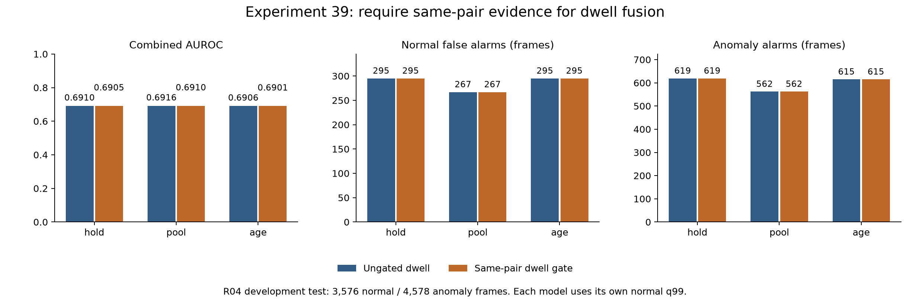

# 실험 39 — 동일 객체 쌍의 진입 근거로 체류 결합 제한

## 1. 이번 실험 결과

**완료: 체류 evidence gate 구현·정상 holdout·R04 테스트·독립 재계산.** 실험38의 1순위를 적용했다. 관측 근거 없는 체류 사용144프레임을 차단했지만 최종 경보는 모두 같고 AUROC/AP는 소폭 낮아졌다. 탐지 성능 개선 실험으로 보고하지 않는다.

### 변경 하나와 고정 조건

`dwell_evidence_gate=same_track_pair_since_entry`이면 실제 phase 진입 이후 현재까지 동일한 선택 anchor/target track 쌍이 연속 관측된 경우에만 체류를 결합한다. 이전/현재 sample이 모두 관측되고 같은 쌍에서 phase가 바뀌어야 진입을 인정한다. 누락·anchor 또는 target 교체는 근거를 해제하며, 재관측만으로 복구하지 않는다. 다음 관측 phase 진입이 있어야 복구한다. 미래 이탈을 보지 않고 영상마다 초기화한다.

control의 `ungated`는 이전 점수를 유지하면서 같은 진단 mask를 기록한다. `dwell_evidence_valid`는 지원 수와 별개인 관측 근거이며, 실제 사용은 기존 `dwell_valid`와의 교집합이다. `dwell_gated`는 실제 결합용 점수다. 기존 원시 `dwell`·`dwell_valid`·나이·진입 문맥·학습 분포는 유지한다. 옵션을 생략한 기존 실험에는 새 진단 배열을 추가하지 않는다.

외형의 초기 gate·hold/pool/age 정책, VLM/검출/CLIP/선택/feature, asinh phase, PCA/rank, 전이 same-pair gate, 학습/보정 분할, 실제 CDF와 최소 지원10을 고정했다. q99는 각 정책의 정상 calibration에서 다시 계산했다. 새 VLM 호출이나 llama.cpp 설정 변경은 없다. seed42, stride4 source frames다.

R04 FIT20영상/7,812 frames/1,960 samples, calibration5영상/1,920 frames/482 samples, test19영상/8,154 frames/2,047 samples다. test 정상3,576/이상4,578 frames, GT 이상 구간26개다. 반복 관찰한 R04 개발 평가이며 독립 검증이 아니다.

### 탐지 결과

정상 q99는 여섯 구성 모두 **.997457627118644**로 같았고 strict `>`를 사용했다. AP는 average precision이다.

| 구성 | Visual AUROC / AP | Combined AUROC / AP | 정상 FPR (FP) | 이상 recall (TP) | 탐지 / 26 |
|---|---:|---:|---:|---:|---:|
| control_hold | 0.6856 / 0.6822 | 0.6910 / 0.6826 | 8.25% (295) | 13.52% (619) | 14 |
| control_pool | 0.6860 / 0.6814 | 0.6916 / 0.6815 | 7.47% (267) | 12.28% (562) | 14 |
| control_age | 0.6852 / 0.6809 | 0.6906 / 0.6812 | 8.25% (295) | 13.43% (615) | 13 |
| gated_hold | 0.6856 / 0.6822 | 0.6905 / 0.6822 | 8.25% (295) | 13.52% (619) | 14 |
| gated_pool | 0.6860 / 0.6814 | 0.6910 / 0.6811 | 7.47% (267) | 12.28% (562) | 14 |
| gated_age | 0.6852 / 0.6809 | 0.6901 / 0.6808 | 8.25% (295) | 13.43% (615) | 13 |



control은 실험38 guarded의 **57개 test 예측 파일에 있던 모든 배열**을 정확히 재현했다. 여기에 진단 배열2개만 추가했다. 실험군의 원시 외형·전이·체류와 객체 점수도 정확히 같다. 전이·공정 CDF/PCA/체류 모델의 전체 비교 배열에서 threshold 외 변경이 없었고, 실제 threshold도 full과 모든 fold에서 같았다.

모든 경로의 경보 추가/제거와 구간 gained/lost는0이다. hold/pool/age는 각각 FP295/267/295, TP619/562/615, 탐지14/14/13개를 유지했다. 탐지된 구간만의 지연 중앙값도45.5/48/59 source frames로 같다. 자신의 q99와 고정 control q99 대조가 일치한다. Visual 지표는 정확히 같고 Combined AUROC는 약0.00053~0.00057, AP는 약0.00042~0.00045 감소했다. 통계적 유의성은 검증하지 않았다.

### 관측 근거와 점수 변화

| test 단계 | 정상 frames | 이상 frames | 전체 |
|---|---:|---:|---:|
| 기존 체류 가용 중 같은 쌍 진입 근거가 없어 제외 | 32 | 112 | 144 |
| 실제 체류 결합값이 낮아짐 | 24 | 92 | 116 |
| 공정 max 점수가 낮아짐 | 16 | 60 | 76 |
| Combined 점수가 낮아짐 | 4 | 20 | 24 |
| 제거된 최종 경보 | 0 | 0 | 0 |

세 외형 경로에서 위 frame 수는 같다. 기존 가용1,889→실제 사용1,745프레임이다. 제외144프레임은 모두 phase 진입 때 또는 이후 선택 쌍이 바뀐 이력 때문이었다. 28프레임은 원래 체류값이0이어서 사용 중단이 값의 변화로 이어지지 않았다. max 결합에서 다른 branch가 크면 최종 점수가 바뀌지 않는다. 이상20프레임의 Combined 점수도 낮아졌으므로 근거 교정과 ranking 개선을 동일시할 수 없다.

체류가 외형/전이보다 독자적으로 추가한 **FP13/TP19는 그대로**, 모두 영상08의1→2다. 32프레임 전부 관측 근거가 있었고 추가 탐지 구간은0이다. 전이만의 독자 경보도0이다. 따라서 현재 체류 오탐은 동일 쌍 gate만으로 해결되지 않는다.

### 정상 FIT·calibration·holdout

| 정상 범위 | 기존 체류 가용 → 실제 사용 (samples) | 같은 값 (frames) | 공정 변화 frames | hold Combined 변화 frames |
|---|---:|---:|---:|---:|
| FIT | 338 → 308 | 1,352 → 1,232 | 60 | 48 |
| full calibration | 51 → 50 | 204 → 200 | 0 | 0 |
| leave-one-video-out holdout | 51 → 50 | 204 → 200 | 0 | 0 |

정상5영상 leave-one-video-out에서는 held-out 영상을 CDF/q99 적합에서 제외했다. 30개 cell 모두 finite/bounded·q99<1을 통과했다. q99와 정상 holdout 오탐은 hold44/pool40/age44로 동일하다. 정상 FIT hold 오탐172와 full calibration16도 그대로이며, FIT 수치는 독립 성능이 아니다. FIT/보정 모델18쌍에서 q99 외 모든 저장 비교 배열이 동일하고 q99도 같았다.

### 남은 학습 자료의 불일치

이 gate는 체류 학습에 쓰인 legacy 완결 표본의 정의를 바꾸지 않는다. 같은 feature에서 별도 episode parser와 관측 mask가 정상25/test19영상 모두 일치함을 확인하고, 학습 자료를 다시 세었다. 분포를 재학습하지 않은 사후 진단이다.

| FIT 진입 문맥 | legacy 완결 | 동일 쌍 완결 | 완결이 나온 영상 수 | 우측 검열 | 양의 검열 하한 |
|---|---:|---:|---:|---:|---:|
| 0→1 | 13 | 9 | 9 | 10 | 10 |
| 1→2 | 16 | 4 | 3 | 22 | 11 |
| 2→1 | 7 | 4 | 3 | 2 | 1 |

동일 쌍 완결은 총17개지만 **어느 진입 문맥도 최소 지원10을 충족하지 않는다**. calibration의 동일 쌍 완결은2/1/1개이며 FIT 지원에 보태지 않는다. 현재 사용 중인0→1/1→2 학습 분포13/16의 관측 정의는 추론 gate와 여전히 맞지 않는다. 검열10/22를 단순히 완결 표본에 더하거나 관측 하한을 실제 duration으로 쓰면 안 된다. 특히1→2의 검열22개 중11개는 하한0이며, 가림/교체가 공정에 의존할 수 있다.

## 2. 실험 결과의 의의

학습 분포를 고정한 채 추론의 체류 관측 근거만 바꿔 영향을 분리했다. 가용성144프레임 감소, 체류값116·공정76·Combined24프레임 변화, 경보 변화0이라는 단계별 결과로 관측 상태와 점수 결합의 관계를 확인했다.

학부 캡스톤의 파이프라인 구현 관점에서 원시 점수·관측 근거·실제 결합값을 분리해 추적할 수 있게 됐다. 그러나 gate 자체의 신규성, 독립 성능 개선, 일반화를 입증한 것은 아니다. 근거를 더 엄격하게 한 변경이 ranking을 소폭 낮춘 결과도 함께 남긴다.

## 3. 보완할 점

- 정상 holdout과 test 경보는 개선되지 않았고 AUROC/AP는 소폭 감소했다. 차단된 이상112프레임의 일부 점수가 낮아졌다.
- 같은 쌍의 test evidence를 요구해도 학습 duration13/16의 identity 불일치는 남는다. 엄격한 완결9/4를 쓰면 현재 최소 지원10에서는 체류 모델을 지원할 수 없다.
- 남은 체류 독자 FP13/TP19는 단일 영상에 집중되고 추가 구간0이다. track 동일성은 실제 객체 identity/역할/action GT가 아니며, 역할 오검출도 계속 가능하다.
- R04 단일 scene/seed의 반복 개발이고 독립 녹화 그룹은 확인되지 않았다. 초기 이상·bbox localization 정확도·semantic phase 정확도·비용·실시간 지연은 미측정이다. FPS/timestamp가 없어 초 단위 해석을 하지 않는다. Stage00 라벨 불일치11영상의 정확한 정렬도 미해결이다.

## 4. 다음 Recommended improvements — 추천순 3개

| 추천순 | 개선 후보와 변경 내용 | 이번 결과의 근거 | 검증 기준 및 주의점 |
|---|---|---|---|
| 1 | **체류 학습을 동일 쌍 완결 episode로 정렬하고 미지원 문맥은 사용하지 않기**: 진입·내부·이탈의 동일 쌍 관측을 요구하고 지원 부족을 명시 | gate는 test144프레임의 근거를 교정했으나 학습 분포는 여전히 legacy13/16 runs. strict0→1/1→2는9/4, 2→1도4로 모든 문맥이 최소10 미달 | 최소 지원10 유지, 빈 체류 모델을 정상적인 unavailable 상태로 처리. 외형·전이를 보존하고 정상 q99를 재보정. 체류가 전부 꺼질 가능성을 사전 명시하며 성능 상승을 유효 체류 학습의 증거로 쓰지 않음 |
| 2 | **검열 자료의 활용 가능성과 불확실성 진단**: 완결과 우측 검열을 분리해 자료 추가 또는 검열 모형의 적합성을 검토 | 정상0→1/1→2의 우측 검열10/22개, 그중 양의 관측 하한10/11개. 1→2 완결4개는3영상에 집중 | 가림·track 교체가 공정 상태에 의존할 수 있음. 검열 하한을 완결 duration으로 대체하거나 단순 합산해 최소 지원을 통과시키지 않음. normal만으로 가정·식별성·불확실성을 검증 |
| 3 | **다른 장면/녹화 그룹에서 적용성 검증**: 관측 근거와 미지원 처리를 고정한 뒤 별도 범위에서 평가 | 단일 R04를 반복 개발했고 이번 gate는 경보를 개선하지 않음. 초기 이상·독립 그룹·역할 GT도 부족 | 장면·분할·실패 기준을 test 확인 전에 고정. 정상 FIT만 적합하고 학습 지원/가용성·경보·순위를 함께 보고. 미지원 상태를 숨기지 않고 일반화 여부를 검증 |

1순위만 [실험 40 계획](EXPERIMENT40_PLAN.md)으로 구체화한다. 지원 부족으로 체류가 꺼지는 결과를 숨기거나 최소 지원을 낮추지 않는다.

## 검증·산출물·재현

- 단위 테스트 **173개 통과**. 새8개는 진입/교체/누락/재관측, prefix/미래 비참조/영상 초기화, 잘못된 메타데이터, 원시 점수/학습 보존과 정상 q99 재계산을 검증한다.
- 정상90개 경로·분할 진단, full 및5개 fold의 모델 비교, holdout30개 cell 및 test114개 예측을 재계산했다. control57개 파일의 기존 배열이 실험38과 정확히 같고 새 진단2개를 명시했다.
- 정상 prefix50회와 test38회, 별도 episode parser44영상의 mask 일치를 확인했다. 정상 단계는 파일 allowlist와 test/label 접근 차단을 사용했고 모델·정상 진단·q99를 동결한 뒤 test를 열었다.
- [설정](../configs/experiment39_gated_hold.json), [정상 근거](../results/experiment39/normal_evidence.json), [정상 결합 검증](../results/experiment39/normal_fusion_audit.json), [정상 holdout](../results/experiment39/normal_audit.json), [체류 표본/변화 근거](../results/experiment39/duration_and_gate_context.json), [전체 진단](../results/experiment39/diagnostic.json), [CSV](../results/experiment39/comparison.csv), [검증](../results/experiment39/validation.json).
- 원본 데이터·가중치·feature cache·예측·서버 로그는 제외하고 코드·설정·집계·그래프·보고서만 업로드한다. PNG는 실제 렌더링을 확인했다.
- [업로드 전 검증](../results/experiment39/publication_validation.json)은 원본 정상 파일105개와 현 protocol의 정상 수치 파일595개 보존, 보고서 수치·링크·추천3개와 공개 파일 해시를 확인한다.

동일 로컬 데이터와 선행 캐시가 필요하다. 동결된 protocol을 덮어쓰지 않는다.

```bash
PYTHONPATH=src .venv/bin/python -m pytest -q
PYTHONPATH=src .venv/bin/python scripts/experiment39_dwell_evidence.py prepare
PYTHONPATH=src .venv/bin/python scripts/experiment39_dwell_evidence.py normal
PYTHONPATH=src .venv/bin/python scripts/experiment39_dwell_evidence.py test_prepare
# normal_audit.json의 eligible 구성 각각 평가한다. 예:
PYTHONPATH=src .venv/bin/python scripts/evaluate_baseline.py --config configs/experiment39_gated_hold.json --data-root /media/jeong/ExtHDD/IPAD_vLLM/IPAD_dataset
PYTHONPATH=src .venv/bin/python scripts/diagnose_dwell_evidence.py
PYTHONPATH=src .venv/bin/python scripts/audit_dwell_evidence_context.py
MPLCONFIGDIR=.cache/matplotlib .venv/bin/python scripts/report_dwell_evidence.py
PYTHONPATH=src .venv/bin/python scripts/validate_dwell_evidence_publication.py
```
