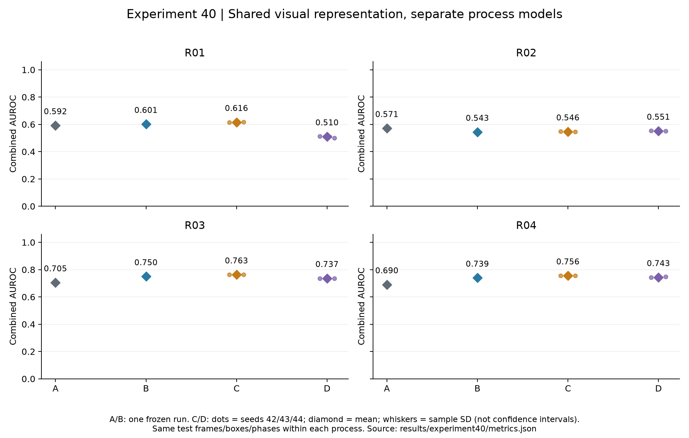
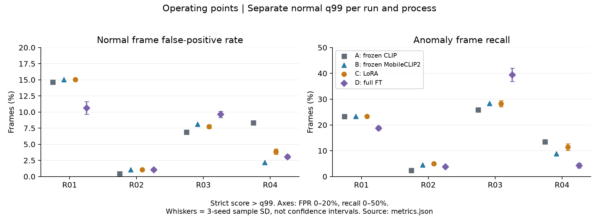
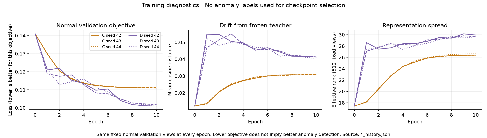

# 실험40 — 공유 Learned Visual Representation와 공정별 정상 모델

**완료(2026-10-05): 이번 고정 설정에서 LoRA는 frozen MobileCLIP2보다 평균 ranking을 높였고, full FT보다 좋은 평균 탐지 ranking을 보였다. 다만 오탐·recall·구간 탐지의 개선은 일관되지 않았다.** “LoRA가 항상 full FT보다 낫다”거나 “과적합을 입증했다”는 결론은 내리지 않는다.

사용자 지시에 따라 이전 체류 학습 안을 보류하고, R01~R04 공유 visual encoder의 A/B/C/D 비교를 실행했다. [사전 계획](EXPERIMENT40_PLAN.md)은 동결된 당시 기록이고, [이전 안](EXPERIMENT40_DWELL_DEFERRED.md)은 미실행 상태다. [구현·손실함수·재현 명세](EXPERIMENT40_METHODS.md)에 상세 조건을 정리했다.

## 1. 이번 실험 결과

### 범위와 비교 조건

- **40-A** frozen CLIP ViT-B/32, **40-B** frozen MobileCLIP2-S2, **40-C** MobileCLIP2-S2 LoRA, **40-D** MobileCLIP2-S2 전체 visual parameter FT. C는 rank8/alpha16의 LoRA 하나이며 별도 partial-FT arm은 없다. C/D 모두 BN running statistics는 고정했다.
- C/D 각 seeds42/43/44, 총6회 실제 학습을 완료했다. 각640 optimizer updates, 모두 정상 validation objective로 epoch10을 선택했고 체크포인트 복원 검증을 통과했다. Calibration·test는 encoder 학습/epoch 선택에 사용하지 않았다.
- 정상111영상에서 표현 train70/val19, 별도 calibration22. 기존 FIT89는 downstream 정상 모델에 사용한다. 정상54,047 views, test66영상/35,340 views를 동일 입력으로 비교했다.
- GroundingDINO/boxes/roles/tracks/phase는 동일하게 유지했다. A도 같은 crop 정의로 재추출했다. 공정 파라미터와 점수가 정확히 동일함을 검사하고 appearance PCA/CDF/q99만 각 표현에 맞춰 정상 데이터로 다시 적합했다. 같은 PCA 규칙을 적용했지만 실제 rank는 다르다.
- R01/R02는 기존 평균 결합, R03/R04는 기존 max 결합이다. 공정 간 동일 downstream 모델 또는 MobileCLIP 단독 실시간 시스템의 비교가 아니다. R04의 이전 수동 rank 고정값을 전체 arm에서 제거했으므로40-A는39의 예측을 그대로 복사한 것이 아니다.

| 공정 | 표현 train | 표현 val | 정상 cal | 정상 views | test 정상 | test 이상 | test 제외 | 이상 구간 |
|---|---|---|---|---|---|---|---|---|
| R01 | 21 | 6 | 7 | 8403 | 2431 | 1254 | 0 | 8 |
| R02 | 19 | 5 | 6 | 21753 | 5094 | 2612 | 1912 | 15 |
| R03 | 14 | 4 | 4 | 13250 | 6937 | 5068 | 0 | 17 |
| R04 | 16 | 4 | 5 | 10641 | 3576 | 4578 | 0 | 26 |

평가 가능 **31,550프레임(정상18,038/이상13,512), 이상 구간66개**다. R02 test12/13/14의 길이 불일치로806/609/497프레임, 합계1,912프레임을 영상 단위로 제외했다. 나머지 세 공정에는 이번 평가의 길이 불일치 제외가 없다. 원본 라벨이나 FPS를 추정 수정하지 않았다. 원본 프레임 총33,462개는 모두 입력 처리했다.

### 공정 평균과 공정별 결과

아래 macro는 공정 안에서 계산한 지표 네 개의 동일 가중 평균이다. C/D는 동일 데이터 분할의 세 학습 seed 평균±표본 표준편차이며 신뢰구간이 아니다. AP는 step-integral average precision이다. FPR/recall/구간 탐지는 각 run·공정의 **서로 다른 정상 q99**에서 계산한다.

| arm | Visual AUC | Combined AUC | Combined AP | FPR% | recall% | 구간 탐지% |
|---|---|---|---|---|---|---|
| A | 0.6934 | 0.6395 | 0.5247 | 7.60 | 16.31 | 56.72 |
| B | 0.7082 | 0.6584 | 0.5510 | 6.58 | 16.29 | 57.68 |
| C | 0.7226 ± 0.0011 | 0.6702 ± 0.0009 | 0.5576 ± 0.0009 | 6.93 ± 0.15 | 17.01 ± 0.37 | 60.50 ± 1.47 |
| D | 0.6759 ± 0.0040 | 0.6354 ± 0.0016 | 0.5368 ± 0.0012 | 6.10 ± 0.24 | 16.58 ± 1.02 | 55.39 ± 1.52 |

- **B→C**: Combined AUROC +0.0118, AP +0.0066. 평균 FPR는6.58→6.93%, recall16.29→17.01%로 함께 올랐다. 이 결과를 오탐까지 모두 개선한 것으로 쓰면 안 된다.
- **C↔D**: C의 평균 Combined AUROC는0.0347 높다. Visual AUROC는 네 공정 모두 C의 seed 평균이 높지만 Combined는 R02에서 D가 높다. 같은 학습률·예산·BN 정책에서의 결과이며 각 방법의 최적 설정 비교는 아니다.
- **A→B**: 평균은 개선됐지만 R02 Visual AUC는0.7814→0.7275로 낮아졌다. 경량 모델 교체가 모든 공정에 이롭지는 않았다.

| 공정 | arm | Visual AUC | Visual AP | Combined AUC | Combined AP | FPR% | recall% | 구간 탐지% |
|---|---|---|---|---|---|---|---|---|
| R01 | A | 0.5738 | 0.3770 | 0.5917 | 0.4013 | 14.69 | 23.37 | 75.00 |
| R01 | B | 0.5822 | 0.3817 | 0.6013 | 0.4053 | 15.01 | 23.37 | 75.00 |
| R01 | C | 0.6035 ± 0.0019 | 0.3942 ± 0.0011 | 0.6156 ± 0.0016 | 0.4144 ± 0.0011 | 15.01 ± 0.00 | 23.37 ± 0.00 | 75.00 ± 0.00 |
| R01 | D | 0.4800 ± 0.0152 | 0.3196 ± 0.0096 | 0.5103 ± 0.0080 | 0.3729 ± 0.0057 | 10.63 ± 0.97 | 18.79 ± 0.74 | 75.00 ± 0.00 |
| R02 | A | 0.7814 | 0.7060 | 0.5711 | 0.4103 | 0.47 | 2.45 | 33.33 |
| R02 | B | 0.7275 | 0.6815 | 0.5435 | 0.4042 | 1.04 | 4.56 | 33.33 |
| R02 | C | 0.7318 ± 0.0020 | 0.6855 ± 0.0009 | 0.5464 ± 0.0020 | 0.4052 ± 0.0008 | 1.07 ± 0.12 | 5.02 ± 0.15 | 40.00 ± 0.00 |
| R02 | D | 0.7093 ± 0.0030 | 0.6337 ± 0.0055 | 0.5515 ± 0.0015 | 0.4111 ± 0.0028 | 1.07 ± 0.16 | 3.84 ± 0.32 | 31.11 ± 3.85 |
| R03 | A | 0.7332 | 0.6778 | 0.7049 | 0.6052 | 6.89 | 25.91 | 64.71 |
| R03 | B | 0.7854 | 0.7441 | 0.7496 | 0.6506 | 8.10 | 28.33 | 64.71 |
| R03 | C | 0.8002 ± 0.0030 | 0.7546 ± 0.0036 | 0.7629 ± 0.0023 | 0.6611 ± 0.0020 | 7.76 ± 0.28 | 28.24 ± 1.13 | 70.59 ± 0.00 |
| R03 | D | 0.7728 ± 0.0037 | 0.7339 ± 0.0072 | 0.7366 ± 0.0025 | 0.6533 ± 0.0030 | 9.64 ± 0.51 | 39.46 ± 2.59 | 70.59 ± 0.00 |
| R04 | A | 0.6854 | 0.6821 | 0.6905 | 0.6822 | 8.36 | 13.50 | 53.85 |
| R04 | B | 0.7376 | 0.7468 | 0.7393 | 0.7439 | 2.18 | 8.89 | 57.69 |
| R04 | C | 0.7549 ± 0.0003 | 0.7532 ± 0.0007 | 0.7557 ± 0.0001 | 0.7495 ± 0.0009 | 3.87 ± 0.43 | 11.42 ± 1.33 | 56.41 ± 5.88 |
| R04 | D | 0.7416 ± 0.0022 | 0.7151 ± 0.0058 | 0.7433 ± 0.0038 | 0.7098 ± 0.0067 | 3.06 ± 0.28 | 4.24 ± 0.88 | 44.87 ± 2.22 |

R01에서 D의 Visual AUROC는0.4800으로 낮아졌고, 오탐 감소와 함께 recall도23.37→18.79%로 줄었다(C 대비). R03에서는 D가 C보다 ranking은 낮으나 recall39.46%로 더 높고 FPR도9.64%로 더 높다. R04에서는 C의 ranking 개선에도 구간 탐지가 seed별16/13/15개(B는15개)로 달랐고, D의 recall은4.24%로 낮았다. 가장 좋은 seed만 대표값으로 선택하지 않았다.

R02에서는 모든 arm에서 Visual보다 Combined ranking이 크게 낮다. C의0.7318→0.5464와 recall5.02%는 frozen phase/grammar와 평균 결합의 진단이 필요함을 보여준다. 이번에는 공정 branch를 변경하지 않았으므로 낮은 성능을 encoder 하나의 문제로 돌리지 않는다.

### 학습 비용과 표현 진단

| run | 학습 파라미터 | 선택 epoch | updates | train loss | val loss | teacher 거리 | 유효 rank | 초 | GPU peak GiB |
|---|---|---|---|---|---|---|---|---|---|
| C_s42 | 137216 | 10 | 640 | 0.12767 | 0.11095 | 0.03063 | 26.39 | 305.3 | 1.59 |
| D_s42 | 35815232 | 10 | 640 | 0.10699 | 0.10099 | 0.04124 | 29.94 | 345.2 | 26.02 |
| C_s43 | 137216 | 10 | 640 | 0.12772 | 0.11113 | 0.03084 | 26.39 | 206.9 | 1.59 |
| D_s43 | 35815232 | 10 | 640 | 0.10734 | 0.10168 | 0.04133 | 29.67 | 346.6 | 26.02 |
| C_s44 | 137216 | 10 | 640 | 0.12676 | 0.11109 | 0.03103 | 26.61 | 181.5 | 1.59 |
| D_s44 | 35815232 | 10 | 640 | 0.10609 | 0.10100 | 0.04030 | 29.62 | 340.4 | 26.02 |

C는 D 대비 약0.38%의 학습 파라미터를 사용했다. PyTorch allocated peak는 C1.59 GiB, D26.02 GiB로 약16배 차이다. 이는 cached teacher feature를 사용한 encoder 학습의 메모리이며 VLM·detector를 동시에 실행하는 전체 파이프라인 메모리가 아니다. 공유 서버의 캐시/경합이 있어 wall time은 기술 기록이고 고립된 속도 benchmark가 아니다.

D의 정상 validation loss는 약0.101로 C의 약0.111보다 낮았지만 anomaly ranking은 평균적으로 더 낮았다. 정상 자기지도 objective의 감소가 anomaly 보존을 보장하지 않는 사례다. 과도한 정상 특화·목적함수 불일치·최적화 설정의 영향을 이번 실험에서 분리하지 않았으므로 과적합의 확정 증거라고 쓰지 않는다.

| 공정 | view | A rank | B rank | C rank | D rank | C→B 거리 | D→B 거리 |
|---|---|---|---|---|---|---|---|
| R01 | global | 29.05 | 23.09 | 14.76 ± 0.42 | 11.64 ± 0.12 | 0.0349 ± 0.0028 | 0.0717 ± 0.0013 |
| R01 | crop | 4.89 | 3.95 | 4.87 ± 0.05 | 6.84 ± 0.08 | 0.0164 ± 0.0000 | 0.0298 ± 0.0005 |
| R02 | global | 18.87 | 6.33 | 5.88 ± 0.02 | 7.21 ± 0.09 | 0.0345 ± 0.0002 | 0.0370 ± 0.0003 |
| R02 | crop | 14.69 | 8.93 | 9.97 ± 0.04 | 11.16 ± 0.15 | 0.0090 ± 0.0002 | 0.0161 ± 0.0006 |
| R03 | global | 15.59 | 9.32 | 8.95 ± 0.20 | 10.73 ± 0.19 | 0.0444 ± 0.0003 | 0.0504 ± 0.0002 |
| R03 | crop | 12.09 | 5.23 | 8.38 ± 0.08 | 9.52 ± 0.09 | 0.0179 ± 0.0006 | 0.0288 ± 0.0004 |
| R04 | global | 21.87 | 12.46 | 14.89 ± 0.21 | 15.01 ± 0.23 | 0.0565 ± 0.0008 | 0.0549 ± 0.0004 |
| R04 | crop | 19.91 | 11.56 | 15.19 ± 0.10 | 15.26 ± 0.21 | 0.0244 ± 0.0003 | 0.0332 ± 0.0009 |

위 rank는 PCA 채택 rank와 다른 **특징 공분산의 유효 rank**다. 공정/partition/view별 최대1,024개의 균등 인덱스 sample로 계산한 기술 진단이다. R01 global의 B23.09→C14.76/D11.64 감소와 D의 B 대비 cosine distance0.0717은 표현 변화가 공정·view마다 다르다는 근거다. 이를 탐지 저하의 단일 원인으로 단정하지 않는다. 서로 좌표계가 다른 A와 B 사이 cosine drift는 계산하지 않았다.

### 정상 holdout과 검증

32개 full 정상 모델과176개 leave-one-video-out calibration 모델 모두 유한하고 경보 가능한 q99(<1)를 얻었다. 예를 들어 R01 C의 정상 holdout FP는105/109/109, 총1631프레임 기준6.44~6.68%여서 명목 q99만으로 새 정상 영상의1% 오탐을 보장하지 못했다. R02~R04에서도 seed·표현에 따른 변동을 아래 표에 그대로 남겼다.

| 공정 | run | 정상 q99 | 정상 LOVO FP | LOVO frames | test FP | test TP | 탐지 구간 | PCA rank 범위 |
|---|---|---|---|---|---|---|---|---|
| R01 | A | 0.95731707 | 97 | 1631 | 357 | 293 | 6/8 | 20–32 |
| R01 | B | 0.95499256 | 105 | 1631 | 365 | 293 | 6/8 | 8–32 |
| R01 | C_s42 | 0.95616627 | 105 | 1631 | 365 | 293 | 6/8 | 9–32 |
| R01 | D_s42 | 0.95628569 | 105 | 1631 | 231 | 225 | 6/8 | 6–26 |
| R01 | C_s43 | 0.95616627 | 109 | 1631 | 365 | 293 | 6/8 | 9–32 |
| R01 | D_s43 | 0.95628569 | 109 | 1631 | 273 | 241 | 6/8 | 6–27 |
| R01 | C_s44 | 0.95616627 | 109 | 1631 | 365 | 293 | 6/8 | 9–32 |
| R01 | D_s44 | 0.95628569 | 105 | 1631 | 271 | 241 | 6/8 | 7–28 |
| R02 | A | 0.98023781 | 40 | 3626 | 24 | 64 | 5/15 | 7–32 |
| R02 | B | 0.96852438 | 44 | 3626 | 53 | 119 | 5/15 | 4–32 |
| R02 | C_s42 | 0.96799603 | 48 | 3626 | 61 | 135 | 6/15 | 4–32 |
| R02 | D_s42 | 0.97106185 | 32 | 3626 | 45 | 91 | 4/15 | 3–32 |
| R02 | C_s43 | 0.96809681 | 44 | 3626 | 53 | 131 | 6/15 | 4–32 |
| R02 | D_s43 | 0.96965613 | 36 | 3626 | 57 | 103 | 5/15 | 3–32 |
| R02 | C_s44 | 0.96919692 | 36 | 3626 | 49 | 127 | 6/15 | 4–32 |
| R02 | D_s44 | 0.96664770 | 36 | 3626 | 61 | 107 | 5/15 | 3–32 |
| R03 | A | 0.99735450 | 44 | 2806 | 478 | 1313 | 11/17 | 32–32 |
| R03 | B | 0.99735450 | 48 | 2806 | 562 | 1436 | 11/17 | 20–32 |
| R03 | C_s42 | 0.99735450 | 36 | 2806 | 525 | 1386 | 12/17 | 26–32 |
| R03 | D_s42 | 0.99735450 | 40 | 2806 | 707 | 1920 | 12/17 | 11–32 |
| R03 | C_s43 | 0.99735450 | 44 | 2806 | 529 | 1412 | 12/17 | 26–32 |
| R03 | D_s43 | 0.99629630 | 40 | 2806 | 661 | 2151 | 12/17 | 11–32 |
| R03 | C_s44 | 0.99735450 | 40 | 2806 | 561 | 1496 | 12/17 | 26–32 |
| R03 | D_s44 | 0.99653259 | 40 | 2806 | 638 | 1928 | 12/17 | 11–32 |
| R04 | A | 0.99745763 | 36 | 1920 | 299 | 618 | 14/26 | 20–32 |
| R04 | B | 0.99745763 | 24 | 1920 | 78 | 407 | 15/26 | 10–32 |
| R04 | C_s42 | 0.99745763 | 20 | 1920 | 143 | 585 | 16/26 | 12–32 |
| R04 | D_s42 | 0.99745763 | 32 | 1920 | 100 | 169 | 11/26 | 11–32 |
| R04 | C_s43 | 0.99745763 | 32 | 1920 | 121 | 463 | 13/26 | 11–32 |
| R04 | D_s43 | 0.99745763 | 24 | 1920 | 120 | 241 | 12/26 | 10–32 |
| R04 | C_s44 | 0.99745763 | 24 | 1920 | 151 | 521 | 15/26 | 11–32 |
| R04 | D_s44 | 0.99745763 | 24 | 1920 | 108 | 173 | 12/26 | 11–32 |

[검증 기록](../results/experiment40/validation.json): 정상 feature888파일, full/holdout 모델·점수208조합, test 예측528파일을 재검증했다. AUROC는 midrank 공식, AP는 tie를 묶은 threshold 합으로 독립 재계산했고 경보·구간 통계를 다시 확인했다. 객체 점수와 detection index 연결도 재구성했다. [평가 감사](../results/experiment40/evaluation_audit.json)에서는 source metadata528대조, process 배열2639대조, 라벨 전 점수 동결을 확인했다. 단위/회귀 테스트177개 통과, 코드 syntax 검사 및 그래프 렌더링 확인을 완료했다.

초기 DataLoader 시도는 호스트 RAM/swap 압박으로 중단한 뒤 worker만 줄여 원본 pretrained에서 다시 시작했다. 최종 아카이브에서는 epoch1·64 updates까지 확인됐고 해당 진행은 모두 폐기했다. 중단 요청 당시 관찰과 동결 계획의 “완료 epoch 없음/epoch0” 기록은 종료 직전 진행을 반영하지 못한 초기 기록이었다. [복구 기록](../results/experiment40/resource_preflight_recovery.json)에 이를 정정했으며, 동결 계획은 당시 기록으로 보존했다. 중단 시도의 epoch1 train/val 수치는 재시작한 C_s42의 epoch1과 정확히 같았다. 완료된6회 학습 결과에 중단 시도를 섞지 않았다. GPU 수치 smoke의 bitwise 차이는 명시적 float32 허용오차로 처리했으며 기록을 숨기지 않았다.

## 2. 실험 결과의 의의

**공유 시각 표현 학습과 공정별 정상 모델을 실제로 분리한 파이프라인을 구현하고, 학습 범위 변화의 효과를 동일 입력에서 확인했다.** Detector·track·phase·process score를 고정한 덕분에 이번 비교를 여러 모듈의 동시 변경 효과로 해석할 필요가 없다. B→C의 네 공정 평균 ranking 개선과 D의 일부 공정 퇴행을 함께 확인했다.

학부 캡스톤에서는 공유 encoder, 공정별 정상 subspace/transition/dwell/calibration, 라벨 독립 학습·동결·검증 절차의 통합 구현과 대조 실험을 설명할 수 있다. 사용한 LoRA·대조 학습·teacher 보존·PCA 자체의 새로운 알고리즘이나 SOTA를 주장하지 않는다. 공유 모델이 공정별 encoder보다 낫다는 대조, 새로운 공정/녹화 환경으로의 일반화, 충분한 관련 연구 대비 novelty 검증은 별도 과제다.

## 3. 보완할 점

1. **학습 목적과 탐지 목적의 간극**: D는 정상 loss가 낮아도 평균 anomaly ranking이 낮다. 다른 정상 영상의 같은 상태를 negative로 다루는 손실, global/crop 혼합, 적응 범위의 효과를 아직 분리하지 않았다. C가 모든 full FT 설정에 우월하다고 일반화할 수 없다.
2. **경보 품질은 낮은 구간이 남음**: C의 평균 recall17.01%이며 R02는5.02%다. R04의 좋은 ranking과 seed별 구간 미탐 변동도 함께 남는다. 서로 다른 q99의 경보를 같은 operating point인 것처럼 비교하면 안 된다. [B 임계값 고정 보조 대조](../results/experiment40/metrics.json)의 `paired_B_contrasts`도 보존했다.
3. **현재 공정 모델의 제약**: R02의 CLIP 기반 phase와 평균 결합, R01 정상 holdout 오탐, R04 관측/추적 근거 한계가 유지된다. 객체 관측률은 검출 recall이 아니며 phase cluster는 action 정답이 아니다. Bbox/identity/phase GT가 없어 해당 정확도는 미측정이다.
4. **분할·평가 범위**: 한 개의 영상 분할과 세 학습 seed, 네 공정에 한정된다. 독립 녹화 그룹을 확인할 메타데이터가 없고 R01/R03/R04는 이전 실험에서 반복 관찰한 개발 장면이다. R02의1912프레임 제외도 전체 데이터셋의 성능 주장을 제한한다. Test 결과로 epoch·임계값·best seed를 선택하지 않았다.
5. **비교 해석의 한계**: A/B의 구조·사전학습·전처리가 다르고, 같은 PCA 정책에서 실제 rank도 달라진다. 기존 CLIP auxiliary phase/anchor를 계속 사용하므로 MobileCLIP 단독 end-to-end 지연은 미측정이다. 실제 rank를 맞춘 추가 대조, 다른 loss/lr/학습 예산 및 partial-FT arm은 이번 범위에 없다.

## 4. 다음 Recommended improvements — 추천순 3개

| 추천순 | 개선 후보와 변경 내용 | 이번 결과의 근거 | 검증 기준 및 주의점 |
|---|---|---|---|
| 1 | **공유 GroundingDINO 학습**: 정상 FIT의 검수 가능한 pseudo-box/role을 만들고 decoder·box head부터 보수적으로 적응. 시각 encoder와 tracker 알고리즘은 고정한다. | LoRA로 ranking은 개선됐지만 R02 recall5.02%, R04 11.42%에 머문다. 이번에는 boxes/roles/tracks를 모두 고정했으므로 남은 관측 오류를 개선하지 못했다. 이전33의 역할 혼동·선택 오류도 해결되지 않은 상태다. detector가 원인이라고 이번 수치만으로 확정하지는 않는다. | frozen detector 대조와 정상 video holdout, 역할별 누락/혼동 검수, 최종 FPR·recall·구간 탐지의 양면 평가. Teacher box를 정답으로 간주해 mAP를 주장하지 않는다. **다음41은 이 변경만 구체화한다.** |
| 2 | **공유 learned ReID/association head**: 고정 encoder 위의 작은 head에 검증된 정상 track pair를 사용하고, 기존 IoU tracker와 비교한다. | R04 C의 AUROC는 seed 간 안정적이지만 구간 탐지는16/13/15개로 달랐다. 이번에 고정한 IoU 추적·관측 연속성은 새 표현 학습만으로 개선되지 않았다. 추적이 이 차이의 원인이라는 인과 주장은 아직 못 한다. | 정상 검수 pair의 잘못된 연결/재연결, 동일 pair 관측 길이, FPR·구간 미탐을 함께 확인. 현재 track ID를 무비판적으로 pseudo identity로 쓰지 않고, 다른 영상의 같은 상태를 negative로 미는 현재 목적의 한계도 점검한다. |
| 3 | **공정별 learned phase head와 보정 진단**: 공유 시각 표현 위의 R01~R04 별도 head를 비교하고, transition/dwell/calibration은 공정별 통계 모델로 유지한다. | R02 C의 Visual AUC0.7318이 Combined0.5464로 낮아지고, R01 C는 정상 holdout FP105~109/1631 및 test FPR15.01%다. 기존 phase/grammar 결합 병목을 점검할 근거다. | 정상-only phase 약지도와 별도 검수 사례로 phase 품질을 구분하고, visual-only 대조·정상 holdout·이상 구간을 함께 평가. 잠재 cluster를 action 정답으로 취급하지 않으며 HSMM/transition/dwell에 LoRA를 억지로 적용하지 않는다. |

다음 실험 전체를 미리 확정하지 않는다. [실험41 계획](EXPERIMENT41_PLAN.md)에서는 첫 번째 후보만 수행 범위로 선택하며, 이후 순위는41 결과로 다시 정한다. 이번 C의 테스트 성능을 근거로 best encoder/seed를 확정해 후속 대조를 없애지 않는다.

## 산출물

- [기계 판독 지표·공정 macro·threshold 보조 대조](../results/experiment40/metrics.json), [영상별 결과](../results/experiment40/per_sequence.csv), [구간 결과](../results/experiment40/events.json)
- [전체 표](../results/experiment40/tables.md), [정상 모델 감사](../results/experiment40/normal_models_audit.json), [표현 진단](../results/experiment40/representation_diagnostic.json)
- [학습 설정](../configs/experiment40_representation.json), [정상 분할·입력 manifest](../results/experiment40/data_manifest.json), [test 입력 manifest](../results/experiment40/test_data_manifest.json), [환경](../results/experiment40/environment.json)
- [구현 및 재현 명령](EXPERIMENT40_METHODS.md), [정상 모델 적합](../scripts/experiment40_normal.py), [점수 동결·평가](../scripts/evaluate_representation40.py), [재검증](../scripts/validate_representation40.py)

가중치·원본 이미지·feature cache·서버 로그는 ignored artifacts/.cache에 남기고 업로드하지 않는다. 공개 결과는 이번 실행 기록이며 새 재현 실행으로 덮어쓰지 않는다.
