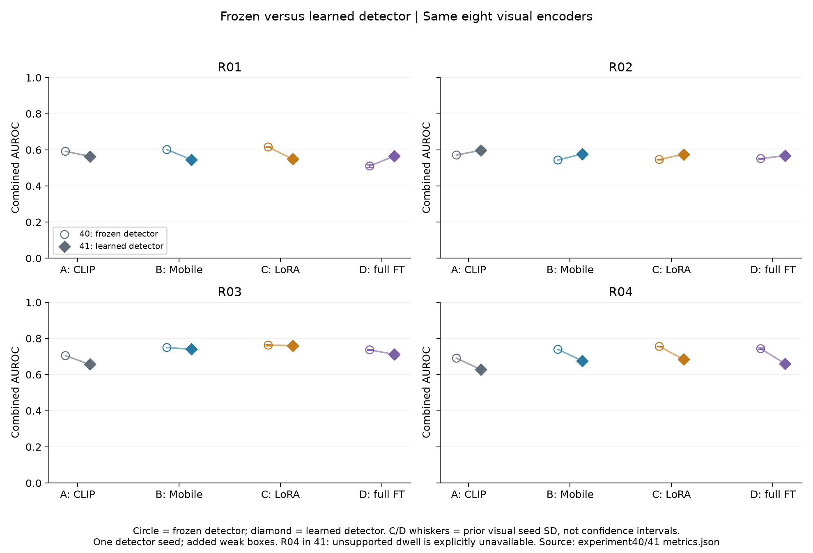
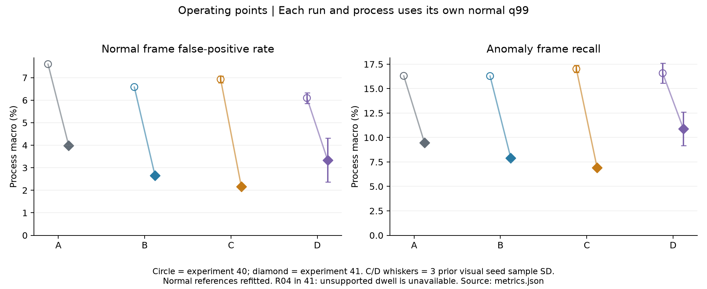
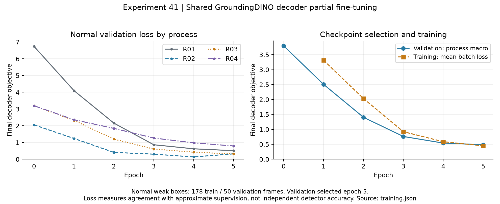

# 실험41 — 공유 GroundingDINO decoder 학습

**완료. 검출 학습의 약지도 loss와 일부 객체 역할 관측은 개선됐지만 전체 이상탐지 성능은 개선되지 않았다.** C 평균 Combined AUROC는0.6702→0.6421, FPR는6.93→2.16%, frame recall은17.01→6.93%다. R04에서는 정상 dwell 적합 자체가 실패하여 명시적 unavailable 처리가 필요했다. 이 실패와 성능 퇴행을 포함한 결과다.

## 질문과 고정 조건

실험40의 공유 visual representation 위에서 검출기만 학습하면 역할·박스 관측과 이상탐지가 함께 개선되는가? GroundingDINO-tiny의 공유 decoder·bbox head 11,187,460개 파라미터만 partial FT했다. 시각 encoder는40의 A/B/C_s42/D_s42/C_s43/D_s43/C_s44/D_s44 모두 동결했다. Vocabulary, confidence/text threshold, IoU tracker 알고리즘, 기존 phase 파라미터, sampling stride4를 유지했다. 새 관측에 대한 appearance subspace·transition·dwell·CDF·q99는 기존 정상 분할과 규칙으로 공정별 재적합한다.

이는 기존 이미지 자기지도에 정상 role/box 약지도를 추가한 비교다. **R04의 strict dwell 적합이 실패하여, 정상 자료에서 지원이 없으면 체류 증거를 사용 불가로 표시하는 runtime 처리가 추가됐다.** 아래 실패 기록을 포함해 해석해야 하며 완전히 동일한 downstream 코드의 비교라고 표현하지 않는다. Detector 아키텍처는 [GroundingDINO 원 논문](https://arxiv.org/abs/2303.05499)을 사용하며 새로운 검출 알고리즘이나 loss를 제안한 실험이 아니다. 세부 구현은 [METHODS](EXPERIMENT41_METHODS.md), 테스트 이전 동결 설정은 [PLAN](EXPERIMENT41_PLAN.md)과 [protocol](../results/experiment41/detector_protocol.json)에 있다. PLAN의 상태 문구는 학습 직전 기록으로 보존한다.

## 이번 실험 결과

A=frozen CLIP, B=frozen MobileCLIP2-S2, C=실험40의 LoRA, D=실험40의 visual full FT다. 41에서는8개 encoder 모두 동결했다. Test66영상 중31,550 valid frames(정상18,038/이상13,512),66이상 구간을 평가했다. R02/12·13·14의 라벨 길이 불일치1,912프레임은 전체 unknown으로 제외했으며 임의 시간 보정을 하지 않았다.

| exp | arm | Visual AUC | Combined AUC | Combined AP | FPR% | recall% | event% |
| --- | --- | --- | --- | --- | --- | --- | --- |
| 40 | A | 0.6934 | 0.6395 | 0.5247 | 7.60 | 16.31 | 56.72 |
| 41 | A | 0.6680 | 0.6113 | 0.5081 | 3.99 | 9.47 | 63.18 |
| 40 | B | 0.7082 | 0.6584 | 0.5510 | 6.58 | 16.29 | 57.68 |
| 41 | B | 0.6775 | 0.6348 | 0.5332 | 2.65 | 7.91 | 61.51 |
| 40 | C | 0.7226 ± 0.0011 | 0.6702 ± 0.0009 | 0.5576 ± 0.0009 | 6.93 ± 0.15 | 17.01 ± 0.37 | 60.50 ± 1.47 |
| 41 | C | 0.6862 ± 0.0009 | 0.6421 ± 0.0005 | 0.5394 ± 0.0007 | 2.16 ± 0.08 | 6.93 ± 0.16 | 58.54 ± 0.84 |
| 40 | D | 0.6759 ± 0.0040 | 0.6354 ± 0.0016 | 0.5368 ± 0.0012 | 6.10 ± 0.24 | 16.58 ± 1.02 | 55.39 ± 1.52 |
| 41 | D | 0.6762 ± 0.0026 | 0.6261 ± 0.0053 | 0.5240 ± 0.0051 | 3.34 ± 0.98 | 10.90 ± 1.72 | 56.12 ± 3.09 |

공정 안의 지표를 동일 가중 평균한 값이다. C/D는 이전 visual 학습3seed의 평균±표본 SD이며 detector 학습은 단일 seed42다. SD는 신뢰구간이나 detector 학습 불확실성이 아니다. FPR/recall/event는 각 run·공정의 별도 정상 q99에서 계산했다. R04의41 결과에는 unavailable-dwell 처리가 포함된다.

R02에서는 모든 표현의 Combined AUROC가 높아졌다. C는0.5464→0.5755, AP0.4052→0.4401, recall5.02→5.83%다. 그러나 다른 공정에서는 이득이 유지되지 않아 A/B/C/D의 macro Combined AUROC는 모두 낮아졌다. C는41 안에서도 B/D보다 ranking이 높지만, D보다 frame recall은 낮다. 특정 지표의 최고값으로 전체 파이프라인을 채택하지 않는다.

R01 C는 오탐365→72, TP293→48프레임, 탐지 구간6/8→7/8이다. 구간 중 한 번이라도 울리는 비율은 늘었지만 이상 구간 전체를 덮는 frame recall은23.37→3.83%로 줄었다. 모든41 visual arm의 R01 경보가72FP/48TP로 같다는 점도 기록한다. 객체 박스가 의미상 맞아진 것과 최종 경보 품질은 별개의 판단이다.

R03 C는 Combined AUROC0.7629→0.7604로 비슷하고 AP0.6611→0.6675는 소폭 높아졌지만 recall28.24→15.82%, 탐지 구간12/17→11/17로 감소했다. R04 C는 Combined AUROC0.7557→0.6837, recall11.42→2.24%, 탐지 구간16/13/15→10/10/11개로 낮아졌다. R04 D는 recall0.90%, 탐지3/4/9개에 그쳤다.

기존40 q99를 새 점수에 적용하는 보조 비교에서도 R01 C는72FP/48TP로 같고, R04 C의 TP는149/117/133으로 기존585/463/521보다 적다. 따라서 임계값 수치 변경만으로 recall 감소를 설명할 수 없다. 다만 정상 CDF도 재적합했으므로 이 비교를 동일 score scale의 통제 실험으로 해석하지 않는다. R04 Visual AUROC 자체도0.7549→0.6879로 내려가 체류 비활성만이 전체 하락의 원인이라고 주장할 수 없다.

전체32개 process/run과 seed별 FP/TP·q99·LOVO는 [표 전체](../results/experiment41/report_tables.md), 영상별 결과는 [CSV](../results/experiment41/per_sequence.csv), paired 추가/제거 경보는 [metrics.json](../results/experiment41/metrics.json), 구간 결과는 [events.json](../results/experiment41/events.json)에 있다.

## 데이터와 학습 결과

정상111영상 중 표현 학습70/검증19/normal calibration22 분할을40과 동일하게 유지했다. Train/val 영상의20/50/80% 시점267프레임을 Codex가 원본 contact sheet로 검수했다. 최종178 train/50 val,39제외다. 사람 독립 bbox GT가 아니며, 정상이라는 정보 외에 역할과 근사 박스 감독이 추가된다. Test와 calibration은 detector 최적화·epoch 선택에서 제외했다.

| 공정 | train frames | val frames | 제외 | epoch0 → epoch5 normal val loss |
|---|---:|---:|---:|---:|
| R01 |63|18|0|6.7395 → 0.5130|
| R02 |57|15|0|2.0551 → 0.3251|
| R03 |37|12|5|3.1909 → 0.3163|
| R04 |21|5|34|3.1964 → 0.7940|

Seed42,5epochs,455 optimizer updates, FP32, AdamW1e-5다. 정상 검증의 공정 macro loss 최소값으로 epoch5가 선택됐다(3.7955→0.4871). R02 단독 loss는 epoch4가 더 낮았지만 사전 지정한 macro 기준을 유지했다. 동결 파라미터·buffer hash는 학습 전후 동일하다. 학습 wall time124.87초, peak PyTorch allocated2.60GiB이며 공유 호스트에서 모델 로딩 이후 측정한 값이다. End-to-end streaming FPS나 VLM 동시 실행 비용이 아니다.

설치된 Transformers4.57.6의 native encoder loss 경로는 큰 상수성 분류항과 detached proposal boxes를 포함했다. 정상 smoke에서 확인한 뒤, 본 학습은 최종 decoder의 Hungarian focal/L1/GIoU만 사용하고 proposal head를 고정했다. Two-stage 추론 구조는 유지했다. 최초/수정 smoke 모두 본 학습에 이어 쓰지 않고 원본 checkpoint에서 재시작했다. HF cardinality_error를 검출 수 정확도로 해석하지 않는다. [학습 기록](../results/experiment41/training.json) · [정상 smoke](../results/experiment41/smoke.json).

## 정상 관측 진단

| 공정 | sampled frames | frozen phase 분포 0/1/2/3 | learned phase 분포 0/1/2/3 | 관계 관측 frozen → learned |
|---|---:|---|---|---|
| R01 |1,966|1330 / 509 / 127 / 해당 없음|635 / 641 / 690 / 해당 없음|해당 없음|
| R02 |4,448|20 / 1425 / 246 / 2757|동일|해당 없음|
| R03 |3,845|1457 / 1186 / 955 / 247|1560 / 1120 / 1100 / 65|3839 → 3844|
| R04 |2,442|292 / 1077 / 618 / 455|69 / 169 / 8 / 2196|1420 → 1708|

정상111영상 전체의 sampled 관측이다. R04의 관계 관측은58.1→69.9%지만 phase3는18.6→89.9%로 집중된다. 새로운 박스와 기존 관계 좌표·phase 중심의 불일치가 가능한 원인이며, 의미 phase 정답이 없어 phase 정확도 하락으로 단정하지 않는다. R01의 phase 전이는27→67회로 증가했다. 이는 검출 증가를 이상 전이로 판단할 수 있다는 뜻이 아니라, 정상 공정 통계도 새 관측에 맞춰 다시 적합해야 한다는 진단이다.

약지도 validation 박스와 IoU≥0.5 일치는 R01 product4/18→18/18, R02 scissor5/15→15/15, R04 blade0/5→5/5다. 학습 checkpoint 선택에 사용한 근사 주석과의 일치이며 독립 mAP/recall이 아니다. R04 validation5프레임은 upright blade에 편중됐다.

각 공정의 첫·마지막 calibration 영상에서20/50/80% 시점을 미리 지정한24프레임을 별도로 육안 비교했다. R01 줄자 오검출이 벨트 제품으로, R02 바이스/코드 오검출이 scissor로 바뀌었다. R03는 비슷한 위치를 유지하고 일부 중복 tray 후보가 줄었다. R04는 foreground vise 대신 blade를 잡지만 손/금속 부위 오검출, 잘라진 종이 누락과 겹친 종이를 한 박스로 합치는 문제가 남았다. 두 R04 영상의6시점 모두 learned phase3였다. 이 사례는 학습·checkpoint 재선택에 쓰지 않았다. [정상 진단](../results/experiment41/normal_diagnostics.json) · [육안 관찰 기록](../results/experiment41/normal_output_review.json).

ReID를 위한 정상 자료도 감사했다. confidence≥0.5, 동일 역할·동일 프레임의 비중첩 박스(IoU≤0.1) 후보는 train에서 R01/R02/R03 모두0개, R04만163개다. 인접 고IoU 관측은 많아도 identity를 구별하는 감독은 부족하다. 비중첩 박스를 자동으로 다른 실제 identity 정답으로 간주하면 split box·오검출까지 학습할 수 있다. [후보 지원 감사](../results/experiment41/association_supervision_inventory.json).

## 정상 적합 실패와 평가 가능한 경로

원래 strict 파이프라인은 R04에서 `No supported normal dwell state`로 중단됐다. FIT20영상의 상태0/1/3 완결 표본은5/5/7개, 문맥별 최대5개로 최소10 미달이다. 이후 정상 자료만 근거로 명시적 `dwell_allow_unavailable` 정책을 추가했다. 지원되는 분포는 기존 계산을 유지하고, 미지원 분포는 빈 값과 `dwell_valid=False`로 표현한다. R04의 체류 점수를 정상 점수로 간주하거나 표본 기준을 낮추지 않는다. 외형·전이 경로를 유지한 채 정상 모델·CDF/q99를 다시 적합하고 동결했다.

이후 정량 결과는 이 availability 처리가 있는 경로의 결과다. 학습 파라미터·영상 특징은 바꾸지 않았지만 runtime 지원 부족 처리까지 같은 대조는 아니며, **strict 적합 실패를 성공으로 덮지 않는다**. 실패 시점 protocol·부분 모델을 보존했다. R01~R03의 중단 전 정상 모델·점수320파일은 복구 후 배열 단위로 정확히 재현됐다. [상세 복구 명세](EXPERIMENT41_NORMAL_RECOVERY.md) · [실패 기록](../results/experiment41/normal_fit_recovery.json) · [복구 범위 검증](../results/experiment41/normal_fit_recovery_validation.json).

## 측정 비용과 재현 범위

정상 검출·CLIP auxiliary·추적·phase 계산·저장은111영상/12,701 sampled frame/32,944 boxes에서1,187.89초, 테스트는66영상/8,391 sampled frame/21,597 boxes에서842.21초였다. 모델 로딩 이후의 순차 처리 시간이며 I/O와 저장, 공유 호스트의 다른 작업 영향을 포함한다. 이후8개 표현의 crop 재추출·정상 통계 적합·검증 비용은 별도다. Test detector 비용에도 라벨 읽기는 포함하지 않는다. VLM 호출·학습과 camera streaming latency를 측정한 것이 아니며, 과거 frozen detector와 일치시킨 속도 벤치마크도 아니다.

정상 박스 수41,346→32,944 감소는 중복/오검출 감소와 누락 변화가 섞인 관측이다. 독립 정답 없이 정확도 또는 속도 개선으로 대체하지 않는다. 같은 visual run의 기존 full-frame 특징을 그대로 재사용하고 새 crop만 다시 계산했다. CLIP/MobileCLIP 원본9개 파일이 실험40 이전 hash와 같은지 확인했다. [원본 시각 가중치 검증](../results/experiment41/reused_backbone_integrity.json).

## 실험 결과의 의의

공유 detector의 실제 gradient·update·복원·동결부 보존을 검증하고, 동일8개 visual representation과 공정별 통계 모델로 변경을 끝까지 전파하는 학습 파이프라인을 구현했다. 일부 역할 검출의 교정, 새로운 crop 분포, phase 점유와 체류 지원, 최종 경보가 함께 바뀐다는 점을 관측했다. **정상 검증 loss 감소나 약지도 box 일치가 anomaly detection 개선을 보장하지 않는다**는 사례를 확인한 것이 이번 단계의 핵심이다.

정상 자료가 부족한 체류 분포를 만들어 채우지 않고 사용 불가로 공개하며, 실패 전후의 변경 범위를 재현했다. 이는 파이프라인 구현·실험 방법의 가치이며 알려진 decoder fine-tuning이나 support masking 자체의 novelty, SOTA, 일반화 또는 통계적 유의성을 주장하지 않는다. 논문 주제는 아직 특정 모델 기여로 고정하지 않는다.

## 보완할 점

전체 frame recall이 크게 낮아졌고 R04 phase/dwell 경로는 새 관측에 적합하지 않았다. R01의 event coverage 상승만 강조하면 짧아진 경보와 큰 TP 감소를 놓친다. 기존 phase 파라미터를 유지한 비교는 detector의 전파 효과를 보여주지만 최종적으로 잘 적응된 공정 모델의 상한이 아니다.

Detector 약지도는 모델 보조 근사 box이며 R04의 움직임·겹침 상태가 충분하지 않다. Weak val box는 epoch 선택에도 쓰였으므로 독립 평가가 아니다. Identity/phase GT, pixel localization 정답과 독립 녹화 그룹도 없다. 정상 track 수나 관측률을 IDF1/HOTA/recall로 대체하지 않는다. 새로운 잘못된 연결, 누락된 이상 객체와 unseen 공정에 대한 일반화는 추가 검증이 필요하다.

40과 비교할 때 정상 box 감독이 추가됐고 R04 runtime availability 처리도 추가됐다. 세 visual seed는 같은 detector와 분할을 공유한다. 반복 관찰한 개발 test이므로 새로운 held-out benchmark의 성과로 보고하지 않는다.

## 검증·재현

182개 테스트 통과, 정상 특징888파일 검증, full/holdout208개 정상 모델·점수와 test528개 예측 재구성, object score/detection index 대응, AUROC midrank·AP tied-threshold 독립 재계산, 경보·event 및 protocol 해시 검증을 완료했다. 모든528개 test 예측은 라벨을 열기 전에 동결됐다. 정상 자료에서 발견한 strict fit 실패와 복구를 별도 보존했다. [검증 기록](../results/experiment41/validation.json) · [평가 감사](../results/experiment41/evaluation_audit.json) · [설정](../configs/experiment41_detector.json) · [구현·재현 명세](EXPERIMENT41_METHODS.md).

## 다음 Recommended improvements — 추천순3개

| 추천순 | 개선 후보와 변경 내용 | 이번 결과의 근거 | 검증 기준 및 주의점 |
|---|---|---|---|
| 1 | **공유 learned ReID/association adapter를 분리 검증**: 검수 가능한 정상 temporal pair로 작은 residual metric head만 학습. IoU-only, frozen-feature association, learned association을 같은 검출·시각 표현에서 비교 | R04 정상 material/blade track ID 합계가223/268→247/286이고, blade 관측률은97.8→82.3%다. 반면 다른 공정의 track 수는 크게 감소했다. 역할 교정 뒤에도 연결 품질을 별도로 검증할 필요가 있다. 정상 same-role negative 후보는 R04 train163/val50에 집중되어 감독 한계도 확인됐다 | 사용자 지정 학습 단계에 따라 **다음42는 이 한 요소**를 선택. 기존 track ID를 identity GT로 복제하지 않고 positive/negative pair를 검수하며, 지원 부족 역할은 IoU로 명시적 fallback. False link·재연결·phase/dwell 가용성·FPR/recall을 함께 평가. Track 감소를 IDF1 개선으로 부르거나 ReID가 AUROC 하락의 원인이라고 단정하지 않음 |
| 2 | **공정별 learned phase head와 관측 분포 적합성 검증**: 새 detector 관측에 맞춘 정상 phase target/참조와 작은 process별 head를 검증. Transition/dwell은 통계 모델로 유지 | R04 phase3가18.6→89.9%, complete run 최대7개로 dwell 적합 실패. C의 R04 Combined AUC0.7557→0.6837, recall11.42→2.24%. R01도 새 박스는 제품을 잡지만 C Combined AUC0.6156→0.5487 | 과거 latent phase를 action 정답으로 그대로 증류하지 않음. 기존 phase, 새 정상 참조, learned head 효과를 구분하고 phase 점유·전이·완결 지원과 최종 경보를 검증. 정상-only checkpoint 선택, test 상대시간 입력 금지. 42 결과를 본 뒤 구체화 |
| 3 | **상태 균형 detector 약지도와 독립 검증 자료 확충**: 낮아진/움직이는 blade, 분리·겹친 material 및 identity/phase 경계를 포함한 정상 주석을 보강 | R04 60개 검수 프레임 중34개 제외, val5개는 upright 편중. 정상 holdout에서 잘린 종이 누락·손/금속 오검출이 남음. 약지도 box 일치 상승에도 전체 C AUROC와 recall 하락 | 최적화 주석·checkpoint validation·독립 진단을 구분. 기존 pseudo-box 일치를 detector 정확도로 대체하지 않으며 주석 변경과 모델 구조 변경을 동시에 넣지 않음. 독립 사람 GT와 별도 녹화 그룹이 없으면 그 제한을 유지 |

[1순위를 구체화한 실험42 계획](EXPERIMENT42_PLAN.md). 후속 연구 전체를 확정한 목록이 아니며42 결과를 보고 우선순위를 다시 갱신한다.
