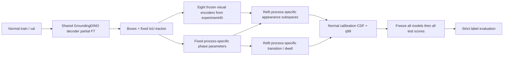

# 실험41 구현·재현 명세

실행 전 동결 기록은 [계획](EXPERIMENT41_PLAN.md), 학습 완료 기록은 [training.json](../results/experiment41/training.json)이다. 최종 이상탐지 결과는 전체 점수 고정과 검증이 끝난 결과 보고서에서 판단한다.



Frozen phase **parameters** do not imply unchanged phase **outputs**: changed boxes and tracks enter the same phase model. R02 alone retains its prior full-frame phase output exactly. This distinction is checked in the normal diagnostics.

## 변경 범위와 추가 감독

R01~R04가 하나의 GroundingDINO-tiny decoder와 decoder bbox head를 공유한다. 초기 모델 revision은 `a2bb814dd30d776dcf7e30523b00659f4f141c71`이다. Vision backbone, text backbone/projection, fusion encoder, encoder proposal head, query 초기 embedding은 고정한다. Decoder11,187,460개 parameter만 FP32로 최적화하며 pretrained 모듈은 eval mode를 유지해 dropout·동결 buffer 통계를 바꾸지 않는다.

이 실험은 anomaly label 없이 정상 영상으로 학습하지만, 실험40의 이미지 자기지도에 비해 **역할·박스 약지도**가 추가된다. Frozen teacher 출력만 복제한 완전 자동 자기학습 또는 사람 정답 기반 supervised detection이라고 표현하지 않는다. 학습 방법과 추가 정보의 효과를 분리하는 완전한 factorial 대조도 아니다.

40에서 정한 train70/val19 영상 분할에서 각 영상의20/50/80% sampled 시점을 골라267프레임을 검수했다. Codex가 aspect ratio를 보존한 원본 contact sheet를 모두 보고 teacher box·정상 장면 기하 초안을 수락/수정/제외했다. 최종178 training frame과50 validation frame,39 excluded frame이다. 원본 데이터는256×256이고 검수판 확대는 해상도 정보 증가가 아니다. 주석 경계는 근사치이며 독립 사람 검수가 없다. 검수 초안·최종 box·제외 사유·주체·원본 SHA256은 [annotations.json](../results/experiment41/annotations.json)에 남겼다. Calibration22영상과 test 영상은 annotation·최적화·epoch 선택에서 제외한다.

R01은 벨트 위 제품 대신 줄자를 잡던 teacher 오검출을 바로잡는다. Belt와 front rail은 고정 장면 기하의 근사 박스다. R02는 plate 아래 scissor 누락을 추가하고 scissor를 meter로 분류한 박스를 수정했다. R03의 tray 범위 오류5프레임은 전체 제외했다. R04는 모호하게 겹친 종이, 누락된 큰 절단 조각, 움직이는 blade의 부정확한 경계34프레임을 제외했다. 따라서 upright blade 상태에 편중된26프레임만 남았으며 공정 전체 동작에 대한 충분한 box supervision이 아니다. 배경의 작은 기존 debris는 sheet 객체로 주석하지 않는다.

## 목적함수와 학습 확인

설치된 Transformers4.57.6의 최종 decoder Hungarian matcher와 sigmoid focal/L1/GIoU loss를 사용한다. 가중치는2/5/2, matching cost는1/5/2다. `class_labels`는 period로 구분한 caption의0-based role index, `boxes`는 normalized cxcywh다. Caption token map을 각 batch에서 검사한다. 동일 공정의 최대2프레임씩 batch를 구성해 HF loss의 batch class offset과 서로 다른2/3-role caption 공간이 섞이지 않게 한다.

기본 HF encoder loss는 learned target query와 fusion 전 text에서 큰 분류항을 만들고 encoder proposal boxes가 detach돼 있었다. 본 실험은 최종 decoder loss만 사용하며 two-stage 추론 구조는 유지한다. Encoder proposal head는 frozen이고 inference proposal 생성도 원본 그대로다. HF의 `cardinality_error`는 DETR argmax 방식이라 confidence threshold를 거친 GroundingDINO 객체 수가 아니며, 이 값을 검출 정확도로 해석하지 않는다.

정상 smoke에서 각 공정의 loss·실제 gradient·update·동결 parameter/buffer hash·checkpoint 복원을 확인했다. 최초 native-loss smoke와 수정 smoke는 모두 원본 가중치에서 수행했고 본 학습은 다시 원본 가중치로 시작했다. 학습에 smoke의 optimizer step을 이어 쓰지 않는다.

Seed42,5epochs, epoch당91step(총455), AdamW1e-5, weight_decay1e-4, gradient norm clip1.0, 고정 learning rate를 사용한다. 모든178프레임을 epoch당 한 번 방문하며 동일 공정 batch와 전체 batch 순서를 shuffle한다. Color augmentation은 brightness/contrast0.9~1.1, saturation0.95~1.05다. Training shortest-edge768/800/832에서 resize하고 crop·flip은 쓰지 않는다. Validation은 shortest-edge800, longest-edge1333이다. Resize에 따라 normalized box 좌표는 유지된다.

정상 validation에서 공정별 image-weighted batch loss를 계산한 뒤4공정 macro 평균으로 epoch0~5 중 하나를 선택한다. Loss는 모델 보조 주석에 대한 적합도를 나타내며 독립 detector accuracy/mAP가 아니다. 단일 seed pilot이며 데이터 분할 간 일반화나 통계적 유의성을 주장하지 않는다.

## Downstream 통제

실험40의8개 visual run(A/B/C_s42/D_s42/C_s43/D_s43/C_s44/D_s44)을 전부 고정한다. 특정 테스트 성능이 좋은 run/seed만 선택하지 않는다. Vocabulary, confidence/text threshold0.25, role별 NMS0.5/최대3개, IoU tracker threshold0.2/max age2, stride4를 유지한다. 새 box에 CLIP auxiliary crop embedding을 계산하고 이전 phase 모델의 파라미터를 그대로 적용한다. R01 spatial, R03 relational, R04 asinh confirmed-anchor 모델이 기존 정상111영상의 phase/관계 배열을 정확히 재현하는지 확인했다. R02의 기존 frozen CLIP phase 관측은 그대로 재사용한다.

Visual feature 추출 시40의 동일 원본 frame·동일 encoder의 global feature는 정확히 재사용하며, 새 box의 crop feature만40과 같은 preprocessing/FP32/normalization으로 다시 계산한다. R04 semantic anchor margin은 기존 CLIP 보조 경로에서 계산해 모든 visual run에 공통으로 유지한다. 공유 표현을 detector와 동시에 다시 학습하지 않는다.

공정별 normal appearance PCA/subspace, transition, dwell, reference CDF, q99는 기존 downstream FIT89/calibration22 분할과40의 동일 수치 설정으로 다시 적합한다. 이는 새 detector 관측을 처리하기 위한 통계적 재적합이며 새로운 phase/transition 신경망 학습이 아니다. 각 normal calibration 영상을 제외한 holdout도 수행한다. 고정 variance0.95/rank cap32/minimum support10 규칙하 실제 rank·support 차이를 공개한다.

정상 적합 중 R04의 모든 complete-run 상태·문맥 지원이10 미만이어서 strict fit이 실패했다. 이후 테스트 이전에 `dwell_allow_unavailable` 정책을 추가했다. 지원되는 분포는 기존 lognormal 계산과 정확히 같고, 지원이 없으면 context/lognormal parameters를 비우고 `dwell_valid=False`로 체류 증거를 제외한다. 이 runtime 처리 추가는 detector 학습과 구분하며 [중단·복구 명세](EXPERIMENT41_NORMAL_RECOVERY.md)와 과거 protocol을 보존한다. 기존 strict 클래스·40 코드는 수정하지 않는다.

정상 모델 동결 → test 이미지 특징 → 전8run·4공정의 모든 score 동결 → label 평가를 따른다. 길이가 불일치하는 R02/12·13·14는1912프레임 전체 unknown으로 제외한다. 인과적 zero-order hold, source-frame index 시간축을 유지하며 FPS나 초 단위 지연을 만들지 않는다. 기존 test를 반복 관찰한 개발 실험이며 독립 confirmatory benchmark가 아니다.

41-Learned와40-Frozen의 동일 visual run을 비교한다. 주 경보 비교는 각각의 정상 q99를 사용한다. Frozen q99에서 learned score를 평가하는 보조 비교도 남기되 CDF가 서로 재적합되므로 완전히 같은 score scale의 임계값 실험으로 해석하지 않는다. Normal observation coverage와 weak validation box agreement는 별도 진단이며 independent detector recall·IDF1·HOTA·phase accuracy는 미측정이다.

## 재현

기존 Stage00/실험40의 split·가중치·cache 및40의 독립 MobileCLIP dependencies가 필요하다. 원본 데이터·가중치·feature cache·server log는 GitHub에 포함하지 않는다. 기존 공개 결과와 local artifacts를 원본 기록으로 보존한 별도 재현 checkout/출력 디렉터리에서 실행한다. 학습·normal checkpoint는 덮어쓰지 않으며 extraction 재개는 signature/hash가 같은 완료 파일만 건너뛴다.

```bash
export PYTHONPATH=artifacts/experiment40/deps:src:scripts
.venv/bin/python scripts/inventory_detector41_candidates.py
.venv/bin/python scripts/prepare_detector41_annotations.py
# 공개된 검수 결정과 원본 이미지 hash가 일치하는 재현에서만 적용한다.
.venv/bin/python scripts/finalize_detector41_annotations.py
.venv/bin/python scripts/train_detector41.py --smoke
.venv/bin/python -m pytest tests/test_learned_detector.py -q
.venv/bin/python scripts/freeze_detector41.py
.venv/bin/python scripts/train_detector41.py
.venv/bin/python scripts/experiment41_phases.py
.venv/bin/python scripts/extract_detector41.py --partition training
.venv/bin/python scripts/run_detector41_evaluation.py
```

`run_detector41_evaluation.py`는 이미 시작한 정상 검출 추출이 완료되면8개 고정 표현 추출, 정상 모델·holdout, normal 진단, test 추출·score 동결·평가·재구성 검증을 순차 실행한다. 오류가 발생하면 해당 stage에서 멈추고 로그를 남긴다. GPU wall time은 공유 호스트 측정이며 camera streaming FPS가 아니다. 학습 peak는 PyTorch allocated memory이고 VLM 동시 실행을 포함하지 않는다. 이번 단계는 VLM을 새로 호출하지 않고 기존 정상 vocabulary를 사용한다.
