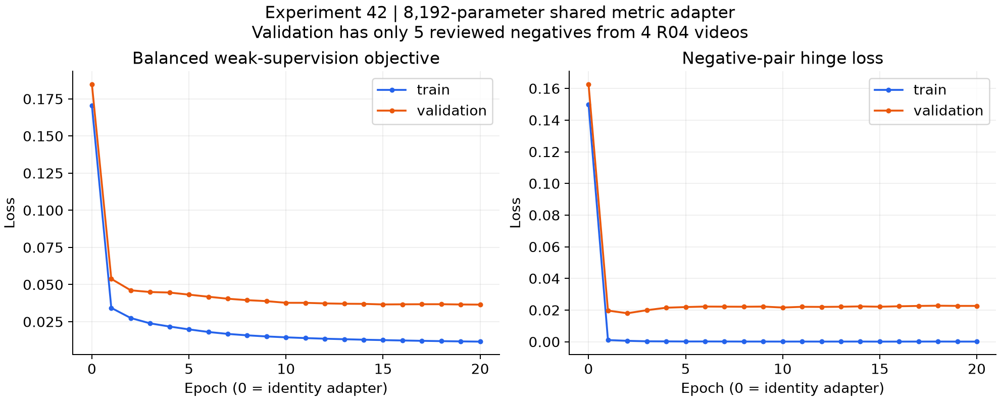
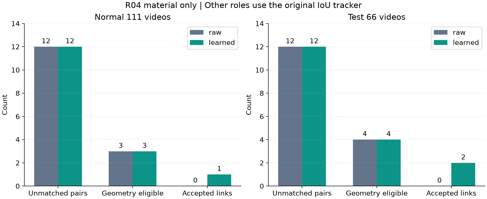

# 실험42 — 공유 learned association adapter

**완료: 정상 weak-pair loss는 감소했지만, 이상탐지 경보의 개선은 없었다.** Learned 경로는 정상1건·test2건의 연결을 추가했고, 기존 IoU와 frozen-feature 경로는 동일했다. Test의 한 경계 박스 연결에서만 phase가 한 샘플 바뀌었으며 R04 AUROC는 소폭 낮아졌다. FPR·recall·event coverage는 모든 visual arm에서 그대로다.

## 질문과 고정 범위

실험41의 추천순1과 사용자 지정 순서에 따라, 공유 representation/ReID 학습이 실제 연결과 downstream 결과에 미치는 효과를 분리했다. Detector41, 실험40의8개 visual arm(A/B/C·D 각3seed), box/role/confidence, stride4, 기존 phase 파라미터를 고정했다. IoU 우선 매칭을 보존하고 남은 관측에만 frozen CLIP cosine 또는 learned cosine을 적용했다. 원래 IoU 대조를 전체 normal111/test66영상에서 재현했다. Phase anchor에는 원래 CLIP 특징을 사용하며 adapter 출력으로 교체하지 않았다.

공정별 appearance PCA·transition·dwell·calibration을 동일 설정으로 재적합했다. 최소 dwell 지원10 및41의 명시적 unavailable 처리를 유지했으며 R04 dwell은 계속 unavailable이다. 41 detector를 최선의 detector로 선택했다는 뜻은 아니다. 이번에는 구성 요소 효과를 분리하기 위해 이전 학습 branch를 유지했다.

## 데이터 감사와 실제 학습

정상70 train/19 representation-validation/22 calibration 분할을 유지했다. Track ID를 정답으로 복제하지 않았다. Confidence≥0.5, 인접 sampled frame의 유일 IoU≥0.7, 경쟁 IoU≥0.2 배제, 같은 역할 관측 수 일치를 만족하는 pair를 temporal-consistency 후보로 만들었다. Same-frame·same-role IoU≤0.1 후보는 영상·role당 처음/중간/마지막 최대3개를 골랐다.

73개 negative frame 전부를 **Codex가 시각 검수**했다. Meter/scissor 역할 혼동1개, 여러 종이를 묶은 박스·모호한 물리 identity30개를 제외하고 train26/val5/cal11개를 수용했다. 이는 사람 identity GT가 아니다. 수용 negative는 전부 R04 material이며 val4영상/cal5영상이다. Positive는 scene-role/train-val의 낮은 confidence·낮은 IoU 극단44쌍을 점검했다. R04 material에서 집합 박스와 물리적 범위 변경을 확인해 **해당 역할의 자동 positive를 전부 제외**했다. 나머지 positive 전체가 개별 검수된 것은 아니다. 장치/fixture와 assembled cargo의 temporal region consistency도 포함한다.

| 감독 | Train | Validation | Calibration |
|---|---:|---:|---:|
| 사용 가능한 weak positive | 15,618 | 4,216 | 4,919 (학습/선택 미사용) |
| 검수 수용 negative | 26 | 5 | 11 (게이트만) |
| 검수 제외 negative | 19 | 8 | 4 |

512차원 auxiliary CLIP 위에 `normalize(x + B(Ax))`, rank8·8,192변수의 공유 residual metric adapter를 학습했다. Foundation visual encoder LoRA와 구분되는 **작은 저랭크 metric head**다. 초기B=0으로 identity, seed42, FP32, AdamW1e-3/wd1e-4, batch256(positive128/negative128),20epochs×64updates=1,280updates. Positive는 scene-role 균등 표집, negative는26개 복원 표집이다. Loss는 positive cosine consistency + negative cosine margin0.5의 squared hinge +0.1 teacher preservation이며 [확정 설정](../configs/experiment42_association.json)과 [Methods](EXPERIMENT42_METHODS.md)에 정의했다.

Epoch0을 포함해 정상 val objective가 가장 낮은 epoch20을 선택했다. Val0.184829→0.036513, train0.170647→0.011603이다. Negative loss는 train0.149785→0.000101, val0.162639→0.022646으로 validation gap이 남았다. 이 값은 ReID accuracy가 아니다. 실제 gradient·weight change, checkpoint 복원 및 원본 feature hash 보존을 확인했다. GPU 학습+validation3.70초, peak allocated0.271GiB이며 데이터 준비/로드/검수·downstream 적합 시간을 포함하지 않는다.

## 실제 연결 및 전파

역할별 train/val negative 지원, cal≥10쌍·≥3영상이 있는 경우에만 appearance 경로를 켰다. 따라서 R04 material만 활성화된다. 게이트는 검수 cal negative의 최대 cosine+0.01로 raw0.938103/learned0.860838이다. 이 수치는 검증된 false-link 보장이나 동일 객체 recall 최적화가 아니다. 양끝confidence≥0.5, 중심거리≤0.25, 면적비[0.25,4], 경쟁 후보 cosine margin≥0.05, max_age2를 유지했다. 누락 프레임에 새 검출을 만들어내지 않는다.

| 범위 | Unmatched 고confidence pair | Geometry 통과 | raw 추가 연결 | learned 추가 연결 | learned phase 변경 |
|---|---:|---:|---:|---:|---:|
| 정상111영상 | 12 | 3 | 0 | 1 | 0 samples |
| Test66영상 | 12 | 4 | 0 | 2 | 1 sample |

정상 R04/05 frame132→136, test R04/11 frame140→144는 떨어지는 한 조각의 연결로 보였다. Test R04/17 frame72→76은 화면 상단에 재료 일부만 보여 동일 identity를 확정하기 어렵다. **추가3연결을 모두 시각 검수했으나 정량 identity 정확도를 주장하지 않는다.** 세 연결 모두 sample gap1로, 검출 누락 후 장기간 재식별을 입증한 결과도 아니다. Raw는 기존 IoU와 전부 같다. Learned의 ID 숫자 변경192/163/288개에는 이후 ID 재번호 부여가 포함되어 있어 새로운 연결643건으로 해석하면 안 된다.

R04/17 sample19(frame76)의 phase3→0, relation descriptor2행 변경이 전파됐다. Test process score는8 source frames, combined는 A4frames/나머지7arms8frames에서 바뀌었다. 다른 test영상65개와 정상phase는 모두 같다. Normal 모델64개와 full/holdout score는41과 정확히 같았고, test raw528개는전부, learned528개 중520개는score가정확히같다. Appearance subspace는role/phase 기반이라 track ID 자체를 직접 분포화하지 않는다. 따라서 연결 수 감소만으로 AD 성능이 개선된다고 기대할 수 없다.

## 이상탐지 결과

31,550 valid frames = 18,038 normal + 13,512 anomaly, 66 events이다. R02 test12/13/14의 길이 불일치 1,912프레임은 영상 전체를 unknown으로 제외했다. FPS나 라벨 위치를 추정해 메우지 않았다. 아래는 공정별 지표의 동일 가중 macro다. C/D는 기존 visual 3seed 평균±표본 SD, association은 seed42 하나다. Run·공정별 정상 q99로 평가했으며, 이번에는 재적합 후에도 41과 임계값이 정확히 같다. **42 raw는 41과 정확히 동일**하여 표에서 생략했다.

| branch | arm | Visual AUC | Combined AUC | Combined AP | FPR% | recall% | event% |
|---|---|---|---|---|---|---|---|
| 41 IoU | A | 0.6680 | 0.6113 | 0.5081 | 3.99 | 9.47 | 63.18 |
| 42 learned | A | 0.6680 | 0.6113 | 0.5080 | 3.99 | 9.47 | 63.18 |
| 41 IoU | B | 0.6775 | 0.6348 | 0.5332 | 2.65 | 7.91 | 61.51 |
| 42 learned | B | 0.6774 | 0.6345 | 0.5328 | 2.65 | 7.91 | 61.51 |
| 41 IoU | C | 0.6862 ± 0.0009 | 0.6421 ± 0.0005 | 0.5394 ± 0.0007 | 2.16 ± 0.08 | 6.93 ± 0.16 | 58.54 ± 0.84 |
| 42 learned | C | 0.6860 ± 0.0009 | 0.6418 ± 0.0005 | 0.5391 ± 0.0007 | 2.16 ± 0.08 | 6.93 ± 0.16 | 58.54 ± 0.84 |
| 41 IoU | D | 0.6762 ± 0.0026 | 0.6261 ± 0.0053 | 0.5240 ± 0.0051 | 3.34 ± 0.98 | 10.90 ± 1.72 | 56.12 ± 3.09 |
| 42 learned | D | 0.6761 ± 0.0026 | 0.6258 ± 0.0052 | 0.5236 ± 0.0050 | 3.34 ± 0.98 | 10.90 ± 1.72 | 56.12 ± 3.09 |

전체 공정·seed 64행은 [결과표](../results/experiment42/report_tables.md), 영상별 1,056행은 [CSV](../results/experiment42/per_sequence.csv)에 있다. R01~R03은 모든 점수와 지표가 그대로다. R04 learned Combined AUROC 변화는 A −0.0000657, B −0.0009771, C 평균 −0.001230, D 평균 −0.001114이다. 모든 run의 추가/제거 FP와 TP는 0이고, 탐지 구간 수도 같다. 작은 ranking 감소를 통계적으로 유의한 퇴행으로 주장하지 않지만 개선 근거도 없다.

## 의의

공유 시각·검출을 재학습하지 않고 작은 metric adapter를 실제 학습하고, IoU 정책과 frozen-feature 정책을 분리하여 연결→phase→이상점수의 전파를 확인했다. Loss 감소가 연결 개선·phase 정확도·AD 개선과 동일하지 않음을 관찰했다. 지원이 없는 10개 scene-role 조합은 명시적으로 IoU를 유지한다. 이는 학부 캡스톤 수준의 모듈별 학습/감사 가능한 파이프라인 구현 결과다. 새로운 metric loss나 ReID 알고리즘, SOTA·통계적 유의성·독립 일반화를 주장하지 않는다.

## 보완할 점

- Negative가 R04 material에만 존재하며 train 26/val 5개의 작은 감독 자료를 반복 표집했다. 다른 역할의 temporal consistency는 identity 분리를 검증하지 못한다. R04 material positive를 제외했으므로 이 역할의 temporal-positive recall도 미측정이다.
- 같은 시점의 negative로 정한 게이트를 시점 간 association에 적용했다. 실제 occlusion·재등장·경계 진입의 identity GT가 없고, geometry를 통과한 후보도 정상 3/test 4쌍뿐이다. IDF1/HOTA, detection mAP, phase accuracy를 보고하지 않는다.
- Normal holdout 352개는 CDF/q99 calibration 영상만 제외한 **조건부 진단**이다. Association 게이트는 전체 검수 cal negative로 고정했으므로 end-to-end 독립 video holdout가 아니다. 별도 그룹/identity validation이 필요하다.
- Learned의 유일한 test phase 변경은 identity를 확정하기 어려운 경계 박스에서 발생했다. R04의 정상 phase3 편중 89.9%와 dwell 지원 부족은 그대로다. 41 이전의 AD 손실을 ReID가 복구하지 못했다.
- 반복 관찰한 개발 장면이며 독립 녹화 그룹/신규 공정 일반화 검증이 없다. 추가한 약한 감독을 무주석 학습으로 표현하지 않는다.

## 다음 Recommended improvements — 추천순 3개

| 추천순 | 개선 후보와 변경 내용 | 이번 결과의 근거 | 검증 기준 및 주의점 |
|---|---|---|---|
| 1 | **공정별 learned phase head**: 공유 동결 시각 특징 위에 process별 저랭크 adapter와 작은 head를 학습. 정상 weak phase target을 감사하고 기존 규칙/linear probe와 분리 비교. Transition/dwell/calibration은 공정별 통계 모델로 유지 | ReID의 정상 phase 변경 0, test 변경 1 sample, 경보 개선 0. R04 phase3 편중과 dwell unavailable도 해결되지 않음 | **다음43은 이 한 요소**. Target의 의미·지원·모호성을 먼저 감사하고 과거 latent cluster를 action GT로 취급하지 않음. Normal val로 checkpoint를 고르고 phase 점유/경계/완결 지원 및 FPR·recall을 함께 평가. Test 상대시간 입력 금지 |
| 2 | **Association의 identity 감독·독립 검증 확충**: 공정별 동시 개체·occlusion·재등장 및 split/merge 사례를 영상 단위로 분리 주석 | Train 26/val 5/cal 11 negative가 모두 R04 material이며, test geometry 통과 후보는 4쌍. 경계 연결 1건의 identity 불확실 | 사람 ID GT와 별도 녹화 그룹에서 false link/IDF1/HOTA·coverage 검증. 현재 loss나 track 수를 ReID 성공으로 부르지 않고 게이트 선정과 평가 자료 분리 |
| 3 | **경계·집합 박스의 관측 신뢰도 처리**: 여러 잘린 재료를 묶은 박스, 화면 경계 절단, 역할 오검출을 모호한 관측으로 다루는 기준을 정상 자료에서 검증 | Negative 31개 및 R04 material 자동 positive 전체 제외. 유일한 test phase 변경이 경계 박스에서 발생 | 정상 coverage·오연결·phase 관측 감소를 먼저 평가하고 고정 test 점수를 확인. 현재 test 한 사례에 맞춘 좌표 마스크/threshold 튜닝 금지. 누락 증가와 recall 손실도 함께 평가 |

다음43은 detector41 + IoU 대조를 기반으로 phase head만 변경한다. 42 learned checkpoint와 결과는 보존하지만, 경보 개선 근거가 없고 경계 연결 해석이 불확실하여 기본 추적기로 승격하지 않는다. 이는 개발 과정의 다음 선택이며 독립 test 모델 선정이라고 주장하지 않는다.

187개 테스트, normal control 모델/score 416파일 재현, 새 normal 64 full + 352 holdout, test control 528개·새 예측 1,056파일을 검증했다. 384개 AUROC/AP 독립 계산, 경보/구간 수와 object-index 정렬도 통과했다. 모든 test score는 라벨 열기 전에 고정했다.

[검증 기록](../results/experiment42/validation.json) · [학습 기록](../results/experiment42/training.json) · [기계 판독 지표](../results/experiment42/metrics.json) · [연결 진단](../results/experiment42/association_diagnostics.json) · [다음43 계획](EXPERIMENT43_PLAN.md).
