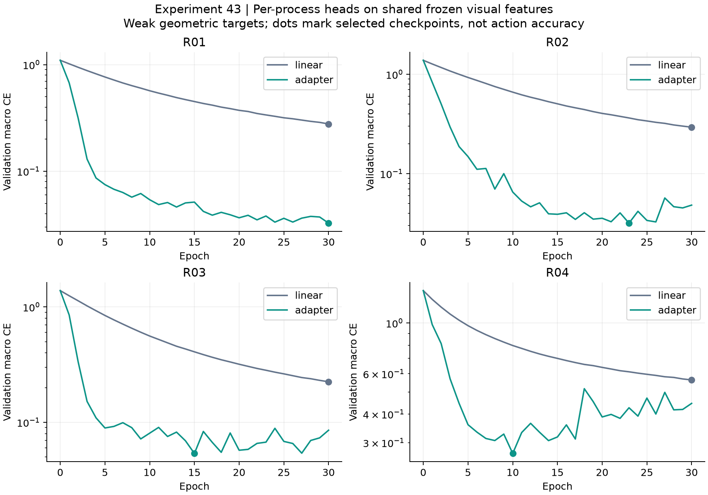
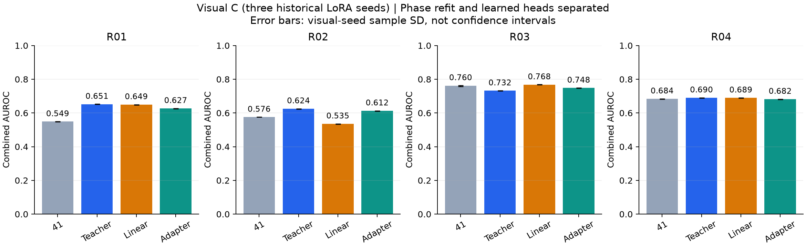

# 실험43 — 공정별 learned phase head

**완료: 저랭크 adapter head는 linear head보다 weak target을 잘 재현했지만, 이상탐지에서 teacher 대조를 일관되게 이기지는 못했다.** Visual C의 평균 Combined AUROC는 기존41의0.6421 → teacher0.6744 / linear0.6602 / adapter0.6672다. Adapter의 recall은6.81%로 teacher4.68%보다 높지만 기존6.93%보다 조금 낮다. 높은 weak-label agreement를 실제 phase 정확도나 AD 개선으로 치환하면 안 된다.

## 질문과 대조

실험42의 추천순1을 선택하여, 공유 시각 표현은 동결한 채 R01~R04의 phase head만 개별 학습했다. Detector41 + 기존 IoU tracker를 유지하고 실험40의8개 anomaly visual arm을 모두 보존했다. 42 learned association은 경보 개선 근거가 없고 경계 연결의 identity가 불확실하여 이번 기본 경로에 넣지 않았다. 검출·시각·추적·phase를 동시에 학습하지 않았다.

비교는 기존41 phase, 새 정상 표적을 만드는 **teacher-only**, 같은 표적의 **linear probe**, **rank8 adapter + classifier**다. Teacher를 새로 적합한 효과와 head를 학습한 효과를 분리했다. Appearance/transition/dwell/calibration은 branch·공정별로 같은 정상 분할과 규칙으로 재적합했다. 최소 지원10과 기존 R04 unavailable 처리 규칙을 유지했다. Original41의 control 예측은 hash로 확인했고, 원래 IoU·phase·통계 모델·score 재현은 직전42에서 검증했다.

## 표적 감사와 학습 범위

정상 train70/val19/calibration22 분할을 유지했다. 첫 감사에서 R02의 텍스트 teacher는 정한 cosine gap≥0.01을 통과하는 표적이 train17/val8개뿐이며 모두 한 상태였다. 강한 후보4개를 검수했을 때3개는 instrument-present 설명과 실제 빈 플랫폼이 불일치했다. 이 표적을 사용하지 않고 [첫 감사](../results/experiment43/target_attempt01/review.json)를 보존했다.

R01은 제품의 기존 관측 축·band를 유지하며 train에서 위치 중심3개를 다시 적합했다. R03/R04는 기존 관측 gate·scaler·선택 방식을 유지하며 현재 train 관계 관측의 중심4개만 재적합했다. R04는 asinh 좌표를 유지한다. R02는 정상 train의 플랫폼–scissor 관계에서 gate·scaler·중심을 새로 적합했다. 따라서 **R02~R04의 새 상태는 잠재 기하 군집이며 실제 action annotation이 아니다.** Normal-train 상대 위치는 cluster ID를 순열 정렬하는 데만 사용했고 test 입력에는 사용하지 않았다.

가장 가까운 두 중심의 상대 거리 차≥0.1인 유효 관측을 weak target으로 선택했다. 각 공정·상태·train/val에서 대표 및 경계 anchor60프레임을 Codex가 시각 감사했다. 전체 표적을 개별 검수하지는 않았다. 군집 안에서 instrument 유무·운반 동작·blade 위치가 섞이는 사례를 기록했다.

| 공정 | 선택 train 표적 | 선택 val 표적 | 희소 검증 상태 |
|---|---:|---:|---|
| R01 | 1,082 | 314 | 각 상태6영상 |
| R02 | 2,606 | 689 | state0: 6samples / 2videos |
| R03 | 2,434 | 671 | 각 상태4영상 |
| R04 | 1,088 | 257 | state0: 16samples / 2videos |

새 중심 적합과 현재 head optimizer에는 val/cal/test를 넣지 않았다. 다만 R01/R03/R04의 **과거 고정 gate·scaler는 이전 normal FIT에서 만들어져 현재 representation-validation 영상을 포함할 수 있다.** 현재 val은 optimizer에서 제외됐지만 모든 과거 처리까지 독립인 action 검증 자료는 아니다. Detector/visual checkpoint도 같은 정상 validation 분할을 이전에 사용했다. [검증 범위](../results/experiment43/validation_scope.json)를 명시하며 독립 녹화 그룹 일반화로 주장하지 않는다.

입력은 공통 동결 CLIP global512와 role0/1/2 최고 confidence crop512를 연결한2048차원이다. 없는 역할은 zero block, 현재 및 이전2sample의 trailing mean을 정규화한다. Phase label·좌표·frame index·영상 총길이·미래 특징은 입력하지 않는다. 작은 classifier를 학습하고 adapter branch에만 초기 identity인 rank8 residual을 추가한다. Foundation visual tower 전체 FT나 VLM LoRA가 아니다.

Seed42, FP32/noTF32, AdamW1e-3/wd1e-4, batch128, class-balanced sampling,30epochs×32steps=960updates/head다. CE +0.1 표현 보존항을 학습하고, 두 branch 모두 epoch0을 포함한 정상 val의 class-macro CE로 checkpoint를 선택했다. 총8개 head이며 R01 linear/adapter6,147/38,915변수, 다른 공정8,196/40,964변수다.

| 공정 | linear epoch / val CE / agreement | adapter epoch / val CE / agreement |
|---|---|---|
| R01 | 30 / 0.2777 / 97.77% | 30 / 0.0326 / 99.04% |
| R02 | 30 / 0.2936 / 89.55% | 23 / 0.0318 / 99.27% |
| R03 | 30 / 0.2246 / 95.83% | 15 / 0.0537 / 99.11% |
| R04 | 30 / 0.5641 / 78.99% | 10 / 0.2692 / 88.33% |

Agreement는 **선택된 weak target과의 표본 일치율**이다. 실제 action 정확도, 전체 timeline 정확도 또는 anomaly 분류 정확도가 아니다. R04 adapter는 이후 val CE가 다시 높아져 epoch10이 선택됐다. 이를 모든 fine-tuning의 과적합 증거로 일반화하지 않는다.

## 정상 관측과 통계 모델

Box/role/track/confidence, 기존 relation valid/descriptor 및8개 visual feature는 그대로이며 phase 배열만 바꿨다. 정상111영상에서 teacher/linear/adapter를 재생하고 모델96개 + calibration holdout528개를 적합했다. 모두 finite/bounded이고 q99<1이다. 초기 process JSON의 envelope 누락은 첫 model fit 전에 발견하여 동일 payload의 포맷만 교정했다. Head 가중치나 학습 표적을 다시 선택하지 않았으며 [복구 기록](../results/experiment43/normal_schema_recovery.json)을 남겼다.

| R04 정상2442 sampled observations | 기존41 | Teacher | Linear | Adapter |
|---|---:|---:|---:|---:|
| phase3 수 | 2196 | 1097 | 980 | 1035 |
| phase3 비율 | 89.9% | 44.9% | 40.1% | 42.4% |
| 지원된 dwell entry-context 수 | 0 | 2 | 1 | 3 |

Relation 관측 수 자체는 바뀌지 않았다. Teacher만 재적합해도 dwell 통계 모델의 일부 context가 다시 지원된다. **모든 상태의 dwell이 검증됐다는 뜻은 아니며**, 새로운 잠재 상태 분할에서 정상 complete-run 통계가 최소 지원을 만족했다는 의미다. Teacher의 지원 context는3→2(18runs),2→1(13runs), adapter는 여기에1→2(12runs)가 추가된다. Identity 경계를 고려한 episode 진단과 통계 모델의 fitting-run 집계는 다른 정의이므로 둘을 혼동하지 않는다.

## 이상탐지 결과

Test66영상, strict valid31,550프레임(정상18,038/이상13,512),66events다. R02 test12/13/14의 길이 불일치1,912프레임은 전체 unknown으로 제외했다. 라벨 위치나 FPS를 추정해 메우지 않았다. 모델/정상 임계값과1,584개 test 예측을 고정한 뒤 라벨을 읽었다.

| phase branch | visual arm | Visual AUC | Combined AUC | Combined AP | FPR% | recall% | event% |
|---|---|---|---|---|---|---|---|
| 41 control | A | 0.6680 | 0.6113 | 0.5081 | 3.99 | 9.47 | 63.18 |
| 43 teacher | A | 0.6708 | 0.6505 | 0.5336 | 4.49 | 6.84 | 59.65 |
| 43 linear | A | 0.6806 | 0.6376 | 0.5313 | 3.54 | 8.43 | 66.51 |
| 43 adapter | A | 0.6762 | 0.6454 | 0.5463 | 3.53 | 9.11 | 59.65 |
| 41 control | B | 0.6775 | 0.6348 | 0.5332 | 2.65 | 7.91 | 61.51 |
| 43 teacher | B | 0.6721 | 0.6674 | 0.5524 | 2.63 | 5.42 | 58.18 |
| 43 linear | B | 0.6788 | 0.6521 | 0.5454 | 2.32 | 5.38 | 66.26 |
| 43 adapter | B | 0.6751 | 0.6601 | 0.5554 | 2.69 | 7.34 | 59.85 |
| 41 control | C | 0.6862 ± 0.0009 | 0.6421 ± 0.0005 | 0.5394 ± 0.0007 | 2.16 ± 0.08 | 6.93 ± 0.16 | 58.54 ± 0.84 |
| 43 teacher | C | 0.6867 ± 0.0013 | 0.6744 ± 0.0006 | 0.5543 ± 0.0013 | 2.38 ± 0.02 | 4.68 ± 0.28 | 56.71 ± 0.44 |
| 43 linear | C | 0.6935 ± 0.0011 | 0.6602 ± 0.0004 | 0.5490 ± 0.0013 | 2.65 ± 0.05 | 5.15 ± 0.08 | 62.60 ± 0.56 |
| 43 adapter | C | 0.6893 ± 0.0010 | 0.6672 ± 0.0003 | 0.5609 ± 0.0009 | 2.30 ± 0.12 | 6.81 ± 0.46 | 59.39 ± 1.47 |
| 41 control | D | 0.6762 ± 0.0026 | 0.6261 ± 0.0053 | 0.5240 ± 0.0051 | 3.34 ± 0.98 | 10.90 ± 1.72 | 56.12 ± 3.09 |
| 43 teacher | D | 0.6790 ± 0.0066 | 0.6645 ± 0.0043 | 0.5442 ± 0.0047 | 2.49 ± 0.05 | 4.06 ± 0.65 | 53.67 ± 1.40 |
| 43 linear | D | 0.6851 ± 0.0038 | 0.6491 ± 0.0023 | 0.5334 ± 0.0024 | 2.55 ± 0.12 | 3.55 ± 0.92 | 56.84 ± 0.51 |
| 43 adapter | D | 0.6771 ± 0.0047 | 0.6535 ± 0.0031 | 0.5461 ± 0.0026 | 2.67 ± 0.13 | 8.94 ± 0.53 | 56.31 ± 1.67 |

공정 안에서 계산한 지표의 동일 가중 macro다. C/D는 기존 visual3seed 평균±표본 SD, phase head는 공정별 seed42 하나이며 신뢰구간이 아니다. **Branch·공정·run마다 정상 q99를 따로 재적합했으므로 FPR/recall/event 비교는 서로 다른 operating point 비교다.** [전체96행](../results/experiment43/report_tables.md), [영상별1,584행](../results/experiment43/per_sequence.csv), [teacher 및41과의 paired 변화](../results/experiment43/metrics.json)를 함께 제공한다.

Visual C의 공정별 특징은 다음과 같다.

- **R01:** teacher/adapter Combined AUC0.6515/0.6267. Adapter의 정상 weak agreement는99.04%지만 teacher보다 낮은 anomaly ranking이다. TP48→66, FP72→74로 경보 범위는 조금 늘었다.
- **R02:** teacher/linear/adapter AUC0.6244/0.5347/0.6122. Adapter가 linear를 크게 웃돌지만 teacher를 넘지 못한다. Adapter recall2.99%는 기존41의5.83%보다 낮다. 새 latent 목표는 instrument 유무의 기존 의미 단계와 다르다.
- **R03:** linear AUC0.7676이 adapter0.7484보다 높지만 adapter recall16.54%는 linear9.59%보다 높다. 대신 FPR도3.17→5.06%로 늘었다. Teacher-label agreement와 AUC·recall의 순위가 다르다.
- **R04:** adapter AUC0.6816은 teacher0.6897보다 낮다. Adapter FPR0.56%, recall2.44%, 탐지12/26events로 teacher 평균 FPR1.15%, recall2.26%,12.33/26events와 상충한다. Phase 점유 균형과 dwell 가용성만으로 AD 개선을 주장할 수 없다.

## 의의

공유 visual/detector 표현과 공정별 작은 head 학습을 분리하고, 통계 transition/dwell에는 LoRA를 강제로 적용하지 않는 모듈별 학습 체계를 완성했다. 같은 weak target에서 linear/저랭크 적응을 비교했고, teacher 재적합 대조 덕분에 AUROC 회복을 head 학습 효과로 잘못 귀속하지 않았다. 현재 자료에서는 학습 objective, 상태 표적의 재현, 최종 ranking, 경보 recall을 각각 확인해야 한다.

학부 캡스톤 논문에서는 이러한 모듈별 학습·대조·실패 분석과 재현 가능한 통합 파이프라인을 구현 기여로 다룰 수 있다. 기존 LoRA/adapter, KMeans, PCA, 통계 dwell의 사용 자체를 새로운 학습 알고리즘이나 SOTA로 주장하지 않는다. 논문 주제는 이번 결과만으로 고정하지 않는다.

## 보완할 점

1. 표적은 사람이 확인한 action GT가 아닌 기하 관계 군집이다. R02의 의미 단계도 바뀌었다. 희소 상태와 과거 normal preprocessing의 validation 포함 범위 때문에 높은 agreement를 일반화 근거로 쓸 수 없다.
2. Adapter가 linear보다 weak agreement가 높아도 모든 공정의 AUROC를 개선하지 않았다. 정상 categorical 표적의 학습이 anomaly의 미지 상태를 강제로 정상 클래스에 배정할 수 있으나, 이번에는 그 원인 가설을 직접 검증하지 않았다.
3. Refit teacher만으로 얻는 변화가 크다. Adapter 대 기존41 비교만 제시하면 target 재정의·정상 bank/calibration 재적합 효과가 혼입된다. 별도 q99에서 AUC/recall/FPR의 상충도 남는다.
4. 공정 head는1seed, detector도1seed, 같은 개발 장면을 반복 평가했다. 기존 visual3seed SD를 전체 파이프라인의 통계적 신뢰구간으로 부를 수 없다. 독립 recording group·bbox/identity/action GT·새 공정 일반화는 미검증이다.
5. Head 학습+val 총16.46초, peak allocated0.149GiB이며 backbone inference·원자료 준비·downstream 적합은 제외했다. Feature-cache 기반 normal/test replay+hash IO는2.88/1.82초다. End-to-end FPS 비교가 아니다.

## 다음 Recommended improvements — 추천순3개

| 추천순 | 개선 후보와 변경 내용 | 이번 결과의 근거 | 검증 기준 및 주의점 |
|---|---|---|---|
| 1 | **독립 phase/identity 검증 자료 확보**: 새 녹화 그룹과 사람 주석에서 phase 의미·경계·ambiguous 상태 및 객체 ID를 정의하고, 현재 모델을 수정하지 않은 채 평가 | R02 초기 teacher의 의미 불일치, 새 표적의 희소 상태, R04 agreement88.33% 및 latent/action 구분. 이미 본 validation과 개발 test만으로 학습 효과를 확인하기 어려움 | 다음44 계획은 이 검증부터 시작. 새 영상/주석 없이 독립 검증 완료라고 주장하지 않음. Weak teacher 일치율과 사람 GT 정확도, normal false alarm과 anomaly recall을 분리 |
| 2 | **Phase 불확실성·unknown 경로**: 낮은 지지/높은 불확실성의 head 출력을 보류하고 pooled appearance 및 신뢰할 수 있는 전이만 사용하도록 정상 자료에서 검증 | R01 adapter agreement99.04%인데 AUC가 teacher보다 낮고, R02 adapter recall은 기존보다 감소. 높은 teacher 일치가 AD를 보장하지 않음 | Normal val/cal로 선택 후 고정 평가. Softmax confidence가 OOD 정확도를 보장하지 않으며, 보류로 인한 process 누락·recall 손실·coverage 감소를 함께 측정 |
| 3 | **운영점·seed 및 체류 근거의 정합성 검증**: branch별 정상 오탐 예산을 맞추고 phase head seed/녹화 그룹 안정성과 identity 경계에 맞는 dwell 근거를 점검 | R03 linear가 AUROC는 높지만 adapter가 recall/FPR 모두 높다. R04 dwell 가용성은 회복됐으나 AD 효과는 작고 fitting-run과 identity episode 정의가 다름 | Test label로 threshold를 고르지 않음. 같은 정상 예산에서 paired FP/TP·events 및 state/context support를 비교하고, 잠재 상태 수를 물리 동작 수로 해석하지 않음 |

이번40~43의 학습 범위는 shared visual adaptation → shared detector partial FT → shared association adapter → process-specific phase heads까지 완료됐다. Appearance/transition/dwell/calibration은 매 단계 공정별 정상 자료로 적합했다. 다음 검증의 구체적인 시작 조건은 [44 계획](EXPERIMENT44_PLAN.md)에 남겼고, 아직 수집하지 않은 독립 자료의 결과를 만들지는 않는다.

190개 테스트, 정상96 full +528 holdout, test1,584예측, AUROC/AP576개 독립 계산, 경보·이벤트·object-index 및 원본 tracking 보존 검사를 통과했다. [학습 기록](../results/experiment43/training.json) · [검증](../results/experiment43/validation.json) · [phase 진단](../results/experiment43/phase_diagnostics.json) · [설정](../configs/experiment43_phase.json) · [구현·재현](EXPERIMENT43_METHODS.md) · [학습 단계 종합](LEARNED_PIPELINE_SUMMARY.md).
