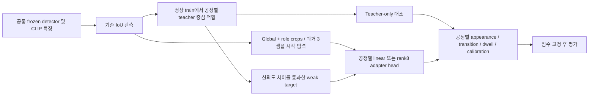

# 실험43 구현 및 재현

## 변경 경로



기존41 phase를 대조로 보존한다. 새로운 teacher만 적용한 branch를 별도로 평가하므로 teacher 표적 변경과 학습 head 변경을 분리할 수 있다. R01은 공간 위치, R02~R04는 기하 관계의 잠재 군집이다. State ID를 실제 action annotation으로 취급하지 않는다.

## 표적 준비

`prepare_phase43.py`는 정상 train70/val19만 읽는다. 첫 감사에서 R02의 텍스트 표적은 한 상태에 집중됐고 검수한 강한 후보에도 의미 불일치가 있어 사용하지 않았다. 첫 시도의 코드·표적 감사는 `results/experiment43/target_attempt01/`, 로컬 원자료는 ignored `artifacts/experiment43_target_attempt01/`에 보존했다.

R01은 기존 band·관측과 trailing3 위치에서 중심3개를 train에 적합한다. R03/R04는 기존 gate·scaler·선택 관측을 유지하고 중심4개만 현재 train 관측에 적합한다. R04는 asinh 좌표다. R02는 platform–scissor 관계의 gate·scaler·중심을 train에서 새로 적합한다. 군집 ID 정렬에 사용한 normal-train 상대 위치는 추론 입력이 아니다. 선택 표적은 가장 가까운 두 중심의 squared distance를 d1≤d2라 할 때 `(d2-d1)/max(d2,1e-9) ≥ 0.1`인 유효 관측이다.

새 중심 적합과 현재 head optimizer에는 val/cal/test가 포함되지 않는다. 다만 **R01/R03/R04의 과거 고정 gate·scaler는 이전 normal FIT에서 만들어져 현재 representation-validation 영상을 포함할 수 있다.** 현재 val은 optimizer에서 제외되지만 전체 과거 처리까지 독립인 action 검증 자료가 아니다. 이 범위는 `validation_scope.json`에 명시했다. Calibration22는 현재 teacher/head 적합과 checkpoint 선택에서 제외한다.

## 시각 입력과 head

`src/ipad_vad/learned_phase.py`에서 각 sample의 global CLIP512 + role0/1/2 최고 confidence crop512를 연결한다. 없는 역할은 zero block이다. 연결 벡터를 정규화하고 현재 및 과거2sample의 평균을 다시 정규화하여2048차원 입력을 만든다. Geometry·phase ID·총길이·frame index·미래 특징은 입력하지 않는다. Auxiliary CLIP은 공통이며 anomaly appearance encoder A/B/C/D와 분리되어 있다.

공정마다 linear classifier 또는 `normalize(x+B(Ax))` 뒤의 classifier를 학습한다. Adapter rank8, B 초기값0이며 동일 seed에서 두 branch의 초기 classifier는 같다. AdamW1e-3, weight decay1e-4, batch128, 30epochs×32updates, seed42, FP32/noTF32다. Class 균등 복원 표집으로 CE를 최소화하며 adapter에만 표현 보존항 `0.1*mean(||z-x||²)`가 생긴다. 두 branch 모두 epoch0을 포함한 **val class-macro CE**로 checkpoint를 선택한다.

R01 linear/adapter는6,147/38,915개, 나머지는8,196/40,964개 변수를 학습한다. 이는 새 classifier와 작은 저랭크 adapter의 학습이며 foundation visual tower 전체 FT나 VLM LoRA가 아니다. 추론 시 현재 관측이 유효하면 argmax, 아니면 직전 상태를 유지한다. 초기 상태는0이다. 별도 probability gate나 test 기반 threshold 탐색을 추가하지 않는다.

## 통계 모델과 실행 기록

`extract_phase43.py`는41의 box/role/track/confidence/descriptor와8개 visual feature를 그대로 유지하고 phase 배열만 바꾼다. `experiment43_normal.py`는 공정·branch·visual arm별 appearance PCA, transition, dwell 및 calibration을 재적합한다. Minimum support10과 기존 R04 unavailable 처리 규칙을 유지한다. Initial process JSON의 envelope 누락은 첫 model fit 전에 발견됐고, 동일 payload에 scene/sources/process envelope를 붙여 교정했다. 학습 가중치·표적·통계 규칙은 바뀌지 않았으며 `normal_fit_attempt01/`과 `normal_schema_recovery.json`에 기록했다.

`evaluate_phase43.py`는 정상 모델 재구성을 검증하고 모든 test score를 고정한 뒤 라벨을 연다. `validate_phase43.py`는 tie-aware rank AUROC/AP, 경보·이벤트, object-index 정렬 및 원본 tracking 보존을 독립 검사한다. Original41의 예측은 hash로 검증하며, 원래 IoU/phase/model/score 재현 검증은 직전42에서 완료했다.

## 재현 명령

실험40/41의 로컬 feature와 모델이 필요하다. Dataset·가중치·cache·contact sheet·로그는 공개 저장소에 포함하지 않는다. 완료 output에는 stage guard가 있으므로 새 재실험은 별도 결과 디렉터리를 사용한다.

```bash
PYTHONPATH=src:scripts .venv/bin/python scripts/prepare_phase43.py
# 정상 anchor를 실제 검수하고 target_review.json의 결정과 범위를 확인
PYTHONPATH=src:scripts .venv/bin/python scripts/train_phase43.py
PYTHONPATH=src:scripts .venv/bin/python scripts/extract_phase43.py --split training
PYTHONPATH=src:scripts .venv/bin/python scripts/experiment43_normal.py
PYTHONPATH=src:scripts .venv/bin/python scripts/extract_phase43.py --split testing
PYTHONPATH=src:scripts .venv/bin/python scripts/evaluate_phase43.py
PYTHONPATH=src:scripts .venv/bin/python scripts/diagnose_phase43.py
PYTHONPATH=src:scripts .venv/bin/python scripts/validate_phase43.py
PYTHONPATH=src:scripts .venv/bin/python scripts/report_phase43.py
PYTHONPATH=src:scripts .venv/bin/python -m pytest -q
```

GPU는RTX PRO6000 Blackwell이며 학습은 저장된 동결 특징 위에서 수행한다. 모델 추론을 포함하지 않은 head 시간/메모리는 end-to-end FPS와 구분하여 보고한다. 이번 단계에는 VLM 재호출이 필요하지 않았다.
