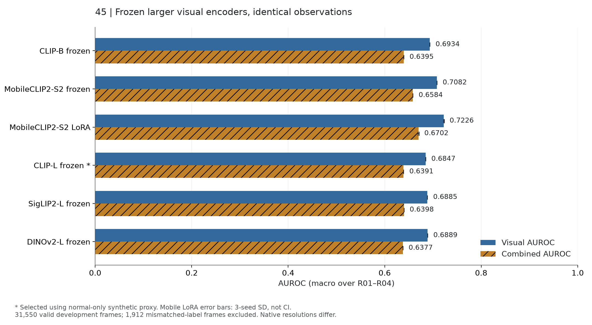
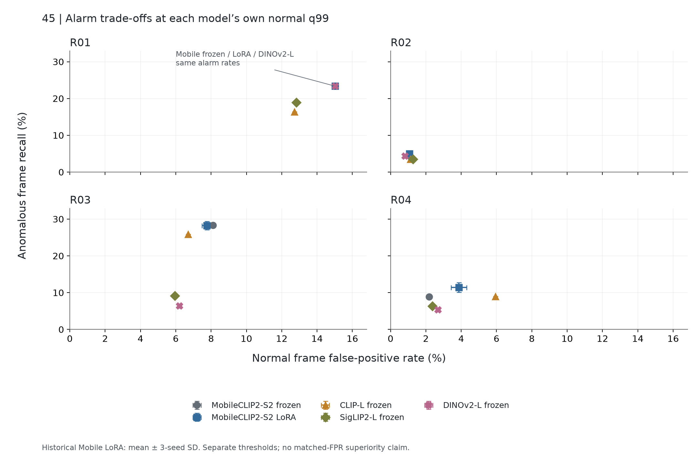

# 실험45 — 큰 frozen encoder3개 실제 비교와 normal-only 후보 선정

**완료 결과: 큰 encoder로 교체하는 것만으로는 기존 MobileCLIP보다 나아지지 않았다.** Normal synthetic proxy에서 CLIP-L을 선정했지만 실제 개발 AD에서 그 우위는 유지되지 않았다. 선택을 test 결과로 바꾸지 않고, 다음46에서 CLIP-L의 적응 학습을 검증한다. 이 결과는 실패를 포함한 모델 교체 대조이며 새로운 알고리즘/SOTA 주장이 아니다.

[사전 고정 계획](EXPERIMENT45_PLAN.md) · [구현·재현](EXPERIMENT45_METHODS.md) · [설정](../configs/experiment45_candidates.json) · [기계 판독 결과](../results/experiment45/metrics.json) · [영상별 결과](../results/experiment45/per_sequence.csv) · [독립 검증](../results/experiment45/validation.json)

## 이번 실험 결과

45는40의 같은 detector boxes/tracks/phase/process score를 유지하고 visual feature만 변경했다.41의 detector FT와43의 phase head는 이 비교에 추가하지 않았다. Controls A/B/LoRA3seed를 정확히 재현하고 CLIP-L, SigLIP2-L, DINOv2-L은 모든 정상111/test66영상에서 실제 추론했다. 새 neural training은 이번 단계에 없으며 공정별 정상 통계 모델은 새 feature로 다시 적합했다.

정상 train70/representation-val19/calibration22, downstream FIT89를 유지했다. Test는총33,462프레임 중strict valid31,550(정상18,038/이상13,512),66events다. R02길이 불일치3영상/1,912프레임은 전체unknown으로 제외했다. Source frame index를 사용하며 FPS를 추정하지 않았다. 반복 사용한 개발 데이터이고 독립 확인 평가가 아니다.

| Encoder | Visual AUROC | Combined AUROC | Combined AP | 정상 FPR | 이상 recall | Event coverage |
|---|---:|---:|---:|---:|---:|---:|
| CLIP-B frozen | 0.6934 | 0.6395 | 0.5247 | 7.60% | 16.31% | 56.72% |
| MobileCLIP2-S2 frozen | 0.7082 | 0.6584 | 0.5510 | 6.58% | 16.29% | 57.68% |
| MobileCLIP2-S2 LoRA | 0.7226 ± 0.0011 | 0.6702 ± 0.0009 | 0.5576 ± 0.0009 | 6.93 ± 0.15% | 17.01 ± 0.37% | 60.50 ± 1.47% |
| CLIP-L frozen **(normal proxy 선정)** | 0.6847 | 0.6391 | 0.5297 | 6.62% | 13.68% | 55.05% |
| SigLIP2-L frozen | 0.6885 | 0.6398 | 0.5207 | 5.61% | 9.47% | 55.76% |
| DINOv2-L frozen | 0.6889 | 0.6377 | 0.5198 | 6.18% | 9.88% | 62.04% |

각 공정 지표의 동일 가중 macro다. Mobile LoRA는40의3visual seed 평균±표본SD이며 CI가 아니다. 각 모델/process는 별도 normal q99를 사용하므로 동일 FPR에서의 비교가 아니다. Event coverage는 구간 내 경보가 한 번이라도 있었는지이며 이상 구간 전체를 잘 탐지했다는 뜻이 아니다.

### 실제 후보 선택과 비용

| 후보 | Visual parameters | Feature dim / native input | Normal proxy AUROC | Probe encoder ms/view | Normal / test 추출초 | Peak allocated GiB |
|---|---:|---|---:|---:|---:|---:|
| CLIP-L |303,966,208|768 /224×224|0.9909|4.96|316.57 /197.33|1.66|
| SigLIP2-L |316,283,904|1024 /384×384|0.9813|11.40|637.49 /429.34|2.08|
| DINOv2-L |304,368,640|1024 /224×224|0.8835|4.87|289.69 /180.72|1.60|

각 모델에서 정상54,047/test35,340 frame+crop views를 처리했다. Full model의 text tower를 제외한 실제 visual parameter 수다. GPU RTX PRO6000 Blackwell96GB, FP32, batch32, TF32 off. Probe encoder 시간은 전처리·IO를 제외한2,560views 측정이며 전체 추출은 IO/worker/전처리/저장을 포함하고 checkpoint load는 제외한다. CPU 진단이 일부 test 추출과 겹쳤고 전용 benchmark 환경이 아니므로 end-to-end pipeline FPS나 이론적 연산량 비교로 해석하지 않는다. [환경](../results/experiment45/environment.json)과 [수치 원본](../results/experiment45/report_data.json)을 보존했다.

선정은 정상 train4096/val512 video-balanced sampled views의 PCA residual로 수행했다. Val 원본·brightness1.05와 국소 가림/roll/noise3종을 구분한24개 AUROC 평균이다. Calibration/test를 선택에 쓰지 않았다. 후보 최고점과.005이내면 측정 latency로 tie-break하는 사전 규칙이 있었으나 CLIP-L만 해당해 속도로 결정되지는 않았다. [선정 기록](../results/experiment45/selection.json), [선정 동결](../results/experiment45/selection_checkpoint.json).

이 proxy는 texture/외형 교란에 편향됐다. Global/crop 평균은 CLIP-L0.9978/0.9840, SigLIP2-L0.9960/0.9666, DINOv2-L0.9581/0.8089였다. DINOv2 R04 crop에서는0.6339~0.6899였다. 전처리로 교란이 완전히 제거된 경우는 각 후보0/1,536건이었다([visibility 진단](../results/experiment45/probe_visibility.json)). 그러나 남은 픽셀 비율·context·perceptual difficulty가 같다는 뜻은 아니며 실제 결함/공정 순서 GT로 사용할 수 없다.

### 공정별 상충

- R01: CLIP-L Combined0.5514는 Mobile frozen0.6013보다 낮다. 정상 holdout FP는105→37로 줄었지만 test TP293→205로 줄었다. 정상 validation에서의 오탐 감소가 이상 recall 개선을 보장하지 않았다.
- R02: CLIP-L Visual0.7643/Combined0.5642는 Mobile0.7275/0.5435보다 높지만, 자체q99에서 TP119→91, 탐지events5→4였다. Ranking 개선과 경보 지표는 다른 결론을 주었다.
- R03: DINOv2는 Mobile의11/17보다 많은12/17events를 잡았지만 TP1436→325로 감소했다. 구간 내 한 번의 반응과 지속적인 탐지를 구분해야 한다.
- R04: CLIP-L FP78→212, TP407→412, events15→14로 오탐 증가에 비해 이득이 작았다. DINOv2는18/26events로 Mobile15/26보다 많았지만 TP407→245였다.

전체 [공정별 표](../results/experiment45/process_table.md)와 [paired Mobile-B 경보 비교](../results/experiment45/metrics.json)를 제공한다. Plot의 R01 세 비교군은 실제 경보율이 같아 같은 위치에 겹친다. 표시를 위해 좌표를 임의로 이동하지 않았다.

### 정상 용량 진단과 검증

정상 calibration video holdout의9,983프레임에서 FP는 Mobile frozen221, CLIP-L200, SigLIP2-L195, DINOv2-L189였다. 이는 micro count이며 위 표의 test macro FPR과 다른 모집단/집계다. 모든32full/176holdout의 score가 유한·유계이고32비교군 모두q99<1이었다.

저장된 basis와 FIT feature로 분산 보존율을 계산했다. CLIP-L63/70, SigLIP2-L52/70, DINOv2-L54/70bank가95%목표에 미달했으며 모두rank32상한에 도달했다. Bank별 단순 평균 보존율은90.16/91.39/89.87%, 최솟값78.88/80.56/67.66%였다. Mobile frozen은26/70미달, 평균93.75%였다. [원본 진단](../results/experiment45/capacity_diagnostics.json). 고차원 정상 분산을 충분히 담지 못한 것은 측정된 사실이지만, rank를 늘리면 실제 AD가 나아진다는 것은 아직 가설이다.

190개 기존 회귀 테스트를 통과했다. 별도 실험 검증은 normal feature888파일, full+holdout208모델/점수, test prediction528개를 재계산했다. 기존40 control330개test prediction과260normal model/score파일의 배열이 exact match했다. AUROC/AP192개를 독립 midrank/tie-aware 계산으로 확인하고, probe AUROC72개와 선택 규칙, 경보/event를 검증했다. [평가 감사](../results/experiment45/evaluation_audit.json), [검증](../results/experiment45/validation.json). 두 그래프를 실제 열어 확인했고 xlabel/footer 겹침은 수치 변경 없이 별도 [렌더 스크립트](../scripts/plot_alarm45.py)로 수정했다.

## 실험 결과의 의의

모델 parameter 수를 늘리는 것과 이 데이터의 이상 탐지 성능이 좋아지는 것은 같은 일이 아니었다. 동일 detector/phase/process와 exact controls 아래에서 세 대형 후보의 효과를 실제 측정하고, 정상 proxy 선택과 AD 평가의 불일치를 드러냈다. Normal subspace의 rank 제약과 frame/event 지표의 상충을 확인한 점은 후속 학습·용량·시간 표현 실험을 설계할 구체적인 근거다.

## 보완할 점

Native resize/crop, 차원, 사전학습 목적/자료가 모두 다르므로 순수한 크기 scaling 법칙이 아니다. Shared rank32가 대형 feature에 더 강한 제약이 될 수 있지만, 이번에는 동일한 downstream budget 대조로 유지했다. Normal val/weak phase/관측 전처리의 독립성에는 기존 한계가 있고, 실제 phase/identity GT와 새 녹화 그룹 검증은 아직 없다. 새 neural learning의 과적합이나 최대성능은 이 frozen 단계로 판단할 수 없다. Crop-level localization은 box 기반 근거이며 pixel GT localization 성능은 측정하지 않았다.

## 다음 Recommended improvements — 추천순3개

| 추천순 | 개선 후보와 변경 내용 | 이번 결과의 근거 | 검증 기준 및 주의점 |
|---|---|---|---|
| 1 | 선정 CLIP-L에 LoRA / 마지막2block partial FT / full FT를 각각 적용하고 normal-val early stopping·3seed로 비교 | Frozen CLIP-L Combined0.6391로 Mobile frozen0.6584보다 낮음;40의 작은 모델 LoRA는0.6702. 대형 모델의 domain adaptation 효과는 미측정 | 같은 관측·rank32에서9학습run, epoch0 포함 선택·train/val curve·collapse/teacher drift·FP/TP/events 비교. Normal loss 개선을 실제 AD 개선으로 대체하지 않음. **46에서 선택** |
| 2 | PCA rank cap/보존분산 목표와 local patch/object feature 수를 단계적으로 비교 | CLIP-L63/70개 bank가95%분산을 못 담고 평균90.16%; R04 crop proxy가 global보다 낮음 | 먼저 한 용량 요소만 변경하고 support·실제 보존분산·normal holdout·AD를 함께 확인. Rank/feature 수 증가가 이상까지 정상으로 흡수하거나 잡음을 늘릴 가능성. 다음 번호는46결과 후 결정 |
| 3 | 시간 학습 단위와 관측 품질을 분리 진단하고 필요시 larger detector·causal temporal representation 비교 | DINOv2는 event coverage62.04%지만 frame recall9.88%; 기존 phase/box는 그대로여서 encoder 확대만으로 순서·짧은 구간 관측을 개선하지 못함 | Frame-index 기반 causality·identity 경계·관측률/누락 길이·event delay와 FP/TP를 함께 측정. 시각·detector·시간 window를 한꺼번에 바꾸지 않으며 독립 phase/identity GT 부재를 명시 |

다음 실행은 [46 계획](EXPERIMENT46_PLAN.md)이다.44 독립 주석 검증은 미실행 계획으로 유지한다. 모델 확대·학습·특징/시간 hyperparameter라는 전체 새 목표는 아직 완료가 아니다.
