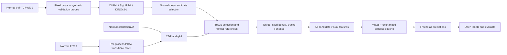

# 실험45 구현·재현

이번 단계는 큰 visual encoder의 frozen 비교다. 모델의 학습 강도·detector·phase head를 동시에 변경하지 않는다. 다음 LoRA/FT 실험은 이번 실제 비교 결과에 따라 별도로 설계한다.



## 모델·입력

`configs/experiment45_candidates.json`의 공식 Hugging Face revision에서 safetensors/config/image processor만 가져오며 원격 Python 코드를 실행하지 않는다. 미사용 text tower parameter는 로드하지 않고 visual weight의 missing/mismatch를 오류 처리한다. 모든 파라미터는 frozen, FP32 forward/normalization, TF32 비활성, batch32다. 공식 native preprocessing을 사용하므로 입력 해상도·학습 목적·학습 자료도 다르다. 단순한 크기 효과만의 대조가 아니다.

| 후보 | Feature | 입력 전처리 |
|---|---|---|
| CLIP ViT-L/14 | visual pooled output + projection, L2 | 공식 resize/center crop224, CLIP normalize |
| SigLIP2-L/16 | vision attention pooler, L2 | 공식384×384 resize, mean/std0.5 |
| DINOv2-L/14 | 마지막 layer CLS, L2 | 공식 processor의 resize/center crop/normalize |

실측 visual parameter 수·출력 차원·처리시간은 각 `*_smoke.json`, `*_normal_extraction.json`, `*_test_extraction.json`에 기록한다. Smoke 시간은 짧은 준비 검사다. 후보 tie-break에는 더 긴 동일 probe의 encoder-only 측정만 사용한다. 전체 추출 시간은 image IO·worker·전처리·GPU·저장을 포함하지만 checkpoint load는 제외하며 카메라 streaming FPS가 아니다. Peak memory는 PyTorch allocated 기준이고 시스템 전체 VRAM이 아니다.

## 관측과 통계 모델

40의 A/B/C_s42/C_s43/C_s44는 기존 visual cache와 학습 checkpoint를 재사용한 대조다. 이 단계에서 그 encoder를 다시 학습하지 않는다. 후보3개는 정상111/test66 전체에서 새로 추론한다. 공정별로40의 GroundingDINO-tiny box/IoU tracks/기존 phase를 고정한다. Feature cache에서 `global_features`, `crop_features`만 변경하며 나머지 array는 exact equality로 검사한다. 추가 object/patch token은 아직 사용하지 않는다.

Stride4 source frames, IoU0.2, max age2 sampled frames, PCA variance.95/rank cap32/min support10, transition Laplace1, q99 규칙을 유지한다. R01/R02는 visual/process 평균, R03/R04는 기존 max 결합과 각각 completed-run percentile/lognormal dwell을 유지한다. R04 observed-relation FIT·actual-bank calibration·같은 track pair evidence gate도 그대로다. 정상 공정 parameter와 process score를 encoder 간 exact equality로 확인한다.

정상 split은70 train /19 representation validation /22 calibration이며 downstream FIT에는70+19를 사용한다. 영상 그룹은 서로 겹치지 않지만 독립 녹화 session/실물 객체 그룹의 분할은 알려져 있지 않다. 고정된 기존 관측 모델의 gate/scaler가 현재 representation validation에 해당하는 정상 영상을 과거에 보았을 수 있으므로 전체 preprocessing까지 독립인 검증으로 주장하지 않는다.

## 후보 선택과 합성 proxy 한계

Scene×global/crop별로 normal train512, normal val64를 video-balanced replacement sampling한다. 총4096/512 view이며 실제 unique view 수와 영상 목록을 `probe_protocol.json`에 기록한다. 반복 추출 수를 독립 표본 수로 해석하지 않는다. PCA는 해당 train 원본만으로 적합한다.

Val 원본/brightness1.05는 negative, 면적16% 국소 평균색 가림·패치 반폭/반높이 roll·50% random-noise 혼합은 각각 positive다. 모델별로 동일 crop·위치·난수를 사용한다. Local roll은 짝수 변 길이에서 네 사분면 위치를 맞바꾸는 동작이고 홀수에서는 half-offset roll이다. 실제 물리적 공정 결함이나 이상 영상의 정답이 아니다. 이 proxy는 texture/appearance 민감도에 편향되며 공정 순서·누락·체류 이상을 검증하지 못한다. 밝기 변화만으로 현실의 모든 정상 variation도 대표하지 못한다.

24개(scene4×kind2×corruption3) PCA residual AUROC의 산술 평균을 비교한다. 최고값과.005이내의 후보 중 같은 probe의 encoder ms/view가 작은 것을 선정한다. `selection.json`과 `selection_checkpoint.json`을 test feature 추출 전에 고정한다. 실제 AD ranking과 proxy ranking이 다르면 그대로 보고하며 test 결과로 모델을 교체하지 않는다. 다음 단계의 학습 성과를 보장하는 선택 기준이 아니다.

## 실행·평가 보호

정상 단계는 audit hook으로 test frame/cache/label 접근을 차단한다. 특징 추출은 영상별 원자적 NPZ 저장과 hash journal을 남긴다. 작업이 중단되면 실제 프로세스 종료부터 확인하고 일치한 완료 shard만 재사용한다. 완료 기록 없는 shard는 자동 덮어쓰지 않는다.

정상 full32개, calibration-video holdout176개를 적합하고 정상 reference와 score를 동결한다. 각 모델/process에는 자체 q99가 있으므로 recall/FPR 비교는 matched-FPR 비교가 아니다. Test prediction 전체를 동결한 다음 label을 읽고 AUROC/AP·FP/TP·event coverage를 계산한다. R02 길이 불일치1912프레임은 해당3영상 전체 unknown으로 제외한다. 시간은 원래 frame index이며 FPS·seconds 변환은 추정하지 않는다.

검증 스크립트는 기존40 control model/score의 일치, normal full/holdout reconstruction, test prediction 재계산, rank 기반 AUROC와 tie-aware AP 독립 계산, 경보/event 및 선택 규칙을 검사한다. 모든 실행이 끝났는지는 `validation.json`과 상세 보고서로 판단하며, 이 구현 설명만으로 완료를 주장하지 않는다.

추가 normal-only capacity 진단은 저장된 PCA mean/basis와 원래 FIT 특징을 사용한다. 각 bank에서 `sum(((X-mean) @ basis.T)^2) / sum((X-mean)^2)`로 보존 분산을 계산하고, 정상 parameter를 다시 적합하거나 label을 읽지 않는다. Bank별 비율의 단순 평균은 영상별/표본별 가중 평균과 다르다. Rank 상한 제약을 측정하지만 rank 증가가 AD를 개선한다는 증거는 아니다. 이 CPU 진단 일부가 test GPU 추출과 동시에 실행됐으므로 wall time은 독점 환경의 정밀 성능 benchmark로 해석하지 않는다.

## 재현 명령

프로젝트 `.venv`의 기존 torch2.10/transformers4.57.6을 유지한다. 저장 공간은 데이터 디스크의 `.cache`/`artifacts`를 사용한다. 정상 runner를 이미 실행 중이라면 아래 명령을 중복 실행하지 않는다.

```bash
export PYTHONPATH=src:scripts
HF_HUB_DISABLE_XET=1 .venv/bin/python scripts/download_candidates45.py
.venv/bin/python scripts/run_candidates45_normal.py
# 정상 선택·적합 결과를 확인한 뒤 후보별 test 추출
.venv/bin/python scripts/extract_candidates45.py --candidate clip_L --partition test
.venv/bin/python scripts/extract_candidates45.py --candidate siglip2_L --partition test
.venv/bin/python scripts/extract_candidates45.py --candidate dinov2_L --partition test
.venv/bin/python scripts/evaluate_candidates45.py
.venv/bin/python scripts/validate_candidates45.py
.venv/bin/python scripts/diagnose_capacity45.py
.venv/bin/python scripts/diagnose_probe_visibility45.py
.venv/bin/python scripts/report_candidates45.py
.venv/bin/python scripts/plot_alarm45.py
```

완료된 파일을 가진 재현 디렉터리에서 stage를 무조건 재실행하면 보호 검사로 중단한다. 새 환경에서 원래 revision·source manifest를 복구하거나 완료 checkpoint 검증을 수행해야 한다. 모델·영상·feature cache는 GitHub 배포 범위에 포함하지 않는다.
